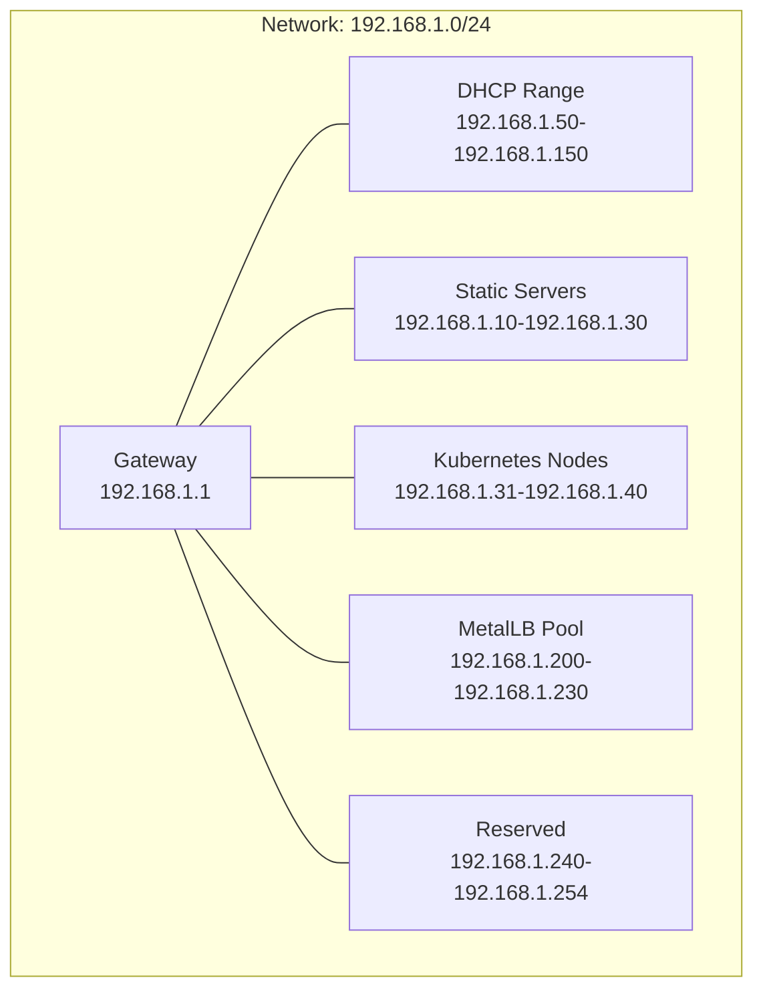
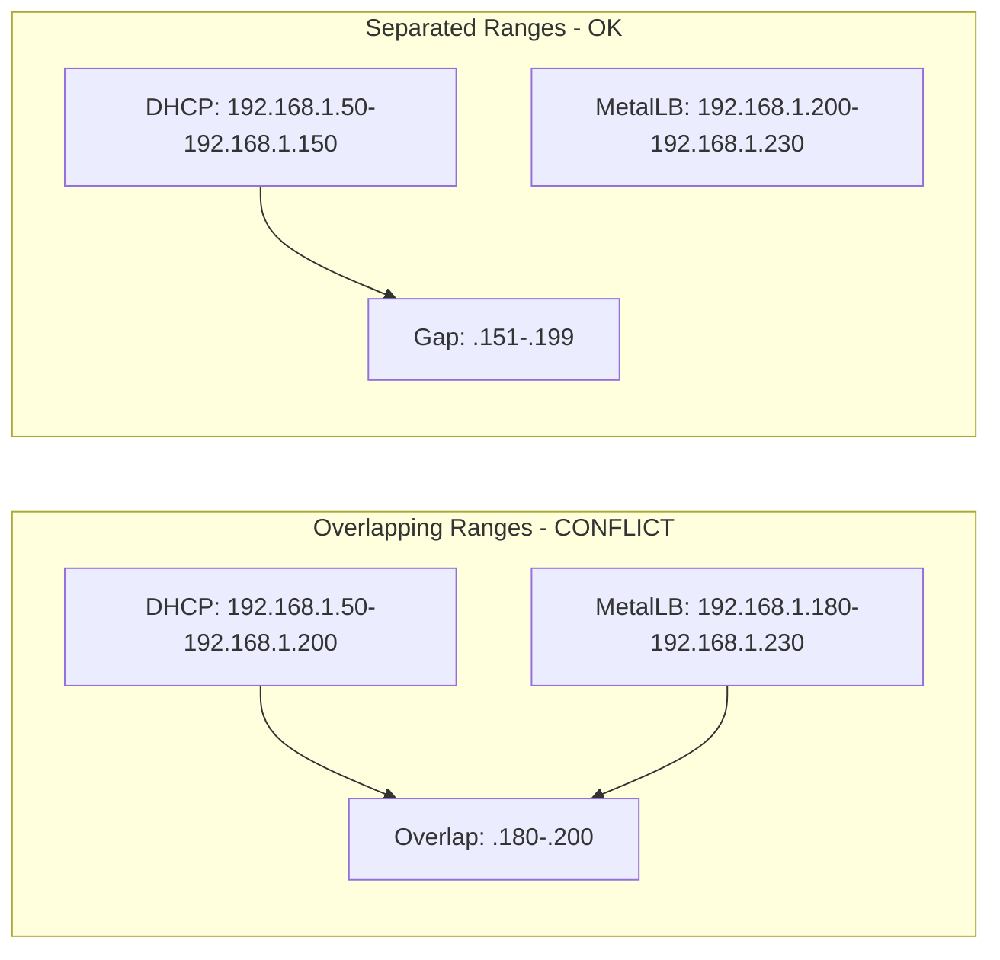

# How to Plan IP Address Ranges for MetalLB in Production

Author: [nawazdhandala](https://www.github.com/nawazdhandala)

Tags: Kubernetes, MetalLB, IP Planning, Production, Networking

Description: A practical guide to planning IP address ranges for MetalLB in production environments including sizing, subnet selection, and DHCP avoidance.

---

One of the most common mistakes when deploying MetalLB in production is poor IP address range planning. Choosing the wrong range can cause IP conflicts with DHCP, exhaust your available addresses too quickly, or create routing problems. This guide walks through a practical approach to planning IP ranges that scale with your infrastructure.

## Understanding the IP Landscape

Before choosing ranges for MetalLB, you need to map out how IP addresses are used across your network:



## Step 1: Inventory Your Network

Start by documenting everything on your network:

```bash
# Scan the local subnet to find active hosts
# This helps identify which IPs are already in use
nmap -sn 192.168.1.0/24

# Check your DHCP server configuration for its lease range
# On a Linux DHCP server:
cat /etc/dhcp/dhcpd.conf | grep range

# On a router, check the DHCP settings through its admin interface
# Document the start and end of the DHCP range
```

Create a simple inventory table:

| Purpose | IP Range | Count |
|---------|----------|-------|
| Gateway | 192.168.1.1 | 1 |
| Static infrastructure | 192.168.1.2-192.168.1.9 | 8 |
| Physical servers | 192.168.1.10-192.168.1.30 | 21 |
| Kubernetes nodes | 192.168.1.31-192.168.1.40 | 10 |
| DHCP clients | 192.168.1.50-192.168.1.150 | 101 |
| MetalLB (planned) | 192.168.1.200-192.168.1.230 | 31 |
| Reserved | 192.168.1.240-192.168.1.254 | 15 |

## Step 2: Avoid DHCP Overlap

The most critical rule is to never let your MetalLB range overlap with DHCP. MetalLB uses ARP (in L2 mode) or BGP to announce IPs. If a DHCP server also hands out those IPs, you get conflicts.



To avoid conflicts:

1. Set your DHCP range to end well before your MetalLB range starts
2. Leave a gap between the DHCP range and MetalLB range
3. Document both ranges clearly

## Step 3: Size Your Pool Correctly

Calculate how many IPs you need based on your services:

```bash
# Count your current LoadBalancer services
kubectl get svc -A --field-selector spec.type=LoadBalancer --no-headers | wc -l

# Add a growth buffer of at least 50%
# If you have 10 services today, plan for at least 15 IPs
# Round up to a clean number like 20 or 32
```

Guidelines for sizing:

| Cluster Size | Services (estimated) | Recommended Pool Size | Example Range |
|-------------|---------------------|----------------------|---------------|
| Small (dev) | 1-5 | 10 IPs | .200-.209 |
| Medium | 5-20 | 32 IPs | .200-.231 |
| Large | 20-50 | 64 IPs | .128-.191 |
| Enterprise | 50+ | Dedicated /24 subnet | 10.0.100.0/24 |

## Step 4: Choose Between Single Range and Multiple Pools

For simple setups, a single pool works fine. For production, consider multiple pools:

```yaml
# production-pools.yaml
# Separate pools for different service tiers.
# Each pool has different size and auto-assignment policies.
apiVersion: metallb.io/v1beta1
kind: IPAddressPool
metadata:
  name: production-services
  namespace: metallb-system
spec:
  addresses:
    # Primary pool for production workloads
    - 192.168.1.200-192.168.1.220
---
apiVersion: metallb.io/v1beta1
kind: IPAddressPool
metadata:
  name: staging-services
  namespace: metallb-system
spec:
  addresses:
    # Smaller pool for staging workloads
    - 192.168.1.221-192.168.1.230
---
apiVersion: metallb.io/v1beta1
kind: IPAddressPool
metadata:
  name: critical-vips
  namespace: metallb-system
spec:
  addresses:
    # Reserved IPs for critical services only
    - 192.168.1.240-192.168.1.245
  # Only assign when explicitly requested
  autoAssign: false
```

## Step 5: Plan for Dedicated Subnets in Larger Environments

For larger deployments, use a dedicated subnet just for MetalLB:

```yaml
# dedicated-subnet-pool.yaml
# A full /24 subnet dedicated to MetalLB.
# This avoids conflicts with other network services entirely.
apiVersion: metallb.io/v1beta1
kind: IPAddressPool
metadata:
  name: lb-subnet
  namespace: metallb-system
spec:
  addresses:
    # Full /24 gives 254 usable IPs
    # Reserve .1 for gateway and .255 for broadcast
    - 10.0.100.2-10.0.100.254
```

Make sure routing is configured on your network so traffic can reach this subnet:

```bash
# On your router or gateway, add a static route
# pointing the MetalLB subnet to one of the Kubernetes nodes
# (for L2 mode, the subnet must be on the same L2 segment)
ip route add 10.0.100.0/24 via 192.168.1.31
```

## Step 6: Plan for IPv6

If your network supports IPv6, plan dual-stack pools:

```yaml
# dual-stack-pools.yaml
# Separate pools for IPv4 and IPv6 addresses.
apiVersion: metallb.io/v1beta1
kind: IPAddressPool
metadata:
  name: v4-pool
  namespace: metallb-system
spec:
  addresses:
    - 192.168.1.200-192.168.1.230
---
apiVersion: metallb.io/v1beta1
kind: IPAddressPool
metadata:
  name: v6-pool
  namespace: metallb-system
spec:
  addresses:
    # Use a /112 from your allocated prefix
    - fd00:1::200-fd00:1::230
```

## Step 7: Document and Validate

Create a validation script to check for conflicts:

```bash
#!/bin/bash
# validate-ip-ranges.sh
# Check that MetalLB IPs do not conflict with existing hosts.

METALLB_START="192.168.1.200"
METALLB_END="192.168.1.230"

echo "Scanning MetalLB range for existing hosts..."
echo "Range: $METALLB_START to $METALLB_END"
echo "---"

# Convert IP to integer for range comparison
ip_to_int() {
    local IFS='.'
    read -r a b c d <<< "$1"
    echo $(( (a << 24) + (b << 16) + (c << 8) + d ))
}

START_INT=$(ip_to_int "$METALLB_START")
END_INT=$(ip_to_int "$METALLB_END")
CONFLICTS=0

# Ping each IP in the range to check for existing hosts
for i in $(seq "$START_INT" "$END_INT"); do
    # Convert integer back to IP
    IP="$(( (i >> 24) & 255 )).$(( (i >> 16) & 255 )).$(( (i >> 8) & 255 )).$(( i & 255 ))"
    if ping -c 1 -W 1 "$IP" > /dev/null 2>&1; then
        echo "CONFLICT: $IP is already in use!"
        CONFLICTS=$((CONFLICTS + 1))
    fi
done

if [ "$CONFLICTS" -eq 0 ]; then
    echo "No conflicts found. Range is safe to use."
else
    echo "$CONFLICTS conflicts found. Resolve before deploying MetalLB."
fi
```

## IP Planning Checklist

Before going to production, verify each item:

- [ ] MetalLB range does not overlap with DHCP
- [ ] MetalLB range does not overlap with static assignments
- [ ] Pool is sized for current services plus 50% growth
- [ ] Network routing is configured for the MetalLB subnet
- [ ] Firewall rules allow traffic to MetalLB IPs
- [ ] IP ranges are documented in your infrastructure runbook
- [ ] Validation script confirms no conflicts

## Monitoring IP Utilization with OneUptime

Proper IP planning is only half the job. You also need to monitor pool utilization over time. [OneUptime](https://oneuptime.com) gives you continuous monitoring of your LoadBalancer services, alerts when services fail to get an IP, and observability into your entire bare-metal Kubernetes networking stack so you can catch pool exhaustion before it causes outages.
