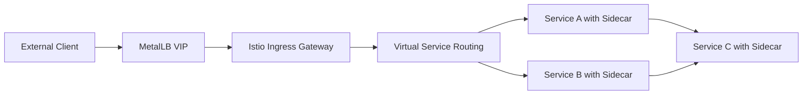
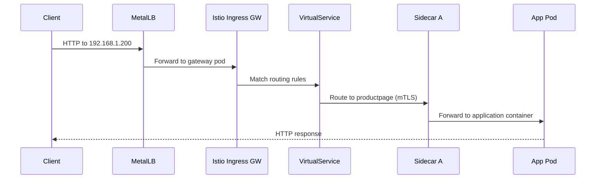

# How to Use MetalLB with Istio Ingress Gateway

Author: [nawazdhandala](https://www.github.com/nawazdhandala)

Tags: Kubernetes, MetalLB, Istio, Service Mesh, Gateway

Description: Learn how to expose Istio Ingress Gateway with MetalLB on bare-metal Kubernetes clusters.

---

Istio's Ingress Gateway is the entry point for all traffic entering the service mesh. On cloud platforms, the gateway automatically gets a cloud load balancer. On bare metal, you need MetalLB to assign an external IP to the Istio Ingress Gateway so that traffic can reach your mesh.

This post shows you how to set up MetalLB with Istio Ingress Gateway on a bare-metal Kubernetes cluster.

## Architecture

Here is how traffic flows through MetalLB into the Istio service mesh:



All traffic enters through the MetalLB VIP, hits the Istio Ingress Gateway, and is then routed by VirtualService rules to the appropriate backend. Inside the mesh, traffic flows through Envoy sidecars with mTLS encryption.

## Prerequisites

- Kubernetes cluster on bare metal
- MetalLB installed with an IP address pool
- Helm 3 and istioctl installed
- kubectl access to the cluster

## Step 1: Configure MetalLB

Create an IP pool for the Istio Ingress Gateway:

```yaml
# metallb-istio-pool.yaml
# Reserve IPs for the Istio Ingress Gateway.
apiVersion: metallb.io/v1beta1
kind: IPAddressPool
metadata:
  name: istio-pool
  namespace: metallb-system
spec:
  addresses:
    - 192.168.1.200-192.168.1.210
---
apiVersion: metallb.io/v1beta1
kind: L2Advertisement
metadata:
  name: istio-l2
  namespace: metallb-system
spec:
  ipAddressPools:
    - istio-pool
```

```bash
kubectl apply -f metallb-istio-pool.yaml
```

## Step 2: Install Istio

Install Istio using istioctl with the default profile, which includes the Ingress Gateway:

```bash
# Install Istio with the default profile
# This creates the istiod control plane and the ingress gateway
istioctl install --set profile=default -y

# Verify the installation
istioctl verify-install

# Check that the Istio Ingress Gateway got a MetalLB IP
kubectl get svc -n istio-system istio-ingressgateway
```

You should see an EXTERNAL-IP assigned from the MetalLB pool:

```
NAME                   TYPE           CLUSTER-IP     EXTERNAL-IP     PORT(S)
istio-ingressgateway   LoadBalancer   10.43.50.100   192.168.1.200   15021:30521/TCP,80:30080/TCP,443:30443/TCP
```

## Step 3: Request a Specific IP

If you want the Istio Ingress Gateway to always use a specific MetalLB IP, annotate the service:

```bash
# Patch the Istio Ingress Gateway service to request a specific IP
kubectl patch svc istio-ingressgateway -n istio-system -p '{
  "metadata": {
    "annotations": {
      "metallb.universe.tf/loadBalancerIPs": "192.168.1.200"
    }
  }
}'
```

## Step 4: Enable Sidecar Injection

Enable automatic sidecar injection for your application namespace:

```bash
# Label the namespace for automatic Envoy sidecar injection
kubectl label namespace default istio-injection=enabled

# Verify the label
kubectl get namespace default --show-labels
```

## Step 5: Deploy a Sample Application

Deploy a sample application inside the mesh:

```yaml
# bookinfo.yaml
# Deploy the Istio Bookinfo sample application.
apiVersion: apps/v1
kind: Deployment
metadata:
  name: productpage
  namespace: default
spec:
  replicas: 2
  selector:
    matchLabels:
      app: productpage
  template:
    metadata:
      labels:
        app: productpage
        version: v1
    spec:
      containers:
        - name: productpage
          image: docker.io/istio/examples-bookinfo-productpage-v1:1.20.2
          ports:
            - containerPort: 9080
          # Readiness probe for Istio health checks
          readinessProbe:
            httpGet:
              path: /health
              port: 9080
            initialDelaySeconds: 10
            periodSeconds: 5
---
apiVersion: v1
kind: Service
metadata:
  name: productpage
  namespace: default
spec:
  selector:
    app: productpage
  ports:
    - port: 9080
      targetPort: 9080
```

```bash
kubectl apply -f bookinfo.yaml
```

## Step 6: Configure Istio Gateway and VirtualService

Create an Istio Gateway and VirtualService to route external traffic to your application:

```yaml
# istio-gateway.yaml
# Define how external traffic enters the mesh.
apiVersion: networking.istio.io/v1
kind: Gateway
metadata:
  name: app-gateway
  namespace: default
spec:
  selector:
    # Use the default Istio ingress gateway
    istio: ingressgateway
  servers:
    - port:
        number: 80
        name: http
        protocol: HTTP
      hosts:
        # Accept traffic for this hostname
        - "bookinfo.example.com"
    - port:
        number: 443
        name: https
        protocol: HTTPS
      hosts:
        - "bookinfo.example.com"
      tls:
        mode: SIMPLE
        # Reference a Kubernetes secret containing the TLS cert
        credentialName: bookinfo-tls-secret
---
# VirtualService defines routing rules for traffic entering through the Gateway.
apiVersion: networking.istio.io/v1
kind: VirtualService
metadata:
  name: bookinfo-vs
  namespace: default
spec:
  hosts:
    - "bookinfo.example.com"
  gateways:
    - app-gateway
  http:
    # Route all traffic to the productpage service
    - match:
        - uri:
            prefix: /
      route:
        - destination:
            host: productpage
            port:
              number: 9080
```

```bash
# Apply the gateway and routing rules
kubectl apply -f istio-gateway.yaml

# Test the route
curl -H "Host: bookinfo.example.com" http://192.168.1.200/productpage
```

## Traffic Flow Through the Mesh



## Traffic Management with MetalLB

### Canary Deployments

Use Istio's traffic splitting with VirtualService:

```yaml
# canary-routing.yaml
# Split traffic between two versions of a service.
apiVersion: networking.istio.io/v1
kind: VirtualService
metadata:
  name: reviews-canary
  namespace: default
spec:
  hosts:
    - reviews
  http:
    - route:
        # Send 90% of traffic to v1
        - destination:
            host: reviews
            subset: v1
          weight: 90
        # Send 10% of traffic to v2 (canary)
        - destination:
            host: reviews
            subset: v2
          weight: 10
---
# DestinationRule defines the subsets
apiVersion: networking.istio.io/v1
kind: DestinationRule
metadata:
  name: reviews-dr
  namespace: default
spec:
  host: reviews
  subsets:
    - name: v1
      labels:
        version: v1
    - name: v2
      labels:
        version: v2
```

### Circuit Breaking

Protect your services from cascading failures:

```yaml
# circuit-breaker.yaml
# Configure circuit breaking for a backend service.
apiVersion: networking.istio.io/v1
kind: DestinationRule
metadata:
  name: productpage-cb
  namespace: default
spec:
  host: productpage
  trafficPolicy:
    connectionPool:
      tcp:
        # Maximum number of TCP connections
        maxConnections: 100
      http:
        # Maximum pending HTTP requests
        h2UpgradePolicy: DEFAULT
        maxRequestsPerConnection: 10
    outlierDetection:
      # Eject a host after 3 consecutive 5xx errors
      consecutive5xxErrors: 3
      interval: 30s
      baseEjectionTime: 60s
```

## Observability

Istio provides built-in observability. With MetalLB providing the entry point, you can monitor all traffic flowing through the mesh.

### Check Mesh Status

```bash
# View the proxy status of all sidecars
istioctl proxy-status

# Check the configuration of the ingress gateway
istioctl proxy-config routes istio-ingressgateway-xxx -n istio-system

# View access logs from the ingress gateway
kubectl logs -n istio-system -l app=istio-ingressgateway --tail=50
```

### Prometheus Metrics

Istio generates detailed metrics for every request:

- `istio_requests_total` - Total request count by source, destination, and response code
- `istio_request_duration_milliseconds` - Request latency distribution
- `istio_tcp_connections_opened_total` - TCP connections opened

## Troubleshooting

1. **Gateway service has no external IP** - Verify MetalLB is running and the IP pool has available addresses
2. **503 errors from the gateway** - Check that the VirtualService matches the Gateway hosts
3. **mTLS errors** - Verify sidecar injection is enabled and PeerAuthentication policies are correct
4. **Timeout errors** - Check DestinationRule connection pool settings and circuit breaker configuration

```bash
# Common debug commands
istioctl analyze                          # Check for configuration issues
istioctl proxy-config cluster <pod>       # View cluster configuration
kubectl get gateway,virtualservice -A     # List all gateways and routes
```

## Summary

MetalLB and Istio Ingress Gateway together provide a powerful ingress solution for bare-metal Kubernetes clusters running a service mesh. MetalLB assigns the external IP, and Istio handles advanced traffic management, mTLS, and observability for all traffic entering the mesh.

For monitoring the external availability of your Istio services exposed via MetalLB, use [OneUptime](https://oneuptime.com). OneUptime can monitor your gateway endpoints from outside the cluster, track response times, and alert you when services become degraded or unreachable. Combined with Istio's internal observability, you get full coverage from the edge to the mesh.
