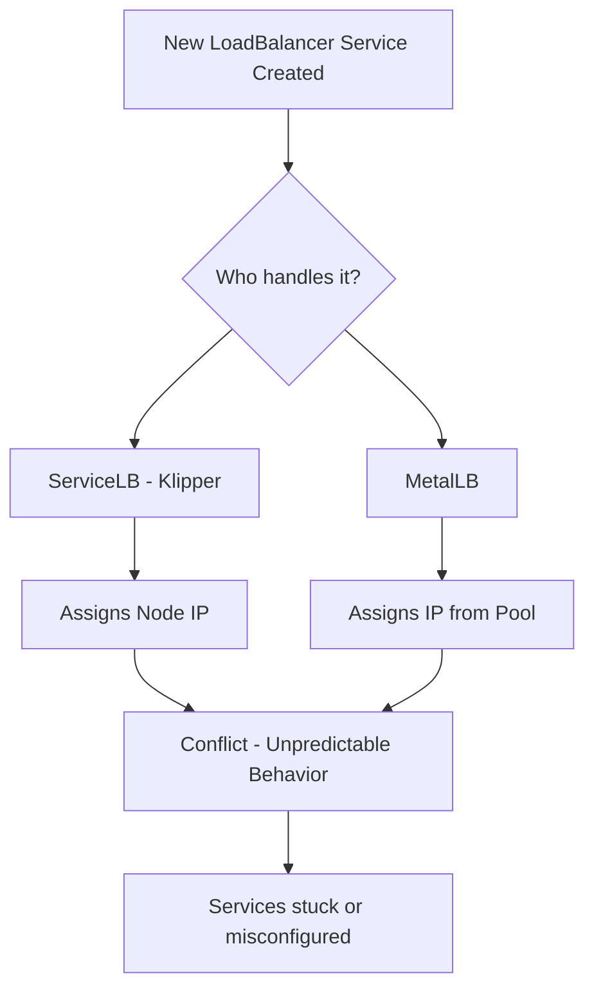
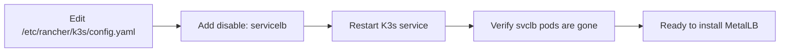

# How to Install MetalLB on K3s and Fix ServiceLB Conflicts

Author: [nawazdhandala](https://www.github.com/nawazdhandala)

Tags: Kubernetes, MetalLB, K3s, ServiceLB, Load Balancing

Description: Learn how to install MetalLB on K3s clusters and resolve conflicts with K3s built-in ServiceLB (formerly Klipper). This guide covers disabling ServiceLB, deploying MetalLB, and configuring IP address pools.

---

If you have ever tried installing MetalLB on a K3s cluster and watched your LoadBalancer services get stuck in a weird state - you are not alone. K3s ships with its own built-in load balancer called ServiceLB (previously known as Klipper), and it does not play well with MetalLB. The two will fight over who gets to assign external IPs to your services, and nobody wins.

This guide walks you through the whole process: understanding why the conflict happens, disabling ServiceLB, installing MetalLB properly, and configuring IP address pools so your services actually get reachable external addresses.

## What Is ServiceLB (Klipper) and Why Does It Conflict?

K3s is designed to be a lightweight Kubernetes distribution that works out of the box. Part of that "out of the box" experience is ServiceLB - a simple load balancer that runs as a DaemonSet. When you create a Kubernetes Service of type `LoadBalancer`, ServiceLB spins up a pod on each node that uses `iptables` rules to forward traffic from the node's IP to your service.

MetalLB does something similar but more sophisticated. It supports both Layer 2 (ARP/NDP) and BGP modes, gives you fine-grained control over IP address pools, and is the standard choice for bare-metal Kubernetes clusters that need proper load balancing.

The problem is simple: both ServiceLB and MetalLB watch for `LoadBalancer` services and both try to assign external IPs. This creates a race condition. Sometimes ServiceLB wins and assigns the node IP. Sometimes MetalLB wins and assigns an IP from your configured pool. Sometimes neither wins cleanly and your service sits in `Pending` state forever.

Here is what the conflict looks like at a high level:



The fix is straightforward - you need to disable ServiceLB before or after installing MetalLB.

## Disabling ServiceLB on a New K3s Installation

If you have not installed K3s yet, this is the easiest path. You can disable ServiceLB right at install time by passing the `--disable servicelb` flag.

Install K3s with ServiceLB disabled on the server (control plane) node:

```bash
# Install K3s without the built-in ServiceLB
# The --disable flag prevents the Klipper load balancer from starting
curl -sfL https://get.k3s.io | INSTALL_K3S_EXEC="--disable servicelb" sh -
```

If you are passing multiple flags or want to be more explicit, you can also write it this way:

```bash
# Install K3s with ServiceLB and Traefik disabled
# Useful if you plan to use your own ingress controller too
curl -sfL https://get.k3s.io | sh -s - server \
  --disable servicelb \
  --disable traefik
```

After installation, verify that ServiceLB is actually disabled by checking that no `svclb-` pods are running:

```bash
# Check for any ServiceLB pods - there should be none
kubectl get pods -A | grep svclb
```

If you see no output, ServiceLB is disabled and you are good to go.

## Disabling ServiceLB on an Existing K3s Cluster

Already have a K3s cluster running with ServiceLB? No problem. You can disable it after the fact.

The approach depends on how K3s was installed, but the most reliable method is to add a configuration file. K3s reads YAML config from `/etc/rancher/k3s/config.yaml` on the server node.

Add the disable directive to the K3s config file:

```yaml
# /etc/rancher/k3s/config.yaml
# Add this line to disable the built-in ServiceLB
# K3s will pick this up on the next restart
disable:
  - servicelb
```

Then restart the K3s service so it picks up the new configuration:

```bash
# Restart K3s to apply the configuration change
sudo systemctl restart k3s
```

After the restart, the ServiceLB DaemonSet and its pods will be removed. You can verify this:

```bash
# Confirm ServiceLB pods are gone
kubectl get pods -A | grep svclb

# Also check that the DaemonSet is removed
kubectl get daemonset -A | grep svclb
```

If there are leftover `svclb-` pods still hanging around, you can delete them manually:

```bash
# Clean up any leftover ServiceLB pods in the kube-system namespace
kubectl delete pods -n kube-system -l svccontroller.k3s.cattle.io/svcname
```

Here is the flow for disabling ServiceLB on an existing cluster:



## Installing MetalLB

With ServiceLB out of the way, you can now install MetalLB. There are two common approaches: using the official manifests directly, or using Helm. I will cover both.

### Option 1: Install with Manifests

This is the quickest way to get MetalLB running. The official manifests create the namespace, CRDs, controller deployment, and speaker DaemonSet in one shot.

Apply the MetalLB manifests from the official repository:

```bash
# Install MetalLB using the official manifests
# This creates the metallb-system namespace and all required resources
kubectl apply -f https://raw.githubusercontent.com/metallb/metallb/v0.14.9/config/manifests/metallb-native.yaml
```

Wait for the MetalLB pods to become ready before moving on:

```bash
# Wait for the MetalLB controller and speaker pods to be ready
# The controller manages IP allocations
# The speaker handles network announcements (ARP/BGP)
kubectl wait --namespace metallb-system \
  --for=condition=ready pod \
  --selector=app=metallb \
  --timeout=120s
```

Check that everything is running:

```bash
# Verify MetalLB pods are up and healthy
kubectl get pods -n metallb-system
```

You should see output similar to this:

```
NAME                          READY   STATUS    RESTARTS   AGE
controller-7476b58756-h2wkt   1/1     Running   0          45s
speaker-abcde                 1/1     Running   0          45s
speaker-fghij                 1/1     Running   0          45s
```

The `controller` pod handles IP address allocation. The `speaker` pods run on every node and handle the actual network announcements - ARP responses in L2 mode or BGP sessions in BGP mode.

### Option 2: Install with Helm

If you prefer Helm and want more control over the installation, this is the way to go.

Add the MetalLB Helm repo and install the chart:

```bash
# Add the MetalLB Helm repository
helm repo add metallb https://metallb.github.io/metallb

# Update your local Helm repo cache
helm repo update

# Install MetalLB into the metallb-system namespace
# The --create-namespace flag handles namespace creation for you
helm install metallb metallb/metallb \
  --namespace metallb-system \
  --create-namespace
```

Wait for the pods to come up:

```bash
# Verify the Helm-based installation
kubectl get pods -n metallb-system -w
```

## Configuring an L2 Address Pool

MetalLB is installed but it will not do anything useful until you give it a pool of IP addresses to work with. For most bare-metal and homelab setups, Layer 2 mode is the simplest choice. In L2 mode, MetalLB responds to ARP requests for the IPs it manages - no BGP routers needed.

You need two resources: an `IPAddressPool` that defines which IPs MetalLB can hand out, and an `L2Advertisement` that tells MetalLB to announce those IPs via ARP.

Create a file called `metallb-config.yaml` with the following content. Replace the IP range with addresses that are available on your network and not assigned to anything else:

```yaml
# metallb-config.yaml
# Defines the pool of IP addresses MetalLB can allocate to LoadBalancer services
apiVersion: metallb.io/v1beta1
kind: IPAddressPool
metadata:
  name: default-pool
  namespace: metallb-system
spec:
  addresses:
    # Replace this range with IPs available on your local network
    # Make sure these IPs are not in your DHCP server's range
    - 192.168.1.200-192.168.1.250
---
# Tells MetalLB to advertise the IPs using Layer 2 (ARP)
# This is the simplest mode and works without any router configuration
apiVersion: metallb.io/v1beta1
kind: L2Advertisement
metadata:
  name: default-l2
  namespace: metallb-system
spec:
  ipAddressPools:
    # Reference the pool defined above
    - default-pool
```

Apply the configuration:

```bash
# Apply the IP address pool and L2 advertisement config
kubectl apply -f metallb-config.yaml
```

If you have multiple network segments or want to use specific IPs for specific services, you can create multiple pools:

```yaml
# metallb-multi-pool.yaml
# A pool for production services
apiVersion: metallb.io/v1beta1
kind: IPAddressPool
metadata:
  name: production-pool
  namespace: metallb-system
spec:
  addresses:
    - 10.0.0.100-10.0.0.110
---
# A pool for staging/dev services
apiVersion: metallb.io/v1beta1
kind: IPAddressPool
metadata:
  name: staging-pool
  namespace: metallb-system
spec:
  addresses:
    - 10.0.0.200-10.0.0.210
---
apiVersion: metallb.io/v1beta1
kind: L2Advertisement
metadata:
  name: all-pools-l2
  namespace: metallb-system
spec:
  ipAddressPools:
    - production-pool
    - staging-pool
```

To request an IP from a specific pool, annotate your service:

```yaml
# Example service requesting an IP from the staging pool
apiVersion: v1
kind: Service
metadata:
  name: my-app
  annotations:
    # This annotation tells MetalLB which pool to allocate from
    metallb.universe.tf/address-pool: staging-pool
spec:
  type: LoadBalancer
  selector:
    app: my-app
  ports:
    - port: 80
      targetPort: 8080
```

## Verifying Everything Works

Time to test. Create a simple nginx deployment and expose it through a LoadBalancer service:

```bash
# Create a test deployment
kubectl create deployment nginx-test --image=nginx:alpine

# Expose it as a LoadBalancer service
kubectl expose deployment nginx-test --type=LoadBalancer --port=80
```

Check that MetalLB assigned an external IP from your pool:

```bash
# Watch the service until it gets an external IP
kubectl get svc nginx-test -w
```

You should see something like:

```
NAME         TYPE           CLUSTER-IP     EXTERNAL-IP     PORT(S)        AGE
nginx-test   LoadBalancer   10.43.12.100   192.168.1.200   80:31234/TCP   10s
```

The key thing is that `EXTERNAL-IP` shows an address from your configured pool - not `<pending>` and not a node IP. If you see an IP from your MetalLB pool, everything is working.

Test that you can actually reach the service:

```bash
# Curl the external IP to verify traffic reaches nginx
curl http://192.168.1.200
```

If you get the default nginx welcome page, you are done. MetalLB is handling your LoadBalancer services correctly.

Clean up the test resources when you are satisfied:

```bash
# Remove the test deployment and service
kubectl delete deployment nginx-test
kubectl delete svc nginx-test
```

## Troubleshooting Common Issues

Here are a few things that can trip you up:

**Services stuck in Pending state** - This usually means MetalLB's speaker pods cannot announce the IP. Check that the speaker pods are running on all nodes and that your IP pool addresses are on the same subnet as your nodes.

```bash
# Check speaker pod logs for errors
kubectl logs -n metallb-system -l component=speaker --tail=50
```

**IP address conflicts** - If another device on your network already uses an IP in your MetalLB pool, you will get intermittent connectivity issues. Always double-check that your pool range does not overlap with your DHCP range or any static assignments.

**ServiceLB still running** - If you see `svclb-` pods alongside MetalLB pods, ServiceLB was not disabled properly. Go back to the disabling section and make sure the K3s config is correct and the service was restarted.

```bash
# Quick check for both systems running at the same time
echo "--- ServiceLB pods ---"
kubectl get pods -A | grep svclb
echo "--- MetalLB pods ---"
kubectl get pods -n metallb-system
```

## Monitoring Your K3s Services with OneUptime

Once your MetalLB setup is working and your services have stable external IPs, you will want to make sure they stay healthy. [OneUptime](https://oneuptime.com) can monitor your K3s services by checking those external endpoints, tracking uptime, and alerting you when something goes down. Since MetalLB gives your services consistent IPs, setting up HTTP or TCP monitors in OneUptime is straightforward - just point them at the external IPs or DNS names that resolve to your MetalLB-assigned addresses.
