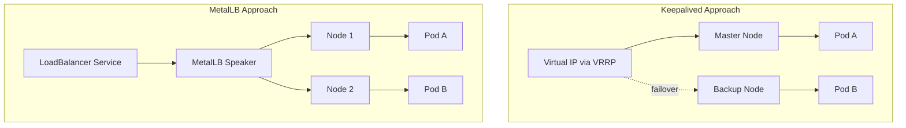
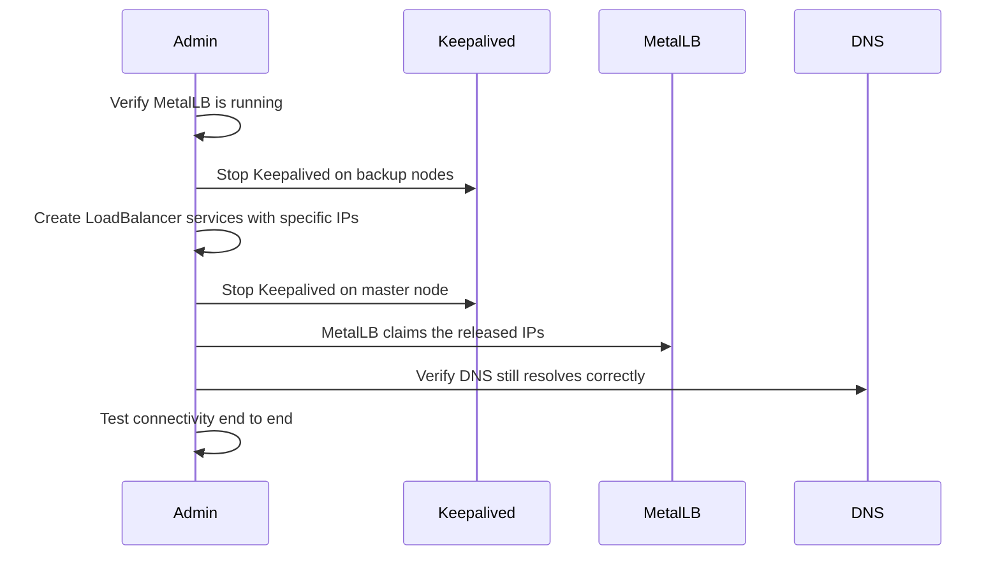

# How to Migrate from Keepalived to MetalLB on Kubernetes

Author: [nawazdhandala](https://www.github.com/nawazdhandala)

Tags: Kubernetes, MetalLB, Keepalived, Migration, Load Balancing

Description: Step-by-step guide to migrating from Keepalived virtual IPs to MetalLB-managed LoadBalancer services on Kubernetes.

---

## Why Migrate from Keepalived to MetalLB?

Keepalived has been the go-to solution for virtual IP failover on bare-metal Linux servers for years. It uses VRRP (Virtual Router Redundancy Protocol) to float IP addresses between nodes. However, Keepalived was not designed for Kubernetes-native workflows. It requires manual configuration, lacks integration with Kubernetes service objects, and can create operational headaches as clusters grow.

MetalLB is a Kubernetes-native load balancer that assigns real IP addresses to LoadBalancer-type services. It integrates directly with the Kubernetes API, supports both Layer 2 and BGP modes, and eliminates the need for external scripts or manual VRRP configuration.

## Architecture Comparison

Here is how traffic flows differently between the two approaches:



## Prerequisites

Before starting the migration, ensure you have:

- A running Kubernetes cluster (v1.24 or later)
- kubectl access with cluster-admin privileges
- An inventory of all Keepalived-managed VIPs
- A list of services currently using those VIPs
- A maintenance window for the cutover

## Step 1: Inventory Your Keepalived Configuration

Start by documenting every virtual IP managed by Keepalived. Typically you will find the configuration in `/etc/keepalived/keepalived.conf`:

```bash
# List all virtual IPs from keepalived config
# This helps identify which IPs need to be migrated
grep -A 5 "virtual_ipaddress" /etc/keepalived/keepalived.conf
```

Create a mapping document:

```yaml
# migration-inventory.yaml
# Maps each Keepalived VIP to its target Kubernetes service
vips:
  - ip: "192.168.1.100"
    service: "web-frontend"
    namespace: "production"
    port: 80
  - ip: "192.168.1.101"
    service: "api-gateway"
    namespace: "production"
    port: 443
  - ip: "192.168.1.102"
    service: "monitoring-ingress"
    namespace: "monitoring"
    port: 9090
```

## Step 2: Install MetalLB

Install MetalLB using the official manifests:

```bash
# Install MetalLB v0.14.x
# This creates the metallb-system namespace and deploys controller + speakers
kubectl apply -f https://raw.githubusercontent.com/metallb/metallb/v0.14.9/config/manifests/metallb-native.yaml

# Wait for all MetalLB pods to be ready
kubectl wait --namespace metallb-system \
  --for=condition=ready pod \
  --selector=app=metallb \
  --timeout=120s
```

## Step 3: Configure MetalLB IP Address Pools

Create an IPAddressPool that includes the same IPs previously managed by Keepalived:

```yaml
# metallb-config.yaml
# Define the pool of IPs that MetalLB can assign to services
apiVersion: metallb.io/v1beta1
kind: IPAddressPool
metadata:
  name: production-pool
  namespace: metallb-system
spec:
  addresses:
    # Include all IPs previously managed by Keepalived
    - 192.168.1.100-192.168.1.110
  autoAssign: true
---
# Use L2 advertisement to announce IPs via ARP
# This is the closest equivalent to Keepalived VRRP behavior
apiVersion: metallb.io/v1beta1
kind: L2Advertisement
metadata:
  name: production-l2
  namespace: metallb-system
spec:
  ipAddressPools:
    - production-pool
```

Apply the configuration:

```bash
# Apply MetalLB pool and advertisement config
kubectl apply -f metallb-config.yaml
```

## Step 4: Plan the Cutover Sequence

The migration sequence matters. Follow this order to minimize downtime:



## Step 5: Create LoadBalancer Services

For each Keepalived VIP, create a corresponding LoadBalancer service with the `loadBalancerIP` field set to the same address:

```yaml
# svc-web-frontend.yaml
# Assigns the same IP that Keepalived used to manage
apiVersion: v1
kind: Service
metadata:
  name: web-frontend
  namespace: production
  annotations:
    # Optional: pin to a specific MetalLB pool
    metallb.universe.tf/address-pool: production-pool
spec:
  type: LoadBalancer
  # Request the exact IP previously managed by Keepalived
  loadBalancerIP: "192.168.1.100"
  ports:
    - name: http
      port: 80
      targetPort: 8080
      protocol: TCP
  selector:
    app: web-frontend
```

## Step 6: Execute the Cutover

Run the cutover during your maintenance window:

```bash
# Step 6a: Stop Keepalived on backup nodes first
# This prevents split-brain during cutover
ssh backup-node-1 "sudo systemctl stop keepalived"
ssh backup-node-2 "sudo systemctl stop keepalived"

# Step 6b: Apply MetalLB services (they will pend until IPs are free)
kubectl apply -f svc-web-frontend.yaml
kubectl apply -f svc-api-gateway.yaml
kubectl apply -f svc-monitoring-ingress.yaml

# Step 6c: Stop Keepalived on master node to release IPs
ssh master-node "sudo systemctl stop keepalived"

# Step 6d: Verify MetalLB has claimed the IPs
kubectl get svc -A -o wide | grep LoadBalancer
```

## Step 7: Validate the Migration

Run connectivity checks for every migrated service:

```bash
# Verify each service has the expected external IP
# The EXTERNAL-IP column should show the migrated VIP
kubectl get svc -n production web-frontend

# Test HTTP connectivity through the migrated IP
curl -v http://192.168.1.100

# Check MetalLB speaker logs for ARP announcements
kubectl logs -n metallb-system -l component=speaker --tail=50

# Verify ARP resolution on a client machine
arp -n | grep "192.168.1.100"
```

## Step 8: Clean Up Keepalived

Once everything is validated, remove Keepalived from your nodes:

```bash
# Disable Keepalived so it does not start on reboot
sudo systemctl disable keepalived

# Optionally remove the package entirely
sudo apt-get remove keepalived  # Debian/Ubuntu
# or
sudo yum remove keepalived      # RHEL/CentOS
```

## Rollback Plan

If something goes wrong, you can roll back quickly:

```bash
# Delete the MetalLB-managed services
kubectl delete svc web-frontend -n production

# Restart Keepalived on all nodes
ssh master-node "sudo systemctl start keepalived"
ssh backup-node-1 "sudo systemctl start keepalived"

# Keepalived will reclaim the VIPs via VRRP
# Verify with: ip addr show | grep 192.168.1.100
```

## Common Pitfalls

1. **ARP cache staleness**: Clients may cache the old MAC address. MetalLB sends gratuitous ARP, but some switches need manual ARP table clearing.
2. **IP conflicts during cutover**: Never run Keepalived and MetalLB for the same IP simultaneously. Stop Keepalived first.
3. **Firewall rules**: If your nodes have iptables rules specific to Keepalived VRRP (protocol 112), you can remove those after migration.
4. **Health checks**: Keepalived health checks do not carry over. Use Kubernetes readiness probes and MetalLB's native service health awareness instead.

## Summary

Migrating from Keepalived to MetalLB gives you a Kubernetes-native load balancing solution that scales with your cluster. The key steps are: inventory your VIPs, install and configure MetalLB, create LoadBalancer services with the same IPs, execute a clean cutover, and validate connectivity.

If you need to monitor the health and uptime of your MetalLB-managed services after migration, [OneUptime](https://oneuptime.com) provides comprehensive infrastructure monitoring, alerting, and status pages that integrate seamlessly with Kubernetes environments.
