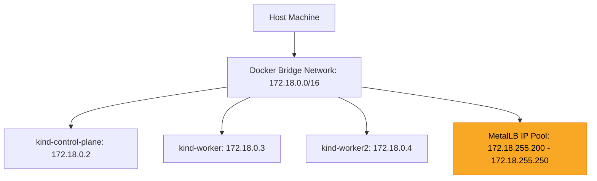
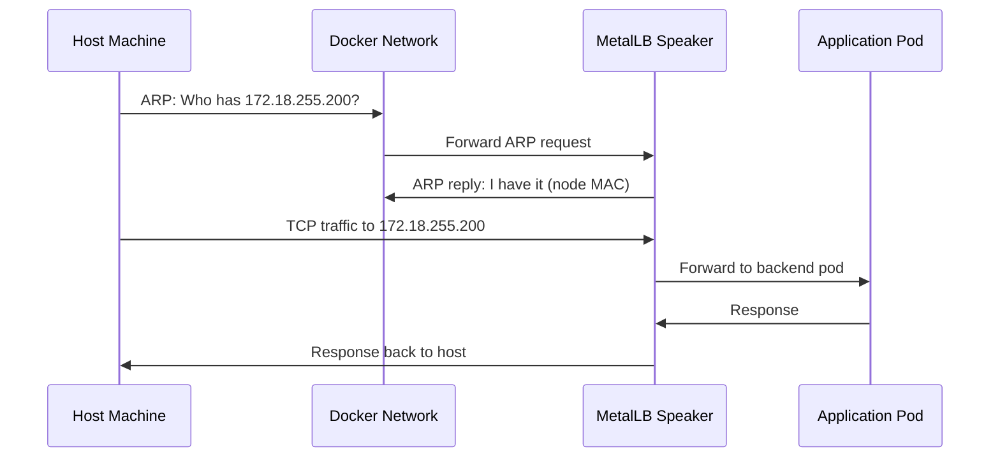

# How to Install MetalLB on Kind for Local Development and Testing

Author: [nawazdhandala](https://www.github.com/nawazdhandala)

Tags: Kubernetes, MetalLB, Kind, Local Development, Testing

Description: Learn how to set up MetalLB on Kind (Kubernetes in Docker) clusters for local development and testing. This guide covers Docker network configuration, IP pool selection, and testing LoadBalancer services locally.

---

If you have ever tried to create a Kubernetes Service of type `LoadBalancer` on a local cluster, you have probably seen it stuck forever with `EXTERNAL-IP` showing `<pending>`. That is because local clusters do not have a cloud provider to provision load balancers for you. MetalLB solves this problem by acting as a software load balancer that runs entirely inside your cluster.

In this guide, we will walk through installing MetalLB on a Kind (Kubernetes in Docker) cluster so you can develop and test LoadBalancer services on your laptop.

## What Is Kind?

Kind stands for **Kubernetes in Docker**. It runs a full Kubernetes cluster inside Docker containers, making it one of the fastest ways to spin up a local cluster. Each Kubernetes node is a Docker container, and the entire cluster lives on a Docker network.

Kind is popular for:

- **Local development** - test manifests and Helm charts before pushing to staging.
- **CI pipelines** - spin up a throwaway cluster in seconds.
- **Learning** - experiment with Kubernetes without cloud costs.

Because Kind clusters live inside Docker, they share a Docker bridge network. This is the key detail we will use later when configuring MetalLB's IP address pool.

## Prerequisites

Before you begin, make sure you have the following installed:

- **Docker** - Kind runs Kubernetes nodes as Docker containers.
- **Kind** - install from [kind.sigs.k8s.io](https://kind.sigs.k8s.io/).
- **kubectl** - the Kubernetes CLI, configured to talk to your cluster.

## Step 1: Create a Kind Cluster

Start by creating a fresh Kind cluster. You can use a simple one-liner or a config file for multi-node setups.

```bash
# Create a single-node Kind cluster named "metallb-lab"
kind create cluster --name metallb-lab
```

For a more realistic setup with multiple nodes, create a config file:

```yaml
# kind-config.yaml
# Multi-node Kind cluster with one control plane and two workers
apiVersion: kind.x-k8s.io/v1alpha4
kind: Cluster
nodes:
  - role: control-plane   # The control plane node
  - role: worker           # First worker node
  - role: worker           # Second worker node
```

Then create the cluster with:

```bash
# Create a multi-node cluster from the config file
kind create cluster --name metallb-lab --config kind-config.yaml
```

Verify your cluster is running:

```bash
# Check that all nodes are in Ready state
kubectl get nodes
```

You should see output like this:

```
NAME                        STATUS   ROLES           AGE   VERSION
metallb-lab-control-plane   Ready    control-plane   45s   v1.31.0
metallb-lab-worker          Ready    <none>          30s   v1.31.0
metallb-lab-worker2         Ready    <none>          30s   v1.31.0
```

## Step 2: Find the Docker Network Subnet

MetalLB needs a pool of IP addresses it can assign to LoadBalancer services. On Kind, those IPs must come from the same Docker network the cluster uses. Let us find that subnet.

```bash
# Inspect the Kind Docker network to find its subnet
# Kind creates a network named "kind" by default
docker network inspect kind -f '{{range .IPAM.Config}}{{.Subnet}}{{end}}'
```

This will output something like:

```
172.18.0.0/16
```

This tells us the Docker network uses the `172.18.0.0/16` range. We will pick a slice of this range for MetalLB - one that does not overlap with the IPs Docker has already assigned to the Kind containers.

Check which IPs Docker has already assigned:

```bash
# List the IPs of running Kind containers so we avoid conflicts
docker network inspect kind -f '{{range .Containers}}{{.IPv4Address}} {{end}}'
```

You might see something like `172.18.0.2/16 172.18.0.3/16 172.18.0.4/16`. That means Docker is using the low end of the range, so we can safely pick addresses from higher in the range, for example `172.18.255.200 - 172.18.255.250`.

Here is how the network topology looks:



## Step 3: Install MetalLB

Install MetalLB using the official manifest. This deploys the MetalLB controller and speaker pods into the `metallb-system` namespace.

```bash
# Apply the MetalLB manifest (use the version appropriate for your needs)
kubectl apply -f https://raw.githubusercontent.com/metallb/metallb/v0.14.9/config/manifests/metallb-native.yaml
```

Wait for the MetalLB pods to be ready before proceeding:

```bash
# Wait until all MetalLB pods are running
# The controller manages IP allocation; the speaker announces IPs on the network
kubectl wait --namespace metallb-system \
  --for=condition=ready pod \
  --selector=app=metallb \
  --timeout=90s
```

Verify the installation:

```bash
# Check that the controller and speaker pods are running
kubectl get pods -n metallb-system
```

Expected output:

```
NAME                          READY   STATUS    RESTARTS   AGE
controller-65db86ddc6-k4czj   1/1     Running   0          30s
speaker-7b2xk                 1/1     Running   0          30s
speaker-9m4tl                 1/1     Running   0          30s
speaker-xp7rz                 1/1     Running   0          30s
```

Notice there is one speaker pod per node. The speaker is a DaemonSet that runs on every node and is responsible for responding to ARP requests for the allocated IPs.

## Step 4: Configure the IP Address Pool

Now create an `IPAddressPool` resource that tells MetalLB which IPs it can hand out. Use the range you identified from the Docker subnet.

```yaml
# metallb-ippool.yaml
# Defines the range of IPs MetalLB can assign to LoadBalancer services
apiVersion: metallb.io/v1beta1
kind: IPAddressPool
metadata:
  name: kind-pool                # A descriptive name for this pool
  namespace: metallb-system      # Must be in the metallb-system namespace
spec:
  addresses:
    # Pick a range from the Docker "kind" network that does not
    # overlap with IPs already assigned to Kind containers.
    # Adjust this to match YOUR Docker network subnet.
    - 172.18.255.200-172.18.255.250
```

Apply it:

```bash
# Create the IP address pool in the cluster
kubectl apply -f metallb-ippool.yaml
```

## Step 5: Configure L2 Advertisement

MetalLB supports two modes: Layer 2 (L2) and BGP. For local development, L2 is the simplest choice. In L2 mode, the MetalLB speaker responds to ARP requests on the local network, directing traffic to the correct node.

```yaml
# metallb-l2-advert.yaml
# Tells MetalLB to advertise IPs from our pool using Layer 2 (ARP)
apiVersion: metallb.io/v1beta1
kind: L2Advertisement
metadata:
  name: kind-l2-advert           # Name for this advertisement config
  namespace: metallb-system       # Must be in the metallb-system namespace
spec:
  ipAddressPools:
    - kind-pool                   # Reference the IPAddressPool we created above
```

Apply it:

```bash
# Enable L2 advertisement for the IP pool
kubectl apply -f metallb-l2-advert.yaml
```

Here is how L2 advertisement works at a high level:



## Step 6: Test with a Sample Service

Let us deploy a simple nginx pod and expose it with a LoadBalancer service to verify everything works.

```yaml
# test-lb.yaml
# A minimal deployment and LoadBalancer service to test MetalLB
apiVersion: apps/v1
kind: Deployment
metadata:
  name: nginx-test
  labels:
    app: nginx-test              # Label used by the service selector
spec:
  replicas: 2                    # Run two replicas for a basic HA setup
  selector:
    matchLabels:
      app: nginx-test
  template:
    metadata:
      labels:
        app: nginx-test
    spec:
      containers:
        - name: nginx
          image: nginx:alpine     # Lightweight nginx image
          ports:
            - containerPort: 80   # nginx listens on port 80
---
apiVersion: v1
kind: Service
metadata:
  name: nginx-lb
spec:
  type: LoadBalancer              # This triggers MetalLB to assign an external IP
  selector:
    app: nginx-test               # Route traffic to pods with this label
  ports:
    - protocol: TCP
      port: 80                    # Port exposed on the external IP
      targetPort: 80              # Port on the container
```

Apply the manifest:

```bash
# Deploy the test application and LoadBalancer service
kubectl apply -f test-lb.yaml
```

Now check the service:

```bash
# Verify MetalLB assigned an external IP (no more <pending>!)
kubectl get svc nginx-lb
```

You should see an external IP from your pool:

```
NAME       TYPE           CLUSTER-IP     EXTERNAL-IP      PORT(S)        AGE
nginx-lb   LoadBalancer   10.96.45.123   172.18.255.200   80:31234/TCP   10s
```

The `EXTERNAL-IP` column now shows a real IP instead of `<pending>`. MetalLB allocated `172.18.255.200` from our pool.

## Step 7: Access the Service from Your Host

Since the MetalLB IPs live on the Docker network and your host machine is connected to that network, you can reach the service directly:

```bash
# Hit the LoadBalancer IP from your host machine
curl http://172.18.255.200
```

You should see the default nginx welcome page HTML. This works because:

1. Your host is connected to the Docker `kind` bridge network.
2. MetalLB's speaker responds to ARP requests for `172.18.255.200`.
3. Traffic is forwarded to one of the nginx pods.

## Troubleshooting Tips

If the external IP is stuck on `<pending>`, check these common issues:

```bash
# 1. Make sure MetalLB pods are running
kubectl get pods -n metallb-system

# 2. Check that the IPAddressPool was created successfully
kubectl get ipaddresspools -n metallb-system

# 3. Check that the L2Advertisement was created
kubectl get l2advertisements -n metallb-system

# 4. Look at MetalLB controller logs for errors
kubectl logs -n metallb-system -l app=metallb,component=controller

# 5. Verify your IP range is within the Docker subnet
docker network inspect kind -f '{{range .IPAM.Config}}{{.Subnet}}{{end}}'
```

A common mistake is choosing an IP range outside the Docker network subnet. If your Docker network is `172.18.0.0/16`, your MetalLB pool must use addresses within that range.

## Cleanup

When you are done testing, tear everything down:

```bash
# Delete the Kind cluster and all resources inside it
kind delete cluster --name metallb-lab
```

This removes the Docker containers, the network, and all Kubernetes resources.

## Wrapping Up

MetalLB on Kind gives you a fully functional LoadBalancer experience on your local machine. This is invaluable when you need to test Ingress controllers, service meshes, or any workload that depends on external IPs - all without spending a cent on cloud infrastructure.

The key steps to remember are: find your Docker subnet, pick a non-overlapping IP range, install MetalLB, create an IPAddressPool, and enable L2 advertisement. Once that is in place, every `type: LoadBalancer` service you create will get a real IP automatically.

If you are building services that need monitoring once they hit production, check out [OneUptime](https://oneuptime.com) - an open-source observability platform for monitoring uptime, performance, and incidents across your entire stack.
