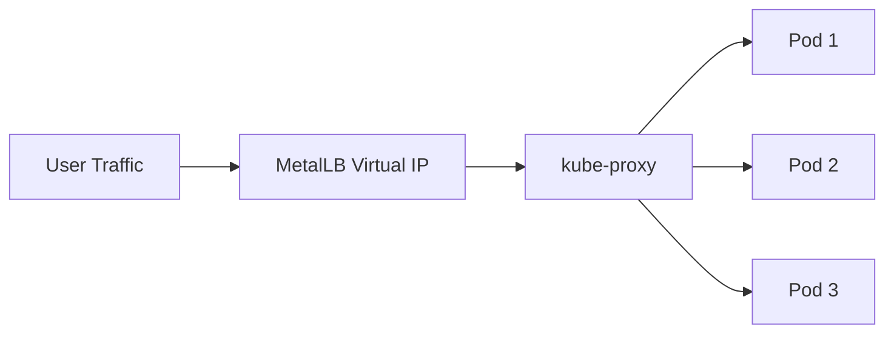
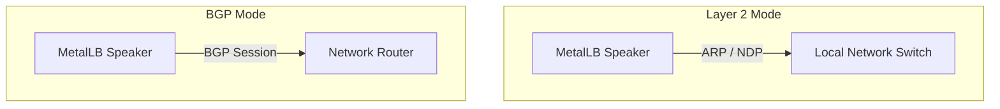

# How to Install MetalLB on kubeadm Clusters from Scratch

Author: [nawazdhandala](https://www.github.com/nawazdhandala)

Tags: Kubernetes, MetalLB, kubeadm, Bare Metal, Load Balancing

Description: Step-by-step guide to installing and configuring MetalLB on kubeadm-provisioned Kubernetes clusters. Covers prerequisites, strict ARP mode, installation methods, and IP pool setup.

---

If you run Kubernetes on bare metal using kubeadm, you have probably noticed that `LoadBalancer` services stay stuck in `<pending>` forever. Cloud providers hand you a load balancer automatically, but bare metal does not. MetalLB fills that gap by assigning real IP addresses to your services so they become reachable from outside the cluster.

This guide walks you through every step: preparing a kubeadm cluster, enabling strict ARP mode, installing MetalLB, configuring IP address pools, and choosing between Layer 2 and BGP advertisement modes.

## How MetalLB Fits into a kubeadm Cluster

In a cloud environment, when you create a Service of type `LoadBalancer`, the cloud controller provisions an external load balancer and assigns it an IP. On bare metal there is no cloud controller, so nothing ever assigns that IP. MetalLB watches for `LoadBalancer` services and assigns IPs from a pool you define.



MetalLB runs as a set of pods inside your cluster. It has two main components:

- **Controller** - a Deployment that watches Services and allocates IPs from your configured pools.
- **Speaker** - a DaemonSet that runs on every node and announces the allocated IPs to the local network (via ARP in L2 mode or via BGP in BGP mode).

## Prerequisites

Before you begin, make sure you have:

- A working kubeadm cluster (single or multi-node) running Kubernetes 1.25 or later.
- `kubectl` configured and pointing at your cluster.
- A range of unused IP addresses on your network that you can dedicate to MetalLB.
- No other load balancer controller running in the cluster.

Verify your cluster is healthy:

```bash
# Check that all nodes are in Ready state
kubectl get nodes

# Confirm the control plane pods are running
kubectl get pods -n kube-system
```

## Step 1: Enable Strict ARP Mode

kubeadm clusters use kube-proxy in IPVS mode by default on many setups. When IPVS is active, kube-proxy responds to ARP requests for every Service IP on every node. This conflicts with MetalLB, which needs to be the only component answering ARP requests for the IPs it manages.

You must enable `strictARP` so kube-proxy stops responding to ARP for addresses it does not own.

```bash
# Edit the kube-proxy ConfigMap to enable strict ARP
# This prevents kube-proxy from answering ARP for MetalLB-managed IPs
kubectl get configmap kube-proxy -n kube-system -o yaml | \
  sed -e "s/strictARP: false/strictARP: true/" | \
  kubectl apply -f - -n kube-system
```

You can also edit it interactively:

```bash
# Open the kube-proxy ConfigMap in your default editor
kubectl edit configmap kube-proxy -n kube-system
```

Find the `ipvs` section and set `strictARP: true`:

```yaml
# Inside the kube-proxy ConfigMap
apiVersion: v1
kind: ConfigMap
metadata:
  name: kube-proxy
  namespace: kube-system
data:
  config.conf: |
    # ... other settings ...
    ipvs:
      # Set to true so kube-proxy only responds to ARP
      # for addresses it actually owns
      strictARP: true
    # ... other settings ...
```

After editing, restart kube-proxy so the change takes effect:

```bash
# Restart the kube-proxy DaemonSet to pick up the new config
kubectl rollout restart daemonset kube-proxy -n kube-system

# Wait until the rollout completes
kubectl rollout status daemonset kube-proxy -n kube-system
```

> **Note:** If your cluster uses iptables mode instead of IPVS, you can skip this step. MetalLB works with both modes, but strict ARP is only required for IPVS.

## Step 2: Install MetalLB

There are two common ways to install MetalLB: plain manifests and Helm.

### Option A: Install with Manifests

This is the simplest approach. Apply the official manifest directly:

```bash
# Install MetalLB v0.14.9 using the official manifest
# This creates the metallb-system namespace and all required resources
METALLB_VERSION="v0.14.9"
kubectl apply -f https://raw.githubusercontent.com/metallb/metallb/${METALLB_VERSION}/config/manifests/metallb-native.yaml
```

Wait for all MetalLB pods to become ready:

```bash
# Wait for the MetalLB controller and speaker pods to start
kubectl wait --namespace metallb-system \
  --for=condition=ready pod \
  --selector=app=metallb \
  --timeout=120s
```

### Option B: Install with Helm

If you prefer Helm for managing releases:

```bash
# Add the MetalLB Helm repository
helm repo add metallb https://metallb.github.io/metallb

# Update the repo index to fetch latest chart versions
helm repo update

# Install MetalLB into the metallb-system namespace
helm install metallb metallb/metallb \
  --namespace metallb-system \
  --create-namespace
```

Verify the installation regardless of which method you used:

```bash
# Check that the controller Deployment is available
kubectl get deployment -n metallb-system

# Check that the speaker DaemonSet has pods on every node
kubectl get daemonset -n metallb-system

# List all pods to confirm they are running
kubectl get pods -n metallb-system
```

You should see output similar to:

```
NAME                          READY   STATUS    RESTARTS   AGE
controller-7cf77c64b6-xk9m2  1/1     Running   0          45s
speaker-abcde                 1/1     Running   0          45s
speaker-fghij                 1/1     Running   0          45s
```

## Step 3: Configure an IP Address Pool

MetalLB needs to know which IP addresses it can hand out. Create an `IPAddressPool` resource:

```yaml
# ip-address-pool.yaml
# Defines the range of IPs MetalLB can assign to LoadBalancer services
apiVersion: metallb.io/v1beta1
kind: IPAddressPool
metadata:
  name: default-pool
  namespace: metallb-system
spec:
  addresses:
    # Use a CIDR range that is free on your network
    - 192.168.1.200-192.168.1.250
    # You can also use CIDR notation
    # - 10.0.0.100/28
```

Apply it:

```bash
# Create the IP address pool in the cluster
kubectl apply -f ip-address-pool.yaml
```

> **Tip:** Pick addresses that are on the same subnet as your nodes but outside the range used by your DHCP server to avoid conflicts.

## Step 4: Choose an Advertisement Mode

MetalLB supports two ways to announce IPs to the network: Layer 2 (L2) and BGP.



### Layer 2 Mode

L2 mode is the easiest to set up. One node in the cluster takes ownership of each service IP and responds to ARP requests for it. No special network hardware is required.

```yaml
# l2-advertisement.yaml
# Tells MetalLB to announce IPs from default-pool using Layer 2 (ARP)
apiVersion: metallb.io/v1beta1
kind: L2Advertisement
metadata:
  name: default-l2
  namespace: metallb-system
spec:
  # Bind this advertisement to specific pools
  # Omit ipAddressPools to advertise all pools
  ipAddressPools:
    - default-pool
```

```bash
# Apply the L2 advertisement configuration
kubectl apply -f l2-advertisement.yaml
```

**Trade-offs of L2 mode:**

- Simple setup, no router configuration needed.
- All traffic for a given IP flows through a single node (no true load balancing at the network level).
- Failover happens when the speaker on the owning node detects a failure and another node takes over.

### BGP Mode

BGP mode peers MetalLB with your network router. Each node announces the service IPs via BGP, and the router distributes traffic across nodes using ECMP (Equal-Cost Multi-Path).

```yaml
# bgp-advertisement.yaml
# Configure MetalLB to peer with a BGP router
apiVersion: metallb.io/v1beta2
kind: BGPPeer
metadata:
  name: router-peer
  namespace: metallb-system
spec:
  # IP address of your upstream BGP router
  peerAddress: 10.0.0.1
  # ASN (Autonomous System Number) of your router
  peerASN: 64501
  # ASN you assign to MetalLB
  myASN: 64500
  # Source address MetalLB uses for the BGP session
  # Typically the node IP on the network facing the router
  # sourceAddress: 10.0.0.10
---
# bgp-pool-advertisement.yaml
# Announce addresses from default-pool over BGP
apiVersion: metallb.io/v1beta1
kind: BGPAdvertisement
metadata:
  name: default-bgp
  namespace: metallb-system
spec:
  ipAddressPools:
    - default-pool
```

```bash
# Apply the BGP peer and advertisement configuration
kubectl apply -f bgp-advertisement.yaml
```

**Trade-offs of BGP mode:**

- True load balancing across nodes via ECMP.
- Requires a BGP-capable router and some network configuration.
- More complex to set up and debug.

## Step 5: Test Your Setup

Deploy a simple nginx service to verify everything works:

```yaml
# test-lb.yaml
# A minimal Deployment and LoadBalancer Service to verify MetalLB
apiVersion: apps/v1
kind: Deployment
metadata:
  name: nginx-test
spec:
  replicas: 2
  selector:
    matchLabels:
      app: nginx-test
  template:
    metadata:
      labels:
        app: nginx-test
    spec:
      containers:
        - name: nginx
          image: nginx:alpine
          ports:
            - containerPort: 80
---
apiVersion: v1
kind: Service
metadata:
  name: nginx-lb
spec:
  type: LoadBalancer
  ports:
    - port: 80
      targetPort: 80
      protocol: TCP
  selector:
    app: nginx-test
```

```bash
# Deploy the test workload and service
kubectl apply -f test-lb.yaml

# Watch the service until an external IP is assigned
kubectl get svc nginx-lb --watch
```

Once an IP appears in the `EXTERNAL-IP` column, test it:

```bash
# Replace with the IP MetalLB assigned to nginx-lb
curl http://<EXTERNAL-IP>
```

You should see the default nginx welcome page. If the external IP stays in `<pending>`, check that your IPAddressPool and advertisement resources are applied correctly and that MetalLB pods are running.

## Troubleshooting

Common issues and quick fixes:

| Symptom | Likely Cause | Fix |
|---|---|---|
| External IP stuck in `<pending>` | No IPAddressPool configured | Create an IPAddressPool with available addresses |
| ARP conflicts in IPVS mode | `strictARP` not enabled | Set `strictARP: true` in kube-proxy ConfigMap |
| MetalLB pods crash-looping | Version mismatch or missing CRDs | Re-apply the manifest for your MetalLB version |
| Cannot reach the external IP | Firewall rules blocking traffic | Allow traffic to the MetalLB IP range on your nodes |
| BGP session not establishing | Wrong peer ASN or address | Verify `peerAddress` and `peerASN` match your router config |

Check MetalLB logs for detailed diagnostics:

```bash
# View controller logs for IP allocation events
kubectl logs -n metallb-system deployment/controller

# View speaker logs for ARP or BGP activity on a specific node
kubectl logs -n metallb-system daemonset/speaker
```

## Cleanup

When you are done testing, remove the test resources:

```bash
# Delete the test deployment and service
kubectl delete -f test-lb.yaml
```

To uninstall MetalLB entirely (if you installed via manifests):

```bash
# Remove all MetalLB resources and the namespace
kubectl delete -f https://raw.githubusercontent.com/metallb/metallb/v0.14.9/config/manifests/metallb-native.yaml
```

## Wrapping Up

MetalLB turns a kubeadm bare-metal cluster into something that behaves much closer to a managed Kubernetes offering when it comes to external connectivity. The key steps are: enable strict ARP if you use IPVS, install MetalLB, define an IP pool, and pick an advertisement mode that fits your network.

For most small and mid-size deployments, Layer 2 mode is the fastest path to a working setup. If you need true multi-node load balancing and have a BGP-capable router, BGP mode is worth the extra configuration.

Once your services have real external IPs, monitoring them becomes critical. [OneUptime](https://oneuptime.com) can monitor the health of your Kubernetes services, track uptime, alert your team when something goes wrong, and give you full observability with logs, metrics, and traces - all in one open-source platform.
