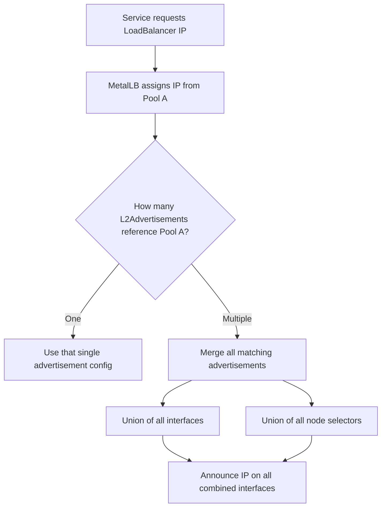
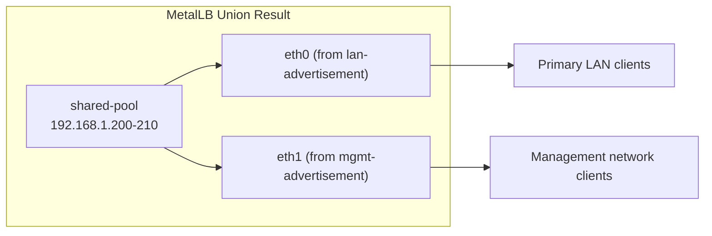
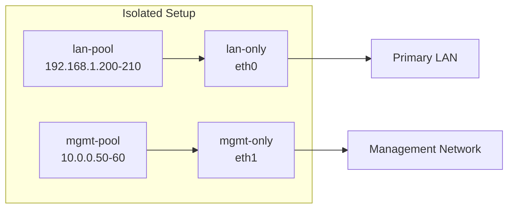

# How to Understand L2Advertisement Union Behavior for Multiple Advertisements

Author: [nawazdhandala](https://www.github.com/nawazdhandala)

Tags: Kubernetes, MetalLB, Layer 2, L2Advertisement, Configuration

Description: Learn how MetalLB handles multiple L2Advertisement resources and their union behavior. Understand how overlapping advertisements are merged and how to design multi-advertisement setups.

---

When you deploy MetalLB in Layer 2 mode, you define L2Advertisement resources to control which IP pools are announced and on which network interfaces. A common question is: what happens when you create more than one L2Advertisement? The answer is union behavior. MetalLB merges all matching advertisements for a given service, combining their interface and node selectors into a single effective configuration.

## What Is an L2Advertisement?

An L2Advertisement tells MetalLB how to announce IPs from one or more IPAddressPools using ARP (IPv4) or NDP (IPv6). Each L2Advertisement can optionally restrict announcements to specific interfaces or nodes.

```yaml
# A basic L2Advertisement that announces all IP pools on all interfaces
apiVersion: metallb.io/v1beta1
kind: L2Advertisement
metadata:
  name: default-l2
  namespace: metallb-system
spec:
  # When ipAddressPools is empty, MetalLB advertises ALL pools
  # This is the simplest configuration for single-network setups
  ipAddressPools: []
```

## How Union Behavior Works

If multiple L2Advertisement resources match the same IPAddressPool, MetalLB does not pick one and ignore the rest. Instead, it takes the union of all matching advertisements. This means the IP will be announced on every interface and from every node that any of the matching advertisements specify.



## A Practical Example: Two Advertisements, One Pool

Consider a cluster with two network interfaces per node: `eth0` for your primary LAN and `eth1` for a secondary management network. You want a single IP pool advertised on both.

```yaml
# IPAddressPool: the shared pool of IPs available for LoadBalancer services
apiVersion: metallb.io/v1beta1
kind: IPAddressPool
metadata:
  name: shared-pool
  namespace: metallb-system
spec:
  addresses:
    # A small range of IPs on your local subnet
    - 192.168.1.200-192.168.1.210
---
# First L2Advertisement: announce the shared pool on eth0 (primary LAN)
apiVersion: metallb.io/v1beta1
kind: L2Advertisement
metadata:
  name: lan-advertisement
  namespace: metallb-system
spec:
  ipAddressPools:
    - shared-pool          # References the pool defined above
  interfaces:
    - eth0                 # Only announce on the primary LAN interface
---
# Second L2Advertisement: announce the same pool on eth1 (management network)
apiVersion: metallb.io/v1beta1
kind: L2Advertisement
metadata:
  name: mgmt-advertisement
  namespace: metallb-system
spec:
  ipAddressPools:
    - shared-pool          # Same pool as the first advertisement
  interfaces:
    - eth1                 # Only announce on the management interface
```

Because both advertisements reference `shared-pool`, MetalLB merges them. The effective result is that any IP from `shared-pool` will be announced on both `eth0` and `eth1`.



## Separate Pools, Separate Advertisements

If you do not want union behavior, assign each advertisement its own dedicated pool. This gives you full isolation between networks.

```yaml
# Pool for primary LAN traffic only
apiVersion: metallb.io/v1beta1
kind: IPAddressPool
metadata:
  name: lan-pool
  namespace: metallb-system
spec:
  addresses:
    - 192.168.1.200-192.168.1.210   # LAN IP range
---
# Pool for management network traffic only
apiVersion: metallb.io/v1beta1
kind: IPAddressPool
metadata:
  name: mgmt-pool
  namespace: metallb-system
spec:
  addresses:
    - 10.0.0.50-10.0.0.60           # Management IP range
---
# L2Advertisement for LAN pool on eth0
apiVersion: metallb.io/v1beta1
kind: L2Advertisement
metadata:
  name: lan-only
  namespace: metallb-system
spec:
  ipAddressPools:
    - lan-pool             # Only this pool is advertised here
  interfaces:
    - eth0                 # Only on the LAN interface
---
# L2Advertisement for management pool on eth1
apiVersion: metallb.io/v1beta1
kind: L2Advertisement
metadata:
  name: mgmt-only
  namespace: metallb-system
spec:
  ipAddressPools:
    - mgmt-pool            # Only this pool is advertised here
  interfaces:
    - eth1                 # Only on the management interface
```

With this layout, there is no overlap. Each pool maps to exactly one advertisement, so no union merging occurs.



## Node Selectors and Union

L2Advertisements also support `nodeSelectors` to restrict which nodes respond to ARP requests. When multiple advertisements with different node selectors reference the same pool, MetalLB takes the union of all selectors. This means more nodes become eligible to announce the IP, not fewer.

```yaml
# Advertisement restricted to worker nodes
apiVersion: metallb.io/v1beta1
kind: L2Advertisement
metadata:
  name: worker-advert
  namespace: metallb-system
spec:
  ipAddressPools:
    - shared-pool
  nodeSelectors:
    - matchLabels:
        node-role.kubernetes.io/worker: ""   # Only worker nodes
---
# Advertisement restricted to edge nodes
apiVersion: metallb.io/v1beta1
kind: L2Advertisement
metadata:
  name: edge-advert
  namespace: metallb-system
spec:
  ipAddressPools:
    - shared-pool
  nodeSelectors:
    - matchLabels:
        node-role.kubernetes.io/edge: ""     # Only edge nodes
```

The union result: any node labeled as either `worker` or `edge` can announce IPs from `shared-pool`. This is useful when you want to expand announcement coverage across node roles without modifying existing advertisements.

## Common Pitfalls

**Unintended broad announcements.** If you create an L2Advertisement with no `interfaces` field (meaning all interfaces) and another with a specific interface, the union includes all interfaces. The restrictive advertisement has no effect.

**Overlapping pools in multiple advertisements.** If two advertisements reference the same pool but you expected isolation, you will not get it. Always use separate pools when you need strict separation.

**Debugging union behavior.** Use `kubectl get l2advertisements -n metallb-system -o yaml` to inspect all active advertisements. Cross-reference the `ipAddressPools` fields to find overlaps.

```bash
# List all L2Advertisements and their pool references
# This helps identify unintended overlaps between advertisements
kubectl get l2advertisements -n metallb-system -o custom-columns=\
NAME:.metadata.name,\
POOLS:.spec.ipAddressPools,\
INTERFACES:.spec.interfaces

# Check which node is currently announcing a specific IP
# The speaker pod logs show ARP announcement activity
kubectl logs -n metallb-system -l app=metallb,component=speaker --tail=50
```

## Design Guidelines

1. **One pool per network segment.** Map each L2Advertisement to a dedicated IPAddressPool when you need isolation.
2. **Use union intentionally.** When you want an IP reachable from multiple interfaces or node roles, overlapping advertisements is the right pattern.
3. **Avoid mixing wildcard and specific advertisements.** A wildcard advertisement (no interfaces, no node selectors) makes all other advertisements for the same pool redundant.
4. **Document your intent.** Add annotations or comments to each L2Advertisement explaining which network segment it serves.

## Monitoring Your MetalLB Setup

Once you have your L2Advertisement configuration in place, monitoring becomes critical. You need to know if ARP announcements are working, if IPs are reachable, and if failover between nodes happens correctly. [OneUptime](https://oneuptime.com) can monitor the services behind your MetalLB endpoints, alert you when they become unreachable, and give your team visibility into uptime across all your network segments. Pair your MetalLB setup with proper observability to catch issues before your users do.
