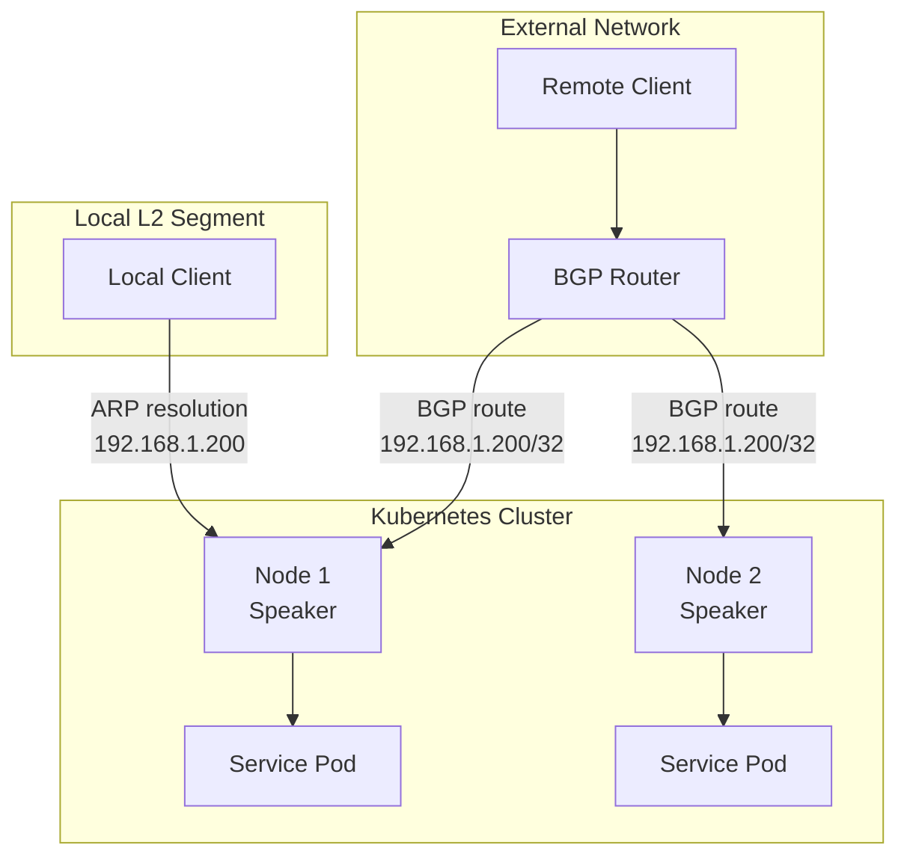
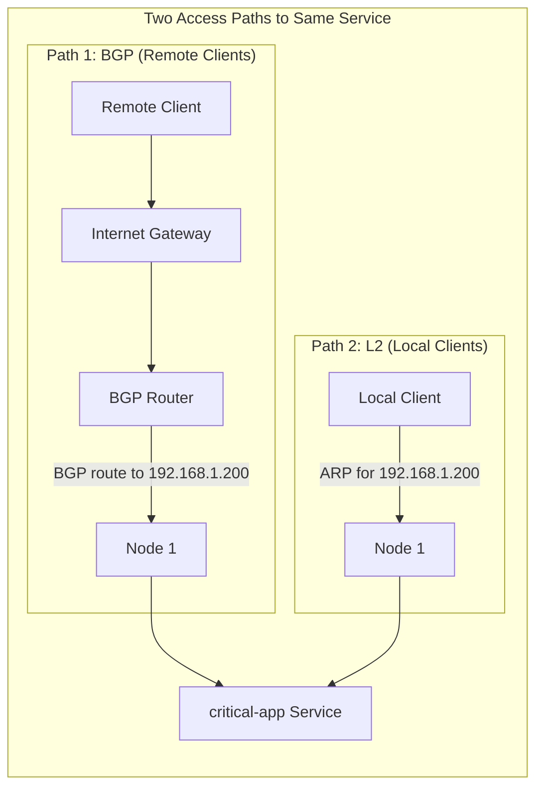
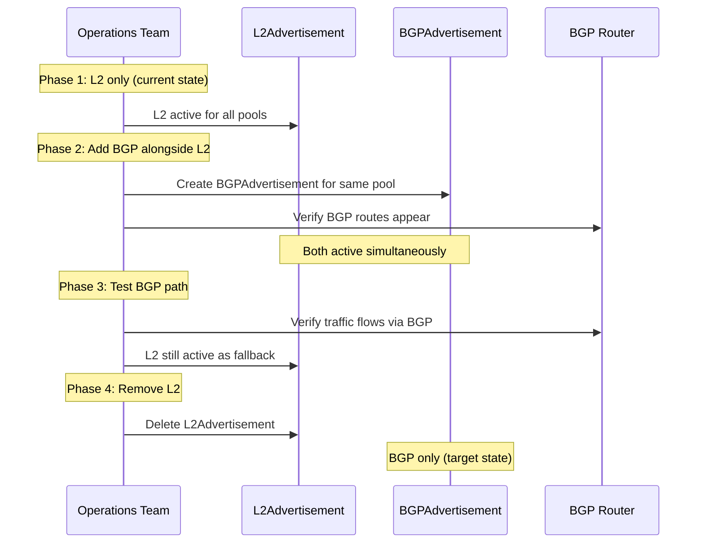

# How to Advertise the Same Service via Both L2 and BGP in MetalLB

Author: [nawazdhandala](https://www.github.com/nawazdhandala)

Tags: Kubernetes, MetalLB, Layer 2, BGP, Dual Advertisement

Description: Learn how to configure MetalLB to advertise the same service IP via both Layer 2 and BGP for redundant network access paths.

---

MetalLB supports both Layer 2 (ARP/NDP) and BGP advertisement modes. Most deployments use one or the other. But in certain environments, you might want to advertise the same service IP via both protocols simultaneously. This provides redundant network access paths - if BGP sessions go down, L2 still works on the local network segment, and vice versa.

This post shows you how to configure dual advertisement and explains when it makes sense.

## Why Dual Advertisement?

Dual advertisement creates redundancy at the network protocol level:



Use cases for dual advertisement:

- **Migration** from L2 to BGP (run both during transition)
- **Redundancy** for critical services that need multiple access paths
- **Mixed networks** where some clients are on the local segment and others are remote
- **Gradual rollout** to test BGP while keeping L2 as a safety net

## Prerequisites

You need:

1. MetalLB installed with both speaker capabilities (L2 and BGP)
2. A BGP-capable router peered with your cluster nodes
3. Nodes on the same L2 network segment as your local clients
4. An IPAddressPool with IPs routable in both contexts

## Step 1: Configure the IP Address Pool

Create a pool that will be referenced by both advertisement types:

```yaml
# ip-pool.yaml
# This pool is used by both L2 and BGP advertisements.
# The IPs must be valid and routable for both protocols.
apiVersion: metallb.io/v1beta1
kind: IPAddressPool
metadata:
  name: dual-advertise-pool
  namespace: metallb-system
spec:
  addresses:
    # Range of IPs for dual-advertised services
    - 192.168.1.200-192.168.1.210
```

## Step 2: Configure the BGP Peer

Set up the BGP peering with your router:

```yaml
# bgp-peer.yaml
# Configure BGP peering with the upstream router.
# Each node running a MetalLB speaker will establish a session.
apiVersion: metallb.io/v1beta2
kind: BGPPeer
metadata:
  name: upstream-router
  namespace: metallb-system
spec:
  # Router's IP address on the local network
  peerAddress: 192.168.1.1
  # Router's BGP AS number
  peerASN: 64501
  # MetalLB's AS number
  myASN: 64500
  # How often to send keepalives (seconds)
  keepaliveTime: 30s
  # How long to wait before declaring peer dead
  holdTime: 90s
```

## Step 3: Create Both Advertisements

This is the key step. Create both an L2Advertisement and a BGPAdvertisement that reference the same pool:

```yaml
# dual-advertisements.yaml
# L2 Advertisement - handles local network traffic via ARP.
# Clients on the same network segment will reach the service via L2.
apiVersion: metallb.io/v1beta1
kind: L2Advertisement
metadata:
  name: local-l2
  namespace: metallb-system
spec:
  ipAddressPools:
    # Reference the same pool as the BGP advertisement
    - dual-advertise-pool
  # Optionally limit to specific interfaces
  interfaces:
    - eth0
---
# BGP Advertisement - handles routed traffic via BGP.
# Clients on remote networks will reach the service via BGP routes.
apiVersion: metallb.io/v1beta1
kind: BGPAdvertisement
metadata:
  name: routed-bgp
  namespace: metallb-system
spec:
  ipAddressPools:
    # Same pool as the L2 advertisement
    - dual-advertise-pool
  # Advertise as a /32 host route
  aggregationLength: 32
```

Apply all configurations:

```bash
# Apply pool, peer, and both advertisements
kubectl apply -f ip-pool.yaml
kubectl apply -f bgp-peer.yaml
kubectl apply -f dual-advertisements.yaml

# Verify all resources are created
kubectl get ipaddresspools,bgppeers,l2advertisements,bgpadvertisements -n metallb-system
```

## Step 4: Create a Service

```yaml
# service.yaml
# A standard LoadBalancer service.
# MetalLB will advertise its IP via both L2 and BGP automatically.
apiVersion: v1
kind: Service
metadata:
  name: critical-app
  namespace: default
spec:
  type: LoadBalancer
  selector:
    app: critical-app
  ports:
    - name: http
      protocol: TCP
      port: 80
      targetPort: 8080
    - name: https
      protocol: TCP
      port: 443
      targetPort: 8443
```

```bash
# Create the service
kubectl apply -f service.yaml

# Verify it got an IP from the dual-advertise pool
kubectl get svc critical-app
```

## How Traffic Flows with Dual Advertisement

With both advertisements active, traffic reaches your service through two possible paths:



The MetalLB speaker on the elected node handles both:

- Responding to ARP requests for the VIP on the local network
- Advertising the VIP route via BGP to the upstream router

## Verifying Both Advertisements Are Active

Check that both advertisement paths are working:

```bash
# Check L2 advertisement - verify ARP responses
# Run from a machine on the same L2 segment
arping -c 3 192.168.1.200

# Check BGP advertisement - verify BGP session is established
kubectl logs -n metallb-system -l component=speaker --tail=50 | grep -i "bgp\|session"

# On your router, verify the BGP route exists
# (Router-specific command, example for FRRouting)
# vtysh -c "show bgp ipv4 unicast 192.168.1.200/32"

# Test connectivity from a local client
curl http://192.168.1.200

# Test connectivity from a remote client (through the router)
ssh remote-host "curl http://192.168.1.200"
```

## Selective Node Participation

You can have different nodes participate in L2 versus BGP:

```yaml
# selective-advertisements.yaml
# Only edge nodes participate in BGP.
# All nodes participate in L2 for local redundancy.
apiVersion: metallb.io/v1beta1
kind: L2Advertisement
metadata:
  name: all-nodes-l2
  namespace: metallb-system
spec:
  ipAddressPools:
    - dual-advertise-pool
  # No node selector - all nodes participate in L2
---
apiVersion: metallb.io/v1beta1
kind: BGPAdvertisement
metadata:
  name: edge-bgp
  namespace: metallb-system
spec:
  ipAddressPools:
    - dual-advertise-pool
  nodeSelectors:
    # Only edge nodes advertise via BGP
    - matchLabels:
        node-role: edge
```

Label your edge nodes:

```bash
# Label nodes that should participate in BGP
kubectl label node node-1 node-role=edge
kubectl label node node-2 node-role=edge

# Worker nodes without the label will only do L2
```

## Migration Scenario: L2 to BGP

Dual advertisement is ideal for migrating from L2 to BGP:



## Handling Failover Between Protocols

If the BGP session drops, remote clients lose their route to the service. Local clients on the L2 segment are unaffected. Conversely, if the L2 leader node fails, a new leader is elected for L2 while BGP continues routing to other nodes.

```bash
# Simulate BGP failure by checking what happens when you kill a session
# Monitor the service from both local and remote clients

# Watch MetalLB speaker logs during failover
kubectl logs -n metallb-system -l component=speaker -f | grep -i "failover\|leader\|bgp"
```

## Considerations and Caveats

1. **IP must be valid for both contexts** - The IP must be reachable via both L2 and the BGP routing table
2. **L2 is single-leader** - In L2 mode, only one node handles all L2 traffic. BGP can spread across multiple nodes
3. **ARP vs BGP priority** - On the local segment, ARP typically takes precedence over BGP routes
4. **Monitoring complexity** - You need to monitor both advertisement paths
5. **Resource usage** - Running both protocols uses more resources on speaker pods

## Best Practices

- Use dual advertisement during migration periods, not permanently (unless you have a specific need)
- Monitor both L2 and BGP paths independently
- Document which pools use dual advertisement and why
- Test failover scenarios for both protocols
- Set appropriate BGP timers for your failover requirements

## Monitoring Dual-Advertised Services with OneUptime

With two network paths to the same service, monitoring becomes more complex. You need to verify reachability from both local and remote perspectives. [OneUptime](https://oneuptime.com) can monitor your service from multiple network locations, detect when one path fails while the other remains active, and provide dashboards that show the health of both your L2 and BGP advertisement paths. This gives you full confidence that your dual-advertisement setup is working as intended.
