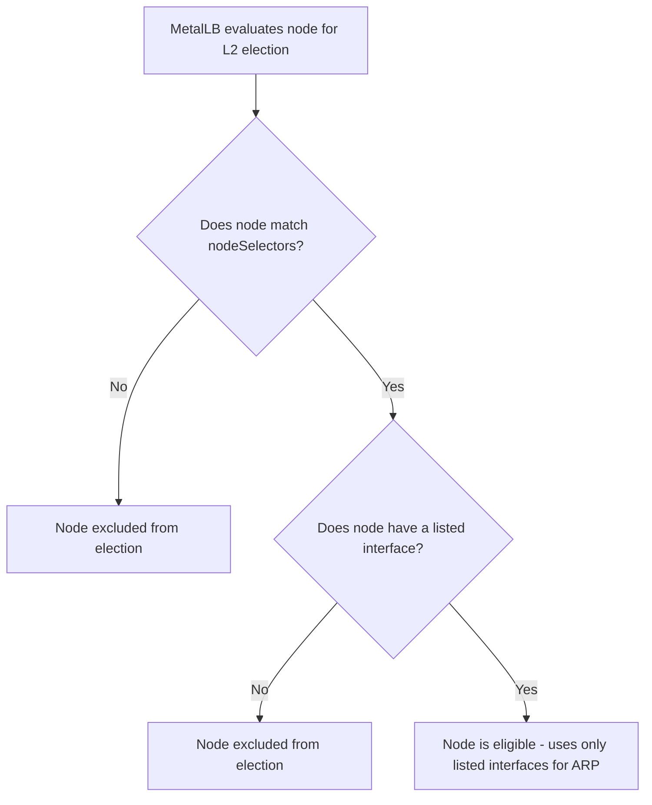
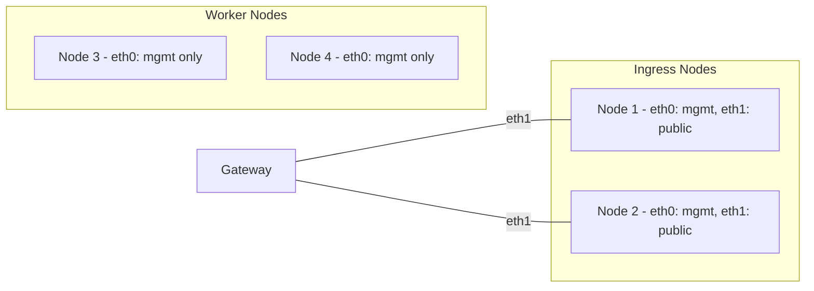

# How to Combine Interface Selectors and Node Selectors in MetalLB L2 Mode

Author: [nawazdhandala](https://www.github.com/nawazdhandala)

Tags: Kubernetes, MetalLB, Layer 2, Selectors, L2Advertisement, Networking

Description: Learn how to combine interface selectors and node selectors in MetalLB L2Advertisement resources for precise control over where and how LoadBalancer IPs are advertised.

---

MetalLB L2Advertisement supports two selector fields: `nodeSelectors` and `interfaces`. Each one narrows advertisement behavior on its own. When you use both in the same L2Advertisement resource, MetalLB applies AND logic. The IP is only advertised on the chosen interfaces of the chosen nodes. This post walks through how to combine them for multi-NIC, multi-node bare-metal clusters.

### How the Two Selectors Work Individually

**nodeSelectors** restricts which nodes participate in leader election. Only nodes matching the selector respond to ARP for the pool's IPs.

**interfaces** restricts which network interfaces the MetalLB speaker uses for ARP responses. If a node has `eth0`, `eth1`, and `bond0`, you can limit announcements to only `eth0`.

### How They Combine: AND Logic

When you specify both `nodeSelectors` and `interfaces` in the same L2Advertisement, MetalLB applies them together:

1. The node must match the `nodeSelectors`, AND
2. The node must have at least one of the listed `interfaces`.



### Scenario: Multi-NIC Ingress Nodes

You need Kubernetes v1.20+ with MetalLB v0.13+ installed and at least two multi-NIC nodes.

Imagine a four-node cluster where two nodes handle ingress. Each ingress node has two NICs: `eth0` on a management network and `eth1` on a public-facing network. You want MetalLB to announce LoadBalancer IPs only on `eth1` of the ingress nodes.



### Step 1: Label Your Ingress Nodes

```bash
# Label the nodes that should handle external LoadBalancer traffic
kubectl label node node-1 network-role=ingress
kubectl label node node-2 network-role=ingress

# Verify the labels are applied
kubectl get nodes -l network-role=ingress
```

### Step 2: Create an IP Address Pool

```yaml
# ip-pool-public.yaml
# Pool of IPs on the public network that clients will reach
apiVersion: metallb.io/v1beta1
kind: IPAddressPool
metadata:
  name: public-pool
  namespace: metallb-system
spec:
  addresses:
    # This range must be routable on the eth1 (public) network segment
    - 10.20.30.100-10.20.30.120
```

```bash
# Apply the IP address pool
kubectl apply -f ip-pool-public.yaml
```

### Step 3: Create an L2Advertisement with Both Selectors

This is where the combination happens. The `nodeSelectors` picks ingress nodes. The `interfaces` field pins ARP to `eth1`.

```yaml
# l2-combined.yaml
# L2Advertisement combining nodeSelectors and interfaces
# MetalLB applies AND logic: node must match the label AND have the interface
apiVersion: metallb.io/v1beta1
kind: L2Advertisement
metadata:
  name: public-l2-advert
  namespace: metallb-system
spec:
  # Bind to the public IP pool
  ipAddressPools:
    - public-pool

  # Only nodes with this label are candidates for leader election
  nodeSelectors:
    - matchLabels:
        network-role: ingress

  # Only send ARP responses on eth1 (the public-facing NIC)
  # This prevents ARP announcements from leaking onto the management network
  interfaces:
    - eth1
```

```bash
# Apply the combined L2Advertisement
kubectl apply -f l2-combined.yaml
```

### Step 4: Deploy a Service and Verify

```yaml
# test-service.yaml
# A LoadBalancer service that pulls an IP from the public pool
apiVersion: v1
kind: Service
metadata:
  name: web-public
  annotations:
    # Explicitly request an IP from the public pool
    metallb.universe.tf/address-pool: public-pool
spec:
  type: LoadBalancer
  ports:
    - protocol: TCP
      port: 443
      targetPort: 8443
  selector:
    app: web-frontend
```

```bash
# Deploy and check the assigned external IP
kubectl apply -f test-service.yaml
kubectl get svc web-public
```

Verify which node is announcing:

```bash
# Check MetalLB speaker logs for the ARP announcement
kubectl logs -n metallb-system -l app=metallb-speaker | grep "announcing"

# Confirm the ARP entry on a client machine or the gateway
# The MAC address should belong to eth1 of the elected ingress node
arp -a | grep 10.20.30
```

### Multiple Pools with Different Selector Combinations

You can create separate L2Advertisement resources for different pools. For example, one pool for public traffic on `eth1` of ingress nodes and another for internal traffic on `eth0` of all nodes.

```yaml
# l2-internal.yaml
# Internal advertisement: all nodes, management interface only
apiVersion: metallb.io/v1beta1
kind: L2Advertisement
metadata:
  name: internal-l2-advert
  namespace: metallb-system
spec:
  ipAddressPools:
    - internal-pool

  # No nodeSelectors means all nodes are eligible
  # Only restrict by interface
  interfaces:
    - eth0
---
# l2-public.yaml
# Public advertisement: ingress nodes only, public interface only
apiVersion: metallb.io/v1beta1
kind: L2Advertisement
metadata:
  name: public-l2-advert
  namespace: metallb-system
spec:
  ipAddressPools:
    - public-pool

  nodeSelectors:
    - matchLabels:
        network-role: ingress

  interfaces:
    - eth1
```

### Using matchExpressions with Interfaces

For more flexible node selection, combine `matchExpressions` with the `interfaces` field.

```yaml
# l2-zone-aware.yaml
# Zone-aware advertisement with interface pinning
apiVersion: metallb.io/v1beta1
kind: L2Advertisement
metadata:
  name: zone-a-l2-advert
  namespace: metallb-system
spec:
  ipAddressPools:
    - zone-a-pool

  nodeSelectors:
    # Select nodes in zone-a that also have the ingress role
    - matchExpressions:
        - key: topology.kubernetes.io/zone
          operator: In
          values:
            - zone-a
      matchLabels:
        network-role: ingress

  # ARP only on the VLAN-tagged interface for zone-a
  interfaces:
    - eth1.100
```

### Common Mistakes

- **Interface name typos**: Must match exactly (e.g., `eth1`, not `Eth1`). Check with `ip link show`.
- **Missing interface on a matching node**: The node is silently skipped. No error is raised.
- **Omitting ipAddressPools**: The L2Advertisement applies to all pools, which may not be intended.
- **Confusing OR vs AND**: Multiple `nodeSelectors` entries are OR. The relationship between `nodeSelectors` and `interfaces` is AND.

### Cleanup

```bash
# Remove test resources and node labels
kubectl delete svc web-public
kubectl delete l2advertisement public-l2-advert internal-l2-advert -n metallb-system
kubectl delete ipaddresspool public-pool -n metallb-system
kubectl label node node-1 node-2 network-role-
```

### Conclusion

Combining `nodeSelectors` and `interfaces` in a single L2Advertisement gives you two-dimensional control over MetalLB L2 announcements. Node selectors pick which nodes participate, interface selectors pick which NICs carry the ARP traffic, and together they isolate LoadBalancer IPs to specific NICs on specific nodes.

If you are running bare-metal Kubernetes and need monitoring, alerting, and status pages, check out [OneUptime](https://oneuptime.com). It is open source, self-hostable, and built to run alongside MetalLB on your own infrastructure.
