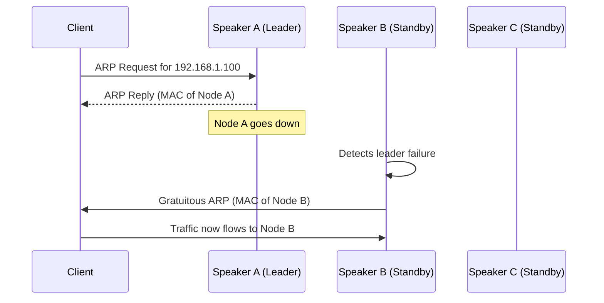
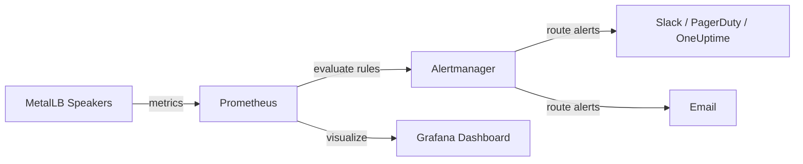

# How to Alert on MetalLB L2 Leader Node Failover Events

Author: [nawazdhandala](https://www.github.com/nawazdhandala)

Tags: Kubernetes, MetalLB, Prometheus, Alerting, Layer 2

Description: Learn how to set up Prometheus alerts for MetalLB Layer 2 leader node failover events to track service disruptions.

---

MetalLB in Layer 2 mode elects a single leader node to handle traffic for each LoadBalancer service IP. When that leader node goes down, a failover occurs and a new leader is elected. During this transition, there is a brief disruption in traffic. Monitoring these failover events is critical for understanding service availability and diagnosing intermittent connectivity issues.

This post walks you through setting up Prometheus alerts that fire whenever a MetalLB L2 leader failover happens.

## How MetalLB L2 Leader Election Works

In Layer 2 mode, MetalLB uses memberlist to elect a single speaker pod as the leader for each service IP. That speaker responds to ARP (IPv4) or NDP (IPv6) requests for the IP. If the leader node becomes unreachable, another speaker takes over.



The failover is usually fast, but it is not instant. Clients that have cached the old ARP entry may experience a few seconds of packet loss.

## MetalLB Prometheus Metrics

MetalLB speaker pods expose metrics on port 7472 by default. The key metrics for failover detection are:

- `metallb_layer2_announcements` - Number of L2 announcements per service
- `metallb_speaker_announced` - Whether this speaker is currently announcing a service

First, make sure MetalLB metrics are being scraped. Create a ServiceMonitor if you are using the Prometheus Operator:

```yaml
# servicemonitor-metallb.yaml
# This ServiceMonitor tells Prometheus to scrape MetalLB speaker pods.
apiVersion: monitoring.coreos.com/v1
kind: ServiceMonitor
metadata:
  name: metallb-speaker
  namespace: metallb-system
  labels:
    app: metallb
spec:
  selector:
    matchLabels:
      app: metallb
      component: speaker
  endpoints:
    # MetalLB speakers expose metrics on port 7472
    - port: monitoring
      interval: 15s
      path: /metrics
```

Apply the ServiceMonitor:

```bash
# Apply the ServiceMonitor to your cluster
kubectl apply -f servicemonitor-metallb.yaml
```

## Verifying Metrics Are Being Scraped

Before writing alert rules, confirm that Prometheus is collecting the metrics:

```bash
# Port-forward to Prometheus and query for MetalLB metrics
kubectl port-forward -n monitoring svc/prometheus-operated 9090:9090

# In another terminal, query for the metric
curl -s 'http://localhost:9090/api/v1/query?query=metallb_speaker_announced' | jq .
```

You should see results with labels like `service`, `node`, and `ip`.

## Detecting Failover Events

A failover event can be detected when the `metallb_speaker_announced` metric changes its `node` label for a given service. We can track this by alerting on changes in the announcing speaker.

The following PromQL expression detects when a service's announcing speaker has changed in the last 5 minutes:

```promql
# This expression finds services where the announcing speaker
# changed within the last 5 minutes, indicating a failover.
changes(
  metallb_speaker_announced{value="true"}[5m]
) > 0
```

## Creating Prometheus Alert Rules

Create a PrometheusRule resource with alert definitions for MetalLB failover events:

```yaml
# prometheusrule-metallb-failover.yaml
# Alert rules for detecting MetalLB L2 leader failover events.
apiVersion: monitoring.coreos.com/v1
kind: PrometheusRule
metadata:
  name: metallb-failover-alerts
  namespace: metallb-system
  labels:
    app: metallb
    prometheus: kube-prometheus
spec:
  groups:
    - name: metallb-failover
      rules:
        # Alert when a failover event is detected
        - alert: MetalLBL2LeaderFailover
          expr: |
            changes(
              metallb_speaker_announced{value="true"}[5m]
            ) > 0
          for: 0m
          labels:
            severity: warning
          annotations:
            summary: "MetalLB L2 leader failover detected"
            description: >
              The announcing speaker for service {{ $labels.service }}
              in namespace {{ $labels.namespace }} has changed.
              This indicates a leader node failover occurred.

        # Alert when no speaker is announcing a service
        - alert: MetalLBNoSpeakerAnnouncing
          expr: |
            count by (service, namespace) (
              metallb_speaker_announced{value="true"}
            ) == 0
          for: 1m
          labels:
            severity: critical
          annotations:
            summary: "No MetalLB speaker announcing service"
            description: >
              No speaker is currently announcing service
              {{ $labels.service }} in namespace {{ $labels.namespace }}.
              The LoadBalancer IP is unreachable.

        # Alert when repeated failovers happen in a short window
        - alert: MetalLBFrequentFailovers
          expr: |
            changes(
              metallb_speaker_announced{value="true"}[30m]
            ) > 3
          for: 0m
          labels:
            severity: critical
          annotations:
            summary: "Frequent MetalLB L2 failovers detected"
            description: >
              Service {{ $labels.service }} has experienced more than
              3 leader failovers in the last 30 minutes. This may
              indicate a flapping node or network instability.
```

Apply the alert rules:

```bash
# Apply the PrometheusRule to your cluster
kubectl apply -f prometheusrule-metallb-failover.yaml
```

## Alert Flow Architecture

Here is how the alert pipeline works end to end:



## Configuring Alertmanager Routes

To make sure these alerts reach your on-call team, configure an Alertmanager route:

```yaml
# alertmanager-config.yaml
# Route MetalLB alerts to the infrastructure team channel.
route:
  receiver: default
  routes:
    - match:
        alertname: MetalLBL2LeaderFailover
      receiver: infra-team
      group_wait: 10s
      group_interval: 5m
      repeat_interval: 1h

    - match:
        alertname: MetalLBNoSpeakerAnnouncing
      receiver: infra-team-critical
      group_wait: 0s
      repeat_interval: 5m

receivers:
  - name: infra-team
    slack_configs:
      # Send warnings to the infrastructure Slack channel
      - channel: '#infra-alerts'
        send_resolved: true
        title: 'MetalLB Failover: {{ .GroupLabels.alertname }}'
        text: '{{ .CommonAnnotations.description }}'

  - name: infra-team-critical
    slack_configs:
      # Send critical alerts to the on-call channel
      - channel: '#oncall'
        send_resolved: true
```

## Testing the Alert

You can simulate a failover by cordoning and draining the node that currently holds the leader role:

```bash
# Find which node is the current leader for a service IP
kubectl get events -n metallb-system --field-selector reason=nodeAssigned

# Cordon and drain that node to trigger a failover
kubectl cordon <leader-node>
kubectl drain <leader-node> --ignore-daemonsets --delete-emptydir-data

# Watch for the failover event
kubectl get events -n metallb-system -w

# After testing, uncordon the node
kubectl uncordon <leader-node>
```

## Tracking Failover History in Grafana

Create a Grafana panel to visualize failover history over time:

```promql
# Use this query in a Grafana time series panel
# to show failover events as spikes on a timeline.
changes(metallb_speaker_announced{value="true"}[5m])
```

Set the panel type to "State timeline" or "Bar gauge" so each failover event is clearly visible.

## Summary

Monitoring MetalLB L2 failover events gives you visibility into brief traffic disruptions that might otherwise go unnoticed. By combining Prometheus metrics, alert rules, and Alertmanager routing, you can be notified immediately when a failover happens and investigate the root cause.

If you are looking for a unified platform that combines monitoring, alerting, and incident management, check out [OneUptime](https://oneuptime.com). OneUptime can ingest Prometheus alerts via webhooks, correlate them with your status pages, and automatically notify on-call teams when MetalLB failovers impact your services.
