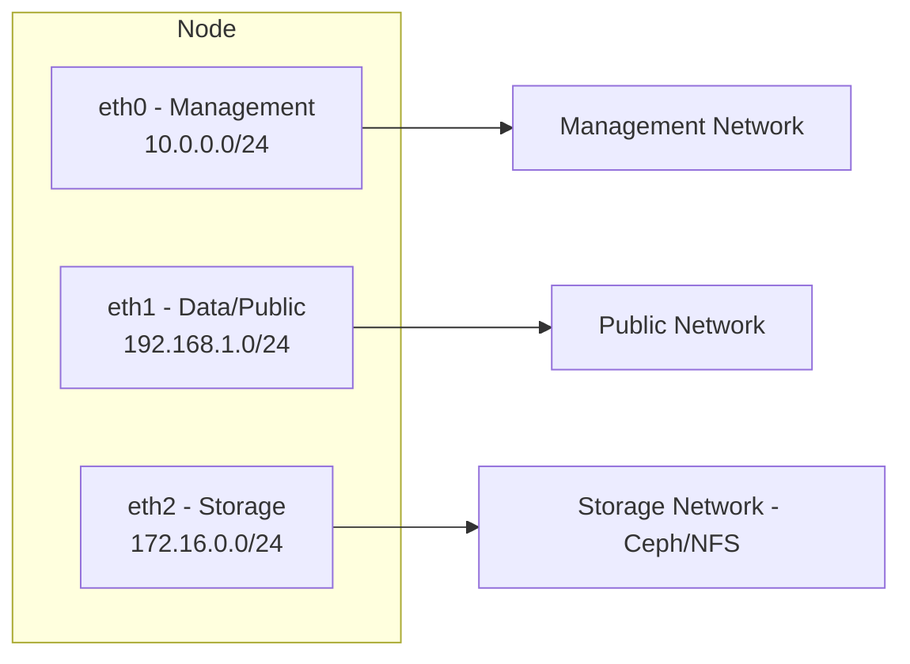
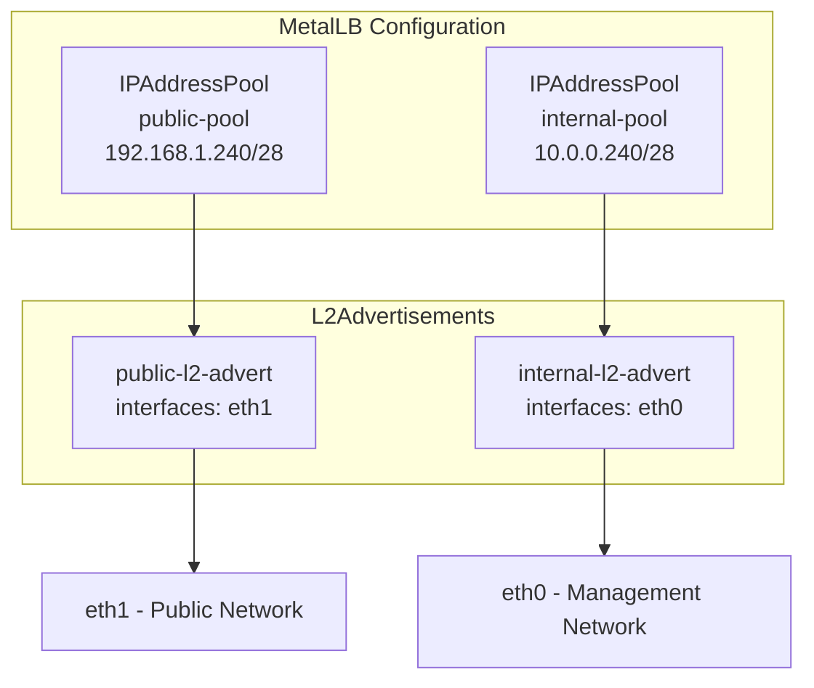
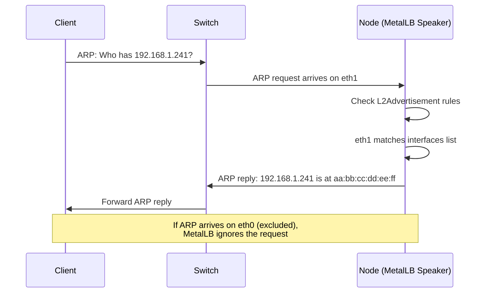

# How to Select Specific Network Interfaces for L2 Announcements in MetalLB

Author: [nawazdhandala](https://www.github.com/nawazdhandala)

Tags: Kubernetes, MetalLB, Layer 2, Network Interfaces, L2Advertisement

Description: Learn how to configure MetalLB to send Layer 2 announcements only on specific network interfaces. Useful for multi-homed nodes with separate management and data networks.

---

When you run MetalLB in Layer 2 mode, it responds to ARP (IPv4) or NDP (IPv6) requests for your service IPs. By default, MetalLB sends these responses on every network interface attached to the node. That works fine on single-NIC hosts, but becomes a problem when your nodes have multiple network interfaces serving different purposes.

This guide shows you how to restrict L2 announcements to specific interfaces using the `interfaces` field in the `L2Advertisement` resource.

## Why Interface Selection Matters

In production Kubernetes clusters, nodes often have more than one network interface. A typical bare-metal setup might look like this:



Without interface selection, MetalLB broadcasts ARP replies on all three interfaces. This creates several issues:

- **Unnecessary traffic on management and storage networks.** ARP replies for public service IPs flood internal networks that will never route that traffic.
- **Security exposure.** Service IPs become reachable from networks that should not have access.
- **ARP table pollution.** Switches and routers on internal networks learn MAC-to-IP mappings they do not need, wasting resources.
- **Unpredictable routing.** Clients on the wrong network might try to reach the service IP through an interface that cannot handle the traffic.

Interface selection solves all of these by telling MetalLB exactly where to announce.

## Setting Up the IPAddressPool

Before you begin, make sure you have a Kubernetes cluster with MetalLB v0.13.2 or later, `kubectl` access, and nodes with multiple network interfaces. If you do not already have an address pool, create one:

```yaml
# IPAddressPool defines the range of IPs MetalLB can assign
# These should be routable on your data/public network
apiVersion: metallb.io/v1beta1
kind: IPAddressPool
metadata:
  name: public-pool
  namespace: metallb-system
spec:
  addresses:
    # CIDR range for your public-facing service IPs
    - 192.168.1.240/28
```

Apply it:

```bash
# Create the IP address pool in the metallb-system namespace
kubectl apply -f ipaddresspool.yaml
```

## Basic L2Advertisement with Interface Selection

Here is the key resource. The `interfaces` field accepts a list of interface matchers that control where MetalLB sends ARP/NDP responses:

```yaml
# L2Advertisement restricted to a single named interface
# MetalLB will only respond to ARP requests on eth1
apiVersion: metallb.io/v1beta1
kind: L2Advertisement
metadata:
  name: public-l2-advert
  namespace: metallb-system
spec:
  # Bind this advertisement to a specific IP pool
  ipAddressPools:
    - public-pool
  # Only announce on matching interfaces
  interfaces:
    - eth1
```

Apply it:

```bash
# Create the L2Advertisement with interface restriction
kubectl apply -f l2advertisement.yaml
```

With this configuration, MetalLB only sends Layer 2 announcements on `eth1`. All other interfaces are left untouched.

## Matching Interfaces by Regex

Not every cluster uses consistent interface names. One node might have `ens192`, another `ens224`. You can use regex patterns to match groups of interfaces:

```yaml
# L2Advertisement using regex to match interface names
# Matches any interface starting with "ens" followed by digits
apiVersion: metallb.io/v1beta1
kind: L2Advertisement
metadata:
  name: data-network-advert
  namespace: metallb-system
spec:
  ipAddressPools:
    - public-pool
  interfaces:
    # Regex pattern matching ens-prefixed interfaces
    - ens1.*
```

This matches `ens192`, `ens19`, `ens1f0`, and any other interface whose name starts with `ens1`.

## Multi-NIC Scenario: Separating Traffic

Consider a cluster where each node has three interfaces and you need different pools announced on different networks:



Here is the full configuration for this setup:

```yaml
# Pool for public-facing services
apiVersion: metallb.io/v1beta1
kind: IPAddressPool
metadata:
  name: public-pool
  namespace: metallb-system
spec:
  addresses:
    - 192.168.1.240/28
---
# Pool for internal services only reachable on the management network
apiVersion: metallb.io/v1beta1
kind: IPAddressPool
metadata:
  name: internal-pool
  namespace: metallb-system
spec:
  addresses:
    - 10.0.0.240/28
---
# Announce public IPs only on eth1 (data/public interface)
apiVersion: metallb.io/v1beta1
kind: L2Advertisement
metadata:
  name: public-l2-advert
  namespace: metallb-system
spec:
  ipAddressPools:
    - public-pool
  interfaces:
    - eth1
---
# Announce internal IPs only on eth0 (management interface)
apiVersion: metallb.io/v1beta1
kind: L2Advertisement
metadata:
  name: internal-l2-advert
  namespace: metallb-system
spec:
  ipAddressPools:
    - internal-pool
  interfaces:
    - eth0
```

Apply everything at once:

```bash
# Apply all MetalLB resources in a single command
kubectl apply -f metallb-multi-nic.yaml
```

## Verifying Your Configuration

After applying, confirm that MetalLB picked up the configuration correctly:

```bash
# List all L2Advertisement resources and verify interface fields
kubectl get l2advertisements -n metallb-system -o yaml

# Confirm speaker pods are running on each node
kubectl get pods -n metallb-system -l component=speaker

# From a machine on the public network, verify ARP resolution works
arping -I eth1 192.168.1.241

# From the management network, confirm ARP does NOT resolve
# If this succeeds, your interface selection is not working
arping -I eth0 192.168.1.241

# Check speaker logs for interface binding details
kubectl logs -n metallb-system -l component=speaker --tail=50 | grep "interface"
```

## The Announcement Flow

Here is how MetalLB processes an incoming ARP request with interface selection enabled:



## Common Pitfalls

**Misspelled interface names.** MetalLB silently ignores interfaces it cannot find. Double-check names with `ip link show` on each node.

**Inconsistent naming across nodes.** If node-1 has `eth1` but node-2 has `ens192`, a single static name will not work. Use regex patterns or ensure consistent naming with udev rules.

**VLAN interfaces.** If your data network uses VLANs, use the VLAN interface name (for example, `eth1.100`) rather than the parent interface.

## Conclusion

Interface selection in MetalLB gives you precise control over where Layer 2 announcements are sent. In multi-homed environments, this prevents traffic leaking across network boundaries, reduces ARP noise, and improves security. The `interfaces` field in `L2Advertisement` supports both exact names and regex patterns, making it flexible enough for heterogeneous clusters.

If you are running MetalLB in a production bare-metal cluster, pairing interface selection with proper monitoring ensures you catch misconfigurations before they cause outages. [OneUptime](https://oneuptime.com) can monitor your Kubernetes services, alert you when load balancer IPs become unreachable, and give you full observability into your bare-metal infrastructure.
