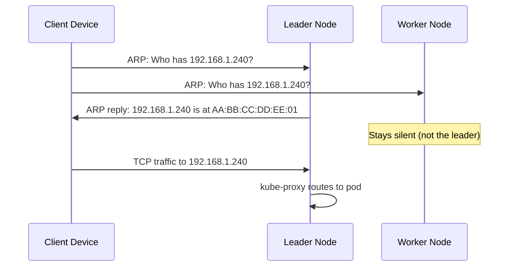
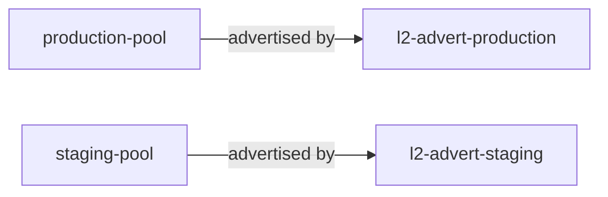

# How to Configure MetalLB Layer 2 Mode with IPAddressPool and L2Advertisement

Author: [nawazdhandala](https://www.github.com/nawazdhandala)

Tags: Kubernetes, MetalLB, Layer 2, IPAddressPool, L2Advertisement, ARP

Description: A hands-on guide to configuring MetalLB in Layer 2 mode using IPAddressPool and L2Advertisement custom resources. Learn pool sizing, advertisement scoping, and service exposure.

---

MetalLB gives bare-metal Kubernetes clusters a LoadBalancer implementation. In Layer 2 mode, it works by responding to ARP (Address Resolution Protocol) requests on the local network. No special routers or switches are needed. A single node in the cluster claims the IP and answers ARP queries for it, directing all traffic to that node.

This guide covers the two custom resources that drive Layer 2 mode: **IPAddressPool** and **L2Advertisement**. You will learn how to define IP ranges, scope advertisements to specific nodes or interfaces, and test the setup end to end.

### How Layer 2 Mode Works

In L2 mode, MetalLB assigns a virtual IP (VIP) to a LoadBalancer service. One node becomes the "leader" for that IP and responds to ARP (IPv4) or NDP (IPv6) requests, mapping the VIP to its MAC address.



Key points about L2 mode:

- **Single-node traffic** - one node handles all traffic for a given IP. Failover promotes a different node automatically.
- **No special network gear** - any flat L2 network segment works.
- **Gratuitous ARP on failover** - MAC tables across the network get updated when leadership changes.

### Prerequisites

- A Kubernetes cluster (v1.20+) with MetalLB installed in the `metallb-system` namespace.
- `kubectl` configured for the cluster.
- Free IP addresses on the same subnet as your nodes, outside your DHCP range.

### Creating an IPAddressPool

The `IPAddressPool` resource tells MetalLB which IPs it can hand out. Specify addresses using CIDR notation or explicit ranges.

#### CIDR Notation

Use CIDR notation when you have a contiguous block of addresses:

```yaml
# ipaddresspool-cidr.yaml
apiVersion: metallb.io/v1beta1
kind: IPAddressPool
metadata:
  name: production-pool
  namespace: metallb-system
spec:
  addresses:
    # A /28 gives 16 addresses: 192.168.1.240 through 192.168.1.255
    - 192.168.1.240/28
```

#### Range Notation

Use a dash-separated range when your IPs do not align to a CIDR boundary:

```yaml
# ipaddresspool-range.yaml
apiVersion: metallb.io/v1beta1
kind: IPAddressPool
metadata:
  name: staging-pool
  namespace: metallb-system
spec:
  addresses:
    # Five addresses: .200 through .204
    - 192.168.1.200-192.168.1.204
```

#### Mixing Both Formats

A single pool can contain both CIDR blocks and ranges:

```yaml
# ipaddresspool-mixed.yaml - both formats in one pool
apiVersion: metallb.io/v1beta1
kind: IPAddressPool
metadata:
  name: mixed-pool
  namespace: metallb-system
spec:
  addresses:
    - 10.0.0.100/30           # 4 addresses from CIDR
    - 10.0.0.110-10.0.0.115   # 6 addresses from a range
  autoAssign: true             # set false to require explicit pool annotation
```

Apply with `kubectl apply -f ipaddresspool-cidr.yaml`.

### Creating an L2Advertisement

An `IPAddressPool` alone does not advertise addresses. You need an `L2Advertisement` to announce IPs via ARP/NDP. The simplest form advertises all pools:

```yaml
# l2advertisement-all.yaml
# No ipAddressPools field means it covers every pool in the cluster
apiVersion: metallb.io/v1beta1
kind: L2Advertisement
metadata:
  name: l2-advert-all
  namespace: metallb-system
```

Apply it with `kubectl apply -f l2advertisement-all.yaml`. That is all you need for a basic setup.

### Linking Pools to Advertisements

In production, you often want tighter control. Link specific pools to specific advertisements using the `ipAddressPools` field:

```yaml
# l2advertisement-scoped.yaml
apiVersion: metallb.io/v1beta1
kind: L2Advertisement
metadata:
  name: l2-advert-production
  namespace: metallb-system
spec:
  ipAddressPools:
    - production-pool   # only this pool is advertised
```

The diagram below shows how pools and advertisements relate:



### Multi-Pool Setup

```yaml
# multi-pool-setup.yaml
---
apiVersion: metallb.io/v1beta1
kind: IPAddressPool
metadata:
  name: production-pool
  namespace: metallb-system
spec:
  addresses:
    - 192.168.1.240/28
  autoAssign: true          # services get IPs automatically
---
apiVersion: metallb.io/v1beta1
kind: IPAddressPool
metadata:
  name: staging-pool
  namespace: metallb-system
spec:
  addresses:
    - 192.168.1.200-192.168.1.204
  autoAssign: false         # services must request this pool explicitly
---
apiVersion: metallb.io/v1beta1
kind: L2Advertisement
metadata:
  name: l2-advert-production
  namespace: metallb-system
spec:
  ipAddressPools:
    - production-pool
---
apiVersion: metallb.io/v1beta1
kind: L2Advertisement
metadata:
  name: l2-advert-staging
  namespace: metallb-system
spec:
  ipAddressPools:
    - staging-pool
```

Apply it with `kubectl apply -f multi-pool-setup.yaml`. When a service needs an IP from the staging pool (which has `autoAssign: false`), add an annotation:

```yaml
# service-staging.yaml - request a specific pool
apiVersion: v1
kind: Service
metadata:
  name: staging-app
  annotations:
    metallb.universe.tf/address-pool: staging-pool
spec:
  type: LoadBalancer
  ports:
    - port: 80
      targetPort: 8080
  selector:
    app: staging-app
```

### Scoping with Node Selectors

Restrict which nodes can be the leader for an advertisement. Useful when only certain nodes sit on a particular network segment:

```yaml
# l2advertisement-node-selector.yaml
apiVersion: metallb.io/v1beta1
kind: L2Advertisement
metadata:
  name: l2-advert-dmz
  namespace: metallb-system
spec:
  ipAddressPools:
    - production-pool
  nodeSelectors:
    - matchLabels:
        network-zone: dmz   # only nodes with this label respond to ARP
```

Label your nodes first:

```bash
kubectl label node worker-01 network-zone=dmz
kubectl label node worker-02 network-zone=dmz
```

### Scoping with Interface Selectors

On multi-homed nodes, control which NIC MetalLB uses for ARP responses:

```yaml
# l2advertisement-interface-selector.yaml
apiVersion: metallb.io/v1beta1
kind: L2Advertisement
metadata:
  name: l2-advert-bond0
  namespace: metallb-system
spec:
  ipAddressPools:
    - production-pool
  interfaces:
    - bond0    # only respond to ARP on this interface
```

You can combine node selectors and interface selectors in one L2Advertisement for full control.

### Testing the Configuration

Deploy a test service and verify that MetalLB assigns an IP and responds to ARP:

```bash
# Create a test deployment and expose it
kubectl create deployment test-nginx --image=nginx:latest
kubectl expose deployment test-nginx --type=LoadBalancer --port=80

# Verify the service received an external IP from your pool
kubectl get svc test-nginx
```

Expected output:

```
NAME         TYPE           CLUSTER-IP     EXTERNAL-IP     PORT(S)        AGE
test-nginx   LoadBalancer   10.96.45.123   192.168.1.240   80:31234/TCP   10s
```

Verify ARP and connectivity from a machine on the same network:

```bash
# Check the ARP table - you should see the leader node's MAC address
arp -n 192.168.1.240

# Test HTTP connectivity through the LoadBalancer IP
curl http://192.168.1.240
```

If you see the nginx welcome page, Layer 2 mode is working correctly.

### Troubleshooting

```bash
kubectl get pods -n metallb-system               # are MetalLB pods running?
kubectl get ipaddresspools -n metallb-system      # do pools exist?
kubectl get l2advertisements -n metallb-system    # do advertisements exist?
kubectl logs -n metallb-system -l component=speaker --tail=50  # ARP activity
kubectl get svc -A | grep pending                 # stuck services?
```

A service stuck in `Pending` means no pool is available or no L2Advertisement covers the pool.

### Wrapping Up

Layer 2 mode in MetalLB is the simplest path to LoadBalancer services on bare metal. Start with a single `IPAddressPool` and a catch-all `L2Advertisement`. As your cluster grows, split into multiple pools with scoped advertisements, node selectors, and interface selectors.

If you run MetalLB in production and need to monitor your LoadBalancer services, check out [OneUptime](https://oneuptime.com). It provides uptime monitoring, alerting, and incident management so you know the moment an external IP becomes unreachable.
