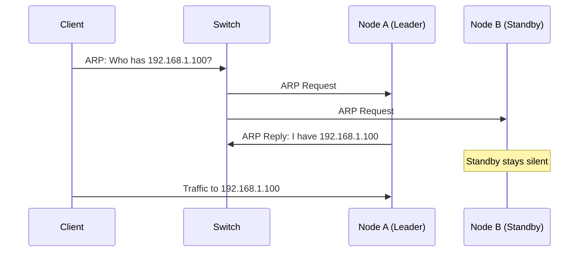
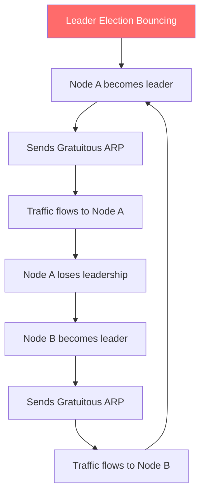
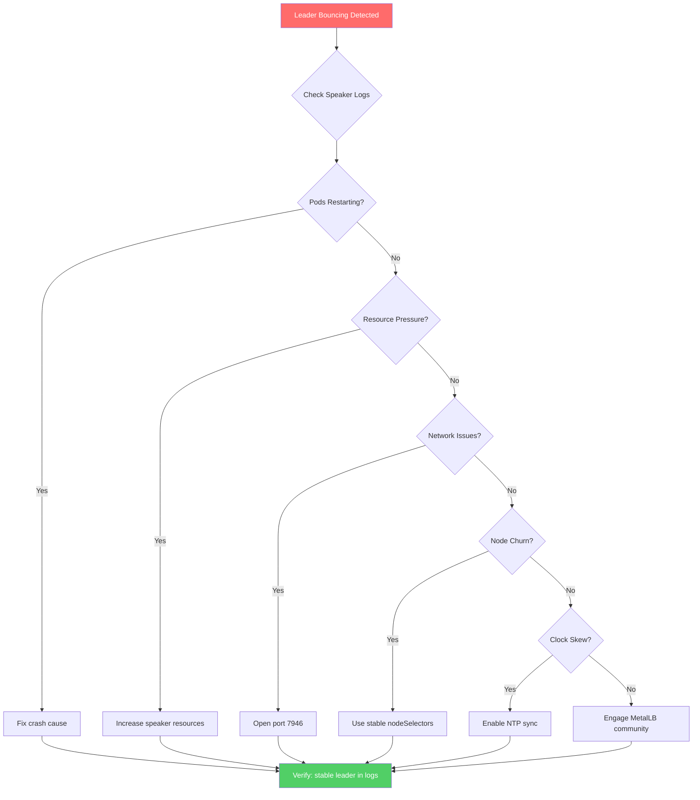

# How to Fix MetalLB L2 Leader Election Bouncing Between Nodes

Author: [nawazdhandala](https://www.github.com/nawazdhandala)

Tags: Kubernetes, MetalLB, Layer 2, Leader Election, Troubleshooting

Description: Troubleshooting guide for MetalLB L2 leader election instability where the leader keeps bouncing between nodes, causing service interruptions and ARP flapping.

---

If you run MetalLB in Layer 2 mode, you may have hit a situation where the leader for a given service keeps flipping between nodes every few seconds. Traffic drops, ARP tables go stale, and your service becomes unreachable in short bursts. This guide walks through how L2 leader election works, what causes it to bounce, and how to fix it.

## How L2 Leader Election Works

MetalLB uses a **memberlist-based** leader election in Layer 2 mode. Each `speaker` pod runs on every node. For each LoadBalancer service, one speaker wins the election and becomes the leader. That leader responds to ARP (IPv4) or NDP (IPv6) requests for the service's external IP.



When leadership is stable, this works well. The problem starts when leadership keeps changing.

## Symptoms of Bouncing

Confirm you are seeing leader bouncing before investigating further:

- **Intermittent connectivity** - the service works for a few seconds, drops, then works again.
- **ARP flapping** - your switch logs show the MAC for the service IP changing repeatedly.
- **Frequent leader change events** - speaker logs show transitions every few seconds.
- **Gratuitous ARP storms** - each new leader sends a gratuitous ARP, and switches may rate-limit them.



## Checking Speaker Logs

Tail the speaker logs to confirm leadership is unstable:

```bash
# Tail logs from all speaker pods and filter for leader changes
kubectl logs -n metallb-system -l app=metallb,component=speaker \
  --all-containers --follow | grep -i "leader"
```

Healthy output shows a single election at startup. Unhealthy output looks like rapid transitions:

```text
{"event":"leaderChanged","ip":"192.168.1.100","new":"node-a","old":"node-b","ts":"2026-02-20T10:00:01Z"}
{"event":"leaderChanged","ip":"192.168.1.100","new":"node-b","old":"node-a","ts":"2026-02-20T10:00:04Z"}
{"event":"leaderChanged","ip":"192.168.1.100","new":"node-c","old":"node-b","ts":"2026-02-20T10:00:07Z"}
```

If leadership changes every few seconds, you have a bouncing problem.

## Common Causes and Fixes

### 1. Resource Pressure on Nodes

The speaker uses memberlist for gossip communication. If a node is under heavy CPU or memory pressure, the speaker may miss health probes, causing others to declare it dead and trigger re-election.

```bash
# Check node resource usage - high values can starve speaker pods
kubectl top nodes

# Check if speaker pods are being throttled or OOM-killed
kubectl describe pods -n metallb-system -l component=speaker | \
  grep -A 5 "State\|Reason\|Restart Count"
```

**Fix**: Increase resource requests for the speaker DaemonSet:

```yaml
# Patch the speaker DaemonSet to guarantee resources
apiVersion: apps/v1
kind: DaemonSet
metadata:
  name: speaker
  namespace: metallb-system
spec:
  template:
    spec:
      containers:
      - name: speaker
        resources:
          requests:
            cpu: 100m      # Guarantee CPU so the speaker is never starved
            memory: 128Mi
          limits:
            cpu: 200m
            memory: 256Mi
```

### 2. Network Connectivity Issues Between Nodes

Memberlist relies on TCP and UDP between speaker pods. Network partitions, firewall rules, or packet loss between nodes cause members to lose contact and re-elect.

```bash
# Check for packet loss between nodes from inside a speaker pod
kubectl exec -n metallb-system <speaker-pod-on-node-a> -- \
  ping -c 10 <node-b-ip> | tail -3
```

**Fix**: Open port 7946 (TCP and UDP) between all nodes. If you use network policies, add an allow rule:

```yaml
# Allow MetalLB speaker pods to communicate on the memberlist port
apiVersion: networking.k8s.io/v1
kind: NetworkPolicy
metadata:
  name: allow-metallb-memberlist
  namespace: metallb-system
spec:
  podSelector:
    matchLabels:
      component: speaker
  ingress:
    - from:
        - podSelector:
            matchLabels:
              component: speaker
      ports:
        - { protocol: TCP, port: 7946 }
        - { protocol: UDP, port: 7946 }
  egress:
    - to:
        - podSelector:
            matchLabels:
              component: speaker
      ports:
        - { protocol: TCP, port: 7946 }
        - { protocol: UDP, port: 7946 }
```

### 3. Speaker Pod Crashes or Restarts

A crash-looping speaker keeps joining and leaving the memberlist ring, forcing re-elections for every IP it held.

```bash
# Check restart counts - a high number is a red flag
kubectl get pods -n metallb-system -l component=speaker \
  -o custom-columns=NAME:.metadata.name,NODE:.spec.nodeName,RESTARTS:.status.containerStatuses[0].restartCount

# Check previous crash logs
kubectl logs -n metallb-system <speaker-pod-name> --previous
```

Common crash causes: RBAC misconfiguration, missing L2Advertisement or IPAddressPool CRDs, or conflicting versions after an upgrade. Verify CRDs are installed:

```bash
# Confirm all MetalLB CRDs exist
kubectl get crd | grep metallb
```

### 4. Misconfigured Node Selectors

If your L2Advertisement uses `nodeSelectors` and matching nodes keep cycling due to autoscaling, leadership bounces as nodes join and leave.

**Fix**: Use stable, manually assigned labels:

```yaml
apiVersion: metallb.io/v1beta1
kind: L2Advertisement
metadata:
  name: stable-l2
  namespace: metallb-system
spec:
  ipAddressPools:
    - production-pool
  # Assign this label manually to specific, long-lived nodes
  nodeSelectors:
    - matchLabels:
        metallb-speaker: "active"
```

### 5. Clock Skew Between Nodes

Memberlist uses timestamps for protocol operations. Significant clock drift causes members to misinterpret message timing, leading to false failure detections.

```bash
# Check time on each node - look for differences greater than a few seconds
for node in $(kubectl get nodes -o jsonpath='{.items[*].metadata.name}'); do
  echo "--- $node ---"
  kubectl debug node/$node -it --image=busybox -- date -u 2>/dev/null
done

# Fix: enable NTP on all nodes
sudo timedatectl set-ntp true
```

## Verifying the Fix

After applying your fix, confirm leadership has stabilized:

```bash
# Watch for leader changes - you should see none after initial election
kubectl logs -n metallb-system -l component=speaker --follow | grep -i "leader"

# Confirm the service IP's MAC address stays constant
arp -a | grep "192.168.1.100"
```



## Monitor MetalLB with OneUptime

Leader election bouncing can go unnoticed until users report intermittent failures. With [OneUptime](https://oneuptime.com), you can monitor MetalLB-backed services end-to-end. Set up HTTP monitors against your LoadBalancer IPs, configure alerts for intermittent failures, and use OpenTelemetry to trace traffic through your cluster. If leader election starts bouncing, you will know before your users do.
