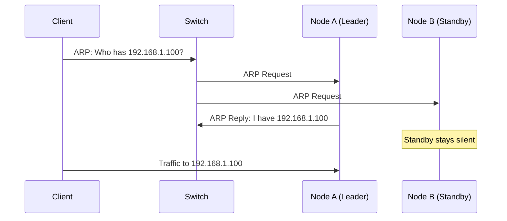
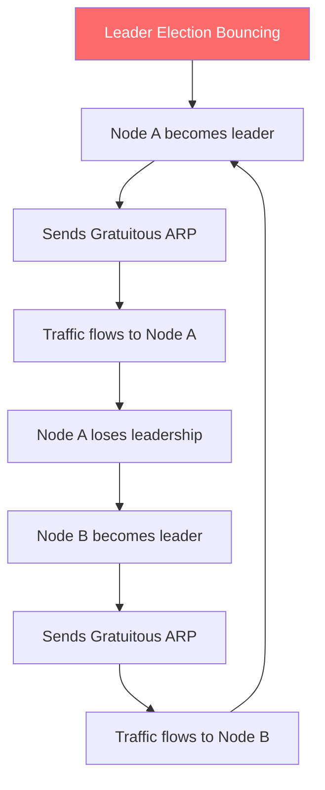
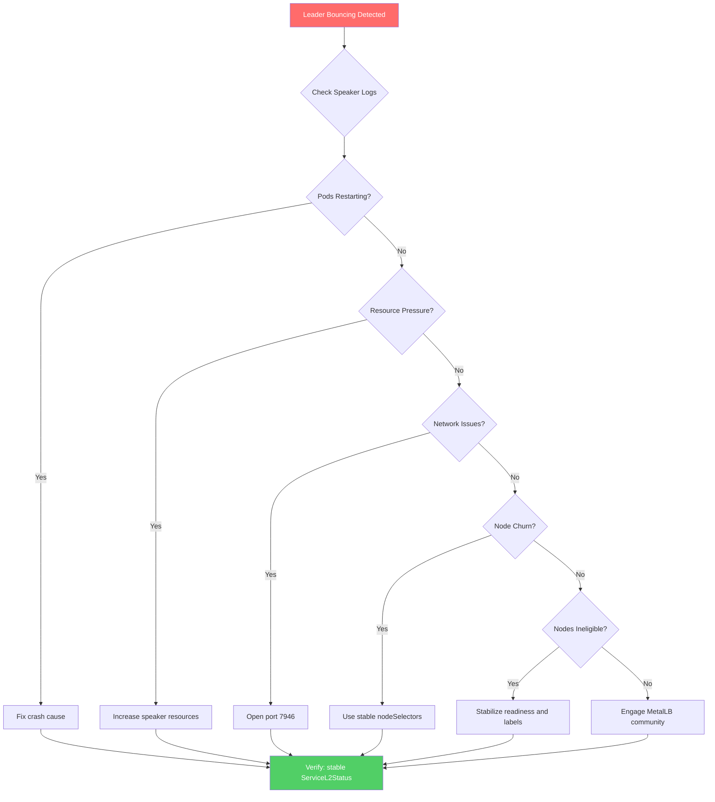

# How to Fix MetalLB L2 Leader Election Bouncing Between Nodes

Author: [nawazdhandala](https://www.github.com/nawazdhandala)

Tags: Kubernetes, MetalLB, Layer 2, Leader Election, Troubleshooting

Description: Troubleshooting guide for MetalLB L2 leader election instability where the leader keeps bouncing between nodes, causing service interruptions and ARP flapping.

---

If you run MetalLB in Layer 2 mode, you may have hit a situation where the leader for a given service keeps flipping between nodes every few seconds. Traffic drops, ARP tables go stale, and your service becomes unreachable in short bursts. This guide walks through how L2 leader election works, what causes it to bounce, and how to fix it.

## How L2 Leader Election Works

MetalLB uses a **stateless hash-based** leader selection in Layer 2 mode. Each `speaker` pod runs on every node, and memberlist is used to decide which speakers are currently active. For each LoadBalancer service, the speakers compute the same sorted `node + VIP` hash list, and the first eligible speaker becomes the announcer. That speaker responds to ARP (IPv4) or NDP (IPv6) requests for the service's external IP.


```mermaid
sequenceDiagram
    participant Client
    participant Switch
    participant NodeA as Node A (Leader)
    participant NodeB as Node B (Standby)
    Client->>Switch: ARP: Who has 192.168.1.100?
    Switch->>NodeA: ARP Request
    Switch->>NodeB: ARP Request
    NodeA->>Switch: ARP Reply: I have 192.168.1.100
    Note over NodeB: Standby stays silent
    Client->>NodeA: Traffic to 192.168.1.100
```

When leadership is stable, this works well. The problem starts when leadership keeps changing.

## Symptoms of Bouncing

Confirm you are seeing leader bouncing before investigating further:

- **Intermittent connectivity** - the service works for a few seconds, drops, then works again.
- **ARP flapping** - your switch logs show the MAC for the service IP changing repeatedly.
- **Frequent announcer changes** - MetalLB service events or `ServiceL2Status` show the announcing node changing repeatedly.
- **Gratuitous ARP storms** - each new leader sends a gratuitous ARP, and switches may rate-limit them.


```mermaid
graph TD
    A[Leader Election Bouncing] --> B[Node A becomes leader]
    B --> C[Sends Gratuitous ARP]
    C --> D[Traffic flows to Node A]
    D --> E[Node A loses leadership]
    E --> F[Node B becomes leader]
    F --> G[Sends Gratuitous ARP]
    G --> H[Traffic flows to Node B]
    H --> B
    style A fill:#ff6b6b,color:#fff
```

## Checking Status and Speaker Logs

Watch the MetalLB `ServiceL2Status` resources to confirm the L2 announcer is unstable:

```bash
# Watch the nodes currently receiving traffic for L2 LoadBalancer services
kubectl get servicel2statuses -n metallb-system -w
```

You can also inspect events on the affected Service:

```bash
# Show MetalLB events that identify the announcing node
kubectl describe svc <service-name> -n <service-namespace> | grep -A 10 "Events"
```

For deeper troubleshooting, tail the speaker logs and look for announce, withdraw, and memberlist messages:

```bash
kubectl logs -n metallb-system -l app=metallb,component=speaker \
  --all-containers --follow | grep -Ei "announce|withdraw|memberlist"
```

Healthy output shows a stable allocated node for the service. Unhealthy status output looks like rapid changes:

```text
NAME       ALLOCATED NODE   SERVICE NAME   SERVICE NAMESPACE
l2-r8jwb   node-a           web            default
l2-r8jwb   node-b           web            default
l2-r8jwb   node-c           web            default
```

If the announcer changes every few seconds, you have a bouncing problem.

## Common Causes and Fixes

### 1. Resource Pressure on Nodes

The speaker uses memberlist for gossip communication. If a node is under heavy CPU or memory pressure, the speaker may miss health probes, causing others to declare it dead and trigger re-election.

```bash
# Check node resource usage - high values can starve speaker pods
kubectl top nodes

# Check if speaker pods are being throttled or OOM-killed
kubectl describe pods -n metallb-system -l component=speaker | \
  grep -A 5 "State\|Reason\|Restart Count"
```

**Fix**: Increase resource requests for the speaker DaemonSet:

```yaml
# Patch the speaker DaemonSet to guarantee resources
apiVersion: apps/v1
kind: DaemonSet
metadata:
  name: speaker
  namespace: metallb-system
spec:
  template:
    spec:
      containers:
      - name: speaker
        resources:
          requests:
            cpu: 100m      # Guarantee CPU so the speaker is never starved
            memory: 128Mi
          limits:
            cpu: 200m
            memory: 256Mi
```

### 2. Network Connectivity Issues Between Nodes

Memberlist relies on TCP and UDP between speakers on the nodes. Network partitions, firewall rules, or packet loss between nodes cause members to lose contact and re-elect.

```bash
# Check for packet loss between nodes from inside a speaker pod
kubectl exec -n metallb-system <speaker-pod-on-node-a> -- \
  ping -c 10 <node-b-ip> | tail -3
```

**Fix**: Open port 7946 (TCP and UDP) between all nodes. If you use network policies, add an allow rule:

```yaml
# Allow MetalLB speaker pods to communicate on the memberlist port.
# Speaker pods normally use hostNetwork, so also verify node firewalls,
# security groups, or CNI host-network policy if those control node traffic.
apiVersion: networking.k8s.io/v1
kind: NetworkPolicy
metadata:
  name: allow-metallb-memberlist
  namespace: metallb-system
spec:
  podSelector:
    matchLabels:
      component: speaker
  ingress:
    - from:
        - podSelector:
            matchLabels:
              component: speaker
      ports:
        - { protocol: TCP, port: 7946 }
        - { protocol: UDP, port: 7946 }
  egress:
    - to:
        - podSelector:
            matchLabels:
              component: speaker
      ports:
        - { protocol: TCP, port: 7946 }
        - { protocol: UDP, port: 7946 }
```

### 3. Speaker Pod Crashes or Restarts

A crash-looping speaker keeps joining and leaving the memberlist ring, forcing re-elections for every IP it held.

```bash
# Check restart counts - a high number is a red flag
kubectl get pods -n metallb-system -l component=speaker \
  -o custom-columns=NAME:.metadata.name,NODE:.spec.nodeName,RESTARTS:.status.containerStatuses[0].restartCount

# Check previous crash logs
kubectl logs -n metallb-system <speaker-pod-name> --previous
```

Common crash causes: RBAC misconfiguration, missing L2Advertisement or IPAddressPool CRDs, or conflicting versions after an upgrade. Verify CRDs are installed:

```bash
# Confirm all MetalLB CRDs exist
kubectl get crd | grep metallb
```

### 4. Misconfigured Node Selectors

If your L2Advertisement uses `nodeSelectors` and matching nodes keep cycling due to autoscaling, leadership bounces as nodes join and leave.

**Fix**: Use stable, manually assigned labels:

```yaml
apiVersion: metallb.io/v1beta1
kind: L2Advertisement
metadata:
  name: stable-l2
  namespace: metallb-system
spec:
  ipAddressPools:
    - production-pool
  # Assign this label manually to specific, long-lived nodes
  nodeSelectors:
    - matchLabels:
        metallb-speaker: "active"
```

### 5. Nodes Becoming Ineligible to Announce

MetalLB only considers eligible nodes when calculating the L2 announcer. If nodes repeatedly become `NotReady`, lose matching labels, lose active local endpoints for services using `externalTrafficPolicy: Local`, or carry the `node.kubernetes.io/exclude-from-external-load-balancers` label, the candidate set changes and the announcer may move.

```bash
# Check node readiness and labels that affect LoadBalancer announcements
kubectl get nodes --show-labels

# Check whether the service requires local endpoints on the announcing node
kubectl get svc <service-name> -n <service-namespace> \
  -o jsonpath='{.spec.externalTrafficPolicy}{"\n"}'
```

**Fix**: Stabilize node readiness and labels. If the excluded-load-balancers label is present on nodes that should announce services, either remove the label where appropriate or configure the speaker with `--ignore-exclude-lb`.

## Verifying the Fix

After applying your fix, confirm the announcer has stabilized:

```bash
# Watch the L2 status - the allocated node should stay stable
kubectl get servicel2statuses -n metallb-system -w

# Confirm the service IP's MAC address stays constant
arp -a | grep "192.168.1.100"
```


```mermaid
flowchart TD
    A[Leader Bouncing Detected] --> B{Check Speaker Logs}
    B --> C{Pods Restarting?}
    C -->|Yes| D[Fix crash cause]
    C -->|No| E{Resource Pressure?}
    E -->|Yes| F[Increase speaker resources]
    E -->|No| G{Network Issues?}
    G -->|Yes| H[Open port 7946]
    G -->|No| I{Node Churn?}
    I -->|Yes| J[Use stable nodeSelectors]
    I -->|No| K{Nodes Ineligible?}
    K -->|Yes| L[Stabilize readiness and labels]
    K -->|No| M[Engage MetalLB community]
    D --> N[Verify: stable ServiceL2Status]
    F --> N
    H --> N
    J --> N
    L --> N
    M --> N
    style A fill:#ff6b6b,color:#fff
    style N fill:#51cf66,color:#fff
```

## Monitor MetalLB with OneUptime

Leader election bouncing can go unnoticed until users report intermittent failures. With [OneUptime](https://oneuptime.com), you can monitor MetalLB-backed services end-to-end. Set up HTTP monitors against your LoadBalancer IPs, configure alerts for intermittent failures, and use OpenTelemetry to trace traffic through your cluster. If leader election starts bouncing, you will know before your users do.
