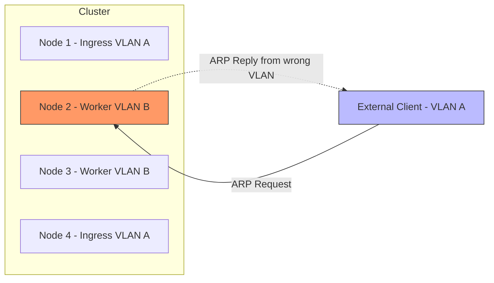
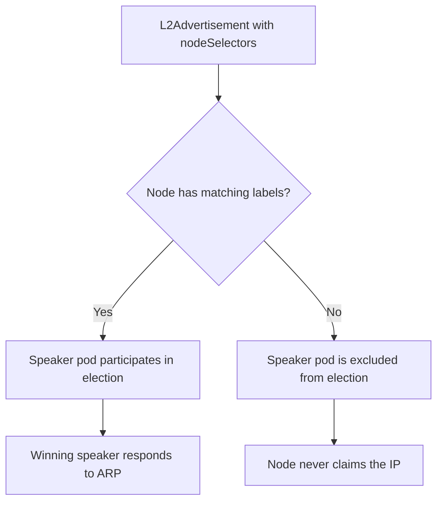

# How to Limit L2 Advertisement to Specific Nodes in MetalLB

Author: [nawazdhandala](https://www.github.com/nawazdhandala)

Tags: Kubernetes, MetalLB, Layer 2, Node Selection, L2Advertisement

Description: Learn how to restrict MetalLB Layer 2 advertisements to specific nodes using nodeSelector in L2Advertisement resources. Control which nodes respond to ARP requests for your LoadBalancer IPs.

---

By default, MetalLB in Layer 2 mode lets any speaker pod on any node claim your LoadBalancer IP. That works fine in small clusters, but in larger environments you often want only specific nodes to respond to ARP requests. Maybe your worker nodes sit on a different VLAN. Maybe you have dedicated ingress nodes with bonded NICs. Maybe you just want predictable traffic flow.

MetalLB supports this through the `nodeSelectors` field on the `L2Advertisement` resource. This guide shows you exactly how to set it up, test it, and verify it works.

### Why Limit L2 Advertisement to Specific Nodes

In Layer 2 mode, one MetalLB speaker pod wins an election and starts responding to ARP requests for the LoadBalancer IP. Any node running a speaker pod can win that election. This creates problems in several scenarios.



If Node 2 wins the speaker election, it responds to ARP requests. But Node 2 is on VLAN B, which the external client cannot reach at Layer 2. Traffic fails silently. The service has an IP but nothing can connect to it.

By restricting L2 advertisements to nodes on the correct network, you avoid this entirely.

### How L2Advertisement nodeSelectors Work

The `L2Advertisement` resource accepts a `nodeSelectors` field. This field takes a list of label selectors, and MetalLB will only allow speaker pods running on nodes that match those selectors to participate in the Layer 2 election.



This does not stop the speaker pod from running on the excluded nodes. The pod still runs. It just never announces the IP via ARP on those nodes.

### Step 1: Label Your Nodes

First, label the nodes that should handle L2 traffic. Pick a label that makes sense for your environment.

```bash
# Label nodes that should respond to ARP requests for LoadBalancer IPs
# Use a descriptive label that indicates the node's role
kubectl label node node-1 node-role.kubernetes.io/ingress=true

# Label additional ingress nodes the same way
kubectl label node node-4 node-role.kubernetes.io/ingress=true
```

Verify the labels are applied:

```bash
# Confirm the labels are set on the correct nodes
# The LABELS column should include your new label
kubectl get nodes --show-labels | grep ingress
```

You should see output like:

```
node-1   Ready   <none>   45d   v1.29.0   ...,node-role.kubernetes.io/ingress=true
node-4   Ready   <none>   45d   v1.29.0   ...,node-role.kubernetes.io/ingress=true
```

### Step 2: Create the IPAddressPool

```yaml
# ip-address-pool.yaml
# Defines the pool of IPs available for MetalLB to allocate
apiVersion: metallb.io/v1beta1
kind: IPAddressPool
metadata:
  # Name this pool descriptively so you can reference it later
  name: ingress-pool
  # All MetalLB resources live in the metallb-system namespace
  namespace: metallb-system
spec:
  addresses:
    # CIDR range of IPs on the ingress VLAN
    # Replace with your actual IP range
    - 192.168.1.240-192.168.1.250
```

Apply it:

```bash
# Create the IP address pool in the cluster
kubectl apply -f ip-address-pool.yaml
```

### Step 3: Create the L2Advertisement with nodeSelectors

This is the key step. Create an `L2Advertisement` that references your IP pool and restricts announcements to labeled nodes.

```yaml
# l2-advertisement.yaml
# L2Advertisement with nodeSelectors to restrict which nodes
# can respond to ARP requests for LoadBalancer IPs
apiVersion: metallb.io/v1beta1
kind: L2Advertisement
metadata:
  name: ingress-l2-advertisement
  namespace: metallb-system
spec:
  # Reference the IP address pool(s) this advertisement covers
  # Only IPs from these pools will be advertised via L2 on selected nodes
  ipAddressPools:
    - ingress-pool

  # nodeSelectors restricts which nodes participate in the L2 election
  # Only nodes matching ALL selectors in at least one entry will advertise
  nodeSelectors:
    - matchLabels:
        # Only nodes labeled as ingress nodes will respond to ARP
        node-role.kubernetes.io/ingress: "true"
```

Apply it:

```bash
# Create the L2 advertisement with node restrictions
kubectl apply -f l2-advertisement.yaml
```

### Step 4: Verify the Configuration

Check that both resources exist and are configured correctly.

```bash
# Verify the IPAddressPool and L2Advertisement
kubectl get ipaddresspools -n metallb-system
kubectl get l2advertisements -n metallb-system -o yaml
```

The output for the L2Advertisement should show your nodeSelectors:

```yaml
# Expected output showing nodeSelectors in the L2Advertisement spec
spec:
  ipAddressPools:
    - ingress-pool
  nodeSelectors:
    - matchLabels:
        node-role.kubernetes.io/ingress: "true"
```

### Step 5: Confirm the Correct Node Is Announcing

Check the MetalLB speaker logs to see which node won the election and is responding to ARP.

```bash
# Check speaker logs across all speaker pods
# Look for "announcing" messages that show which node claimed the IP
kubectl logs -n metallb-system -l app=metallb-speaker --all-containers \
  | grep -i "announc"
```

You should see announcement messages only from speaker pods on your labeled nodes (node-1 or node-4). If you see announcements from node-2 or node-3, the nodeSelector is not working correctly.

### Using matchExpressions for Advanced Selection

The `nodeSelectors` field also supports `matchExpressions` for more complex selection logic.

```yaml
# l2-advertisement-advanced.yaml
# Advanced node selection using matchExpressions
apiVersion: metallb.io/v1beta1
kind: L2Advertisement
metadata:
  name: advanced-l2-advertisement
  namespace: metallb-system
spec:
  ipAddressPools:
    - ingress-pool
  nodeSelectors:
    # matchExpressions allows operators like In, NotIn, Exists, DoesNotExist
    - matchExpressions:
        # Select nodes in the ingress zone
        - key: topology.kubernetes.io/zone
          operator: In
          values:
            - zone-a
            - zone-b
        # Exclude nodes that are marked for maintenance
        - key: node.kubernetes.io/maintenance
          operator: DoesNotExist
```

This selects nodes in zone-a or zone-b that do not have the maintenance label set.

### Multiple L2Advertisements for Different Pools

You can create separate L2Advertisements for different IP pools, each with their own node restrictions.

```yaml
# l2-multi-network.yaml
# Separate L2Advertisements for different network segments
apiVersion: metallb.io/v1beta1
kind: L2Advertisement
metadata:
  name: vlan-a-advertisement
  namespace: metallb-system
spec:
  ipAddressPools:
    - vlan-a-pool
  nodeSelectors:
    - matchLabels:
        network.example.com/vlan: "a"
---
apiVersion: metallb.io/v1beta1
kind: L2Advertisement
metadata:
  name: vlan-b-advertisement
  namespace: metallb-system
spec:
  ipAddressPools:
    - vlan-b-pool
  nodeSelectors:
    - matchLabels:
        network.example.com/vlan: "b"
```

Each pool's IPs are only advertised on the correct network segment, preventing cross-VLAN ARP issues.

### Common Mistakes

**Forgetting to label nodes.** The nodeSelector will match zero nodes, and MetalLB will not advertise the IP at all. The service will stay in `<pending>` state or get an IP that nobody announces.

**Typos in label keys or values.** Label matching is exact. `ingress: "True"` does not match `ingress: "true"`. Always double-check with `kubectl get nodes --show-labels`.

**Using nodeSelectors without ipAddressPools.** If you omit `ipAddressPools`, the L2Advertisement applies to all pools. Your nodeSelector then restricts all L2 traffic to those nodes, which may not be what you want.

### Monitoring Your MetalLB Setup with OneUptime

After restricting L2 advertisements to specific nodes, you want to make sure those nodes stay healthy and your LoadBalancer services remain reachable. [OneUptime](https://oneuptime.com) lets you set up HTTP monitors against your LoadBalancer endpoints, get alerted when services become unreachable, and track uptime over time. Combined with OpenTelemetry-based metrics from your cluster, you get full visibility into whether your MetalLB node selection is working as expected and catch issues before they affect users.
