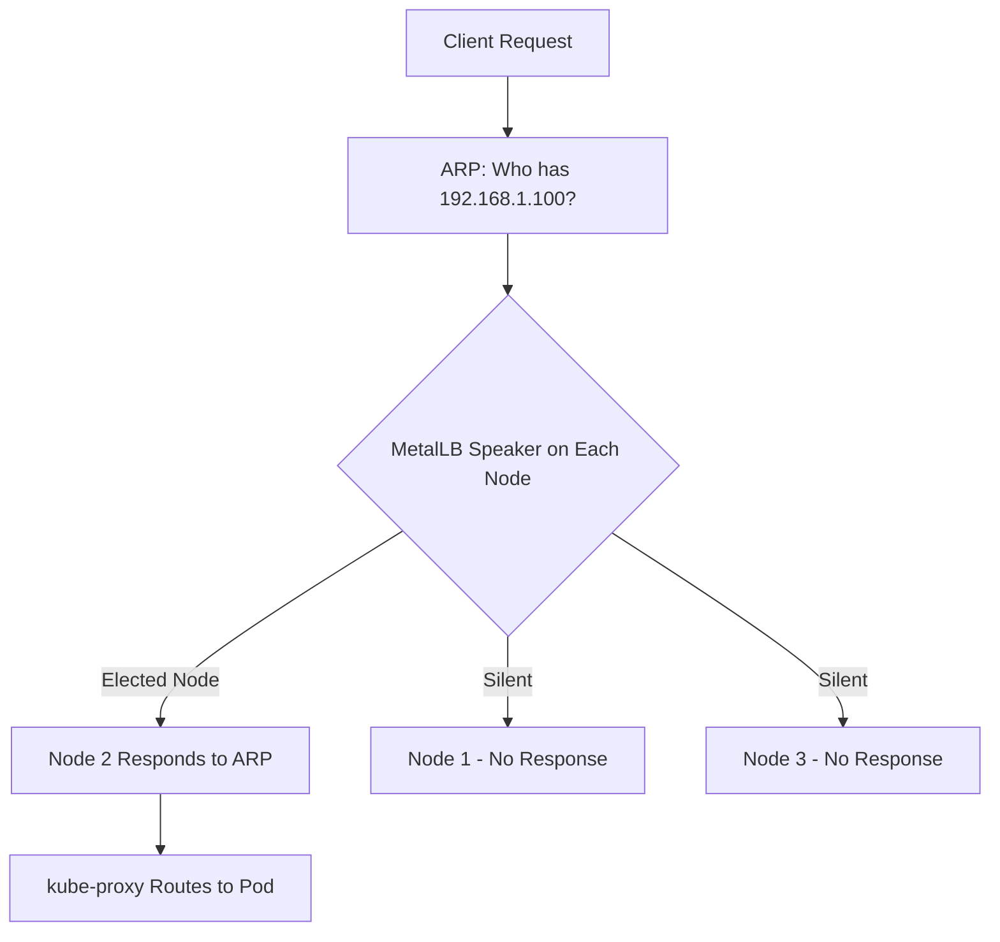
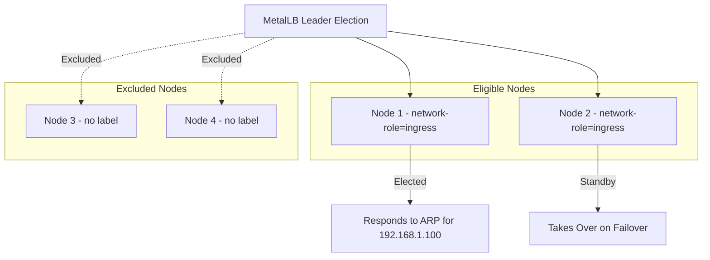
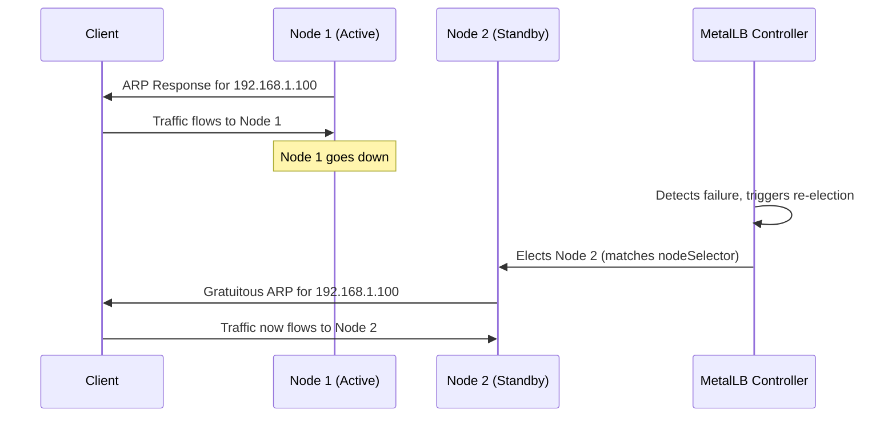

# How to Use Node Selectors with L2Advertisement in MetalLB

Author: [nawazdhandala](https://www.github.com/nawazdhandala)

Tags: Kubernetes, MetalLB, Layer 2, Node Selectors, L2Advertisement

Description: Learn how to combine node selectors with L2Advertisement in MetalLB to control which nodes advertise LoadBalancer IPs via ARP. Covers label-based node selection and practical examples.

---

When you run MetalLB in Layer 2 mode, any node in your cluster can respond to ARP requests for a LoadBalancer IP. In larger or multi-zone deployments, you often want only specific nodes to handle that traffic. MetalLB's `L2Advertisement` resource with `nodeSelectors` gives you that control.

### How L2 Mode Works in MetalLB

MetalLB elects one node to "own" each LoadBalancer IP. That node responds to ARP (IPv4) or NDP (IPv6) requests, pulling all traffic for that IP to itself. Kubernetes then routes traffic to the correct pods via kube-proxy.



Without node selectors, every node is a candidate. That is a problem when nodes span different subnets or you want dedicated ingress nodes.

### Why Use Node Selectors

- **Network topology**: Nodes on different VLANs may not be reachable by clients sending ARP requests.
- **Dedicated ingress nodes**: Reserve certain nodes for external traffic.
- **Resource isolation**: Keep batch worker nodes from also serving as L2 responders.
- **Multi-zone clusters**: Keep the advertising node in the same broadcast domain as the gateway.

### Prerequisites

- Kubernetes v1.20+ with MetalLB v0.13+ installed in `metallb-system`.
- `kubectl` configured and pointed at your cluster.
- At least two nodes available.

### Step 1: Label Your Nodes

Label the nodes that should advertise LoadBalancer IPs:

```bash
# Label nodes that should handle L2 advertisement
kubectl label node node-1 network-role=ingress
kubectl label node node-2 network-role=ingress

# Verify the labels
kubectl get nodes --show-labels | grep network-role
```

### Step 2: Create an IP Address Pool

```yaml
# ip-address-pool.yaml
# Defines the range of IPs MetalLB can hand out to services
apiVersion: metallb.io/v1beta1
kind: IPAddressPool
metadata:
  name: ingress-pool
  namespace: metallb-system
spec:
  addresses:
    # Replace with your actual IP range
    # This range should be routable on the same L2 segment as your ingress nodes
    - 192.168.1.100-192.168.1.110
```

Apply it:

```bash
# Create the IP address pool in your cluster
kubectl apply -f ip-address-pool.yaml
```

### Step 3: Create an L2Advertisement with Node Selectors

The `nodeSelectors` field controls which nodes are eligible to announce IPs from the linked pool.

```yaml
# l2-advertisement.yaml
# L2Advertisement with nodeSelectors to restrict which nodes respond to ARP
apiVersion: metallb.io/v1beta1
kind: L2Advertisement
metadata:
  name: ingress-l2-advert
  namespace: metallb-system
spec:
  # Tie this advertisement to specific IP pools
  # Only IPs from these pools will be advertised using these rules
  ipAddressPools:
    - ingress-pool

  # nodeSelectors restricts which nodes can win the leader election
  # Only nodes matching ALL selectors will be candidates
  nodeSelectors:
    - matchLabels:
        network-role: ingress
```

Apply it:

```bash
# Create the L2Advertisement resource with node selectors
kubectl apply -f l2-advertisement.yaml
```

Now only nodes with the label `network-role=ingress` will respond to ARP requests for IPs in the `ingress-pool`.



### Step 4: Deploy a Service and Verify

```yaml
# test-service.yaml
# A LoadBalancer service to verify MetalLB L2 advertisement
apiVersion: v1
kind: Service
metadata:
  name: test-lb-service
  annotations:
    # Tell MetalLB to pull from our ingress pool
    metallb.universe.tf/address-pool: ingress-pool
spec:
  type: LoadBalancer
  ports:
    - protocol: TCP
      port: 80        # External port
      targetPort: 8080 # Container port
  selector:
    app: test-app      # Must match your pod labels
```

Apply and verify:

```bash
# Deploy the test service and watch for an external IP
kubectl apply -f test-service.yaml
kubectl get svc test-lb-service --watch

# Confirm the announcing node matches your labeled nodes
kubectl logs -n metallb-system -l app=metallb-speaker | grep "announcing"
```

### Using matchExpressions for Advanced Selection

Use `matchExpressions` for operators like `In`, `NotIn`, `Exists`, and `DoesNotExist`.

```yaml
# l2-advertisement-advanced.yaml
# L2Advertisement using matchExpressions for flexible node selection
apiVersion: metallb.io/v1beta1
kind: L2Advertisement
metadata:
  name: zone-aware-l2-advert
  namespace: metallb-system
spec:
  ipAddressPools:
    - ingress-pool

  nodeSelectors:
    # Match nodes in specific zones using the In operator
    # This selects nodes labeled with zone-a OR zone-b
    - matchExpressions:
        - key: topology.kubernetes.io/zone
          operator: In
          values:
            - zone-a
            - zone-b

      # Combine matchExpressions with matchLabels (AND logic)
      matchLabels:
        network-role: ingress
```

Multiple selector blocks act as OR conditions. A node matching any one block is eligible.

### Handling Failover

When the active node goes down, MetalLB re-elects from nodes matching your selectors only. If none are healthy, the IP goes unannounced. Always label at least two nodes and monitor MetalLB speaker pod health.



### Common Mistakes

- **Forgetting to label nodes**: No matching nodes means no ARP announcements. Verify with `kubectl get nodes --show-labels`.
- **Wrong namespace**: IPAddressPool and L2Advertisement must be in `metallb-system`.
- **Mismatched pool names**: `ipAddressPools` must exactly match the pool's `metadata.name`.
- **Confusing node vs interface selection**: Node selectors pick which nodes participate. Interface selection is a separate `interfaces` field.

### Cleanup

To remove the test resources:

```bash
# Remove the test service and MetalLB resources
kubectl delete -f test-service.yaml
kubectl delete -f l2-advertisement.yaml
kubectl delete -f ip-address-pool.yaml

# Optionally remove the node labels
kubectl label node node-1 network-role-
kubectl label node node-2 network-role-
```

### Conclusion

Node selectors on L2Advertisement give you precise control over which nodes handle ARP responses for your LoadBalancer IPs. This is essential in production bare-metal clusters where network topology, traffic isolation, and failover planning matter.

By labeling your nodes and referencing those labels in your L2Advertisement resources, you keep external traffic flowing through the nodes you choose, not random ones picked by MetalLB's default election.

If you are running bare-metal Kubernetes and need full observability into your cluster, services, and load balancers, check out [OneUptime](https://oneuptime.com). It provides monitoring, alerting, incident management, and status pages - all open source and self-hostable alongside your MetalLB setup.
