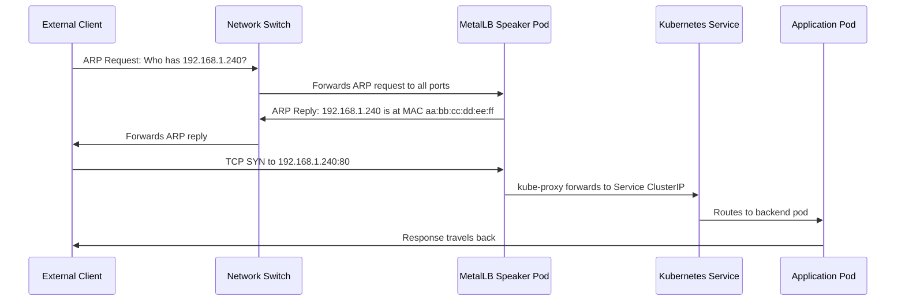
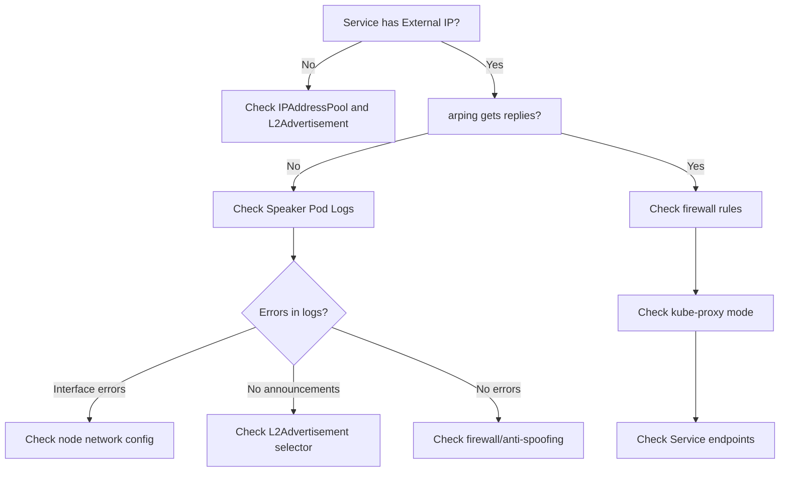
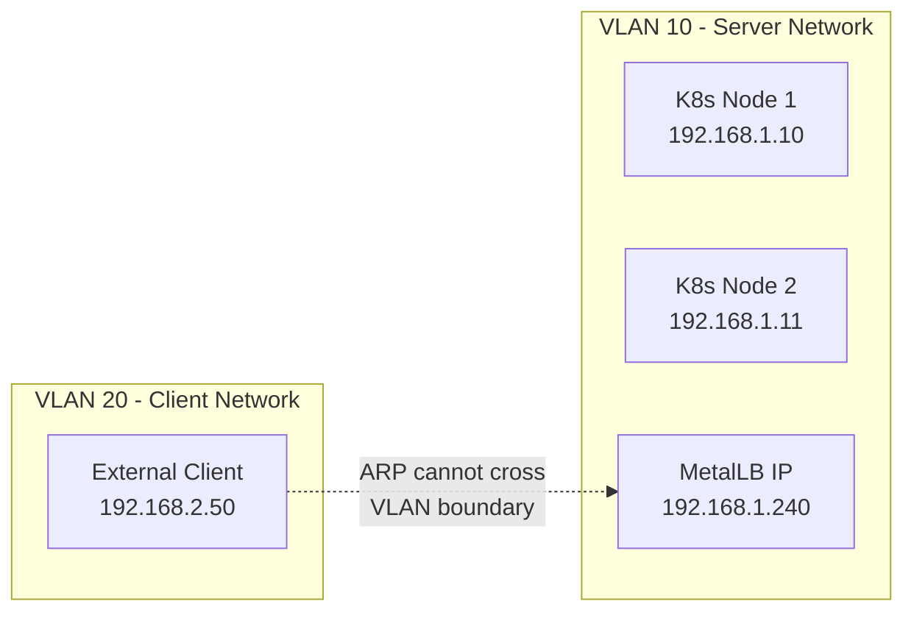
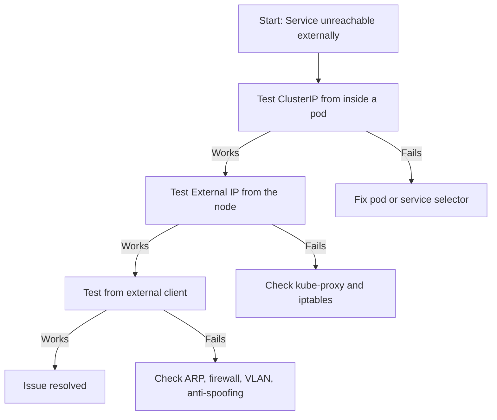

# How to Fix MetalLB Layer 2 Services Not Reachable from External Clients

Author: [nawazdhandala](https://www.github.com/nawazdhandala)

Tags: Kubernetes, MetalLB, Layer 2, Troubleshooting, Networking, ARP

Description: Troubleshooting guide for when MetalLB Layer 2 services get an external IP but are not reachable from outside the cluster. Covers common causes and fixes for ARP, firewall, and network issues.

---

You deployed a Kubernetes service of type LoadBalancer, MetalLB assigned it an external IP, but nothing outside the cluster can reach it. You try to curl or ping the IP and get nothing back. This is one of the most common issues with MetalLB in Layer 2 mode, and it almost always comes down to ARP, firewalls, or network misconfiguration.

This guide walks through a systematic debugging flow to find and fix the root cause.

### How MetalLB Layer 2 Mode Works

Before debugging, it helps to understand how MetalLB Layer 2 mode actually delivers traffic. Unlike BGP mode, Layer 2 does not use routing protocols. Instead, a single MetalLB speaker pod claims the external IP by responding to ARP (IPv4) or NDP (IPv6) requests on the local network.



If any step in this chain breaks, the service becomes unreachable. Let us walk through each failure point.

### Step 1: Confirm the External IP Is Assigned

First, verify that MetalLB actually assigned an IP to your service.

```bash
# Check the external IP assigned to your LoadBalancer service
# Look for the EXTERNAL-IP column - it should show an IP, not <pending>
kubectl get svc -A | grep LoadBalancer
```

If the EXTERNAL-IP shows `<pending>`, MetalLB has not assigned an IP yet. Verify the controller is running, an `IPAddressPool` exists, and an `L2Advertisement` references the pool:

```bash
# Verify MetalLB pods, IP pool, and L2 advertisement are all in place
kubectl get pods -n metallb-system
kubectl get ipaddresspools -n metallb-system -o yaml
kubectl get l2advertisements -n metallb-system -o yaml
```

### Step 2: Verify ARP Responses with arping

The most common reason Layer 2 services are unreachable is that ARP replies are not reaching external clients. From a machine on the same subnet (not inside the cluster), run:

```bash
# Send ARP requests to the MetalLB external IP from an external machine
# This checks whether MetalLB is responding to ARP queries
# Replace 192.168.1.240 with your actual external IP
# Replace eth0 with the network interface on the same subnet
arping -I eth0 192.168.1.240
```

**If you get replies**, ARP is working and the problem is likely a firewall or kube-proxy issue. Skip to Step 4. **If you get no replies**, ARP is broken. You can also confirm by checking the ARP table: `arp -n | grep 192.168.1.240`. Continue to Step 3.

### Step 3: Check MetalLB Speaker Pod Logs

The speaker pods are responsible for responding to ARP requests. Check their logs for errors.

```bash
# Get logs from all MetalLB speaker pods
# Look for messages about IP announcements and ARP responses
# The speaker that owns the IP should log "announcing" messages
kubectl logs -n metallb-system -l app=metallb-speaker --tail=100
```

Healthy logs contain `"event":"serviceAnnounced"` with your IP. If you see interface errors or no announcement messages, the speaker cannot reach the network interface. Check which node owns the IP:

```bash
# In Layer 2 mode, only ONE speaker pod handles each IP
kubectl get pods -n metallb-system -l app=metallb-speaker -o wide
```



### Step 4: Check Firewall Rules Blocking ARP or Traffic

Firewalls on the node can silently drop ARP packets or block incoming traffic on the assigned port.

```bash
# Check iptables for DROP rules affecting the external IP or port
sudo iptables -L -n -v | grep -i drop
sudo iptables -L -n -v | grep 80

# On nftables-based systems, check those rules instead
sudo nft list ruleset | head -50
```

If you use `ufw` or `firewalld`, allow your service port:

```bash
# ufw
sudo ufw allow 80/tcp

# firewalld (--permanent persists across reboots)
sudo firewall-cmd --add-port=80/tcp --permanent && sudo firewall-cmd --reload
```

### Step 5: Check for IP Conflicts on the Network

If another device on the network already uses the same IP, ARP will behave unpredictably. The switch may cache the wrong MAC address, sending traffic to the wrong device.

```bash
# Scan for duplicate IPs on the network (run from same subnet)
# Two different MACs for the same IP means a conflict
arping -D -I eth0 192.168.1.240 -c 3

# Also check the neighbor table on your gateway
ip neigh show | grep 192.168.1.240
```

If there is a conflict, change the MetalLB IP pool to use unused addresses or remove the conflicting device.

### Step 6: Verify the Subnet and VLAN Configuration

MetalLB Layer 2 mode requires the external IP to be on the same Layer 2 broadcast domain as the client trying to reach it. ARP is a broadcast protocol and does not cross VLAN boundaries or routed subnets.



Common mistakes:

- The MetalLB IP pool is on a different subnet than the node network
- The client is on a different VLAN and there is no proxy ARP or routing configured
- The MetalLB IP is a public IP but the nodes are on a private network

Make sure the MetalLB IP pool falls within the same subnet as your node IPs:

```bash
# Compare node IPs with the MetalLB IP pool - they must be in the same subnet
kubectl get nodes -o wide | awk '{print $1, $6}'
kubectl get ipaddresspools -n metallb-system -o jsonpath='{.items[*].spec.addresses}'
```

### Step 7: Disable Anti-Spoofing on Hypervisors

If your Kubernetes nodes run as virtual machines on hypervisors like VMware ESXi, Proxmox, or Hyper-V, the hypervisor may block ARP replies from MetalLB because the MAC address does not match the VM NIC.

This is called **anti-spoofing** or **forged transmits protection**. MetalLB Layer 2 mode sends ARP replies using the node MAC for an IP the hypervisor did not assign, which triggers the protection.

**VMware ESXi:**

```
# In vSphere, navigate to the port group or vSwitch settings
# Security Policy settings that need to be changed:
#   - Promiscuous Mode: Accept
#   - MAC Address Changes: Accept
#   - Forged Transmits: Accept
# These settings allow MetalLB ARP replies to pass through
```

**Proxmox:**

```bash
# On the Proxmox host, edit the VM network configuration
# Find your VM ID and network interface
# Disable the firewall for the bridge or add MAC exceptions
qm set <VMID> -net0 model=virtio,bridge=vmbr0,firewall=0
```

**Cloud Providers (AWS, GCP, Azure):**

Layer 2 mode generally does not work on cloud providers because they do not support arbitrary ARP responses. Use BGP mode or a cloud-native load balancer instead.

### Step 8: Enable Strict ARP for kube-proxy (IPVS Mode)

If your cluster uses kube-proxy in IPVS mode, you must enable `strictARP`. Without this, kube-proxy responds to ARP requests for LoadBalancer IPs on every node, confusing the network about which node actually owns the IP.

```bash
# Check if kube-proxy is running in IPVS mode
# Look for "mode: ipvs" in the output
kubectl get configmap kube-proxy -n kube-system -o yaml | grep mode
```

If it shows IPVS mode, enable strict ARP:

```bash
# Edit the kube-proxy configmap to enable strict ARP
# This prevents kube-proxy from responding to ARP for IPs it does not own
kubectl edit configmap kube-proxy -n kube-system
```

Find the `ipvs` section and set `strictARP: true`:

```yaml
# kube-proxy IPVS configuration section
# strictARP prevents nodes from answering ARP for IPs they do not own
# This is REQUIRED for MetalLB Layer 2 mode with IPVS
apiVersion: kubeproxy.config.k8s.io/v1alpha1
kind: KubeProxyConfiguration
ipvs:
  strictARP: true    # Must be true for MetalLB Layer 2 mode with IPVS
mode: "ipvs"         # Only relevant when mode is set to ipvs
```

Then restart kube-proxy to apply:

```bash
# Restart kube-proxy pods to pick up the new configuration
kubectl rollout restart daemonset kube-proxy -n kube-system
```

### Step 9: Check Service Endpoints and Pod Health

Even if ARP and networking are correct, the service will appear unreachable if there are no healthy backend pods.

```bash
# Check endpoints - if <none>, no pods match the service selector
kubectl get endpoints my-service
kubectl describe svc my-service | grep Selector
kubectl get pods -l app=my-application
```

### Step 10: Test Connectivity Step by Step

Work from the inside out to isolate where the failure happens.

```bash
# 1. Test from inside a pod to the ClusterIP
# This verifies the service and pods work internally
kubectl run test-pod --rm -it --image=busybox -- wget -qO- http://10.152.183.5:80

# 2. Test from the node to the external IP
# This verifies kube-proxy is routing correctly
curl -v http://192.168.1.240:80

# 3. Test from an external machine on the same subnet
# This is the full end-to-end test
curl -v http://192.168.1.240:80
```



### Quick Reference Checklist

Here is a summary of everything to check:

| Check | Command | What to Look For |
|-------|---------|-----------------|
| IP assigned | `kubectl get svc` | EXTERNAL-IP is not pending |
| Speaker running | `kubectl get pods -n metallb-system` | All speaker pods are Running |
| ARP replies | `arping -I eth0 <IP>` | Getting unicast replies |
| Speaker logs | `kubectl logs -n metallb-system -l app=metallb-speaker` | Service announced messages |
| IP conflicts | `arping -D -I eth0 <IP>` | No duplicate replies |
| Firewall | `iptables -L -n` | No DROP rules on service port |
| Strict ARP | `kubectl get cm kube-proxy -n kube-system -o yaml` | strictARP: true (IPVS only) |
| Endpoints | `kubectl get endpoints <svc>` | Pod IPs listed |
| Subnet match | `kubectl get nodes -o wide` | MetalLB IPs in same subnet |

### Monitoring MetalLB with OneUptime

Once your MetalLB services are reachable, you want to make sure they stay that way. [OneUptime](https://oneuptime.com) can monitor your LoadBalancer endpoints with HTTP checks, alert you when services become unreachable, and help you track uptime across all your bare-metal Kubernetes services. Pair it with OpenTelemetry to get full visibility into your cluster networking and catch Layer 2 issues before your users do.
