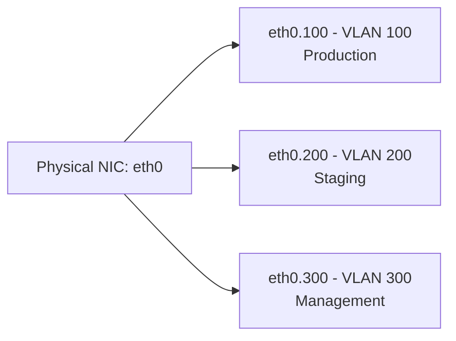
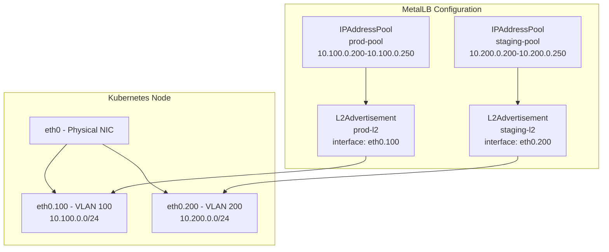

# How to Configure MetalLB L2 Mode for Tagged VLANs

Author: [nawazdhandala](https://www.github.com/nawazdhandala)

Tags: Kubernetes, MetalLB, VLAN, Layer 2, Networking, 802.1Q

Description: Learn how to configure MetalLB Layer 2 mode to work with tagged VLANs (802.1Q). Cover VLAN interface setup on nodes, IP pool configuration per VLAN, and interface selectors.

---

Running Kubernetes on bare metal often means working with network segmentation. Many production environments use 802.1Q tagged VLANs to isolate traffic for security, performance, or compliance. MetalLB supports Layer 2 mode on VLAN-tagged interfaces, but it requires careful setup on each node and in your MetalLB configuration.

This guide walks through the process: creating VLAN interfaces on your nodes, assigning MetalLB IP pools per VLAN, and using interface selectors to direct advertisements to the correct sub-interfaces.

## What Are Tagged VLANs (802.1Q)?

802.1Q is the IEEE standard for VLAN tagging. A single physical network interface can carry traffic for multiple VLANs by adding a 4-byte tag to each Ethernet frame. The OS creates virtual sub-interfaces (like `eth0.100` or `ens3.200`) that each handle traffic for one VLAN ID.



## Architecture Overview

The diagram below shows how MetalLB fits into a tagged VLAN setup. Each VLAN has its own IP pool, and MetalLB uses interface selectors to announce IPs only on the matching sub-interface.



## Prerequisites

Before you begin, make sure you have:

- A Kubernetes cluster running on bare metal (or VMs with trunk port access).
- MetalLB installed in your cluster (v0.13 or later for interface selectors).
- Root or sudo access on each Kubernetes node.
- A network switch configured with 802.1Q trunk ports facing your nodes.

## Step 1: Create VLAN Interfaces on Each Node

You need to create VLAN sub-interfaces on every Kubernetes node that will participate in MetalLB speaker announcements. The `8021q` kernel module must be loaded first.

```bash
# Load the 802.1Q kernel module
# This enables VLAN tagging support in the Linux kernel
sudo modprobe 8021q

# Make the module load automatically on boot
echo "8021q" | sudo tee /etc/modules-load.d/8021q.conf
```

Now create the VLAN interfaces. In this example, we set up VLAN 100 (production) and VLAN 200 (staging) on the `eth0` physical interface.

```bash
# Create VLAN 100 (production) sub-interface on eth0
sudo ip link add link eth0 name eth0.100 type vlan id 100
sudo ip addr add 10.100.0.10/24 dev eth0.100
sudo ip link set dev eth0.100 up

# Create VLAN 200 (staging) sub-interface on eth0
sudo ip link add link eth0 name eth0.200 type vlan id 200
sudo ip addr add 10.200.0.10/24 dev eth0.200
sudo ip link set dev eth0.200 up
```

### Making VLAN Interfaces Persistent with Netplan

On Ubuntu servers, use Netplan to make sure VLAN interfaces survive a reboot.

```yaml
# /etc/netplan/01-vlans.yaml
network:
  version: 2
  renderer: networkd
  ethernets:
    eth0:
      dhcp4: false
  vlans:
    eth0.100:
      id: 100
      link: eth0
      addresses: [10.100.0.10/24]
    eth0.200:
      id: 200
      link: eth0
      addresses: [10.200.0.10/24]
```

Apply with `sudo netplan apply --debug`.

## Step 2: Verify VLAN Interfaces

Confirm that the VLAN interfaces are active on each node before moving on.

```bash
# List all VLAN sub-interfaces and verify they are UP with correct IPs
ip -d link show type vlan
ip addr show eth0.100
ip addr show eth0.200
```

## Step 3: Create IPAddressPools per VLAN

Each VLAN gets its own IPAddressPool. The IP ranges must fall within the subnet of the corresponding VLAN.

```yaml
# metallb-pools.yaml
# Define separate IP pools for each VLAN segment
apiVersion: metallb.io/v1beta1
kind: IPAddressPool
metadata:
  name: prod-pool
  namespace: metallb-system
spec:
  # This range is within the VLAN 100 subnet (10.100.0.0/24)
  # Make sure these IPs are not used by DHCP or other static assignments
  addresses:
    - 10.100.0.200-10.100.0.250
---
apiVersion: metallb.io/v1beta1
kind: IPAddressPool
metadata:
  name: staging-pool
  namespace: metallb-system
spec:
  # This range is within the VLAN 200 subnet (10.200.0.0/24)
  addresses:
    - 10.200.0.200-10.200.0.250
```

Apply the pools:

```bash
# Create the IP address pools in your cluster
kubectl apply -f metallb-pools.yaml
```

## Step 4: Create L2Advertisements with Interface Selectors

This is the key step. Each L2Advertisement binds an IP pool to a specific VLAN interface using the `interfaces` field. Without this, MetalLB would announce the IPs on all interfaces, which breaks VLAN isolation.

```yaml
# metallb-l2-vlans.yaml
# L2Advertisement resources that target specific VLAN interfaces
apiVersion: metallb.io/v1beta1
kind: L2Advertisement
metadata:
  name: prod-l2
  namespace: metallb-system
spec:
  # Only advertise IPs from the production pool
  ipAddressPools:
    - prod-pool
  # Restrict ARP responses to the VLAN 100 interface only
  # This ensures production IPs are only reachable on the production VLAN
  interfaces:
    - eth0.100
---
apiVersion: metallb.io/v1beta1
kind: L2Advertisement
metadata:
  name: staging-l2
  namespace: metallb-system
spec:
  # Only advertise IPs from the staging pool
  ipAddressPools:
    - staging-pool
  # Restrict ARP responses to the VLAN 200 interface only
  interfaces:
    - eth0.200
```

Apply the advertisements:

```bash
# Create the L2 advertisements with VLAN-specific interface selectors
kubectl apply -f metallb-l2-vlans.yaml
```

## Step 5: Deploy a Service on a Specific VLAN

To place a LoadBalancer service on a particular VLAN, reference the matching IP pool using an annotation.

```yaml
# example-service.yaml
apiVersion: v1
kind: Service
metadata:
  name: my-production-app
  annotations:
    # Allocate an IP from prod-pool, reachable only on VLAN 100
    metallb.universe.tf/address-pool: prod-pool
spec:
  type: LoadBalancer
  selector:
    app: my-app
  ports:
    - port: 80
      targetPort: 8080
```

## Step 6: Validate the Setup

Verify that MetalLB assigned an IP from the correct pool and announces it on the right interface.

```bash
# Confirm the external IP is in the 10.100.0.200-250 range
kubectl get svc my-production-app

# Check speaker logs for ARP announcements and interface details
kubectl logs -n metallb-system -l component=speaker --tail=50
```

## Troubleshooting Common Issues

**No external IP assigned**: Verify that your IPAddressPool ranges do not overlap with existing IPs on the network. Check that pool names in your L2Advertisement match exactly.

**ARP responses on the wrong interface**: Confirm the `interfaces` field in your L2Advertisement matches the exact VLAN sub-interface name. Run `ip link show` to verify.

**Traffic not reaching the service**: Make sure the upstream switch port is configured as a trunk port carrying the correct VLAN tags.

**VLAN interface missing after reboot**: Ensure you have a persistent configuration via Netplan or systemd-networkd, and that `8021q` loads at boot.

## Summary

Configuring MetalLB L2 mode with tagged VLANs involves three steps: setting up 802.1Q sub-interfaces on your nodes, creating separate IPAddressPools per VLAN, and using L2Advertisement interface selectors to isolate ARP announcements. This gives you proper network segmentation with MetalLB on bare metal.

If you are running Kubernetes on bare metal and need to monitor the health of services across multiple VLANs, [OneUptime](https://oneuptime.com) provides comprehensive monitoring with support for uptime checks, incident management, and status pages. It helps you keep track of service availability across all your network segments from a single dashboard.
