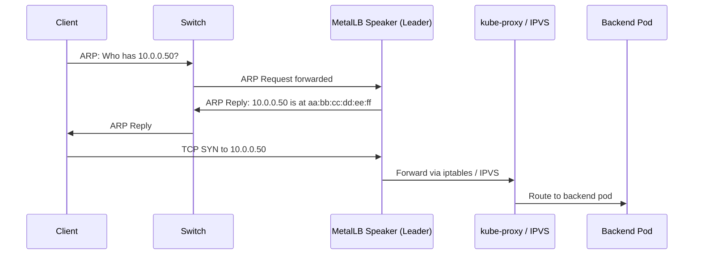
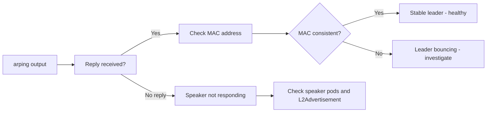
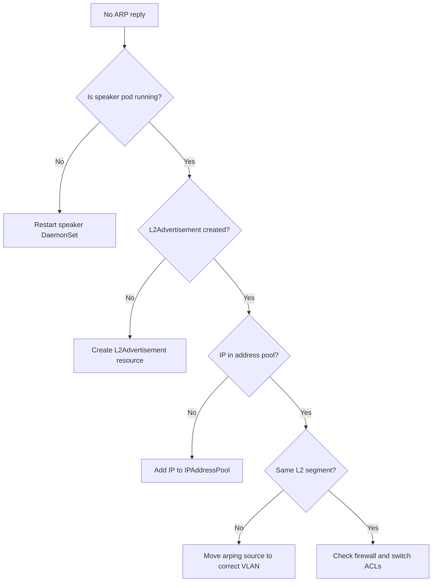

# How to Verify MetalLB L2 Advertisement with arping

Author: [nawazdhandala](https://www.github.com/nawazdhandala)

Tags: Kubernetes, MetalLB, arping, ARP, Layer 2, Debugging

Description: Learn how to use arping to verify that MetalLB Layer 2 advertisements are working correctly. This guide covers installation, usage, interpreting results, and common issues.

---

When you deploy MetalLB in Layer 2 mode, the speaker pod on the elected leader node responds to ARP requests for your service's external IP. If something goes wrong, your service becomes unreachable even though everything inside the cluster looks healthy. The `arping` utility is the fastest way to confirm whether ARP responses are arriving and from which MAC address. This guide covers installation, usage, interpreting output, and troubleshooting common failures.

## How MetalLB L2 Advertisement Works

Before diving into arping, it helps to understand what you are testing. In L2 mode, MetalLB does not use BGP. Instead, the leader speaker pod answers ARP queries for the LoadBalancer IP directly on the local network segment.



If the speaker does not reply to the ARP request, the client never learns the MAC address and traffic never reaches the cluster.

## Installing arping

The `arping` tool sends ARP requests at Layer 2 and displays the replies. Install it for your platform:

```bash
# Debian / Ubuntu
sudo apt-get update && sudo apt-get install -y iputils-arping

# RHEL / CentOS / Fedora
sudo dnf install -y iputils

# Alpine (useful inside containers)
apk add --no-cache iputils

# macOS (via Homebrew)
brew install arping
```

Confirm the binary is available:

```bash
# Verify arping is installed and accessible
which arping
# Expected output: /usr/bin/arping or /usr/sbin/arping
```

## Basic Usage

The simplest arping invocation sends ARP requests to a target IP on a specific network interface. You must run it from a machine on the **same Layer 2 network segment** as the MetalLB external IP.

```bash
# Send 5 ARP requests for the MetalLB LoadBalancer IP
# -c 5    : stop after 5 replies
# -I eth0 : use the eth0 interface (replace with your interface name)
# 10.0.0.50 : the external IP assigned by MetalLB
sudo arping -c 5 -I eth0 10.0.0.50
```

You need `sudo` because arping opens a raw socket to send and receive ARP frames.

## Reading the Output

A healthy response looks like this:

```text
ARPING 10.0.0.50 from 10.0.0.1 eth0
Unicast reply from 10.0.0.50 [AA:BB:CC:DD:EE:FF]  0.987ms
Unicast reply from 10.0.0.50 [AA:BB:CC:DD:EE:FF]  1.012ms
Unicast reply from 10.0.0.50 [AA:BB:CC:DD:EE:FF]  0.954ms
Unicast reply from 10.0.0.50 [AA:BB:CC:DD:EE:FF]  1.034ms
Unicast reply from 10.0.0.50 [AA:BB:CC:DD:EE:FF]  0.998ms
Sent 5 probes (1 broadcast(s))
Received 5 response(s)
```

Here is what each part tells you:



**Key things to look for:**

- **Replies received** - if you get zero replies, MetalLB is not answering ARP at all.
- **Consistent MAC** - every reply should come from the same MAC address. That MAC belongs to the leader node's interface.
- **Changing MAC** - if the MAC alternates between replies, the leader election is unstable.
- **Response time** - sub-millisecond to low-millisecond replies are normal. High latency may indicate network congestion.

## Matching the MAC to a Kubernetes Node

Once you have the MAC address from arping, match it to a node to confirm which speaker is the leader.

```bash
# List all node MAC addresses to find which node owns the responding MAC
# Replace AA:BB:CC:DD:EE:FF with the MAC from your arping output
kubectl get nodes -o wide
```

Then on each node, check the interface MAC:

```bash
# Show the MAC address of the primary network interface on a node
# Replace eth0 with the actual interface name
ip link show eth0 | grep link/ether
# Example output: link/ether aa:bb:cc:dd:ee:ff brd ff:ff:ff:ff:ff:ff
```

You can also check the MetalLB speaker logs to confirm the leader:

```bash
# View speaker logs to find the current leader for a specific service
# Filter for the external IP to narrow results
kubectl logs -n metallb-system -l app=metallb,component=speaker --all-containers \
  | grep "10.0.0.50"
```

## Verifying Gratuitous ARP

When MetalLB elects a new leader, it sends a **gratuitous ARP** to update switch MAC tables. You can watch for these with arping in continuous mode alongside `tcpdump`:

```bash
# Terminal 1: continuous arping to watch for MAC changes
sudo arping -I eth0 10.0.0.50

# Terminal 2: capture ARP traffic to see gratuitous ARP frames
sudo tcpdump -i eth0 -n arp host 10.0.0.50
# Gratuitous ARP output: "ARP, Reply 10.0.0.50 is-at aa:bb:cc:dd:ee:ff"
```

## Automating the Check

For production environments, you can script the verification to run periodically and alert on failures.

```bash
#!/bin/bash
# verify_metallb_arp.sh
# Checks that a MetalLB LoadBalancer IP responds to ARP requests
# Returns exit code 0 on success, 1 on failure

# Configuration
TARGET_IP="${1:?Usage: $0 <loadbalancer-ip> <interface>}"
INTERFACE="${2:?Usage: $0 <loadbalancer-ip> <interface>}"
PROBE_COUNT=3
TIMEOUT=2

# Send ARP probes and count replies
REPLY_COUNT=$(sudo arping -c "$PROBE_COUNT" -w "$TIMEOUT" -I "$INTERFACE" "$TARGET_IP" \
  | grep -c "Unicast reply")

# Evaluate result
if [ "$REPLY_COUNT" -eq "$PROBE_COUNT" ]; then
    echo "OK: $TARGET_IP responded to all $PROBE_COUNT ARP probes on $INTERFACE"
    exit 0
elif [ "$REPLY_COUNT" -gt 0 ]; then
    echo "WARNING: $TARGET_IP responded to $REPLY_COUNT of $PROBE_COUNT probes"
    exit 1
else
    echo "CRITICAL: $TARGET_IP did not respond to any ARP probes on $INTERFACE"
    exit 2
fi
```

Make it executable and run:

```bash
# Make the script executable
chmod +x verify_metallb_arp.sh

# Run the check against your LoadBalancer IP
./verify_metallb_arp.sh 10.0.0.50 eth0
```

## Common Issues and Fixes



### No reply at all

If arping gets zero responses, work through these checks:

```bash
# 1. Verify speaker pods are running on all nodes
kubectl get pods -n metallb-system -l component=speaker -o wide

# 2. Confirm L2Advertisement exists and references the correct pool
kubectl get l2advertisements -n metallb-system -o yaml

# 3. Verify the IP is actually assigned to a service
kubectl get svc --all-namespaces | grep LoadBalancer
```

### Replies from the wrong MAC

If the MAC in the arping output does not match any node in your cluster, another device on the network is responding to ARP for that IP. This is an IP conflict. Remove the conflicting device or choose a different IP range for MetalLB.

### Intermittent replies

If some probes get replies and others do not, check for:

- **Network congestion** causing ARP frames to be dropped.
- **Switch port security** limiting the number of MAC addresses or ARP rate.
- **Speaker pod restarts** during the test window. Verify with `kubectl get pods -n metallb-system -l component=speaker`.

## Quick Reference

| Scenario | arping command | What to look for |
|---|---|---|
| Basic check | `sudo arping -c 3 -I eth0 <IP>` | Replies received |
| Continuous watch | `sudo arping -I eth0 <IP>` | MAC stability over time |
| Timeout control | `sudo arping -c 3 -w 5 -I eth0 <IP>` | Replies within 5 seconds |
| Specific source | `sudo arping -c 3 -S <src-ip> -I eth0 <IP>` | Response from correct segment |

## Conclusion

The `arping` utility gives you direct visibility into whether MetalLB L2 advertisements are working at the network layer. It answers the fundamental question: is the ARP reply arriving, and is it coming from the right node? Pair it with speaker log inspection and tcpdump for a complete debugging workflow.

If you want continuous monitoring of your MetalLB services and the infrastructure underneath them, [OneUptime](https://oneuptime.com) can watch your Kubernetes endpoints, track ARP health, and alert your team the moment something breaks.
