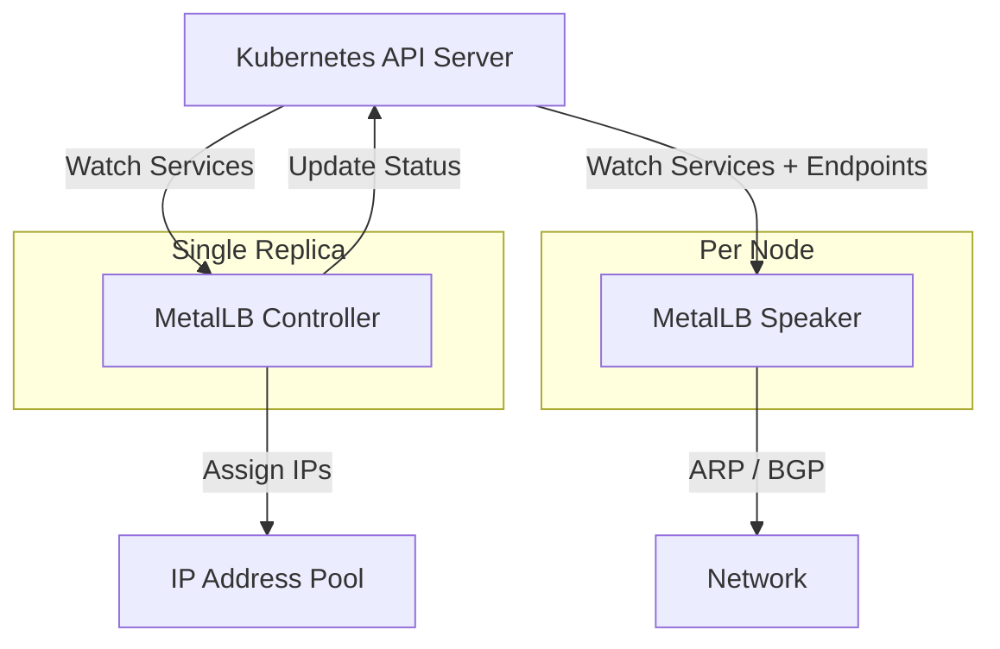
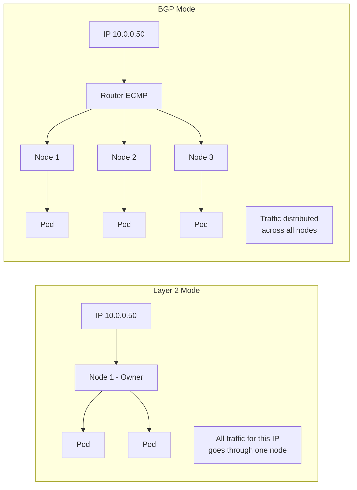

# How to Scale MetalLB for Clusters with Hundreds of Services

Author: [nawazdhandala](https://www.github.com/nawazdhandala)

Tags: Kubernetes, MetalLB, Scaling, Performance, Large Clusters

Description: Best practices for scaling MetalLB in large Kubernetes clusters with hundreds of LoadBalancer services and IP pools.

---

## When Scale Becomes a Concern

MetalLB works effortlessly for clusters with a handful of LoadBalancer services. But as your cluster grows to 50, 100, or 500+ LoadBalancer services, you will encounter challenges: IP pool exhaustion, speaker pod resource pressure, slow ARP convergence, and controller reconciliation delays.

This post covers practical strategies for keeping MetalLB performant at scale.

## Understanding MetalLB's Control Loop

Before optimizing, it helps to understand how MetalLB processes services internally:



The controller watches all services and assigns IPs. Each speaker pod watches services and endpoints to decide whether to announce routes for services with pods on its node. More services means more watch events, more reconciliation loops, and more network announcements.

## Strategy 1: Use Multiple IP Pools

Instead of one massive pool, create purpose-specific pools. This reduces the search space during IP allocation and makes management cleaner:

```yaml
# multiple-pools.yaml
# Separate pools for different workload categories
apiVersion: metallb.io/v1beta1
kind: IPAddressPool
metadata:
  name: web-pool
  namespace: metallb-system
  labels:
    tier: web
spec:
  addresses:
    # 100 IPs for web-facing services
    - 10.100.1.1-10.100.1.100
  autoAssign: false
---
apiVersion: metallb.io/v1beta1
kind: IPAddressPool
metadata:
  name: internal-pool
  namespace: metallb-system
  labels:
    tier: internal
spec:
  addresses:
    # 200 IPs for internal services
    - 10.100.2.1-10.100.2.200
  autoAssign: false
---
apiVersion: metallb.io/v1beta1
kind: IPAddressPool
metadata:
  name: monitoring-pool
  namespace: metallb-system
  labels:
    tier: monitoring
spec:
  addresses:
    # 50 IPs for monitoring and observability
    - 10.100.3.1-10.100.3.50
  autoAssign: false
```

Assign services to specific pools using annotations:

```yaml
# Service requesting an IP from the web pool
apiVersion: v1
kind: Service
metadata:
  name: public-api
  annotations:
    # Direct MetalLB to allocate from the web pool only
    metallb.universe.tf/address-pool: web-pool
spec:
  type: LoadBalancer
  ports:
    - port: 443
      targetPort: 8443
  selector:
    app: public-api
```

## Strategy 2: Tune Speaker Resource Limits

At scale, speaker pods consume more CPU and memory. Set appropriate resource requests and limits:

```bash
# Check current speaker resource usage across all nodes
kubectl top pods -n metallb-system -l component=speaker

# Example output for a 500-service cluster:
# NAME                READY   CPU(cores)   MEMORY(bytes)
# speaker-abc12       1/1     45m          78Mi
# speaker-def34       1/1     52m          82Mi
# speaker-ghi56       1/1     48m          75Mi
```

Patch the speaker DaemonSet with appropriate limits:

```yaml
# speaker-resources.yaml
# Apply via kubectl patch or kustomize overlay
apiVersion: apps/v1
kind: DaemonSet
metadata:
  name: speaker
  namespace: metallb-system
spec:
  template:
    spec:
      containers:
        - name: speaker
          resources:
            requests:
              # Base CPU for watch processing
              cpu: 100m
              # Base memory for route tables and caches
              memory: 128Mi
            limits:
              # Allow burst during reconciliation storms
              cpu: 500m
              memory: 256Mi
```

## Strategy 3: Use BGP Mode for Better Scaling

Layer 2 mode has inherent scaling limitations. Each IP is owned by exactly one node, creating a bottleneck. BGP mode distributes traffic across multiple nodes via ECMP:



## Strategy 4: Limit Speaker Node Selection

Not every node needs to run a MetalLB speaker. On large clusters, limit speakers to designated "edge" nodes:

```yaml
# speaker-node-selector.yaml
# Only run speakers on nodes labeled for external traffic
apiVersion: apps/v1
kind: DaemonSet
metadata:
  name: speaker
  namespace: metallb-system
spec:
  template:
    spec:
      nodeSelector:
        # Only nodes with this label will run a speaker
        metallb/role: "edge"
      tolerations:
        - key: "metallb/edge"
          operator: "Exists"
          effect: "NoSchedule"
```

Label your edge nodes:

```bash
# Designate specific nodes as MetalLB edge nodes
# Only these nodes will participate in IP advertisement
kubectl label node edge-node-1 metallb/role=edge
kubectl label node edge-node-2 metallb/role=edge
kubectl label node edge-node-3 metallb/role=edge
```

## Strategy 5: Monitor IP Pool Utilization

Track pool usage with Prometheus metrics. MetalLB exposes metrics that you can scrape:

```yaml
# prometheus-servicemonitor.yaml
# Scrape MetalLB metrics for pool utilization tracking
apiVersion: monitoring.coreos.com/v1
kind: ServiceMonitor
metadata:
  name: metallb-metrics
  namespace: metallb-system
spec:
  selector:
    matchLabels:
      app: metallb
  endpoints:
    - port: monitoring
      interval: 30s
```

Key metrics to watch:

```text
# Total IPs available across all pools
metallb_allocator_addresses_total

# IPs currently in use
metallb_allocator_addresses_in_use_total

# Per-pool breakdown
metallb_allocator_addresses_in_use_total{pool="web-pool"}
metallb_allocator_addresses_in_use_total{pool="internal-pool"}
```

Create a Prometheus alert for pool exhaustion:

```yaml
# pool-exhaustion-alert.yaml
# Fires when any pool is more than 85% full
apiVersion: monitoring.coreos.com/v1
kind: PrometheusRule
metadata:
  name: metallb-alerts
  namespace: metallb-system
spec:
  groups:
    - name: metallb-pool-alerts
      rules:
        - alert: MetalLBPoolNearExhaustion
          # Calculate utilization percentage per pool
          expr: |
            (metallb_allocator_addresses_in_use_total
            / metallb_allocator_addresses_total) * 100 > 85
          for: 5m
          labels:
            severity: warning
          annotations:
            summary: "MetalLB IP pool nearing exhaustion"
            description: >
              Pool {{ $labels.pool }} is at
              {{ $value | printf "%.0f" }}% capacity.
              Consider expanding the IP range.
```

## Strategy 6: Reduce Service Churn

Frequent service creation and deletion causes reconciliation storms. Use these practices to reduce churn:

```yaml
# Use IP sharing to reduce the number of IPs needed
# Multiple services can share one IP if ports do not overlap
apiVersion: v1
kind: Service
metadata:
  name: service-http
  annotations:
    # Both services share the same IP via this sharing key
    metallb.universe.tf/allow-shared-ip: "shared-web-ip"
spec:
  type: LoadBalancer
  loadBalancerIP: "10.100.1.50"
  ports:
    - port: 80
      targetPort: 8080
  selector:
    app: web
---
apiVersion: v1
kind: Service
metadata:
  name: service-https
  annotations:
    metallb.universe.tf/allow-shared-ip: "shared-web-ip"
spec:
  type: LoadBalancer
  loadBalancerIP: "10.100.1.50"
  ports:
    - port: 443
      targetPort: 8443
  selector:
    app: web
```

## Capacity Planning Table

| Cluster Size | Services | Recommended Mode | Speaker Nodes | IP Pool Size |
|-------------|----------|------------------|---------------|-------------|
| Small       | 1-20     | Layer 2          | All nodes     | /28 (14 IPs) |
| Medium      | 20-100   | Layer 2 or BGP   | All nodes     | /25 (126 IPs) |
| Large       | 100-500  | BGP              | Edge nodes    | /23 (510 IPs) |
| Very Large  | 500+     | BGP + BFD        | Edge nodes    | /22 or multiple pools |

## Summary

Scaling MetalLB for large clusters requires a combination of strategies: segmented IP pools, resource tuning, BGP mode for traffic distribution, limited speaker placement, and proactive monitoring. The goal is to keep reconciliation loops fast, IP allocation predictable, and network announcements efficient.

For comprehensive monitoring of your MetalLB deployment at scale, [OneUptime](https://oneuptime.com) can track service availability, pool utilization, and infrastructure health across your entire cluster fleet with real-time alerting and historical reporting.
