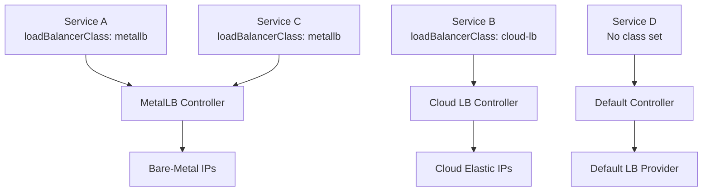
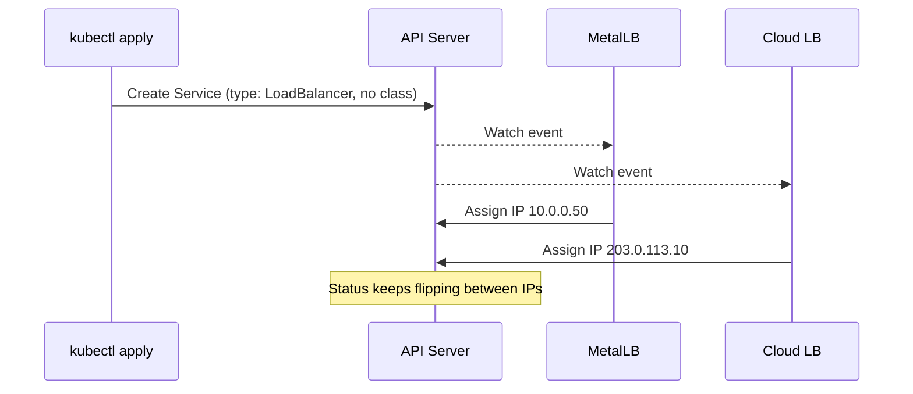
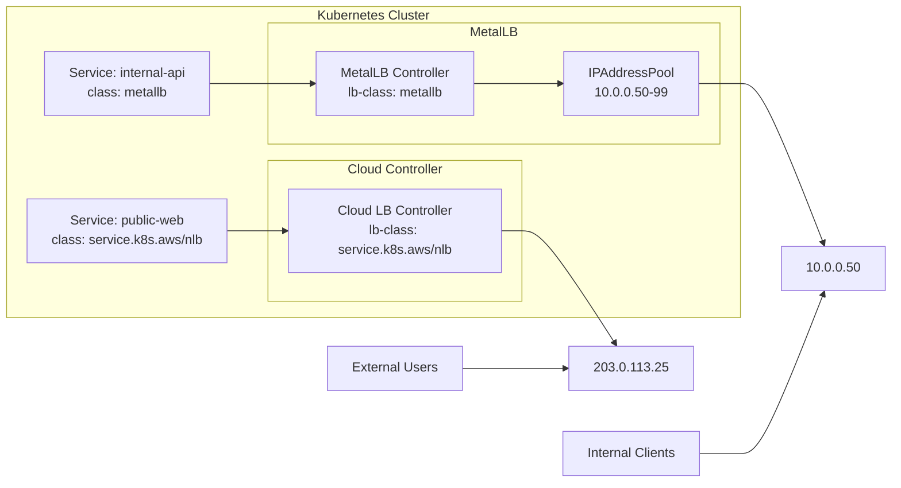

# How to Set the LoadBalancerClass in MetalLB for Multi-LB Coexistence

Author: [nawazdhandala](https://www.github.com/nawazdhandala)

Tags: Kubernetes, MetalLB, LoadBalancerClass, Load Balancing, Multi-Controller

Description: Learn how to use the LoadBalancerClass field to run MetalLB alongside other load balancer controllers in the same Kubernetes cluster without conflicts.

---

> Running multiple load balancer controllers in a single Kubernetes cluster is more common than you might think. Cloud-managed LBs for public traffic, MetalLB for internal services, or even two MetalLB instances for network isolation. The `LoadBalancerClass` field makes this possible without conflicts.

When you deploy a `Service` of type `LoadBalancer` in Kubernetes, every load balancer controller in the cluster will try to reconcile it. Without a way to claim ownership, controllers fight over the same services. The `spec.loadBalancerClass` field, introduced as stable in Kubernetes v1.24, solves this by letting each controller only handle services explicitly assigned to it.

---

## What Is LoadBalancerClass?

The `loadBalancerClass` field is part of the Service spec. It works like `ingressClassName` for Ingress resources. Each load balancer controller registers a class name, and it only processes services that match its class.



Without this field, every controller watches every `LoadBalancer` service and may attempt to provision resources for it. This leads to duplicated external IPs, status conflicts, and unpredictable behavior.

---

## Why You Need It for Multi-LB Setups

There are several scenarios where multiple load balancer controllers coexist in a single cluster:

1. **Hybrid clusters** - A cluster running on bare metal but also connected to a cloud provider. Cloud LBs handle public ingress while MetalLB serves internal traffic.
2. **Network segmentation** - Different MetalLB instances manage separate VLANs or subnets.
3. **Migration** - Gradually moving from one LB solution to another without downtime.
4. **Testing** - Running a new controller alongside the existing one before cutting over.

Without `loadBalancerClass`, both controllers will race to fulfill every `LoadBalancer` service. The result is unpredictable: one controller might provision an IP, and then the other overwrites the status. Services flap between IPs and monitoring alerts fire nonstop.



Setting `loadBalancerClass` eliminates this. Each controller only acts on services it owns.

---

## Configuring MetalLB with a LoadBalancerClass

MetalLB supports `loadBalancerClass` starting from version 0.13.2. You configure it in the MetalLB Helm chart values or directly in the controller deployment arguments.

### Option 1: Helm Values

If you deploy MetalLB with Helm, set the class in your values file:

```yaml
# values-metallb.yaml
# Configure MetalLB to only handle services with this specific class
# Services without this class will be ignored by MetalLB
controller:
  # The loadBalancerClass tells MetalLB to only reconcile
  # services whose spec.loadBalancerClass matches this value
  loadBalancerClass: "metallb"
```

Then install or upgrade MetalLB:

```bash
# Install MetalLB with the custom loadBalancerClass configuration
# The --namespace flag ensures all MetalLB resources land in the correct namespace
helm upgrade --install metallb metallb/metallb \
  --namespace metallb-system \
  --create-namespace \
  -f values-metallb.yaml
```

### Option 2: Controller Argument

If you manage MetalLB manifests directly, add the `--lb-class` flag to the controller deployment:

```yaml
# metallb-controller-deployment.yaml
apiVersion: apps/v1
kind: Deployment
metadata:
  name: controller
  namespace: metallb-system
spec:
  selector:
    matchLabels:
      app: metallb
      component: controller
  template:
    metadata:
      labels:
        app: metallb
        component: controller
    spec:
      containers:
        - name: controller
          image: quay.io/metallb/controller:v0.14.9
          args:
            # This argument restricts MetalLB to only process services
            # with spec.loadBalancerClass set to "metallb"
            - --lb-class=metallb
            # Standard port for health and metrics endpoints
            - --port=7472
            - --log-level=info
```

After applying this, MetalLB will ignore any `LoadBalancer` service that does not have `spec.loadBalancerClass: metallb`.

---

## Setting Up the IP Address Pool

The IP address pool configuration stays the same regardless of whether you use a `loadBalancerClass`. Define the pool of addresses MetalLB can assign:

```yaml
# ip-address-pool.yaml
apiVersion: metallb.io/v1beta1
kind: IPAddressPool
metadata:
  name: internal-pool
  namespace: metallb-system
spec:
  # Define the range of IPs MetalLB can hand out
  # Use CIDR notation or explicit ranges
  addresses:
    - 10.0.0.50-10.0.0.99    # 50 IPs for internal services
    - 192.168.1.240/28        # Additional block if needed
  # Prevent MetalLB from auto-assigning IPs from this pool
  # unless explicitly requested via annotation
  autoAssign: true
---
# L2 advertisement makes MetalLB respond to ARP requests for assigned IPs
# This is the simplest mode and works on any Layer 2 network
apiVersion: metallb.io/v1beta1
kind: L2Advertisement
metadata:
  name: internal-l2
  namespace: metallb-system
spec:
  # Tie this advertisement to the specific pool above
  ipAddressPools:
    - internal-pool
```

Apply the pool:

```bash
# Create the IP pool and L2 advertisement resources
kubectl apply -f ip-address-pool.yaml
```

---

## Creating Services That Target MetalLB

Now that MetalLB is configured with a class, you must set `spec.loadBalancerClass` on every service you want MetalLB to handle.

### Service Targeting MetalLB

```yaml
# service-internal-api.yaml
apiVersion: v1
kind: Service
metadata:
  name: internal-api
  namespace: default
  annotations:
    # Optional: request a specific IP from the pool
    metallb.universe.tf/address-pool: internal-pool
spec:
  # This field is the key - it tells Kubernetes that only the controller
  # registered with class "metallb" should provision this service
  loadBalancerClass: metallb
  type: LoadBalancer
  selector:
    app: internal-api
  ports:
    - name: http
      protocol: TCP
      port: 80           # External port
      targetPort: 8080    # Container port
```

### Service Targeting a Cloud Load Balancer

A service intended for the cloud provider's load balancer would either use a different class or omit the field entirely (depending on your cloud controller's configuration):

```yaml
# service-public-web.yaml
apiVersion: v1
kind: Service
metadata:
  name: public-web
  namespace: default
spec:
  # Use the cloud provider's LB class
  # This value depends on your cloud provider's controller
  loadBalancerClass: "service.k8s.aws/nlb"
  type: LoadBalancer
  selector:
    app: public-web
  ports:
    - name: https
      protocol: TCP
      port: 443
      targetPort: 8443
```

---

## Verifying the Setup

After deploying your services, confirm that each controller only provisioned its own services:

```bash
# List all LoadBalancer services and their assigned external IPs
# The EXTERNAL-IP column shows which controller responded
kubectl get svc -A --field-selector spec.type=LoadBalancer \
  -o custom-columns=\
NAMESPACE:.metadata.namespace,\
NAME:.metadata.name,\
CLASS:.spec.loadBalancerClass,\
EXTERNAL-IP:.status.loadBalancer.ingress[0].ip
```

Expected output:

```text
NAMESPACE   NAME            CLASS                  EXTERNAL-IP
default     internal-api    metallb                10.0.0.50
default     public-web      service.k8s.aws/nlb    203.0.113.25
```

If MetalLB is working correctly, only the `internal-api` service gets an IP from the MetalLB pool. The `public-web` service is handled entirely by the cloud controller.

---

## Full Architecture Overview

Here is how the complete setup looks with both controllers running side by side:



---

## Common Mistakes to Avoid

**Forgetting the class on the service.** If you configure MetalLB with `--lb-class=metallb` but create a service without `spec.loadBalancerClass`, MetalLB will ignore it. The service will stay in `Pending` state forever unless another controller picks it up.

**Mismatched class names.** The class string is case-sensitive. `MetalLB` and `metallb` are different values. Pick a convention and stick with it.

**Not upgrading MetalLB.** Versions before 0.13.2 do not support `loadBalancerClass`. Running an older version with the flag will have no effect, and MetalLB will continue to reconcile all services.

**Mixing annotations and class.** The `loadBalancerClass` field is a Kubernetes-native mechanism. The older `metallb.universe.tf/address-pool` annotation is for pool selection, not controller selection. They serve different purposes and both can be used together.

---

## Quick Troubleshooting Checklist

```bash
# 1. Check MetalLB controller logs for class filtering messages
kubectl logs -n metallb-system deploy/controller | grep -i "class"

# 2. Confirm MetalLB version supports loadBalancerClass (>= 0.13.2)
kubectl get deploy -n metallb-system controller \
  -o jsonpath='{.spec.template.spec.containers[0].image}'

# 3. Verify the service has the correct class set
kubectl get svc internal-api -o jsonpath='{.spec.loadBalancerClass}'

# 4. Check if the service got an external IP
kubectl get svc internal-api -o jsonpath='{.status.loadBalancer.ingress[0].ip}'

# 5. Inspect events for assignment or error messages
kubectl describe svc internal-api | grep -A5 "Events"
```

---

## Monitoring Your Load Balancers with OneUptime

Running multiple load balancer controllers increases the surface area for failures. A misconfigured class, an exhausted IP pool, or a crashed controller can silently break service connectivity. [OneUptime](https://oneuptime.com) helps you stay on top of these issues. You can set up monitors for each externally exposed service endpoint, track uptime across both your bare-metal and cloud load balancers, and get alerted the moment traffic stops flowing. With dashboards that show response times, availability, and incident history, you can catch LB misconfigurations before your users notice.
