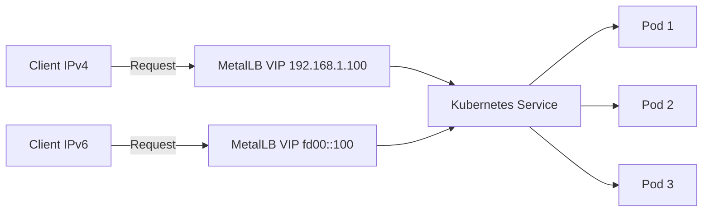
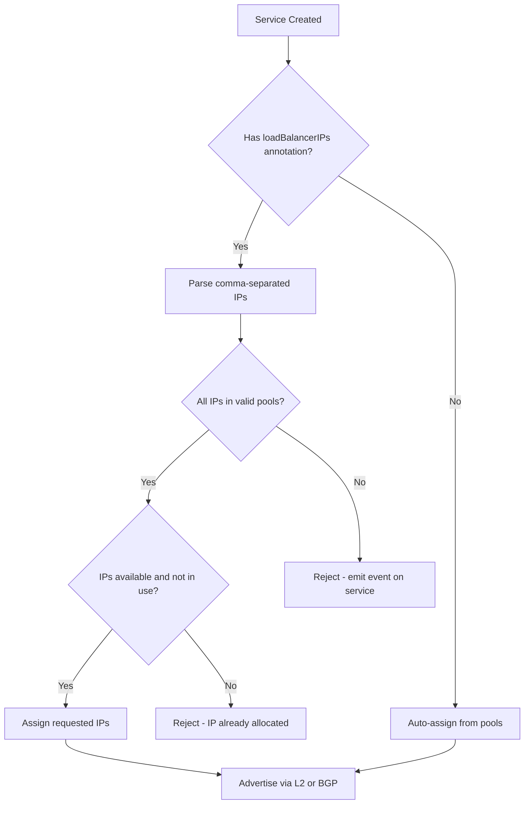

# How to Use the metallb.io/loadBalancerIPs Annotation for Dual-Stack

Author: [nawazdhandala](https://www.github.com/nawazdhandala)

Tags: Kubernetes, MetalLB, Dual Stack, Annotations, IPv6

Description: Learn how to use the metallb.io/loadBalancerIPs annotation to request specific IPv4 and IPv6 addresses for dual-stack LoadBalancer services.

---

When running dual-stack Kubernetes clusters with MetalLB, you often need to assign both an IPv4 and an IPv6 address to a single LoadBalancer service. The `metallb.io/loadBalancerIPs` annotation gives you precise control over which addresses MetalLB assigns. This post walks through how to use it correctly.

## Why You Need This Annotation

By default, MetalLB picks addresses from your configured IP pools automatically. In a dual-stack setup, you may want to pin specific addresses so that DNS records, firewall rules, and monitoring configurations remain stable across service restarts and upgrades.



## Prerequisites

Before using this annotation, make sure you have:

- A Kubernetes cluster with dual-stack networking enabled
- MetalLB v0.13 or later installed
- At least one IPv4 and one IPv6 address pool configured

## Configuring IP Address Pools

First, set up your address pools. You need separate pools for IPv4 and IPv6, or a single pool that includes both ranges.

```yaml
# ipaddresspool.yaml
# Defines the pool of IPv4 addresses MetalLB can assign
apiVersion: metallb.io/v1beta1
kind: IPAddressPool
metadata:
  name: ipv4-pool
  namespace: metallb-system
spec:
  addresses:
    # Range of IPv4 addresses available for LoadBalancer services
    - 192.168.1.100-192.168.1.200
---
# Defines the pool of IPv6 addresses MetalLB can assign
apiVersion: metallb.io/v1beta1
kind: IPAddressPool
metadata:
  name: ipv6-pool
  namespace: metallb-system
spec:
  addresses:
    # IPv6 subnet available for LoadBalancer services
    - fd00::100-fd00::200
```

Apply the pools:

```bash
# Apply both IP address pool definitions to the cluster
kubectl apply -f ipaddresspool.yaml
```

## Using the loadBalancerIPs Annotation

The `metallb.io/loadBalancerIPs` annotation accepts a comma-separated list of IP addresses. For dual-stack, you provide one IPv4 and one IPv6 address.

```yaml
# dual-stack-service.yaml
apiVersion: v1
kind: Service
metadata:
  name: my-web-app
  annotations:
    # Request specific IPv4 and IPv6 addresses from MetalLB
    # Both addresses must exist within configured IPAddressPools
    metallb.io/loadBalancerIPs: "192.168.1.150,fd00::150"
spec:
  # Enable dual-stack by specifying both IP families
  ipFamilyPolicy: RequireDualStack
  ipFamilies:
    - IPv4
    - IPv6
  type: LoadBalancer
  selector:
    app: my-web-app
  ports:
    - name: http
      port: 80
      targetPort: 8080
    - name: https
      port: 443
      targetPort: 8443
```

Apply the service:

```bash
# Create the dual-stack LoadBalancer service
kubectl apply -f dual-stack-service.yaml
```

## Verifying the Assignment

After applying, verify that both addresses were assigned:

```bash
# Check that the service received both IPv4 and IPv6 external IPs
kubectl get svc my-web-app -o wide
```

You should see output similar to:

```
NAME         TYPE           CLUSTER-IP      EXTERNAL-IP                  PORT(S)
my-web-app   LoadBalancer   10.96.100.50    192.168.1.150,fd00::150      80:31234/TCP,443:31235/TCP
```

You can also inspect the full service object:

```bash
# View the detailed service status including all assigned IPs
kubectl get svc my-web-app -o jsonpath='{.status.loadBalancer.ingress[*].ip}'
```

## How the Annotation Is Processed

Here is the flow MetalLB follows when it encounters this annotation:



## Common Mistakes

### Mistake 1: IP Not in Any Pool

If you request an IP that is not within any configured `IPAddressPool`, MetalLB will not assign it. The service stays in `Pending` state.

```bash
# Check events on the service for allocation errors
kubectl describe svc my-web-app | grep -A 5 Events
```

### Mistake 2: Forgetting ipFamilyPolicy

For dual-stack to work, you must set `ipFamilyPolicy: RequireDualStack` or `PreferDualStack`. Without it, Kubernetes only assigns a single-stack service.

```yaml
spec:
  # This field is required for dual-stack services
  # Use RequireDualStack to enforce both families
  # Use PreferDualStack to fall back to single-stack if needed
  ipFamilyPolicy: RequireDualStack
  ipFamilies:
    - IPv4
    - IPv6
```

### Mistake 3: Duplicate IP Assignment

Each IP can only be assigned to one service at a time. If another service already holds the IP, MetalLB rejects the request.

```bash
# Find which service is using a specific IP
kubectl get svc -A -o json | jq -r '
  .items[] |
  select(.status.loadBalancer.ingress != null) |
  select(.status.loadBalancer.ingress[].ip == "192.168.1.150") |
  "\(.metadata.namespace)/\(.metadata.name)"
'
```

## Migrating from the Deprecated Annotation

If you are using the older `metallb.universe.tf/loadBalancerIPs` annotation, migrate to the new `metallb.io/loadBalancerIPs` annotation. The old annotation is deprecated since MetalLB v0.13.

```yaml
# Old (deprecated) - do not use
# metallb.universe.tf/loadBalancerIPs: "192.168.1.150"

# New (current) - use this instead
metallb.io/loadBalancerIPs: "192.168.1.150,fd00::150"
```

## Testing Connectivity

After the IPs are assigned, test both stacks:

```bash
# Test IPv4 connectivity to the service
curl -4 http://192.168.1.150

# Test IPv6 connectivity to the service
curl -6 http://[fd00::150]
```

## Monitoring with OneUptime

Once your dual-stack MetalLB services are running, you need reliable monitoring to detect when IP assignments change or services become unreachable. [OneUptime](https://oneuptime.com) can monitor both IPv4 and IPv6 endpoints, alert you when services go down, and provide status pages for your infrastructure. This ensures your dual-stack services remain accessible on both protocol families at all times.
