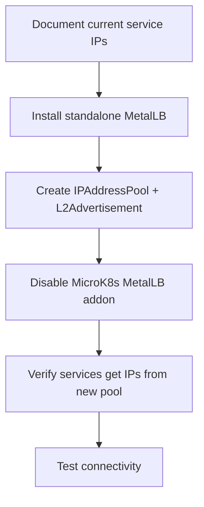

# How to Install MetalLB on MicroK8s Without Breaking Existing Services

Author: [nawazdhandala](https://www.github.com/nawazdhandala)

Tags: Kubernetes, MetalLB, MicroK8s, Load Balancing, Networking

Description: A step-by-step guide to installing MetalLB on MicroK8s without disrupting running services. Learn how to handle the built-in MetalLB addon, configure IP pools, and migrate services safely.

---

If you run MicroK8s in production - or even in a serious staging environment - you have probably hit the point where you need a real load balancer. MetalLB is the go-to solution for bare-metal Kubernetes clusters, but installing it on MicroK8s has a few sharp edges that can knock your running services offline if you are not careful.

This guide walks through the full process: understanding what MicroK8s gives you out of the box, deciding whether to use the addon or go standalone, and doing the switch without downtime.

## The Problem

MicroK8s ships with a built-in MetalLB addon. You can enable it with a single command and it works. But it has limitations. The addon bundles a specific version of MetalLB, and you do not get full control over the configuration. If you want to run a newer version, use BGP mode, or manage MetalLB through Helm and GitOps tooling, you need the standalone install.

The tricky part is that if you already have services running with the addon-managed MetalLB, switching over can cause IP assignments to drop. Services go from having an external IP to showing `<pending>` - and that means downtime.

## MicroK8s MetalLB Addon vs. Standalone MetalLB

Here is a quick comparison to help you decide which path makes sense.

| Feature | MicroK8s Addon | Standalone MetalLB |
|---|---|---|
| Installation | `microk8s enable metallb` | Helm chart or manifests |
| Version control | Tied to MicroK8s release | You pick the version |
| BGP support | Limited | Full support |
| Configuration | Basic IP range on enable | Full CRD-based config |
| GitOps friendly | Not really | Yes |
| Multi-pool support | Limited | Full support |
| Upgrades | Coupled to MicroK8s | Independent |

If you are just running a few services on a single node and do not need fine-grained control, the addon is fine. We covered that setup in our earlier post on [configuring MetalLB with MicroK8s](https://oneuptime.com/blog/post/2023-11-06-configure-metallb-with-kubernetes-microk8s/view). But if you need more flexibility, read on.

## How the Migration Works

Before we jump into commands, here is the high-level flow:



The key insight is that you install the new MetalLB first, then disable the addon. This minimizes the window where no load balancer is running.

## Step 1: Document Your Current State

Before changing anything, record what you have. You will need this to verify things after the migration.

```bash
# List all LoadBalancer services and their external IPs
# Save this output - you will compare against it later
kubectl get svc --all-namespaces -o wide | grep LoadBalancer
```

Save that output somewhere. Also grab the current MetalLB config if you have one:

```bash
# Check for existing IPAddressPool resources from the addon
kubectl get ipaddresspool -n metallb-system -o yaml

# Check for existing L2Advertisement resources
kubectl get l2advertisement -n metallb-system -o yaml
```

## Step 2: Check What the Addon Installed

The MicroK8s addon puts MetalLB components in the `metallb-system` namespace. Let us see what is running:

```bash
# See what pods the addon created
kubectl get pods -n metallb-system

# Check the MetalLB version the addon is using
kubectl get deployment controller -n metallb-system -o jsonpath='{.spec.template.spec.containers[0].image}'
```

You will typically see a `controller` deployment and a `speaker` daemonset. The addon may be running a version that is several releases behind the latest MetalLB.

## Step 3: Disable the MicroK8s MetalLB Addon

This is the step people get nervous about - and rightly so. Disabling the addon will remove the MetalLB components it manages. Any services relying on it will lose their external IPs temporarily.

To keep the disruption window as short as possible, we will do the disable and the standalone install back to back.

First, disable the addon:

```bash
# Disable the built-in MetalLB addon
# This removes the addon-managed controller and speaker pods
microk8s disable metallb
```

Verify it is gone:

```bash
# Confirm the metallb-system namespace is empty or removed
kubectl get pods -n metallb-system
```

You should see either no resources or the namespace itself being terminated.

## Step 4: Install Standalone MetalLB

Now install MetalLB using the official manifests. Using manifests gives you a reproducible setup that you can version-control.

```bash
# Create the namespace if it was removed
kubectl create namespace metallb-system --dry-run=client -o yaml | kubectl apply -f -

# Apply the official MetalLB manifests (use the version you want)
# Check https://metallb.universe.tf/installation/ for the latest version
kubectl apply -f https://raw.githubusercontent.com/metallb/metallb/v0.14.9/config/manifests/metallb-native.yaml
```

If you prefer Helm:

```bash
# Add the MetalLB Helm repo
helm repo add metallb https://metallb.github.io/metallb
helm repo update

# Install MetalLB into the metallb-system namespace
helm install metallb metallb/metallb \
  --namespace metallb-system \
  --create-namespace
```

Wait for everything to come up:

```bash
# Wait for the controller and speaker pods to be ready
# This usually takes 30-60 seconds
kubectl wait --namespace metallb-system \
  --for=condition=ready pod \
  --selector=app.kubernetes.io/name=metallb \
  --timeout=120s
```

## Step 5: Configure Your IP Address Pool

Now you need to tell MetalLB which IPs it can hand out. Create a file called `metallb-config.yaml`:

```yaml
# metallb-config.yaml
# This defines the pool of IPs MetalLB can assign to LoadBalancer services
apiVersion: metallb.io/v1beta1
kind: IPAddressPool
metadata:
  name: default-pool
  namespace: metallb-system
spec:
  addresses:
    # Single IP - useful when you have one public IP
    - 192.168.1.240/32
    # IP range - MetalLB will allocate from this range
    - 192.168.1.241-192.168.1.250
    # CIDR block - another way to specify a range
    # - 10.0.0.0/24
---
# L2Advertisement tells MetalLB to respond to ARP requests for the IPs
# This is what makes the IPs reachable on your local network
apiVersion: metallb.io/v1beta1
kind: L2Advertisement
metadata:
  name: default-l2
  namespace: metallb-system
spec:
  ipAddressPools:
    - default-pool
```

A few things to note about the IP pool:

- Use IPs that are on the same subnet as your nodes but outside the DHCP range
- If you were using specific IPs before, include them in the new pool so services get the same IPs back
- The `/32` suffix means a single IP address. Use ranges or CIDR blocks for multiple IPs

Apply the config:

```bash
# Apply the IP pool and L2 advertisement config
kubectl apply -f metallb-config.yaml

# Verify the resources were created
kubectl get ipaddresspool -n metallb-system
kubectl get l2advertisement -n metallb-system
```

## Step 6: Verify Your Services

At this point, MetalLB should start assigning IPs to any pending LoadBalancer services. Check:

```bash
# Check if services have external IPs again
kubectl get svc --all-namespaces | grep LoadBalancer
```

Compare this output with what you saved in Step 1. If an IP shows `<pending>`, it means MetalLB has not assigned an IP yet. Common reasons:

- The IP pool is exhausted (not enough IPs for all services)
- The L2Advertisement is missing or misconfigured
- MetalLB pods are not fully ready yet

If a service is stuck on `<pending>`, describe it to see events:

```bash
# Check events on a service that is not getting an IP
kubectl describe svc <service-name> -n <namespace>
```

## Step 7: Test Connectivity

Getting an IP assigned is only half the story. You need to verify traffic actually reaches your services.

```bash
# Quick connectivity test - replace with your service IP and port
curl -v http://<external-ip>:<port>/

# If you have a web service, check the response
curl -s -o /dev/null -w "%{http_code}" http://<external-ip>/
```

For a more thorough test, deploy a quick nginx service:

```yaml
# test-lb.yaml
# A simple test to verify MetalLB is handing out IPs and routing traffic
apiVersion: apps/v1
kind: Deployment
metadata:
  name: test-nginx
spec:
  replicas: 1
  selector:
    matchLabels:
      app: test-nginx
  template:
    metadata:
      labels:
        app: test-nginx
    spec:
      containers:
        - name: nginx
          image: nginx:alpine
          ports:
            - containerPort: 80
---
apiVersion: v1
kind: Service
metadata:
  name: test-nginx-lb
spec:
  type: LoadBalancer
  selector:
    app: test-nginx
  ports:
    - port: 80
      targetPort: 80
```

```bash
# Deploy the test service
kubectl apply -f test-lb.yaml

# Wait for the external IP to be assigned
kubectl get svc test-nginx-lb --watch

# Once you have an IP, test it
curl http://<assigned-ip>/

# Clean up after testing
kubectl delete -f test-lb.yaml
```

## Using Multiple IP Pools

One advantage of standalone MetalLB is proper multi-pool support. You might want separate pools for internal and external services:

```yaml
# multi-pool.yaml
apiVersion: metallb.io/v1beta1
kind: IPAddressPool
metadata:
  name: internal-pool
  namespace: metallb-system
spec:
  addresses:
    - 10.0.0.100-10.0.0.120
---
apiVersion: metallb.io/v1beta1
kind: IPAddressPool
metadata:
  name: external-pool
  namespace: metallb-system
spec:
  addresses:
    - 203.0.113.10-203.0.113.20
---
# Advertise both pools via L2
apiVersion: metallb.io/v1beta1
kind: L2Advertisement
metadata:
  name: all-pools
  namespace: metallb-system
spec:
  ipAddressPools:
    - internal-pool
    - external-pool
```

To assign a service to a specific pool, use an annotation:

```yaml
# Service using a specific IP pool
apiVersion: v1
kind: Service
metadata:
  name: my-service
  annotations:
    # Tell MetalLB to pick an IP from the external pool
    metallb.universe.tf/address-pool: external-pool
spec:
  type: LoadBalancer
  ports:
    - port: 443
      targetPort: 8443
  selector:
    app: my-app
```

## Common Pitfalls

Here are the things that trip people up most often:

### 1. Forgetting to create the L2Advertisement

The IPAddressPool alone is not enough. Without an L2Advertisement (or BGPAdvertisement), MetalLB knows the IPs but does not actually announce them on the network. Your services will get IPs assigned, but traffic will never reach them.

### 2. IP conflicts with DHCP

If your MetalLB IP range overlaps with your DHCP server's range, you will get intermittent connectivity issues that are painful to debug. Always use IPs outside the DHCP range, or better yet, create a static reservation on your router.

### 3. Firewall rules blocking ARP

MetalLB in L2 mode relies on ARP (Address Resolution Protocol) to work. If you have strict iptables rules or a firewall between your nodes and the rest of the network, ARP responses from the speaker pods might get dropped.

```bash
# Check if the MetalLB speaker is sending ARP responses
# Run this on a machine on the same network (not the node itself)
tcpdump -i <interface> arp | grep <metallb-ip>
```

### 4. Running the addon and standalone simultaneously

Do not do this. Having two MetalLB instances fighting over ARP responses causes unpredictable behavior. Always disable the addon before installing standalone MetalLB - or the other way around. Never run both.

### 5. Not checking MicroK8s-specific networking

MicroK8s uses its own CNI and networking stack. Make sure the MetalLB speaker pods can access the host network:

```bash
# Verify the speaker daemonset has hostNetwork enabled
kubectl get daemonset speaker -n metallb-system -o jsonpath='{.spec.template.spec.hostNetwork}'
# Should output: true
```

## Quick Reference: The Full Migration Sequence

Here is the complete sequence of commands for a migration, condensed:

```bash
# 1. Save current state
kubectl get svc --all-namespaces -o wide | grep LoadBalancer > /tmp/svc-before.txt

# 2. Disable the addon
microk8s disable metallb

# 3. Install standalone MetalLB
kubectl apply -f https://raw.githubusercontent.com/metallb/metallb/v0.14.9/config/manifests/metallb-native.yaml

# 4. Wait for pods
kubectl wait --namespace metallb-system \
  --for=condition=ready pod \
  --selector=app.kubernetes.io/name=metallb \
  --timeout=120s

# 5. Apply your IP pool config
kubectl apply -f metallb-config.yaml

# 6. Verify services have IPs
kubectl get svc --all-namespaces -o wide | grep LoadBalancer

# 7. Compare with saved state
diff /tmp/svc-before.txt <(kubectl get svc --all-namespaces -o wide | grep LoadBalancer)
```

## Monitoring Your Load Balancer

After the migration, you want to make sure MetalLB keeps working. Watch for services stuck in `<pending>` state, speaker pods crashing, or ARP issues causing connectivity drops. These problems do not always show up immediately - they can surface days later when a new service is deployed or a node reboots.

[OneUptime](https://oneuptime.com) can help here. You can set up monitors for your Kubernetes services to get alerted when an external IP becomes unreachable or when MetalLB pods go unhealthy. Catching these issues early is the difference between a quick fix and an outage.

## Wrapping Up

Migrating from the MicroK8s MetalLB addon to a standalone install is not complicated, but it does require a bit of planning. The biggest risk is the gap between disabling the addon and getting the standalone version configured. By documenting your current state, having your config files ready, and running the steps back to back, you can keep the disruption to a few minutes at most.

The payoff is worth it. You get full version control, proper multi-pool support, and a setup that plays nicely with Helm, ArgoCD, or whatever GitOps tooling you use. And if anything goes wrong, you can always re-enable the addon with `microk8s enable metallb` to get back to a working state while you debug.
