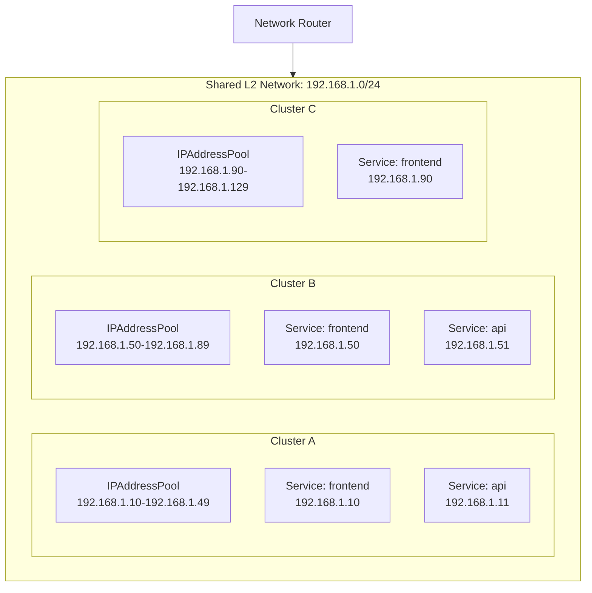
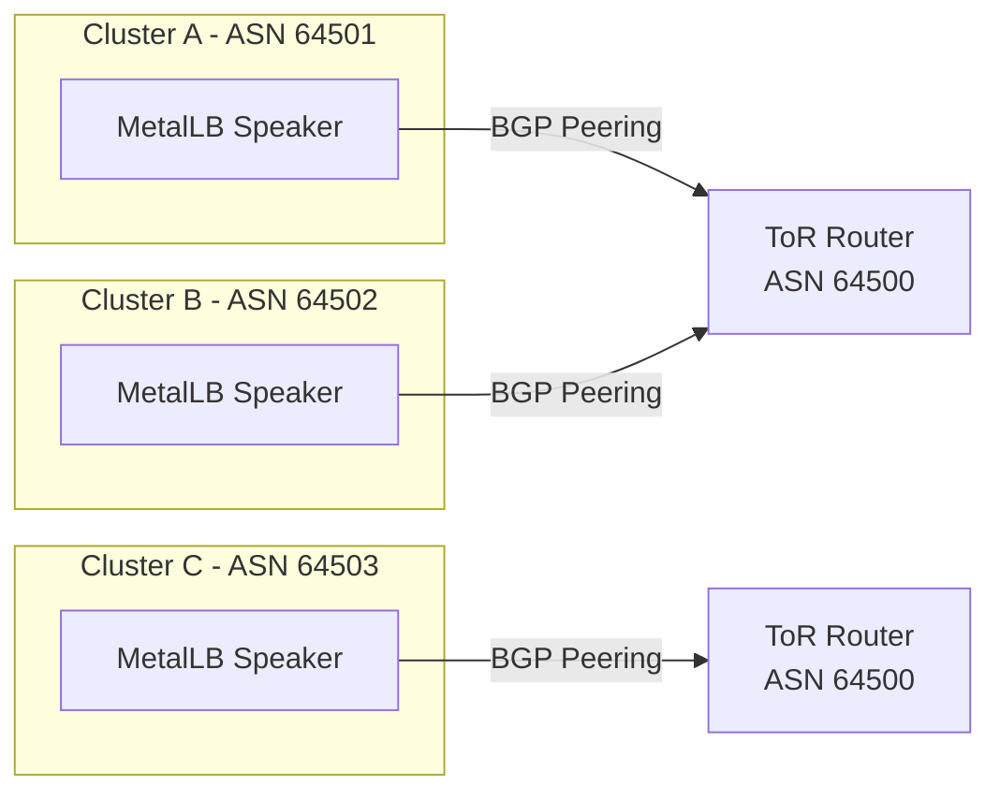

# How to Run MetalLB Across Multiple Clusters Without IP Conflicts

Author: [nawazdhandala](https://www.github.com/nawazdhandala)

Tags: Kubernetes, MetalLB, Multi-Cluster, IP Management, Networking

Description: Learn strategies for running MetalLB in multiple Kubernetes clusters while avoiding IP address conflicts and ensuring proper routing.

---

## The Multi-Cluster IP Challenge

When you run MetalLB on a single Kubernetes cluster, IP management is straightforward. You define one pool, and MetalLB assigns IPs from it. But when you run two, three, or ten clusters on the same network, you risk IP address collisions. Two clusters could assign the same IP to different services, causing ARP conflicts and unpredictable routing.

This post covers practical strategies for partitioning IP space, enforcing boundaries, and monitoring for conflicts across multiple MetalLB deployments.

## Architecture Overview



## Strategy 1: Static IP Range Partitioning

The simplest approach is to divide your available IP range into non-overlapping segments and assign one segment to each cluster. This requires upfront planning but eliminates conflicts entirely.

### Planning the Partition

```yaml
# ip-plan.yaml
# Central document tracking IP allocations per cluster
# Keep this in version control as the source of truth
clusters:
  cluster-a:
    location: "rack-1"
    metallb_range: "192.168.1.10-192.168.1.49"
    capacity: 40
  cluster-b:
    location: "rack-2"
    metallb_range: "192.168.1.50-192.168.1.89"
    capacity: 40
  cluster-c:
    location: "rack-3"
    metallb_range: "192.168.1.90-192.168.1.129"
    capacity: 40
  reserved:
    range: "192.168.1.130-192.168.1.254"
    purpose: "future clusters and infrastructure"
```

### Applying to Each Cluster

For Cluster A:

```yaml
# cluster-a/metallb-pool.yaml
# Pool definition for Cluster A - uses only its allocated range
apiVersion: metallb.io/v1beta1
kind: IPAddressPool
metadata:
  name: cluster-a-pool
  namespace: metallb-system
  labels:
    # Label helps identify which cluster owns this pool
    cluster: cluster-a
spec:
  addresses:
    - 192.168.1.10-192.168.1.49
  autoAssign: true
---
apiVersion: metallb.io/v1beta1
kind: L2Advertisement
metadata:
  name: cluster-a-l2
  namespace: metallb-system
spec:
  ipAddressPools:
    - cluster-a-pool
```

For Cluster B:

```yaml
# cluster-b/metallb-pool.yaml
# Pool definition for Cluster B - completely separate range
apiVersion: metallb.io/v1beta1
kind: IPAddressPool
metadata:
  name: cluster-b-pool
  namespace: metallb-system
  labels:
    cluster: cluster-b
spec:
  addresses:
    - 192.168.1.50-192.168.1.89
  autoAssign: true
---
apiVersion: metallb.io/v1beta1
kind: L2Advertisement
metadata:
  name: cluster-b-l2
  namespace: metallb-system
spec:
  ipAddressPools:
    - cluster-b-pool
```

## Strategy 2: CIDR-Based Partitioning

If you prefer working with CIDR notation, split a larger subnet into smaller blocks:

```yaml
# Using /26 subnets to partition a /24 network
# Each /26 provides 62 usable host addresses
apiVersion: metallb.io/v1beta1
kind: IPAddressPool
metadata:
  name: cluster-a-pool
  namespace: metallb-system
spec:
  addresses:
    # First /26 block: 192.168.1.1 - 192.168.1.62
    - 192.168.1.0/26
---
apiVersion: metallb.io/v1beta1
kind: IPAddressPool
metadata:
  name: cluster-b-pool
  namespace: metallb-system
spec:
  addresses:
    # Second /26 block: 192.168.1.65 - 192.168.1.126
    - 192.168.1.64/26
```

## Strategy 3: BGP with Per-Cluster ASN

When using BGP mode, assign each cluster its own ASN (Autonomous System Number). This lets your upstream routers distinguish announcements from different clusters:



Configure per-cluster BGP peers:

```yaml
# cluster-a/bgp-config.yaml
# Each cluster uses a unique ASN to avoid route confusion
apiVersion: metallb.io/v1beta2
kind: BGPPeer
metadata:
  name: router-peer
  namespace: metallb-system
spec:
  # Unique ASN for this cluster
  myASN: 64501
  # Upstream router ASN
  peerASN: 64500
  peerAddress: 10.0.0.1
  holdTime: 90s
  keepaliveTime: 30s
---
apiVersion: metallb.io/v1beta1
kind: BGPAdvertisement
metadata:
  name: cluster-a-bgp-adv
  namespace: metallb-system
spec:
  ipAddressPools:
    - cluster-a-pool
  # Add community strings for route filtering
  communities:
    - cluster-a-community
---
apiVersion: metallb.io/v1beta1
kind: Community
metadata:
  name: cluster-a-community
  namespace: metallb-system
spec:
  communities:
    - name: cluster-a-routes
      # Standard community format: ASN:value
      value: "64501:100"
```

## Detecting IP Conflicts

Even with careful planning, mistakes happen. Use this script to scan for duplicate ARP entries across your network:

```bash
#!/bin/bash
# detect-ip-conflicts.sh
# Scans the network for duplicate MAC addresses on the same IP
# Run this from a machine on the shared network segment

SUBNET="192.168.1"

echo "Scanning for IP conflicts in ${SUBNET}.0/24..."

for i in $(seq 1 254); do
    IP="${SUBNET}.${i}"
    # Send ARP request and capture responses
    arping -c 2 -w 1 -I eth0 "$IP" 2>/dev/null | grep -q "Received 2"
    if [ $? -eq 0 ]; then
        # Multiple responses indicate a conflict
        echo "CONFLICT DETECTED: ${IP}"
        arping -c 2 -w 1 -I eth0 "$IP" 2>/dev/null
    fi
done

echo "Scan complete."
```

## Monitoring IP Pool Usage

Track how many IPs each cluster has consumed to avoid exhaustion:

```bash
#!/bin/bash
# check-pool-usage.sh
# Reports MetalLB IP pool utilization for a given cluster

# Count services with assigned external IPs
USED=$(kubectl get svc -A \
  -o jsonpath='{.items[?(@.spec.type=="LoadBalancer")].status.loadBalancer.ingress[0].ip}' \
  | tr ' ' '\n' | sort -u | wc -l)

# Count total IPs in the pool
TOTAL=$(kubectl get ipaddresspool -n metallb-system -o json \
  | jq -r '.items[].spec.addresses[]' \
  | while read range; do
      # Parse start and end of range
      START=$(echo "$range" | cut -d'-' -f1 | awk -F. '{print $4}')
      END=$(echo "$range" | cut -d'-' -f2 | awk -F. '{print $4}')
      echo $(( END - START + 1 ))
    done \
  | paste -sd+ | bc)

echo "Pool usage: ${USED} / ${TOTAL} IPs assigned"

# Alert if usage exceeds 80%
THRESHOLD=80
PERCENT=$(( USED * 100 / TOTAL ))
if [ "$PERCENT" -ge "$THRESHOLD" ]; then
    echo "WARNING: Pool usage at ${PERCENT}% - consider expanding the range"
fi
```

## GitOps-Friendly IP Management

Store all cluster IP allocations in a single Git repository to prevent drift:

```
infra-repo/
  clusters/
    cluster-a/
      metallb-pool.yaml
      metallb-advertisement.yaml
    cluster-b/
      metallb-pool.yaml
      metallb-advertisement.yaml
    cluster-c/
      metallb-pool.yaml
      metallb-advertisement.yaml
  ip-plan.yaml        # Central allocation document
  validate-ranges.sh  # CI script to check for overlaps
```

### CI Validation Script

```python
#!/usr/bin/env python3
"""
validate_ranges.py
Checks all MetalLB pool definitions for overlapping IP ranges.
Run this in CI to catch conflicts before they reach production.
"""

import ipaddress
import yaml
import sys
import glob

def parse_range(addr_str):
    """Convert a MetalLB address string to a list of IPs."""
    if "/" in addr_str:
        # CIDR notation
        return list(ipaddress.ip_network(addr_str, strict=False).hosts())
    elif "-" in addr_str:
        # Range notation like 192.168.1.10-192.168.1.49
        start_str, end_str = addr_str.split("-")
        start = ipaddress.ip_address(start_str.strip())
        end = ipaddress.ip_address(end_str.strip())
        return [
            ipaddress.ip_address(int(start) + i)
            for i in range(int(end) - int(start) + 1)
        ]
    else:
        # Single IP
        return [ipaddress.ip_address(addr_str)]

def main():
    all_pools = {}
    # Find all MetalLB pool files across cluster directories
    for filepath in glob.glob("clusters/*/metallb-pool.yaml"):
        cluster = filepath.split("/")[1]
        with open(filepath) as f:
            docs = list(yaml.safe_load_all(f))
        ips = set()
        for doc in docs:
            if doc and doc.get("kind") == "IPAddressPool":
                for addr in doc["spec"]["addresses"]:
                    ips.update(parse_range(addr))
        all_pools[cluster] = ips

    # Check each pair of clusters for overlaps
    clusters = list(all_pools.keys())
    conflicts = False
    for i in range(len(clusters)):
        for j in range(i + 1, len(clusters)):
            overlap = all_pools[clusters[i]] & all_pools[clusters[j]]
            if overlap:
                conflicts = True
                print(
                    f"CONFLICT: {clusters[i]} and {clusters[j]} "
                    f"share {len(overlap)} IPs: "
                    f"{sorted(overlap)[:5]}..."
                )

    if conflicts:
        sys.exit(1)
    else:
        print("No IP conflicts found across all clusters.")

if __name__ == "__main__":
    main()
```

## Summary

Running MetalLB across multiple clusters on the same network requires deliberate IP space partitioning. Whether you use static range splits, CIDR blocks, or per-cluster BGP ASNs, the key is to maintain a single source of truth for IP allocations and validate it in CI.

To monitor the health and availability of services across all your clusters, [OneUptime](https://oneuptime.com) provides unified monitoring, alerting, and status pages that give you visibility into every cluster from a single dashboard.
