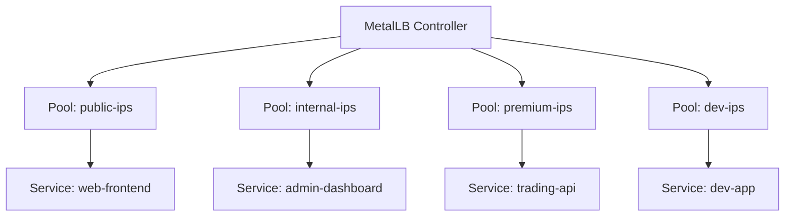
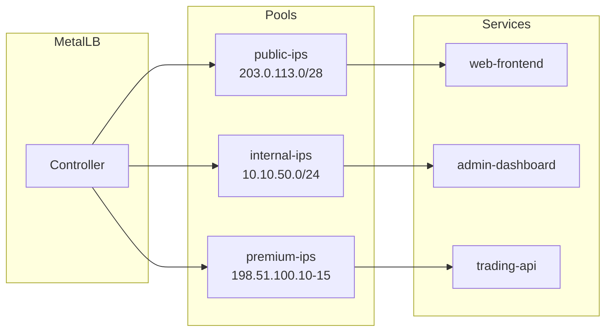

# How to Define Multiple IP Address Pools in MetalLB

Author: [nawazdhandala](https://www.github.com/nawazdhandala)

Tags: Kubernetes, MetalLB, IP Pools, IPAddressPool, Configuration

Description: Learn how to define and manage multiple IP address pools in MetalLB for different service tiers, environments, or network segments.

---

> In production Kubernetes clusters, a single IP address pool rarely fits all needs. You may have public IPs for customer-facing services, private IPs for internal tools, and a premium block for latency-sensitive workloads. MetalLB lets you define multiple IPAddressPool resources so each class of service gets the right address from the right range.

This guide walks through creating, organizing, and assigning multiple IP pools in MetalLB so your network topology stays clean and predictable.

---

## Why Multiple Pools

A single flat pool works for small clusters, but real-world deployments often need segmentation:

| Use Case | Pool Example | Reason |
|----------|-------------|--------|
| Public services | 203.0.113.0/28 | Internet-routable IPs |
| Internal tools | 10.10.50.0/24 | Private network only |
| Premium tier | 198.51.100.10-198.51.100.15 | Low-latency, limited supply |
| Development | 192.168.200.0/24 | Sandbox addresses |



---

## Creating Your First Pool

Start with the most common pool - public-facing IPs that MetalLB can hand out to any LoadBalancer service.

```yaml
# pool-public.yaml
# Public IP pool for internet-facing services
apiVersion: metallb.io/v1beta1
kind: IPAddressPool
metadata:
  # Descriptive name helps operators identify the pool's purpose
  name: public-ips
  # All MetalLB resources live in the metallb-system namespace
  namespace: metallb-system
spec:
  addresses:
    # CIDR block of 16 public IPs
    - 203.0.113.0/28
```

Apply it:

```bash
# Create the public IP pool in the cluster
kubectl apply -f pool-public.yaml
```

---

## Adding an Internal Pool

Internal services should not consume public IPs. Create a separate pool scoped to your private network.

```yaml
# pool-internal.yaml
# Private IP pool for cluster-internal services
apiVersion: metallb.io/v1beta1
kind: IPAddressPool
metadata:
  name: internal-ips
  namespace: metallb-system
spec:
  addresses:
    # Private range for internal tooling
    - 10.10.50.0/24
```

---

## Adding a Premium Pool

Premium pools hold a small number of high-value IPs. You will usually want to disable automatic assignment on these so they are only used when explicitly requested.

```yaml
# pool-premium.yaml
# Premium pool - only assigned when a service explicitly requests it
apiVersion: metallb.io/v1beta1
kind: IPAddressPool
metadata:
  name: premium-ips
  namespace: metallb-system
spec:
  addresses:
    # Only six IPs in this range
    - 198.51.100.10-198.51.100.15
  # Prevent MetalLB from handing these out automatically
  autoAssign: false
```

---

## Requesting a Specific Pool From a Service

When a service needs an IP from a particular pool, annotate it with the pool name.

```yaml
# service-trading.yaml
# Service that explicitly requests an IP from the premium pool
apiVersion: v1
kind: Service
metadata:
  name: trading-api
  annotations:
    # Tell MetalLB to allocate from the premium-ips pool
    metallb.universe.tf/address-pool: premium-ips
spec:
  type: LoadBalancer
  selector:
    # Match pods labeled app=trading-api
    app: trading-api
  ports:
    - port: 443
      targetPort: 8443
      protocol: TCP
```

---

## Verifying Pool Allocation

After creating services, confirm which pool each IP came from.

```bash
# List all LoadBalancer services and their external IPs
kubectl get svc -A -o wide | grep LoadBalancer

# Inspect a specific service to see the assigned IP and annotations
kubectl describe svc trading-api

# Check MetalLB controller logs for allocation decisions
kubectl logs -n metallb-system -l app=metallb,component=controller | grep "assigned"
```

---

## Full Architecture Diagram



---

## Allocation Precedence

When a service does not specify a pool, MetalLB picks the first pool (alphabetically by name) that has available addresses and where `autoAssign` is not `false`. Keep this in mind when naming pools:

1. Pools with `autoAssign: false` are skipped for unannotated services.
2. Among eligible pools, alphabetical order of the pool name determines priority.
3. If no eligible pool has free addresses, the service stays in `Pending` state.

---

## Common Mistakes

| Mistake | Symptom | Fix |
|---------|---------|-----|
| Overlapping CIDRs across pools | Unpredictable assignment | Ensure every IP appears in only one pool |
| Forgetting `autoAssign: false` on premium pools | Expensive IPs consumed by random services | Set `autoAssign: false` on limited pools |
| Mismatched namespace | Pool not found by MetalLB | Always use `metallb-system` namespace |
| No L2Advertisement or BGPAdvertisement | IP assigned but unreachable | Create a matching advertisement resource |

---

## Cleanup

Remove pools you no longer need:

```bash
# Delete a specific IP address pool
kubectl delete ipaddresspool premium-ips -n metallb-system

# Verify remaining pools
kubectl get ipaddresspool -n metallb-system
```

---

## Wrapping Up

Multiple IP pools let you segment your network cleanly - public versus private, premium versus default, production versus development. Pair each pool with the right advertisement strategy and you get a predictable, auditable IP allocation system.

If you need to monitor which services are using which pools and get alerted when a pool is running low, **[OneUptime](https://oneuptime.com)** can track your Kubernetes infrastructure and notify your team before you run out of addresses.
