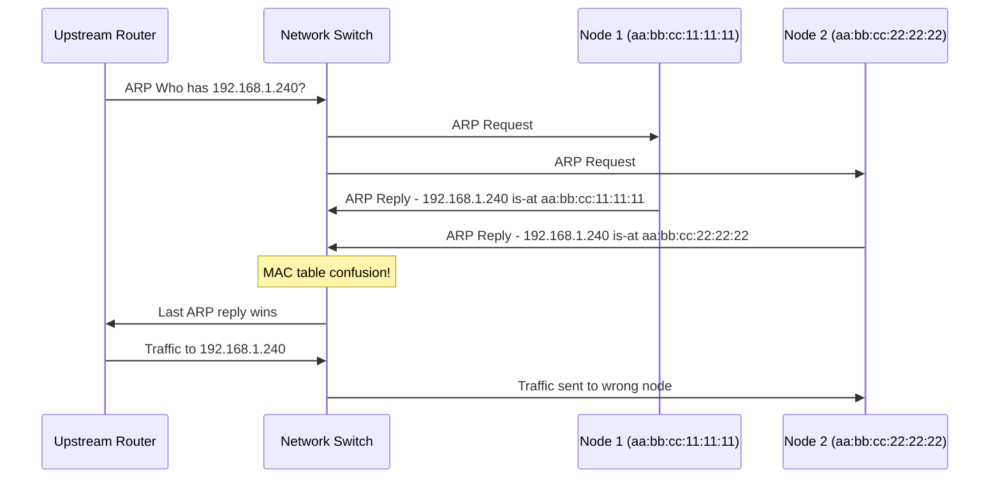
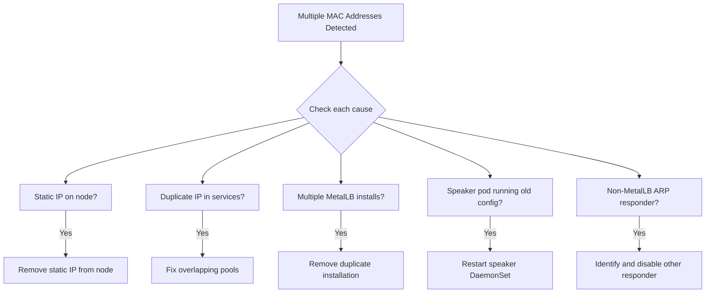

# How to Fix MetalLB Multiple MAC Addresses for the Same LB IP

Author: [nawazdhandala](https://www.github.com/nawazdhandala)

Tags: Kubernetes, MetalLB, MAC Address, Layer 2, Troubleshooting

Description: Learn how to fix the issue of multiple nodes advertising the same MetalLB LoadBalancer IP with different MAC addresses.

---

One of the most confusing MetalLB Layer 2 issues is when multiple nodes respond to ARP requests for the same LoadBalancer IP, each with a different MAC address. This causes upstream switches and routers to flip-flop between MAC addresses, resulting in packet loss, connection resets, and unpredictable routing. This guide explains why this happens and how to fix it.

## Understanding the Problem

In Layer 2 mode, MetalLB assigns exactly one speaker as the leader for each LoadBalancer IP. Only that speaker should respond to ARP requests. When multiple speakers respond, the network sees conflicting ARP replies, and traffic gets split between nodes.



## Diagnosing the Problem

### Step 1: Check ARP Responses on the Network

From any machine on the same L2 network, capture ARP traffic for the LoadBalancer IP:

```bash
# Capture ARP responses for the LoadBalancer IP
# If you see more than one MAC address replying, you have the problem
sudo tcpdump -i eth0 arp -nn -e \
  | grep "192.168.1.240"

# Example output showing the problem:
# aa:bb:cc:11:11:11 > ff:ff:ff:ff:ff:ff, ARP, Reply 192.168.1.240 is-at aa:bb:cc:11:11:11
# aa:bb:cc:22:22:22 > ff:ff:ff:ff:ff:ff, ARP, Reply 192.168.1.240 is-at aa:bb:cc:22:22:22
```

### Step 2: Use arping to Detect Multiple Responders

```bash
# Send ARP requests and check for multiple replies
# The -D flag does duplicate address detection
# Multiple replies confirm the multi-MAC problem
sudo arping -I eth0 192.168.1.240 -c 5

# More explicit: request ARP and show all responses
# Each response line shows the MAC address of the responder
sudo arping -I eth0 -b 192.168.1.240 -c 10
```

### Step 3: Check MetalLB Speaker Leader Election

```bash
# Check which speaker thinks it is the leader for the service
# Only one speaker should show "announcing" for each service
kubectl logs -n metallb-system \
  -l component=speaker \
  --all-containers \
  --timestamps \
  | grep "announcing\|handling\|service"

# Check the speaker leader election status
# Each service should have exactly one leader
kubectl get endpoints -n metallb-system \
  -o yaml | grep -A 5 "leader"
```

## Common Causes and Fixes

### Cause 1: The Node Has the IP Configured Outside MetalLB

If the LoadBalancer IP is also configured as a static IP on one of the nodes, that node will always respond to ARP requests, regardless of MetalLB's leader election.

```bash
# Check if any node has the LoadBalancer IP configured as a local address
# Run on each node in the cluster
ip addr show | grep "192.168.1.240"

# If the IP appears on a node interface, remove it
# This IP should only be managed by MetalLB
sudo ip addr del 192.168.1.240/32 dev eth0
```

### Cause 2: Another Service Is Using the Same IP

If two different LoadBalancer services are assigned the same IP from overlapping pools, both speakers will respond.

```bash
# Check for duplicate IP assignments across services
# Each LoadBalancer IP should appear only once
kubectl get svc -A -o custom-columns=\
  NAMESPACE:.metadata.namespace,\
  NAME:.metadata.name,\
  EXTERNAL-IP:.status.loadBalancer.ingress[0].ip \
  | sort -k3 | uniq -d -f2

# Check for overlapping IP address pools
kubectl get ipaddresspool -n metallb-system -o yaml \
  | grep -A 5 "addresses"
```

```yaml
# Incorrect: overlapping pools
apiVersion: metallb.io/v1beta1
kind: IPAddressPool
metadata:
  name: pool-1
  namespace: metallb-system
spec:
  addresses:
    - 192.168.1.240-192.168.1.250  # Overlaps with pool-2!
---
apiVersion: metallb.io/v1beta1
kind: IPAddressPool
metadata:
  name: pool-2
  namespace: metallb-system
spec:
  addresses:
    - 192.168.1.245-192.168.1.255  # Overlaps with pool-1!
```

```yaml
# Correct: non-overlapping pools
apiVersion: metallb.io/v1beta1
kind: IPAddressPool
metadata:
  name: pool-1
  namespace: metallb-system
spec:
  addresses:
    - 192.168.1.240-192.168.1.249
---
apiVersion: metallb.io/v1beta1
kind: IPAddressPool
metadata:
  name: pool-2
  namespace: metallb-system
spec:
  addresses:
    - 192.168.1.250-192.168.1.255
```

### Cause 3: Multiple MetalLB Installations

If MetalLB is installed in more than one namespace or if a previous installation was not fully cleaned up, you can have two sets of speakers both trying to manage the same IPs.

```bash
# Check for MetalLB components in all namespaces
# There should be exactly one installation
kubectl get pods -A | grep -i "metallb\|speaker\|controller"

# Check for orphaned MetalLB resources
kubectl get all -A | grep metallb

# Check for leftover CRDs from a previous installation
kubectl get crd | grep metallb
```



### Cause 4: Stale Speaker State After Configuration Change

Sometimes after a configuration change, a speaker pod retains the old state and continues to announce an IP it should have released.

```bash
# Restart all speaker pods to clear stale state
# This forces all speakers to re-read the current configuration
kubectl rollout restart daemonset/speaker -n metallb-system

# Wait for the rollout to complete
kubectl rollout status daemonset/speaker -n metallb-system

# Verify only one speaker is announcing each service
kubectl logs -n metallb-system \
  -l component=speaker \
  --timestamps \
  | grep "announcing" \
  | sort -k2
```

## Verifying the Fix

After applying the fix, verify that only one MAC address responds to ARP for each LoadBalancer IP:

```bash
# Clear the ARP cache on your test machine
sudo ip neigh flush dev eth0

# Send ARP requests and verify single response
sudo arping -I eth0 192.168.1.240 -c 10

# All responses should show the same MAC address
# Monitor for 60 seconds to catch any delayed responses
sudo timeout 60 tcpdump -i eth0 \
  'arp and host 192.168.1.240' -nn -e 2>/dev/null \
  | grep "is-at" \
  | awk '{print $NF}' \
  | sort -u

# The output should show exactly one MAC address
```

## Conclusion

Multiple MAC addresses for the same LoadBalancer IP is a Layer 2 issue that causes unpredictable traffic routing. The five most common causes are: static IPs on nodes, overlapping IP pools, multiple MetalLB installations, stale speaker state, and non-MetalLB ARP responders. Diagnosing the issue requires capturing ARP traffic and checking MetalLB speaker logs to verify the leader election is working correctly.

For continuous monitoring of your MetalLB-exposed services, [OneUptime](https://oneuptime.com) can detect the symptoms of this problem - intermittent failures, increased latency, and connection resets - and alert you before your users are significantly impacted. OneUptime's external health checks verify service reachability from the perspective of your clients, catching Layer 2 issues that internal monitoring might miss.
