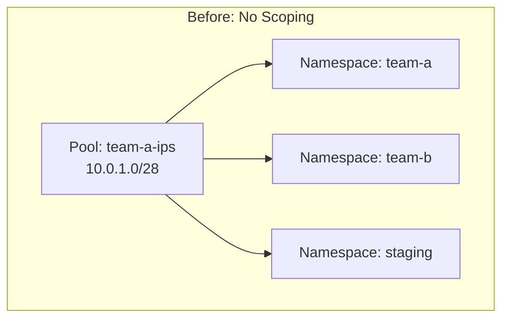
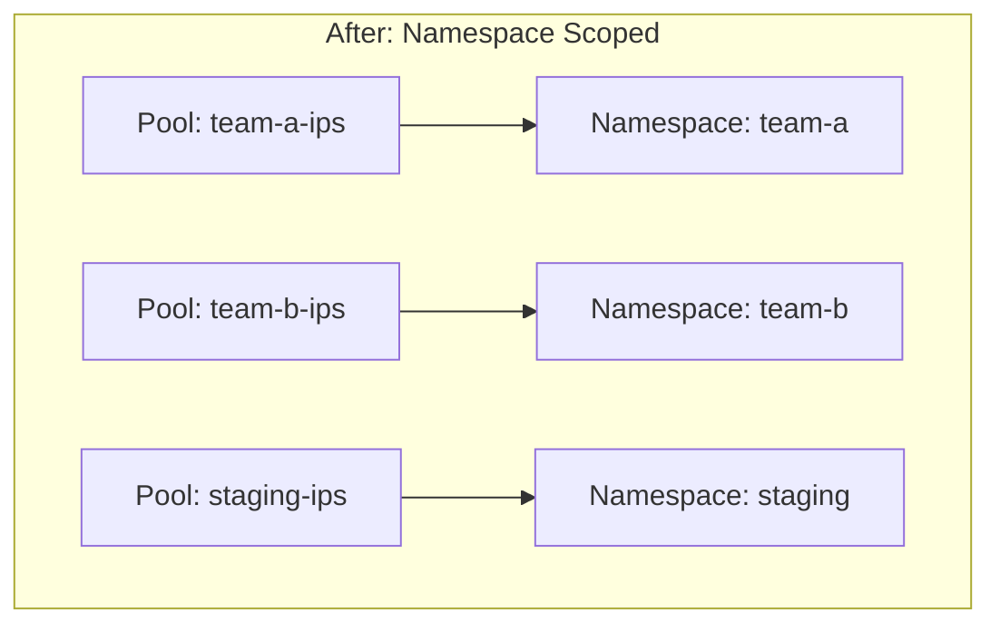
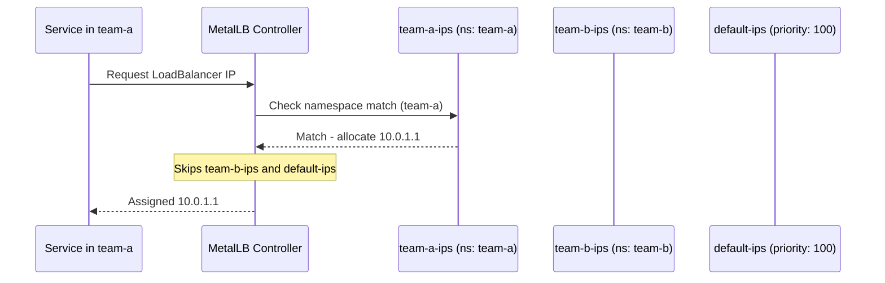

# How to Scope IPAddressPool Allocation to Specific Namespaces in MetalLB

Author: [nawazdhandala](https://www.github.com/nawazdhandala)

Tags: Kubernetes, MetalLB, Namespaces, IP Pools, Multi-tenancy

Description: Learn how to restrict MetalLB IP pool allocation to specific Kubernetes namespaces for multi-tenant IP address management.

---

> In multi-tenant Kubernetes clusters, different teams or environments share the same cluster but need isolation. MetalLB's namespace-based service selectors let you restrict which namespaces can draw IPs from a given pool, preventing one team from consuming another team's addresses.

This guide shows how to configure namespace-scoped pools using MetalLB's `serviceAllocation` feature and service selectors.

---

## Why Namespace Scoping

Without scoping, any namespace can consume IPs from any pool. In a shared cluster this causes problems:



| Problem | Impact |
|---------|--------|
| Team B deploys and grabs Team A's IPs | Team A runs out of addresses |
| Staging services consume production IPs | Production deployments fail |
| No accountability for IP usage | Billing and auditing become impossible |

---

## Architecture With Namespace Scoping



Each pool is locked to its target namespace. Services in other namespaces cannot draw from it.

---

## Using serviceAllocation with Namespace Selectors

MetalLB supports namespace-based allocation through the `serviceAllocation` field on the IPAddressPool resource:

```yaml
# pool-team-a.yaml
# IP pool restricted to the team-a namespace
apiVersion: metallb.io/v1beta1
kind: IPAddressPool
metadata:
  name: team-a-ips
  namespace: metallb-system
spec:
  addresses:
    # 16 IPs allocated to Team A
    - 10.0.1.0/28
  serviceAllocation:
    priority: 50
    namespaces:
      # Only services in the team-a namespace can use this pool
      - team-a
```

```yaml
# pool-team-b.yaml
# IP pool restricted to the team-b namespace
apiVersion: metallb.io/v1beta1
kind: IPAddressPool
metadata:
  name: team-b-ips
  namespace: metallb-system
spec:
  addresses:
    # 16 IPs allocated to Team B
    - 10.0.2.0/28
  serviceAllocation:
    priority: 50
    namespaces:
      # Only services in the team-b namespace can use this pool
      - team-b
```

---

## Adding a Fallback Pool

Create a catch-all pool for namespaces that do not have a dedicated pool:

```yaml
# pool-default.yaml
# Default pool for any namespace without a dedicated pool
apiVersion: metallb.io/v1beta1
kind: IPAddressPool
metadata:
  name: default-ips
  namespace: metallb-system
spec:
  addresses:
    # Large range for general use
    - 10.0.100.0/24
  serviceAllocation:
    # Lower priority number means higher priority
    # This pool is used only when no namespace-specific pool matches
    priority: 100
```

---

## Using Namespace Label Selectors

Instead of listing namespace names, you can use label selectors to match namespaces dynamically:

```yaml
# pool-production.yaml
# Pool that matches any namespace labeled environment=production
apiVersion: metallb.io/v1beta1
kind: IPAddressPool
metadata:
  name: production-ips
  namespace: metallb-system
spec:
  addresses:
    - 203.0.113.0/28
  serviceAllocation:
    priority: 10
    namespaceSelectors:
      - matchLabels:
          # Any namespace with this label gets access to this pool
          environment: production
```

Label your namespaces accordingly:

```bash
# Label the production namespaces
kubectl label namespace team-a environment=production
kubectl label namespace team-b environment=production

# Staging namespace gets a different label
kubectl label namespace staging environment=staging
```

---

## Allocation Flow



---

## Testing the Scoping

```bash
# Deploy a service in the frontend namespace
kubectl -n frontend expose deployment web --type=LoadBalancer --port=80

# Check that it got an IP from 10.0.10.0/28
kubectl -n frontend get svc web -o jsonpath='{.status.loadBalancer.ingress[0].ip}'

# Deploy a service in the backend namespace
kubectl -n backend expose deployment api --type=LoadBalancer --port=8080

# Check that it got an IP from 10.0.20.0/28
kubectl -n backend get svc api -o jsonpath='{.status.loadBalancer.ingress[0].ip}'
```

---

## Common Pitfalls

| Pitfall | Result | Fix |
|---------|--------|-----|
| Namespace not labeled | Service falls through to default pool | Add the correct labels |
| Typo in namespace name | Pool never matches | Verify with `kubectl get ns` |
| No default pool | Services in unlisted namespaces stay Pending | Create a catch-all pool with high priority number |
| Same priority on all pools | Undefined allocation order | Use distinct priority values |

---

## Wrapping Up

Namespace-scoped pools bring order to multi-tenant clusters. Each team gets its own IP range, billing stays clear, and accidental cross-team consumption is eliminated. Pair namespace selectors with RBAC to build a complete isolation story.

To monitor per-namespace IP usage and get alerts when a team's pool is nearing exhaustion, use **[OneUptime](https://oneuptime.com)** for Kubernetes-native observability.
