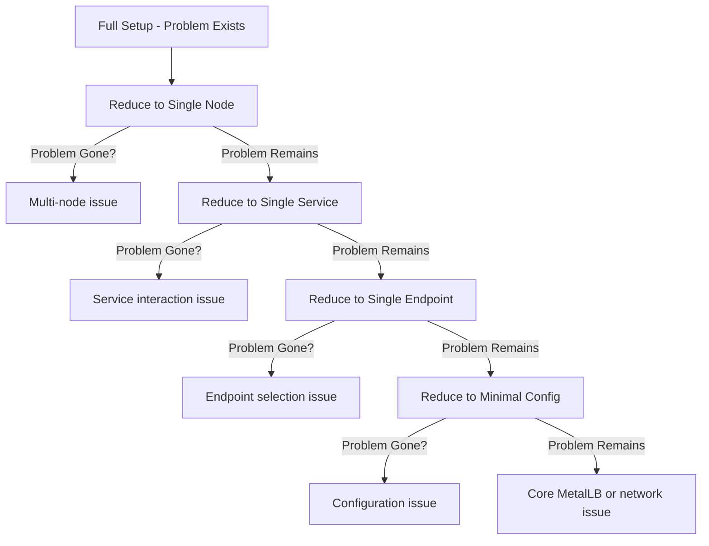
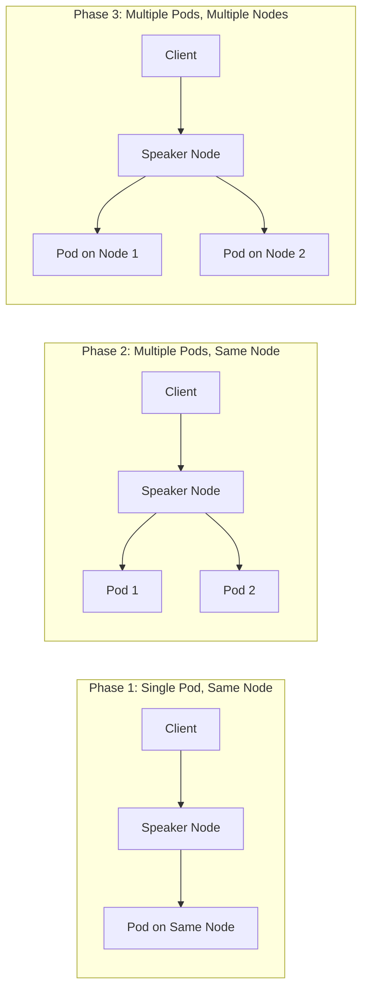

# How to Narrow Down MetalLB Issues by Limiting Nodes and Endpoints

Author: [nawazdhandala](https://www.github.com/nawazdhandala)

Tags: Kubernetes, MetalLB, Troubleshooting, Debugging, Methodology

Description: A systematic approach to narrowing down MetalLB issues by progressively limiting nodes, endpoints, and configuration.

---

When MetalLB is not working as expected, the most effective debugging strategy is to reduce the problem space. Instead of trying to fix everything at once, you progressively limit nodes, endpoints, services, and configuration until you isolate the exact cause. This is the same methodology used in binary search - cut the problem in half at each step.

This guide teaches you a structured narrowing-down technique that works for any MetalLB issue, whether it is Layer 2 or BGP mode.

## The Narrowing-Down Methodology

The core idea is simple: start with the full complex setup, then remove variables one at a time until the problem disappears. The last variable you removed is your culprit.



## Step 1: Document the Current State

Before changing anything, capture the full state of your MetalLB deployment. You will need this as a baseline.

```bash
# Capture the complete MetalLB configuration
# This includes all IP pools, L2 advertisements, and BGP configurations
kubectl get ipaddresspool -n metallb-system -o yaml > /tmp/metallb-pools.yaml
kubectl get l2advertisement -n metallb-system -o yaml > /tmp/metallb-l2.yaml
kubectl get bgpadvertisement -n metallb-system -o yaml > /tmp/metallb-bgp.yaml
kubectl get bgppeer -n metallb-system -o yaml > /tmp/metallb-peers.yaml

# Capture all LoadBalancer services and their current state
kubectl get svc -A --field-selector type=LoadBalancer -o wide > /tmp/lb-services.txt

# Capture all MetalLB speaker and controller logs
kubectl logs -n metallb-system -l component=speaker --all-containers --tail=200 > /tmp/speaker-logs.txt
kubectl logs -n metallb-system -l component=controller --all-containers --tail=200 > /tmp/controller-logs.txt
```

## Step 2: Limit to a Single Node

If you have multiple nodes, restrict MetalLB to operate on just one node. This eliminates cross-node networking as a variable.

```yaml
# node-selector-l2.yaml
# Restrict L2 advertisement to a single node using nodeSelectors
# This forces MetalLB to only announce from one specific node
apiVersion: metallb.io/v1beta1
kind: L2Advertisement
metadata:
  name: debug-l2
  namespace: metallb-system
spec:
  ipAddressPools:
    - debug-pool
  nodeSelectors:
    - matchLabels:
        kubernetes.io/hostname: worker-node-1
```

```bash
# Apply the restricted L2 advertisement
# This replaces any existing L2 advertisements temporarily
kubectl apply -f node-selector-l2.yaml

# Verify the speaker on worker-node-1 is the one announcing
kubectl logs -n metallb-system \
  -l component=speaker \
  --field-selector spec.nodeName=worker-node-1 \
  | grep "announcing"
```

Test whether the problem persists. If the problem goes away, you know the issue is related to a specific node or cross-node communication.

## Step 3: Limit to a Single Service

If you have many LoadBalancer services, create a new test service that is completely isolated from your production workloads.

```yaml
# test-deployment.yaml
# A minimal nginx deployment and service for testing MetalLB
# This isolates the problem from any application-specific issues
apiVersion: apps/v1
kind: Deployment
metadata:
  name: metallb-test
  namespace: default
spec:
  replicas: 1
  selector:
    matchLabels:
      app: metallb-test
  template:
    metadata:
      labels:
        app: metallb-test
    spec:
      # Pin to the same node we restricted MetalLB to
      # This eliminates cross-node pod networking as a variable
      nodeName: worker-node-1
      containers:
        - name: nginx
          image: nginx:alpine
          ports:
            - containerPort: 80
---
apiVersion: v1
kind: Service
metadata:
  name: metallb-test-svc
  namespace: default
spec:
  type: LoadBalancer
  # Use Local to keep traffic on the same node
  # This eliminates SNAT and cross-node forwarding
  externalTrafficPolicy: Local
  selector:
    app: metallb-test
  ports:
    - port: 80
      targetPort: 80
```

```bash
# Deploy the test workload
kubectl apply -f test-deployment.yaml

# Wait for the service to get an external IP
kubectl get svc metallb-test-svc -w

# Test connectivity to the new service
curl -v http://<EXTERNAL-IP>:80
```

## Step 4: Limit to a Single Endpoint

If the test service works with one pod, gradually add complexity. Scale up the deployment and see if the problem returns.

```bash
# Start with a single replica (already done above)
# Test connectivity multiple times to check consistency
for i in $(seq 1 20); do
  curl -s -o /dev/null -w "%{http_code}\n" http://<EXTERNAL-IP>:80
done

# Now scale to 2 replicas on the same node
kubectl scale deployment metallb-test --replicas=2

# Test again - if failures start, the issue is endpoint selection
for i in $(seq 1 20); do
  curl -s -o /dev/null -w "%{http_code}\n" http://<EXTERNAL-IP>:80
done

# Scale to 2 replicas across different nodes
# Remove the nodeName constraint first
kubectl patch deployment metallb-test \
  --type='json' \
  -p='[{"op": "remove", "path": "/spec/template/spec/nodeName"}]'
```



## Step 5: Limit the IP Pool

Create a minimal IP address pool with just one address to eliminate pool-related issues.

```yaml
# debug-pool.yaml
# A single-address pool for isolated testing
# Using a single IP eliminates pool exhaustion and overlap issues
apiVersion: metallb.io/v1beta1
kind: IPAddressPool
metadata:
  name: debug-pool
  namespace: metallb-system
spec:
  addresses:
    - 192.168.1.250/32  # Just one IP address
  autoAssign: true
```

```bash
# Apply the debug pool
kubectl apply -f debug-pool.yaml

# Delete and recreate the test service to pick up the new pool
kubectl delete svc metallb-test-svc
kubectl apply -f test-deployment.yaml
```

## Step 6: Compare Working and Broken Configurations

Once you find the boundary between working and broken, document exactly what changed. This diff is your root cause.

```bash
# Compare the working state with the broken state
# Use kubectl diff to see what changed in MetalLB resources
kubectl diff -f original-config.yaml

# Check MetalLB events for any errors during the transition
kubectl get events -n metallb-system \
  --sort-by=.metadata.creationTimestamp \
  | tail -20

# Compare speaker logs between the working and broken states
diff /tmp/speaker-logs-working.txt /tmp/speaker-logs-broken.txt
```

## Conclusion

The narrowing-down methodology is the most efficient way to debug MetalLB issues. By systematically removing variables - nodes, services, endpoints, and configuration - you can isolate the root cause in minutes instead of hours. Always start with the full broken state, document it, then reduce one dimension at a time.

The key takeaway is to never try to debug the full complex system at once. Simplify until it works, then add complexity back until it breaks. The transition point reveals the root cause.

For ongoing MetalLB health monitoring, consider using [OneUptime](https://oneuptime.com) to set up external health checks on your LoadBalancer services. OneUptime can continuously verify that your MetalLB-exposed services are reachable and alert you immediately when they stop responding, letting you start the narrowing-down process before your users notice.
