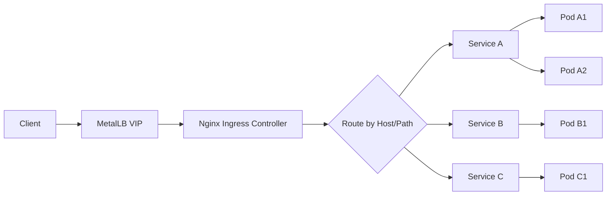
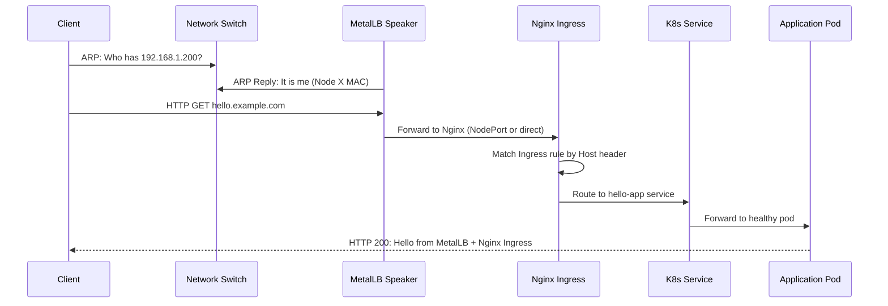

# How to Deploy MetalLB with Nginx Ingress Controller

Author: [nawazdhandala](https://www.github.com/nawazdhandala)

Tags: Kubernetes, MetalLB, Nginx, Ingress, Load Balancing

Description: Step-by-step guide to deploying MetalLB with the Nginx Ingress Controller for production-ready bare-metal ingress.

---

On cloud-managed Kubernetes, the Nginx Ingress Controller gets an external IP automatically from the cloud provider's load balancer. On bare metal, there is no cloud load balancer. MetalLB fills this gap by assigning an IP from a local pool to your Nginx Ingress Controller's LoadBalancer service.

This post walks you through deploying both MetalLB and the Nginx Ingress Controller on a bare-metal Kubernetes cluster.

## Architecture

Here is how traffic flows from the internet to your application through MetalLB and Nginx Ingress:



MetalLB advertises the VIP (Virtual IP) at the network level, and Nginx handles HTTP/HTTPS routing at the application level.

## Step 1: Install MetalLB

Install MetalLB using the official manifests:

```bash
# Install MetalLB v0.14.x
kubectl apply -f https://raw.githubusercontent.com/metallb/metallb/v0.14.9/config/manifests/metallb-native.yaml

# Wait for MetalLB pods to be ready
kubectl wait --namespace metallb-system \
  --for=condition=ready pod \
  --selector=app=metallb \
  --timeout=120s
```

## Step 2: Configure MetalLB IP Address Pool

Create an IP address pool that MetalLB can assign from. Choose IPs that are routable on your network but not assigned to any other device.

```yaml
# metallb-config.yaml
# Define an IP address pool for MetalLB to use.
apiVersion: metallb.io/v1beta1
kind: IPAddressPool
metadata:
  name: default-pool
  namespace: metallb-system
spec:
  addresses:
    # Range of IPs available for LoadBalancer services
    # Adjust this range to match your network
    - 192.168.1.200-192.168.1.250
---
# L2Advertisement tells MetalLB to advertise IPs via ARP/NDP.
apiVersion: metallb.io/v1beta1
kind: L2Advertisement
metadata:
  name: default-l2
  namespace: metallb-system
spec:
  ipAddressPools:
    - default-pool
```

```bash
# Apply the MetalLB configuration
kubectl apply -f metallb-config.yaml
```

## Step 3: Install Nginx Ingress Controller

Install the Nginx Ingress Controller using Helm:

```bash
# Add the Nginx Ingress Helm repository
helm repo add ingress-nginx https://kubernetes.github.io/ingress-nginx
helm repo update

# Install Nginx Ingress Controller
# MetalLB will automatically assign an IP to the LoadBalancer service
helm install ingress-nginx ingress-nginx/ingress-nginx \
  --namespace ingress-nginx \
  --create-namespace \
  --set controller.service.type=LoadBalancer \
  --set controller.service.externalTrafficPolicy=Local \
  --set controller.metrics.enabled=true \
  --set controller.metrics.serviceMonitor.enabled=true
```

The `externalTrafficPolicy=Local` setting preserves the client's source IP address, which is important for logging and access control.

## Step 4: Verify the Setup

Check that MetalLB assigned an IP to the Nginx Ingress Controller:

```bash
# Check the Ingress Controller service
kubectl get svc -n ingress-nginx

# You should see an EXTERNAL-IP from the MetalLB pool
# NAME                       TYPE           CLUSTER-IP     EXTERNAL-IP     PORT(S)
# ingress-nginx-controller   LoadBalancer   10.43.100.50   192.168.1.200   80:31080/TCP,443:31443/TCP
```

Test connectivity:

```bash
# Test that the Nginx default backend responds
curl -v http://192.168.1.200

# You should get a 404 response from Nginx (expected when no Ingress rules exist)
```

## Step 5: Deploy a Sample Application

Deploy a sample application and expose it through Nginx Ingress:

```yaml
# sample-app.yaml
# A simple web application with a Deployment, Service, and Ingress.
apiVersion: apps/v1
kind: Deployment
metadata:
  name: hello-app
  namespace: default
spec:
  replicas: 2
  selector:
    matchLabels:
      app: hello-app
  template:
    metadata:
      labels:
        app: hello-app
    spec:
      containers:
        - name: hello
          image: hashicorp/http-echo
          args:
            - "-text=Hello from MetalLB + Nginx Ingress"
          ports:
            - containerPort: 5678
---
# Service for the application (ClusterIP is fine since Ingress handles external access)
apiVersion: v1
kind: Service
metadata:
  name: hello-app
  namespace: default
spec:
  selector:
    app: hello-app
  ports:
    - port: 80
      targetPort: 5678
---
# Ingress rule to route traffic to the application
apiVersion: networking.k8s.io/v1
kind: Ingress
metadata:
  name: hello-app-ingress
  namespace: default
  annotations:
    # Optional: redirect HTTP to HTTPS
    nginx.ingress.kubernetes.io/ssl-redirect: "false"
spec:
  ingressClassName: nginx
  rules:
    - host: hello.example.com
      http:
        paths:
          - path: /
            pathType: Prefix
            backend:
              service:
                name: hello-app
                port:
                  number: 80
```

```bash
# Deploy the sample application
kubectl apply -f sample-app.yaml

# Test the Ingress route
curl -H "Host: hello.example.com" http://192.168.1.200

# Expected output: Hello from MetalLB + Nginx Ingress
```

## Traffic Flow Diagram

Here is the complete traffic flow with all components:



## Production Considerations

### High Availability

For production, run multiple replicas of the Nginx Ingress Controller:

```bash
# Scale Nginx Ingress to 3 replicas for HA
helm upgrade ingress-nginx ingress-nginx/ingress-nginx \
  --namespace ingress-nginx \
  --set controller.replicaCount=3 \
  --set controller.service.type=LoadBalancer \
  --set controller.service.externalTrafficPolicy=Local
```

### Dedicated IP for Ingress

You can request a specific IP from MetalLB for your Ingress Controller:

```yaml
# Force a specific MetalLB IP for the Ingress Controller
apiVersion: v1
kind: Service
metadata:
  name: ingress-nginx-controller
  namespace: ingress-nginx
  annotations:
    # Request a specific IP from MetalLB
    metallb.universe.tf/loadBalancerIPs: "192.168.1.200"
spec:
  type: LoadBalancer
  # ... rest of the service spec
```

### Rate Limiting

Add rate limiting to protect your services:

```yaml
# ingress-with-rate-limit.yaml
# Rate limit requests to 10 per second per client IP.
apiVersion: networking.k8s.io/v1
kind: Ingress
metadata:
  name: rate-limited-app
  namespace: default
  annotations:
    # Limit to 10 requests per second
    nginx.ingress.kubernetes.io/limit-rps: "10"
    # Return 429 when rate limit is exceeded
    nginx.ingress.kubernetes.io/limit-req-status-code: "429"
spec:
  ingressClassName: nginx
  rules:
    - host: api.example.com
      http:
        paths:
          - path: /
            pathType: Prefix
            backend:
              service:
                name: api-service
                port:
                  number: 80
```

### Monitoring

Enable Prometheus metrics for the Nginx Ingress Controller to track request rates, error rates, and latency:

```bash
# The metrics are already enabled if you used the Helm flags above
# Verify metrics are exposed
kubectl port-forward -n ingress-nginx svc/ingress-nginx-controller-metrics 10254:10254

# Check metrics
curl http://localhost:10254/metrics | grep nginx_ingress
```

## Troubleshooting

Common issues and solutions:

1. **Ingress Controller service stuck in Pending** - MetalLB may not be configured or the IP pool may be exhausted
2. **Connection refused on the MetalLB IP** - Check if the Nginx pods are running and ready
3. **404 for all requests** - Verify the Ingress resource exists and the host header matches
4. **Source IP shows internal cluster IP** - Set `externalTrafficPolicy: Local` on the Ingress Controller service

```bash
# Debug checklist
kubectl get svc -n ingress-nginx          # Check external IP
kubectl get pods -n ingress-nginx         # Check pod health
kubectl get ingress -A                     # List all Ingress resources
kubectl describe ingress <name>            # Check Ingress details
kubectl logs -n ingress-nginx -l app.kubernetes.io/name=ingress-nginx  # Check logs
```

## Summary

MetalLB and the Nginx Ingress Controller together provide a production-ready ingress solution for bare-metal Kubernetes. MetalLB handles the Layer 2 or BGP IP advertisement, and Nginx handles HTTP routing, TLS termination, and traffic management.

To monitor the health and performance of your Nginx Ingress endpoints exposed via MetalLB, check out [OneUptime](https://oneuptime.com). OneUptime can monitor your HTTP endpoints, track response times, and alert your team when services become unreachable or slow.
