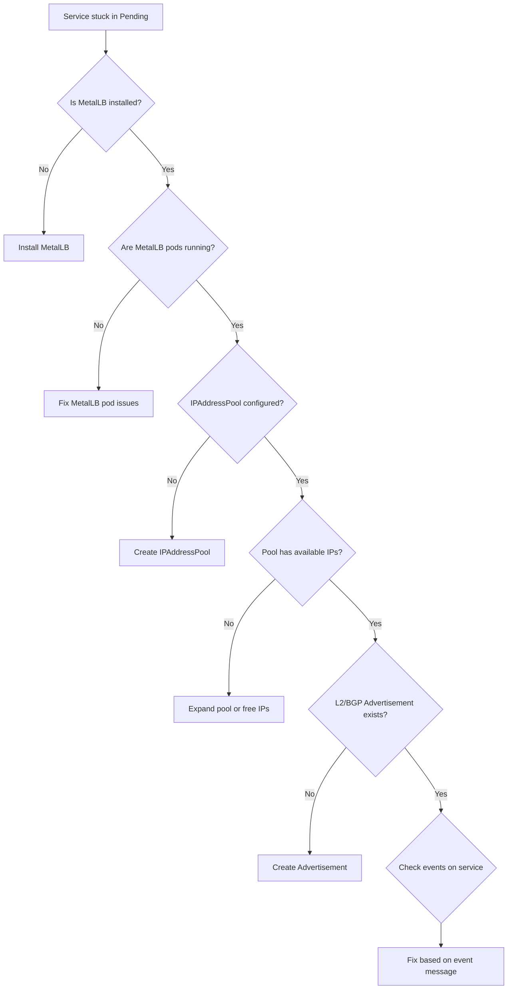

# How to Troubleshoot MetalLB Service Not Getting an External IP

Author: [nawazdhandala](https://www.github.com/nawazdhandala)

Tags: Kubernetes, MetalLB, Troubleshooting, External IP, Pending

Description: Step-by-step troubleshooting guide for MetalLB services stuck in Pending state without an external IP address.

---

One of the most common MetalLB issues is a LoadBalancer service stuck in `Pending` state with no external IP assigned. This post provides a systematic approach to diagnosing and fixing this problem.

## The Symptom

When you create a LoadBalancer service and it stays in Pending:

```bash
# Check service status - EXTERNAL-IP shows <pending>
kubectl get svc my-service
```

```
NAME         TYPE           CLUSTER-IP     EXTERNAL-IP   PORT(S)        AGE
my-service   LoadBalancer   10.96.50.100   <pending>     80:31234/TCP   5m
```

## Troubleshooting Flowchart

Follow this decision tree to identify the root cause:



## Step 1: Verify MetalLB Is Running

First, confirm that all MetalLB components are healthy:

```bash
# Check that the MetalLB controller and speaker pods are running
kubectl get pods -n metallb-system
```

Expected output:

```
NAME                          READY   STATUS    RESTARTS   AGE
controller-7d5b4c8b9f-xyz12   1/1    Running   0          2d
speaker-abc12                  1/1    Running   0          2d
speaker-def34                  1/1    Running   0          2d
speaker-ghi56                  1/1    Running   0          2d
```

If pods are not running:

```bash
# Check pod events for crash reasons
kubectl describe pod -n metallb-system -l app=metallb

# Check controller logs for startup errors
kubectl logs -n metallb-system -l component=controller --tail=50
```

## Step 2: Check IPAddressPool Configuration

MetalLB needs at least one `IPAddressPool` to allocate IPs from:

```bash
# List all configured IP address pools
kubectl get ipaddresspool -n metallb-system
```

If no pools exist, create one:

```yaml
# ipaddresspool.yaml
# Define a range of IPs that MetalLB can assign to services
apiVersion: metallb.io/v1beta1
kind: IPAddressPool
metadata:
  name: default-pool
  namespace: metallb-system
spec:
  addresses:
    # Use addresses on the same subnet as your nodes
    # Ensure these IPs are not used by other devices on the network
    - 192.168.1.200-192.168.1.250
```

```bash
# Apply the IP address pool configuration
kubectl apply -f ipaddresspool.yaml
```

## Step 3: Check That an Advertisement Exists

Having an IP pool is not enough. You also need an `L2Advertisement` or `BGPAdvertisement` to tell MetalLB how to announce the IPs.

```bash
# Check for L2 advertisements
kubectl get l2advertisement -n metallb-system

# Check for BGP advertisements
kubectl get bgpadvertisement -n metallb-system
```

If neither exists, create an L2 advertisement:

```yaml
# l2advertisement.yaml
# Tell MetalLB to advertise IPs from the default-pool using Layer 2
apiVersion: metallb.io/v1beta1
kind: L2Advertisement
metadata:
  name: default-l2
  namespace: metallb-system
spec:
  # Reference the IP address pool to advertise
  # If omitted, all pools are advertised
  ipAddressPools:
    - default-pool
```

```bash
# Apply the L2 advertisement configuration
kubectl apply -f l2advertisement.yaml
```

## Step 4: Check Pool Exhaustion

If your pool is too small, all IPs may already be allocated:

```bash
# Count how many LoadBalancer services exist
kubectl get svc -A --field-selector spec.type=LoadBalancer --no-headers | wc -l

# List all allocated external IPs
kubectl get svc -A -o json | jq -r '
  .items[] |
  select(.spec.type == "LoadBalancer") |
  select(.status.loadBalancer.ingress != null) |
  "\(.metadata.namespace)/\(.metadata.name): \(.status.loadBalancer.ingress[].ip)"
'
```

Compare the count against your pool size. If the pool is full, either expand it or remove unused services.

## Step 5: Check Service Events

MetalLB writes events to the service explaining why allocation failed:

```bash
# Check MetalLB-related events on the service
kubectl describe svc my-service | grep -A 10 Events
```

Common error messages and their fixes:

| Event Message | Cause | Fix |
|--------------|-------|-----|
| No available IPs | Pool exhausted | Expand pool |
| No matching IPAddressPool | Wrong pool annotation | Fix annotation |
| IP already in use | Duplicate IP request | Choose different IP |
| No matching L2/BGP advertisement | Missing advertisement | Create advertisement |

## Step 6: Check for Namespace or Label Restrictions

Your IPAddressPool or Advertisement may be restricted to certain namespaces or service labels:

```bash
# Check if the pool has namespace or label selectors
kubectl get ipaddresspool -n metallb-system -o yaml | grep -A 10 serviceAllocation
```

```yaml
# Example pool with namespace restriction
spec:
  addresses:
    - 192.168.1.200-192.168.1.250
  # This section restricts which services can use this pool
  serviceAllocation:
    # Only services with this label can get IPs from this pool
    serviceSelectors:
      - matchLabels:
          team: platform
    # Only services in these namespaces can use this pool
    namespaces:
      - production
      - staging
```

If your service does not match these selectors, it will not get an IP from this pool.

## Step 7: Check Controller Logs

When all else fails, the controller logs contain detailed allocation decisions:

```bash
# View recent controller logs for allocation attempts
kubectl logs -n metallb-system -l component=controller --tail=100 | grep -i "alloc\|assign\|fail\|error"
```

```bash
# Follow controller logs in real time while creating a service
kubectl logs -n metallb-system -l component=controller -f
```

## Quick Diagnostic Script

Here is a script that checks the most common issues at once:

```bash
#!/bin/bash
# metallb-diag.sh - Quick MetalLB diagnostic script

echo "=== MetalLB Pod Status ==="
kubectl get pods -n metallb-system

echo ""
echo "=== IP Address Pools ==="
kubectl get ipaddresspool -n metallb-system

echo ""
echo "=== L2 Advertisements ==="
kubectl get l2advertisement -n metallb-system

echo ""
echo "=== BGP Advertisements ==="
kubectl get bgpadvertisement -n metallb-system

echo ""
echo "=== Services in Pending State ==="
kubectl get svc -A --field-selector spec.type=LoadBalancer -o json | jq -r '
  .items[] |
  select(.status.loadBalancer.ingress == null) |
  "\(.metadata.namespace)/\(.metadata.name) - PENDING"
'

echo ""
echo "=== Recent MetalLB Events ==="
kubectl get events -n metallb-system --sort-by='.lastTimestamp' | tail -10
```

## Monitoring with OneUptime

Catching IP assignment failures before they impact users requires proactive monitoring. [OneUptime](https://oneuptime.com) lets you monitor your Kubernetes services and receive instant alerts when endpoints become unreachable or when MetalLB services fail to get external IPs. With built-in status pages and incident management, your team can respond to infrastructure issues quickly and keep stakeholders informed throughout the resolution process.
