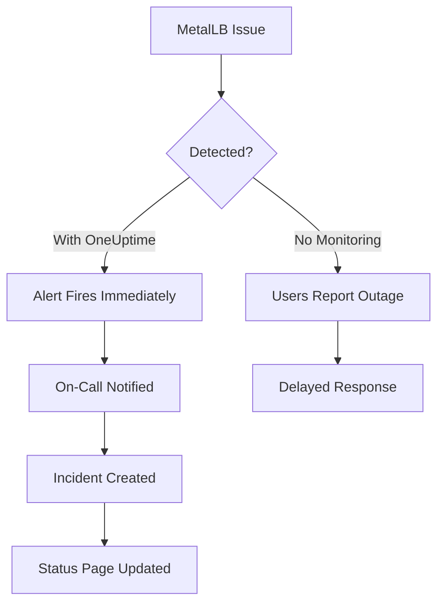
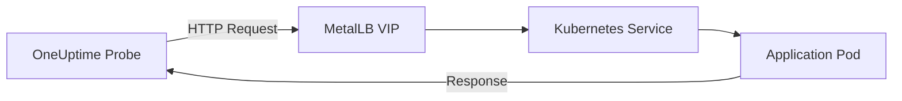
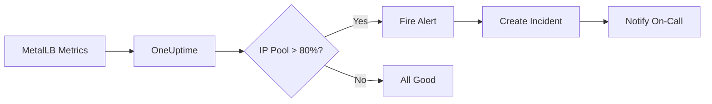
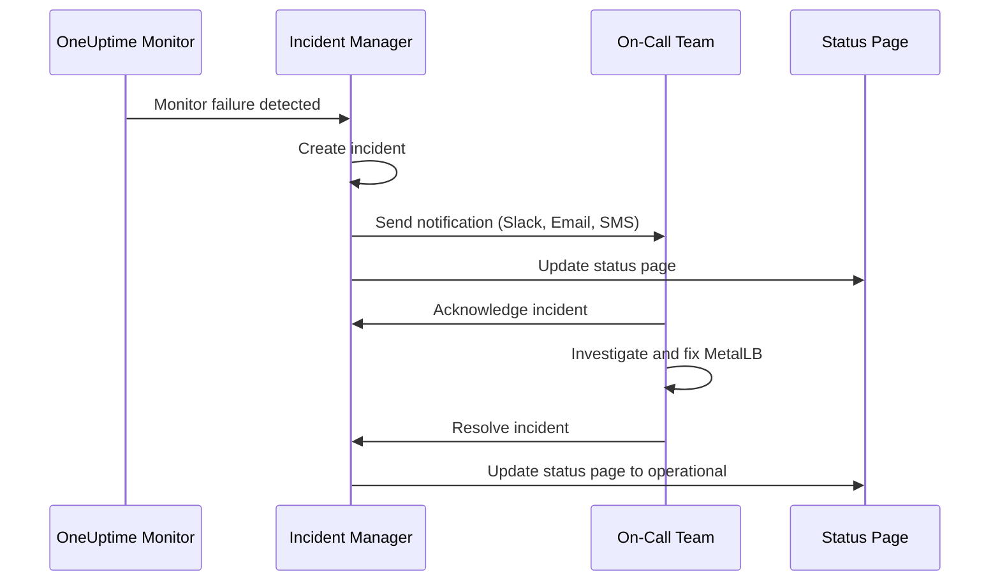

# How to Monitor MetalLB with OneUptime

Author: [nawazdhandala](https://www.github.com/nawazdhandala)

Tags: Kubernetes, MetalLB, OneUptime, Monitoring, Observability

Description: Learn how to integrate MetalLB monitoring with OneUptime for comprehensive observability of your bare-metal load balancer.

---

Running Kubernetes on bare metal means you rely on MetalLB to provide LoadBalancer-type services. When MetalLB has issues, your services become unreachable. Integrating MetalLB monitoring with OneUptime gives you a single pane of glass for tracking the health of your load balancer alongside your application monitors and status pages.

This guide shows you how to set up end-to-end monitoring of MetalLB using OneUptime.

## Why Monitor MetalLB

MetalLB handles IP address assignment and traffic routing for your services. Problems with MetalLB can manifest as:

- LoadBalancer services stuck in Pending state
- IP address pool exhaustion
- L2 leader failover causing brief traffic disruptions
- BGP session drops causing route withdrawal

Without monitoring, these issues can go undetected until users report problems.



## Setting Up OneUptime Monitors

OneUptime supports several monitor types that are useful for MetalLB monitoring. We will set up three types of monitors.

### Monitor Type 1: HTTP Monitors for LoadBalancer Services

The most direct way to monitor MetalLB is to check the services it exposes. Create an HTTP monitor in OneUptime for each critical LoadBalancer service:

1. Log in to your OneUptime dashboard
2. Navigate to Monitors and click Create Monitor
3. Select "API" as the monitor type
4. Enter the external IP assigned by MetalLB
5. Set the monitoring interval to 1 minute
6. Configure the expected status code (usually 200)



### Monitor Type 2: Synthetic Monitors

For more complex checks, use OneUptime synthetic monitors to verify that the full request path through MetalLB works correctly:

```javascript
// OneUptime Synthetic Monitor Script
// This script checks that a LoadBalancer service responds correctly.

const https = require('https');

async function monitor() {
    // Replace with your MetalLB-assigned external IP or DNS name
    const url = 'http://192.168.1.100/health';

    const response = await fetch(url, {
        method: 'GET',
        headers: {
            'Accept': 'application/json'
        },
        // Set a timeout so we detect slow responses
        signal: AbortSignal.timeout(5000)
    });

    // Check that the response status is 200
    if (response.status !== 200) {
        throw new Error(
            `Unexpected status code: ${response.status}`
        );
    }

    // Parse and validate the response body
    const body = await response.json();
    if (body.status !== 'healthy') {
        throw new Error(
            `Service reports unhealthy status: ${body.status}`
        );
    }

    return {
        status: 'ok',
        responseTime: Date.now()
    };
}

// Execute the monitor function
monitor();
```

### Monitor Type 3: Kubernetes Monitor via OpenTelemetry

OneUptime can ingest OpenTelemetry metrics, which means you can forward MetalLB Prometheus metrics through the OpenTelemetry Collector to OneUptime.

First, deploy an OpenTelemetry Collector configured to scrape MetalLB and export to OneUptime:

```yaml
# otel-collector-config.yaml
# OpenTelemetry Collector configuration for scraping MetalLB metrics
# and forwarding them to OneUptime.
apiVersion: v1
kind: ConfigMap
metadata:
  name: otel-collector-config
  namespace: monitoring
data:
  config.yaml: |
    receivers:
      prometheus:
        config:
          scrape_configs:
            # Scrape MetalLB speaker pods for metrics
            - job_name: 'metallb-speakers'
              kubernetes_sd_configs:
                - role: pod
                  namespaces:
                    names:
                      - metallb-system
              relabel_configs:
                - source_labels: [__meta_kubernetes_pod_label_app]
                  regex: metallb
                  action: keep
                - source_labels: [__meta_kubernetes_pod_label_component]
                  regex: speaker
                  action: keep
              # MetalLB speakers expose metrics on port 7472
              scrape_interval: 30s

    processors:
      batch:
        # Batch metrics before sending to reduce network overhead
        send_batch_size: 1000
        timeout: 10s

    exporters:
      otlphttp:
        # Replace with your OneUptime OTLP endpoint
        endpoint: "https://oneuptime.com/otlp"
        headers:
          # Your OneUptime project API key
          x-oneuptime-token: "your-oneuptime-api-key"

    service:
      pipelines:
        metrics:
          receivers: [prometheus]
          processors: [batch]
          exporters: [otlphttp]
```

Apply the collector configuration:

```bash
# Deploy the OpenTelemetry Collector config
kubectl apply -f otel-collector-config.yaml

# Deploy the collector itself (using the contrib image for Prometheus receiver)
kubectl apply -f otel-collector-deployment.yaml
```

## Setting Up Alerts in OneUptime

Once metrics are flowing into OneUptime, create alert rules for common MetalLB failure scenarios.

### Alert: IP Pool Exhaustion

When MetalLB runs out of IPs in its pool, new LoadBalancer services cannot get an address. Set up an alert that fires when the number of allocated IPs approaches the pool size:



### Alert: Service Unreachable

Configure an HTTP monitor with a 1-minute interval. If the monitor fails 3 consecutive times, OneUptime will:

1. Change the monitor status to "Offline"
2. Create an incident automatically
3. Update your status page
4. Notify the on-call team

### Alert: High Response Time

Set a response time threshold on your HTTP monitors. If the response time exceeds 2 seconds, it may indicate MetalLB is experiencing ARP storms or BGP convergence delays.

## Connecting to Status Pages

OneUptime lets you connect monitors to status pages so your users can see real-time service health:

1. Go to Status Pages in the OneUptime dashboard
2. Create or select a status page
3. Add your MetalLB-monitored services as resources
4. Each resource maps to a monitor you created earlier

When a MetalLB issue causes a monitor to fail, the status page automatically reflects the outage.

## Incident Management Workflow

When OneUptime detects a MetalLB issue, the incident workflow kicks in:



## Dashboard Setup

In OneUptime, you can build a custom dashboard that shows:

- Uptime percentage for each LoadBalancer service
- Response time trends over the last 24 hours
- Incident history for MetalLB-related issues
- Current status of all monitored services

This gives your team a single place to check the health of your bare-metal load balancing layer.

## Best Practices

Here are some recommendations for monitoring MetalLB with OneUptime:

1. **Monitor from outside the cluster** - Use OneUptime's external probes to check services from the internet, not just from inside the cluster
2. **Set appropriate intervals** - Use 1-minute intervals for critical services and 5-minute intervals for less critical ones
3. **Configure escalation policies** - Set up escalation in OneUptime so that unacknowledged alerts get escalated after 15 minutes
4. **Use multiple monitor types** - Combine HTTP monitors, synthetic monitors, and metric-based monitors for comprehensive coverage
5. **Connect everything to status pages** - Keep your users informed by linking monitors to public status pages

## Summary

Monitoring MetalLB with [OneUptime](https://oneuptime.com) gives you complete visibility into your bare-metal load balancer. By combining HTTP monitors, synthetic checks, and OpenTelemetry metric ingestion, you can detect MetalLB issues before they impact users. OneUptime's integrated incident management and status pages mean your team can respond quickly and keep users informed throughout any incident.
