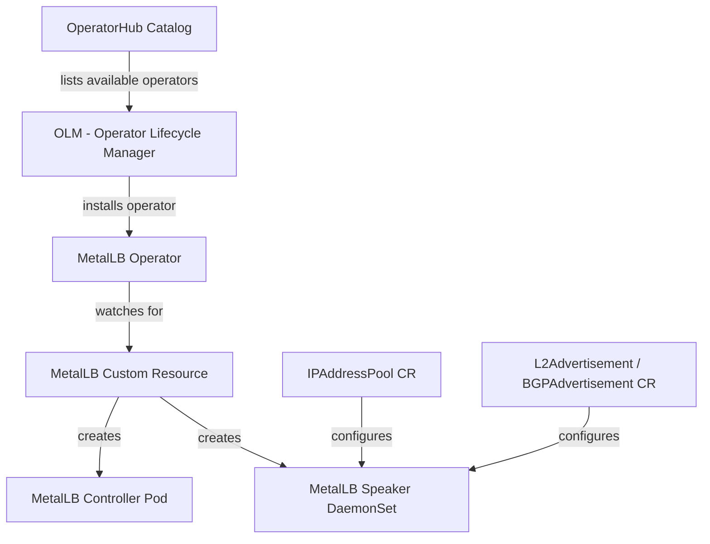
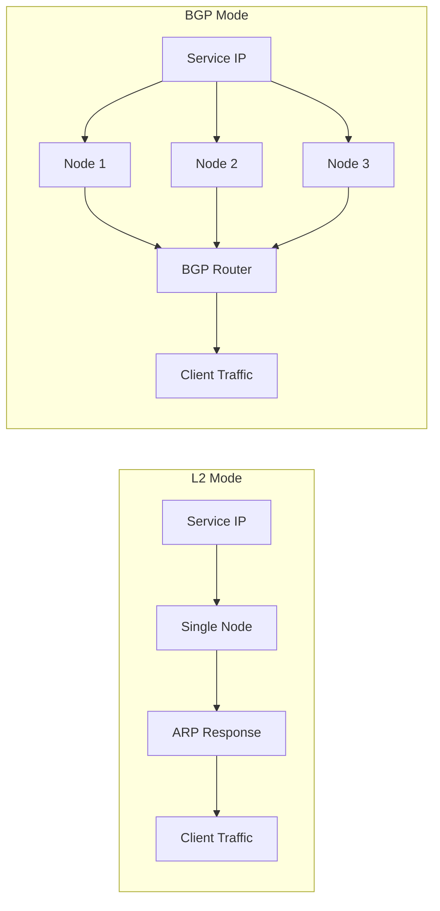

# How to Install MetalLB Using the MetalLB Operator from OperatorHub

Author: [nawazdhandala](https://www.github.com/nawazdhandala)

Tags: Kubernetes, MetalLB, Operator, OperatorHub, OLM

Description: Learn how to install MetalLB using the MetalLB Operator from OperatorHub. This guide covers setting up OLM, subscribing to the operator, and creating MetalLB resources through the operator lifecycle.

---

If you're running Kubernetes on bare metal, you already know the pain - there is no built-in cloud load balancer handing out external IPs for your services. MetalLB fills that gap. But instead of installing MetalLB with raw manifests or Helm, you can use the **MetalLB Operator** from OperatorHub. The operator approach gives you lifecycle management, automatic upgrades, and a cleaner way to manage the deployment through Custom Resources.

This guide walks you through the entire process: installing the Operator Lifecycle Manager (OLM), subscribing to the MetalLB Operator, deploying MetalLB, and configuring IP address pools with L2 or BGP advertisements.

### What Is the MetalLB Operator?

The MetalLB Operator is a Kubernetes operator published on [OperatorHub.io](https://operatorhub.io). It packages MetalLB as a set of Custom Resource Definitions (CRDs) and a controller that watches for those resources. Instead of applying raw YAML manifests and managing upgrades yourself, the operator handles:

- Installing and configuring MetalLB speaker and controller pods
- Managing CRDs for IP address pools and advertisements
- Handling upgrades when new versions are published to the catalog

The operator is installed and managed through OLM - the Operator Lifecycle Manager.

### How OLM Works

OLM is a toolkit that runs inside your cluster and manages the lifecycle of operators. It handles dependency resolution, upgrades, and access control for operators. Here is a simplified view of how the pieces fit together:



The key resources in OLM are:

- **CatalogSource** - points to a repository of operator bundles (OperatorHub is one such catalog)
- **Subscription** - tells OLM which operator to install and which update channel to follow
- **InstallPlan** - the actual installation steps OLM creates for an operator
- **ClusterServiceVersion (CSV)** - describes a specific version of an operator and what it provides

### Prerequisites

Before getting started, make sure you have:

- A running Kubernetes cluster (bare metal, on-prem, or edge - not a cloud provider with native load balancers)
- `kubectl` configured and pointing at your cluster
- Cluster admin permissions

### Step 1: Install OLM

If your cluster does not already have OLM installed (OpenShift ships with it by default), you need to set it up first. Check if OLM is already present:

```bash
# Check if OLM is already installed by looking for its namespace
kubectl get namespace olm 2>/dev/null && echo "OLM is installed" || echo "OLM is not installed"
```

If OLM is not installed, grab the latest release and apply it:

```bash
# Install OLM into your cluster
# This creates the olm namespace and deploys the OLM components
curl -sL https://github.com/operator-framework/operator-lifecycle-manager/releases/download/v0.28.0/install.sh | bash -s v0.28.0
```

Verify that OLM pods are running:

```bash
# Both olm-operator and catalog-operator should be in Running state
kubectl get pods -n olm
```

You should see output similar to this:

```
NAME                                READY   STATUS    RESTARTS   AGE
olm-operator-5b9bd6b4d7-x2k8n      1/1     Running   0          45s
catalog-operator-7f8c5f6b9d-r4jvq   1/1     Running   0          45s
operatorhubio-catalog-k7swn         1/1     Running   0          30s
```

The `operatorhubio-catalog` pod pulls operator metadata from OperatorHub.io, making all published operators available in your cluster.

### Step 2: Create a Namespace for MetalLB

The MetalLB Operator expects to run in a specific namespace. Create it before subscribing:

```yaml
# metallb-namespace.yaml
# The operator and its managed resources will live in this namespace
apiVersion: v1
kind: Namespace
metadata:
  name: metallb-system
  labels:
    # Label helps with identifying operator-managed namespaces
    openshift.io/cluster-monitoring: "true"
```

Apply it:

```bash
kubectl apply -f metallb-namespace.yaml
```

### Step 3: Create an OperatorGroup

An OperatorGroup defines the scope of operators installed in a namespace. For MetalLB, we want it to watch all namespaces since load balancer services can be in any namespace:

```yaml
# metallb-operatorgroup.yaml
# OperatorGroup controls which namespaces the operator can manage
apiVersion: operators.coreos.com/v1
kind: OperatorGroup
metadata:
  name: metallb-operatorgroup
  namespace: metallb-system
spec:
  # Empty targetNamespaces means the operator watches all namespaces
  # This is required because LoadBalancer services can exist anywhere
  targetNamespaces: []
```

Apply it:

```bash
kubectl apply -f metallb-operatorgroup.yaml
```

### Step 4: Subscribe to the MetalLB Operator

Now create a Subscription that tells OLM to install the MetalLB Operator from the OperatorHub catalog:

```yaml
# metallb-subscription.yaml
# This tells OLM to install and keep the MetalLB Operator updated
apiVersion: operators.coreos.com/v1alpha1
kind: Subscription
metadata:
  name: metallb-operator
  namespace: metallb-system
spec:
  # The channel determines which version stream to follow
  # "stable" gets you tested, production-ready releases
  channel: stable
  # Must match the operator's package name in the catalog
  name: metallb-operator
  # Points to the OperatorHub.io catalog that OLM set up
  source: operatorhubio-catalog
  sourceNamespace: olm
  # Automatic means OLM will upgrade the operator when new versions appear
  # Change to Manual if you want to approve each upgrade
  installPlanApproval: Automatic
```

Apply the subscription:

```bash
kubectl apply -f metallb-subscription.yaml
```

OLM will now pull the MetalLB Operator bundle, resolve any dependencies, and install it. Watch the progress:

```bash
# Wait for the operator pod to come up
# This usually takes 30-60 seconds depending on image pull times
kubectl get pods -n metallb-system -w
```

You can also check the ClusterServiceVersion to confirm the operator installed successfully:

```bash
# The PHASE should show "Succeeded" when the operator is ready
kubectl get csv -n metallb-system
```

Expected output:

```
NAME                                  DISPLAY            VERSION   PHASE
metallb-operator.v0.14.9              MetalLB Operator   0.14.9    Succeeded
```

### Step 5: Deploy MetalLB

With the operator running, you can now create a MetalLB custom resource. This tells the operator to deploy the actual MetalLB components - the controller and speaker pods:

```yaml
# metallb-instance.yaml
# This CR triggers the operator to deploy MetalLB into the cluster
apiVersion: metallb.io/v1beta1
kind: MetalLB
metadata:
  name: metallb
  namespace: metallb-system
spec:
  # nodeSelector lets you control which nodes run the speaker
  # Useful if you only want certain nodes to announce IPs
  # nodeSelector:
  #   kubernetes.io/os: linux

  # speakerTolerations lets speakers run on tainted nodes
  # Uncomment if your nodes have taints
  # speakerTolerations:
  # - key: "node-role.kubernetes.io/master"
  #   operator: "Exists"
  #   effect: "NoSchedule"
  logLevel: info
```

Apply it:

```bash
kubectl apply -f metallb-instance.yaml
```

Give it a minute and then verify the MetalLB pods are running:

```bash
# You should see one controller pod and one speaker pod per node
kubectl get pods -n metallb-system
```

The output should look something like:

```
NAME                                      READY   STATUS    RESTARTS   AGE
metallb-operator-5d8c7f9b6-lm4nt         1/1     Running   0          3m
controller-metallb-7b5d6f8c4-p2xwn       1/1     Running   0          45s
speaker-4kx7r                             1/1     Running   0          45s
speaker-8mj2d                             1/1     Running   0          45s
speaker-tn6qz                             1/1     Running   0          45s
```

The speaker runs as a DaemonSet, so you will see one per node. The controller handles IP allocation while speakers handle the actual network advertisements.

### Step 6: Configure an IP Address Pool

MetalLB needs a pool of IP addresses it can hand out to LoadBalancer services. Create an IPAddressPool resource:

```yaml
# ip-address-pool.yaml
# Defines the range of IPs that MetalLB can assign to services
apiVersion: metallb.io/v1beta1
kind: IPAddressPool
metadata:
  name: production-pool
  namespace: metallb-system
spec:
  addresses:
    # You can use CIDR notation or explicit ranges
    # Make sure these IPs are routable on your network
    # and not assigned to any other device
    - 192.168.1.240-192.168.1.250
    # You can also add individual IPs with /32
    # - 10.0.0.100/32
  # autoAssign controls whether this pool is used by default
  # Set to false if you want services to explicitly request this pool
  autoAssign: true
```

Apply the pool:

```bash
kubectl apply -f ip-address-pool.yaml
```

### Step 7: Configure Advertisements

MetalLB supports two modes for advertising IP addresses to your network: Layer 2 (L2) and BGP. Pick the one that fits your network setup.

#### Option A: L2 Advertisement

L2 mode is the simpler option. One node in your cluster takes ownership of an IP address and responds to ARP requests for it. No special network hardware or configuration needed.

```yaml
# l2-advertisement.yaml
# L2 mode - uses ARP/NDP to announce IPs on the local network
apiVersion: metallb.io/v1beta1
kind: L2Advertisement
metadata:
  name: l2-advertisement
  namespace: metallb-system
spec:
  # Reference the IP pools this advertisement should announce
  ipAddressPools:
    - production-pool
  # Optionally restrict which interfaces are used for announcements
  # interfaces:
  #   - eth0
```

Apply it:

```bash
kubectl apply -f l2-advertisement.yaml
```

L2 mode has a limitation - all traffic for a given IP goes through a single node. If that node goes down, MetalLB fails over to another node, but there is a brief interruption. For most small to mid-size setups, this works fine.

#### Option B: BGP Advertisement

BGP mode is more advanced. MetalLB peers with your network routers and announces routes via BGP. This gives you true load distribution across nodes and faster failover.

```yaml
# bgp-advertisement.yaml
# BGP mode - announces routes to network routers via BGP protocol
apiVersion: metallb.io/v1beta1
kind: BGPAdvertisement
metadata:
  name: bgp-advertisement
  namespace: metallb-system
spec:
  ipAddressPools:
    - production-pool
  # communities and aggregationLength are optional tuning knobs
  # aggregationLength: 32
  # localPref: 100
```

You also need to configure BGP peers - these are the routers MetalLB will talk to:

```yaml
# bgp-peer.yaml
# Defines the BGP router that MetalLB should peer with
apiVersion: metallb.io/v1beta1
kind: BGPPeer
metadata:
  name: router-peer
  namespace: metallb-system
spec:
  # Your router's IP address
  peerAddress: 10.0.0.1
  # Your router's ASN (Autonomous System Number)
  peerASN: 64501
  # The ASN MetalLB will use - pick a private ASN (64512-65534)
  myASN: 64500
  # Optional: restrict which nodes peer with this router
  # nodeSelectors:
  # - matchLabels:
  #     rack: rack-1
```

Apply both:

```bash
kubectl apply -f bgp-advertisement.yaml
kubectl apply -f bgp-peer.yaml
```

Here is a quick comparison to help you decide:



### Step 8: Verify Everything Works

Create a test service to confirm MetalLB is assigning IPs correctly:

```yaml
# test-service.yaml
# A simple nginx deployment and LoadBalancer service to test MetalLB
apiVersion: apps/v1
kind: Deployment
metadata:
  name: nginx-test
  namespace: default
spec:
  replicas: 2
  selector:
    matchLabels:
      app: nginx-test
  template:
    metadata:
      labels:
        app: nginx-test
    spec:
      containers:
      - name: nginx
        image: nginx:alpine
        ports:
        - containerPort: 80
---
apiVersion: v1
kind: Service
metadata:
  name: nginx-test-lb
  namespace: default
spec:
  type: LoadBalancer
  # To request an IP from a specific pool, add this annotation:
  # metallb.universe.tf/address-pool: production-pool
  selector:
    app: nginx-test
  ports:
  - port: 80
    targetPort: 80
    protocol: TCP
```

Apply and check:

```bash
# Deploy the test workload
kubectl apply -f test-service.yaml

# Check that the service got an external IP from your pool
# It should no longer show <pending> under EXTERNAL-IP
kubectl get svc nginx-test-lb
```

You should see something like:

```
NAME            TYPE           CLUSTER-IP     EXTERNAL-IP     PORT(S)        AGE
nginx-test-lb   LoadBalancer   10.43.12.95    192.168.1.240   80:31452/TCP   10s
```

Test connectivity to that IP:

```bash
# Should return the nginx welcome page HTML
curl http://192.168.1.240
```

If you see the nginx welcome page, MetalLB is working correctly through the operator.

### Upgrading the Operator

One of the biggest advantages of using the operator approach is upgrades. Since we set `installPlanApproval: Automatic` in the subscription, OLM will automatically upgrade the MetalLB Operator when new versions are published to the catalog. If you prefer manual control, set it to `Manual` and approve upgrades yourself:

```bash
# List pending install plans
kubectl get installplan -n metallb-system

# Approve a specific install plan
kubectl patch installplan <plan-name> -n metallb-system --type merge \
  --patch '{"spec":{"approved":true}}'
```

### Cleanup

If you want to remove MetalLB and the operator, delete the resources in reverse order:

```bash
# Remove test resources
kubectl delete -f test-service.yaml

# Remove advertisements and IP pools
kubectl delete -f l2-advertisement.yaml
kubectl delete -f ip-address-pool.yaml

# Remove the MetalLB instance
kubectl delete -f metallb-instance.yaml

# Remove the operator subscription
kubectl delete -f metallb-subscription.yaml

# The CSV will be cleaned up automatically, but you can force it
kubectl delete csv -n metallb-system --all
```

### Wrapping Up

Using the MetalLB Operator from OperatorHub gives you a clean, repeatable way to deploy and manage MetalLB on bare-metal Kubernetes clusters. OLM handles the operator lifecycle - installs, upgrades, dependency resolution - so you can focus on configuring your network instead of managing YAML manifests.

Once MetalLB is running and your services have external IPs, you will want to make sure everything stays healthy. [OneUptime](https://oneuptime.com) can monitor your Kubernetes infrastructure, track the health of your MetalLB-backed services, and alert you if something goes wrong - whether it is a speaker pod crashing, a node going offline, or an endpoint becoming unreachable.

Happy load balancing!
