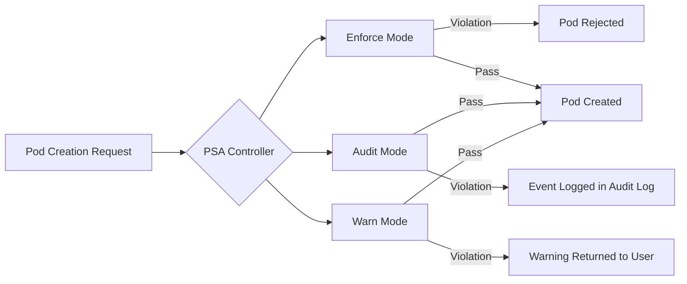
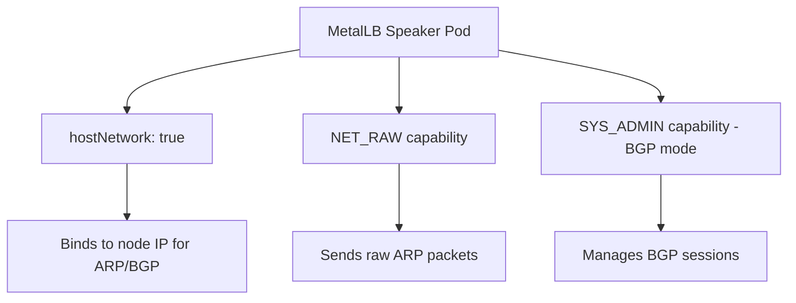

# How to Configure Pod Security Admission Labels for MetalLB Namespace

Author: [nawazdhandala](https://www.github.com/nawazdhandala)

Tags: Kubernetes, MetalLB, Pod Security, PSA, Security

Description: Learn how to configure Pod Security Admission labels for the MetalLB namespace to satisfy Kubernetes security standards while keeping MetalLB functional.

---

> Starting with Kubernetes 1.25, Pod Security Admission (PSA) is enabled by default. If you run MetalLB, you have likely seen warnings or even pod failures caused by PSA policy violations. This guide walks you through labeling the MetalLB namespace correctly so your load balancer keeps working without compromising your cluster's security posture.

MetalLB is the go-to load balancer for bare-metal Kubernetes clusters. Its speaker component needs host-level network access to announce service IPs via ARP or BGP. That requirement clashes with the "restricted" Pod Security Standard that many teams enforce cluster-wide. The fix is straightforward: apply the right PSA labels to the `metallb-system` namespace.

---

## What Is Pod Security Admission?

Pod Security Admission (PSA) is a built-in Kubernetes admission controller that enforces the [Pod Security Standards](https://kubernetes.io/docs/concepts/security/pod-security-standards/). It replaced the deprecated PodSecurityPolicy (PSP) API starting in Kubernetes 1.25.

PSA evaluates pods against three security profiles:

| Profile | Description |
|-------------|--------------------------------------------------------------|
| **Privileged** | Unrestricted. No security checks applied. |
| **Baseline** | Prevents known privilege escalations. Allows most workloads. |
| **Restricted** | Heavily locked down. Follows current hardening best practices.|

PSA applies these profiles through **namespace labels**. You do not write policy objects; you simply label the namespace and the admission controller does the rest.

---

## The Three PSA Modes

Each profile can operate in one of three modes, and you can combine them on a single namespace:



- **enforce** - Pods that violate the policy are **rejected**. They will not run.
- **audit** - Violations are recorded in the Kubernetes **audit log** but pods still run.
- **warn** - Violations produce a **warning message** shown to the user (e.g. in kubectl output) but pods still run.

The label format follows this pattern:

```
pod-security.kubernetes.io/<MODE>: <PROFILE>
pod-security.kubernetes.io/<MODE>-version: <VERSION>
```

For example:

```yaml
# Enforce the "baseline" profile at the v1.30 standard
pod-security.kubernetes.io/enforce: baseline
pod-security.kubernetes.io/enforce-version: v1.30
```

---

## Why MetalLB Needs Privileged Access

MetalLB has two main components:

1. **Controller** - A Deployment that handles IP address allocation. It runs as a regular unprivileged pod.
2. **Speaker** - A DaemonSet that runs on every node and announces service IPs to the network.

The speaker is the component that needs elevated privileges. Here is why:



- **hostNetwork: true** - The speaker binds directly to the node's network stack to send gratuitous ARP replies or establish BGP sessions. This violates the "restricted" and "baseline" profiles.
- **NET_RAW capability** - Required to craft and send raw ARP packets in Layer 2 mode.
- **SYS_ADMIN capability** - Needed in some BGP configurations for advanced networking.

Because of these requirements, the `metallb-system` namespace **cannot** use the "restricted" or "baseline" enforce profile. Attempting to do so will block the speaker pods from starting.

---

## Checking Your Current Namespace Labels

Before making changes, inspect the existing labels on the `metallb-system` namespace:

```bash
# Show all labels on the metallb-system namespace
# Look for any pod-security.kubernetes.io/* labels
kubectl get namespace metallb-system --show-labels
```

If your cluster enforces a default PSA profile (through an AdmissionConfiguration file), even unlabeled namespaces inherit that policy. Check the API server flags:

```bash
# Check if a default admission configuration is set
# The --admission-control-config-file flag points to the config
ps aux | grep kube-apiserver | grep admission-control-config-file
```

---

## Labeling the MetalLB Namespace

The recommended approach is to set `enforce` to `privileged` (so the speaker pods can run) while keeping `audit` and `warn` at a stricter level (so you still get visibility into security posture).

### Option 1: Using kubectl

```bash
# Set enforce to privileged so MetalLB speaker pods are allowed to run.
# Set audit to privileged to avoid noisy audit log entries for expected behavior.
# Set warn to privileged to suppress warnings during deployments.
kubectl label namespace metallb-system \
  pod-security.kubernetes.io/enforce=privileged \
  pod-security.kubernetes.io/audit=privileged \
  pod-security.kubernetes.io/warn=privileged \
  --overwrite
```

If you want stricter visibility (recommended for security-conscious teams):

```bash
# Enforce privileged (required for speaker pods to start).
# Audit at baseline level to log any violations beyond what MetalLB needs.
# Warn at baseline level to surface unexpected privilege usage.
kubectl label namespace metallb-system \
  pod-security.kubernetes.io/enforce=privileged \
  pod-security.kubernetes.io/audit=baseline \
  pod-security.kubernetes.io/warn=baseline \
  --overwrite
```

### Option 2: Declarative YAML

For GitOps workflows, define the namespace in a manifest:

```yaml
# metallb-namespace.yaml
# Declares the metallb-system namespace with PSA labels.
# Enforce is set to privileged because the speaker DaemonSet
# requires hostNetwork and NET_RAW capabilities.
apiVersion: v1
kind: Namespace
metadata:
  name: metallb-system
  labels:
    # Allow pods with any security profile to run
    pod-security.kubernetes.io/enforce: privileged
    # Log audit events for pods that would violate baseline
    pod-security.kubernetes.io/audit: baseline
    # Show warnings for pods that would violate baseline
    pod-security.kubernetes.io/warn: baseline
    # Pin to a specific Kubernetes version for consistent behavior
    pod-security.kubernetes.io/enforce-version: v1.30
    pod-security.kubernetes.io/audit-version: v1.30
    pod-security.kubernetes.io/warn-version: v1.30
```

Apply it:

```bash
# Apply the namespace manifest
# Use --server-side to avoid conflicts with existing resources
kubectl apply -f metallb-namespace.yaml
```

### Option 3: Helm Values Override

If you install MetalLB via Helm, you can set the labels in your values file:

```yaml
# helm-values.yaml
# Override namespace labels when installing MetalLB with Helm.
# This ensures PSA labels are applied automatically during install.
namespace:
  labels:
    pod-security.kubernetes.io/enforce: privileged
    pod-security.kubernetes.io/audit: baseline
    pod-security.kubernetes.io/warn: baseline
```

Install or upgrade with:

```bash
# Install MetalLB with custom namespace labels via Helm
helm upgrade --install metallb metallb/metallb \
  --namespace metallb-system \
  --create-namespace \
  -f helm-values.yaml
```

---

## Verifying the Configuration

After applying the labels, confirm everything is working:

```bash
# Step 1: Verify the labels are applied correctly
kubectl get namespace metallb-system -o jsonpath='{.metadata.labels}' | jq .
```

Expected output:

```json
{
  "pod-security.kubernetes.io/enforce": "privileged",
  "pod-security.kubernetes.io/audit": "baseline",
  "pod-security.kubernetes.io/warn": "baseline"
}
```

```bash
# Step 2: Verify all MetalLB pods are running
# Both controller and speaker pods should show Running status
kubectl get pods -n metallb-system
```

Expected output:

```
NAME                          READY   STATUS    RESTARTS   AGE
controller-7cf77c64f-x2k9p   1/1     Running   0          5m
speaker-abc12                 1/1     Running   0          5m
speaker-def34                 1/1     Running   0          5m
```

```bash
# Step 3: Run a dry-run test to confirm new pods would be admitted
# This creates a test pod spec similar to the speaker and checks admission
kubectl run psa-test \
  --image=busybox \
  --namespace=metallb-system \
  --overrides='{
    "spec": {
      "hostNetwork": true,
      "containers": [{
        "name": "test",
        "image": "busybox",
        "securityContext": {
          "capabilities": {
            "add": ["NET_RAW"]
          }
        }
      }]
    }
  }' \
  --dry-run=server
```

If the namespace labels are correct, the dry-run should succeed with:

```
pod/psa-test created (server dry run)
```

---

## Common Errors and How to Fix Them

### Error: Pods Stuck in CreateContainerError

```
Error: container has runAsNonRoot and image will run as root
```

**Cause:** The namespace enforce label is set to `restricted` or `baseline`, which blocks the speaker's security context.

**Fix:** Change the enforce label to `privileged`:

```bash
# Override the enforce label to allow privileged workloads
kubectl label namespace metallb-system \
  pod-security.kubernetes.io/enforce=privileged \
  --overwrite
```

### Error: Warning Messages During Helm Install

```
Warning: would violate PodSecurity "baseline:latest": host namespaces
(hostNetwork=true), unrestricted capabilities (container "speaker"
must not include "NET_RAW" in securityContext.capabilities.add)
```

**Cause:** The `warn` label is set to `baseline` or `restricted`. This is informational, not a blocker, as long as `enforce` is `privileged`.

**Fix:** If the warnings are too noisy, set warn to `privileged` as well. Otherwise, keep them - they are useful for visibility.

### Error: Speaker DaemonSet Has Zero Ready Pods

```bash
# Check the DaemonSet status for scheduling issues
kubectl get daemonset -n metallb-system speaker -o wide
```

If desired/ready shows 0, the speaker pods are being rejected by admission. Confirm the namespace labels and restart the DaemonSet:

```bash
# Restart the speaker DaemonSet to pick up namespace label changes
kubectl rollout restart daemonset/speaker -n metallb-system
```

### Error: Admission Webhook Conflicts

Some clusters run third-party admission webhooks (OPA Gatekeeper, Kyverno) alongside PSA. These can independently block pods even when PSA labels are correct.

```bash
# List all validating webhooks that might interfere
kubectl get validatingwebhookconfigurations

# Check if any webhook targets the metallb-system namespace
kubectl get validatingwebhookconfigurations -o json | \
  jq '.items[] | {name: .metadata.name, namespaceSelector: .webhooks[].namespaceSelector}'
```

---

## Best Practices

1. **Pin the PSA version** - Always include `-version` labels (e.g., `v1.30`) to avoid unexpected behavior when you upgrade Kubernetes.

2. **Use audit and warn even when enforce is privileged** - This gives you visibility into what the speaker actually requires, which helps when MetalLB updates reduce its privilege requirements.

3. **Scope privileged access narrowly** - Only the `metallb-system` namespace should be privileged. Do not relax PSA labels cluster-wide.

4. **Document the exception** - Add a comment or annotation explaining why the namespace is privileged:

```bash
# Annotate the namespace with the reason for the privileged exception
kubectl annotate namespace metallb-system \
  "psa-exception-reason=MetalLB speaker requires hostNetwork and NET_RAW for L2/BGP" \
  --overwrite
```

5. **Review regularly** - As MetalLB evolves, check release notes for reduced privilege requirements. Future versions may work with baseline or restricted profiles.

---

## Summary

Pod Security Admission is a simple but effective way to enforce security standards in Kubernetes. MetalLB's speaker component genuinely needs privileged access to function - it is not a misconfiguration. The correct approach is to label the `metallb-system` namespace with `enforce: privileged` while optionally keeping `audit` and `warn` at stricter levels for visibility.

The key takeaway: PSA is namespace-scoped, so granting privileged access to MetalLB does not weaken security for the rest of your cluster.

If you are running MetalLB on bare-metal Kubernetes and want comprehensive monitoring of your load balancer, network, and cluster health, check out [OneUptime](https://oneuptime.com). OneUptime provides end-to-end observability with uptime monitoring, incident management, and alerting - so you know immediately when your MetalLB configuration or any other infrastructure component needs attention.
