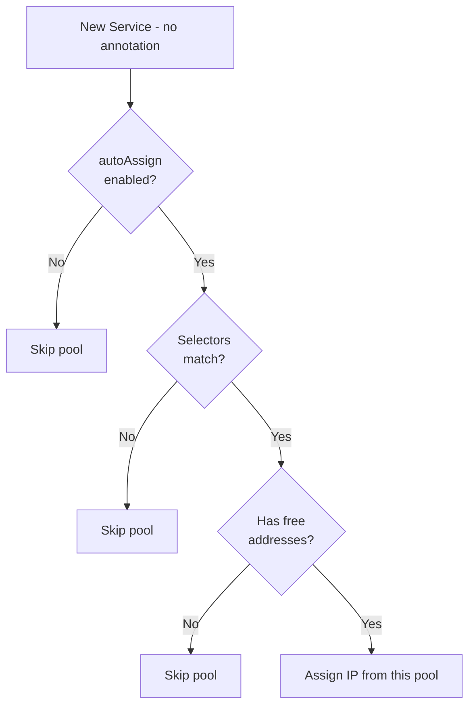
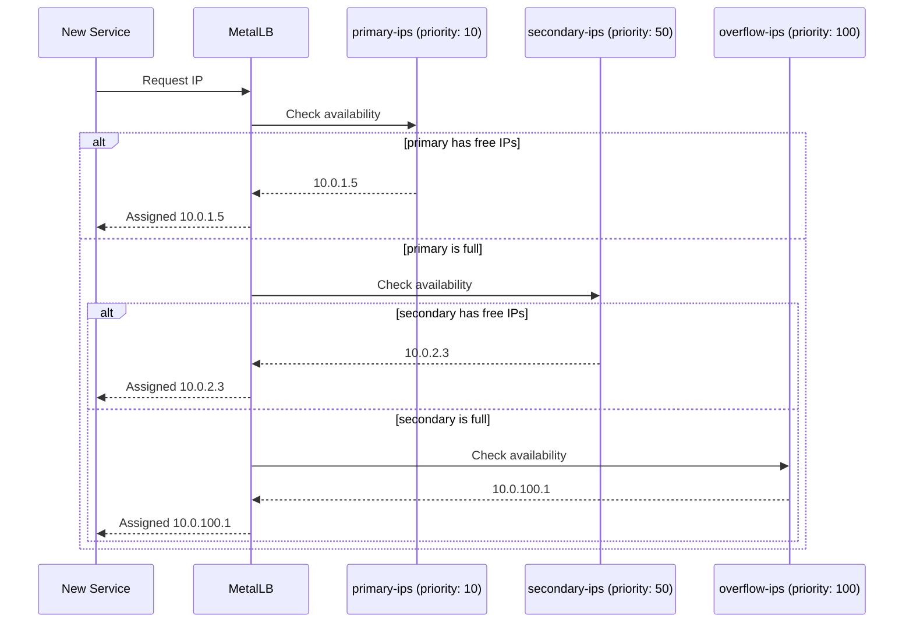

# How to Set IPAddressPool Priority for Allocation Order in MetalLB

Author: [nawazdhandala](https://www.github.com/nawazdhandala)

Tags: Kubernetes, MetalLB, IP Pools, Priority, Configuration

Description: Learn how to set priority values on MetalLB IPAddressPool resources to control the order in which pools are used for IP allocation.

---

> When you have multiple IP pools, the order in which MetalLB tries them matters. A service that does not specify a pool will get an IP from the first eligible pool. MetalLB's priority system lets you control that order explicitly instead of relying on alphabetical pool names.

This guide explains how pool priority works, how to set it, and how to design a priority scheme for real-world clusters.

---

## How MetalLB Chooses a Pool

When a new LoadBalancer service appears without a pool annotation, MetalLB evaluates pools in this order:

1. Filter out pools where `autoAssign: false`.
2. Filter out pools whose service or namespace selectors do not match.
3. Among remaining pools, sort by `serviceAllocation.priority` (lower number = higher priority).
4. Pick the first pool that has available addresses.



---

## Setting Priority

Priority is set inside the `serviceAllocation` block of the IPAddressPool:

```yaml
# pool-primary.yaml
# Primary pool - tried first (lowest priority number)
apiVersion: metallb.io/v1beta1
kind: IPAddressPool
metadata:
  name: primary-ips
  namespace: metallb-system
spec:
  addresses:
    # Main IP range
    - 10.0.1.0/24
  serviceAllocation:
    # Lower number = higher priority = tried first
    priority: 10
```

```yaml
# pool-secondary.yaml
# Secondary pool - tried after primary is exhausted
apiVersion: metallb.io/v1beta1
kind: IPAddressPool
metadata:
  name: secondary-ips
  namespace: metallb-system
spec:
  addresses:
    # Backup IP range
    - 10.0.2.0/24
  serviceAllocation:
    # Higher number = lower priority = tried second
    priority: 50
```

```yaml
# pool-overflow.yaml
# Overflow pool - last resort
apiVersion: metallb.io/v1beta1
kind: IPAddressPool
metadata:
  name: overflow-ips
  namespace: metallb-system
spec:
  addresses:
    # Emergency overflow range
    - 10.0.100.0/24
  serviceAllocation:
    # Highest number = lowest priority = tried last
    priority: 100
```

---

## Priority Allocation Flow



---

## Priority Design Patterns

### Pattern 1: Drain and Overflow

Use priority to drain one pool completely before touching the next:

| Pool | Priority | Purpose |
|------|----------|---------|
| primary-ips | 10 | Main allocation pool |
| secondary-ips | 50 | Used when primary is full |
| overflow-ips | 100 | Emergency addresses |

### Pattern 2: Tier-Based Allocation

Different tiers for different service classes:

| Pool | Priority | Label Selector |
|------|----------|---------------|
| premium-ips | 10 | `tier: premium` |
| standard-ips | 50 | `tier: standard` |
| default-ips | 100 | None (catch-all) |

### Pattern 3: Region-Based

Route services to the nearest network segment:

| Pool | Priority | Namespace Selector |
|------|----------|-------------------|
| us-east-ips | 10 | `us-east` |
| us-west-ips | 20 | `us-west` |
| global-ips | 100 | Any |

---

## What Happens With Equal Priority

When two pools have the same priority, MetalLB uses alphabetical order of the pool name as a tiebreaker. This can lead to surprises:

```yaml
# Both pools have priority 50
# "alpha-pool" will be tried before "beta-pool" due to alphabetical order
---
apiVersion: metallb.io/v1beta1
kind: IPAddressPool
metadata:
  name: beta-pool
  namespace: metallb-system
spec:
  addresses:
    - 10.0.20.0/24
  serviceAllocation:
    priority: 50
---
apiVersion: metallb.io/v1beta1
kind: IPAddressPool
metadata:
  name: alpha-pool
  namespace: metallb-system
spec:
  addresses:
    - 10.0.10.0/24
  serviceAllocation:
    priority: 50
```

Best practice: always use distinct priority values to avoid relying on name ordering.

---

## Pools Without serviceAllocation

If a pool does not have a `serviceAllocation` block at all, it has no explicit priority. These pools are evaluated after all pools with explicit priorities and are ordered alphabetically by name.

```yaml
# pool-legacy.yaml
# Pool without serviceAllocation - treated as lowest priority
apiVersion: metallb.io/v1beta1
kind: IPAddressPool
metadata:
  name: legacy-pool
  namespace: metallb-system
spec:
  addresses:
    - 10.0.99.0/24
  # No serviceAllocation block
  # This pool is tried after all pools with explicit priorities
```

---

## Verifying Priority Order

```bash
# List all pools with their priority values
kubectl get ipaddresspool -n metallb-system \
  -o custom-columns=NAME:.metadata.name,PRIORITY:.spec.serviceAllocation.priority

# Watch MetalLB controller logs during service creation
kubectl logs -n metallb-system -l app=metallb,component=controller -f | grep "pool"

# Check which pool a service was assigned from
kubectl describe svc my-service | grep -A3 "Events"
```

---

## Recommended Priority Ranges

| Range | Use Case |
|-------|----------|
| 1-10 | Critical pools, expensive IPs, premium tier |
| 11-50 | Standard production pools |
| 51-80 | Staging and development pools |
| 81-99 | Overflow and emergency pools |
| 100 | Catch-all default pool |

---

## Wrapping Up

Pool priority gives you deterministic control over allocation order. Use low numbers for pools you want MetalLB to prefer and high numbers for fallback pools. Always assign distinct priorities and avoid relying on alphabetical name ordering.

To get alerts when your primary pools are running low and services start falling through to overflow pools, set up monitoring with **[OneUptime](https://oneuptime.com)**.
