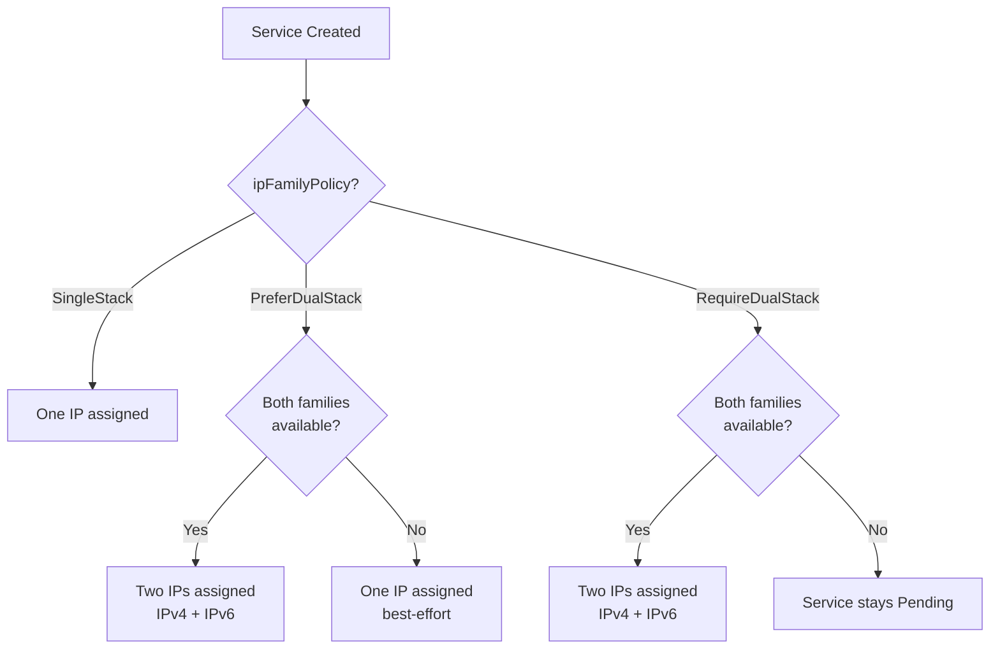
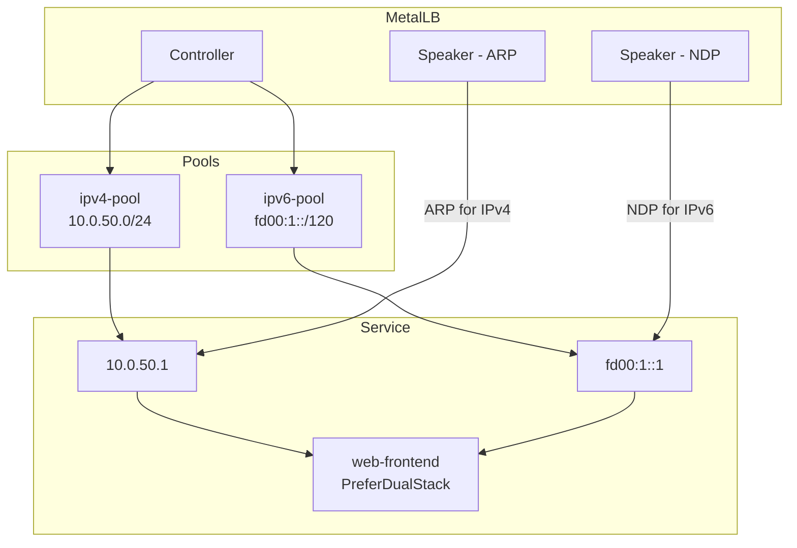

# How to Use PreferDualStack IP Family Policy with MetalLB

Author: [nawazdhandala](https://www.github.com/nawazdhandala)

Tags: Kubernetes, MetalLB, Dual Stack, IPv6, IPFamilyPolicy

Description: Learn how to use the PreferDualStack IP family policy with MetalLB to request both IPv4 and IPv6 addresses for LoadBalancer services.

---

> As IPv6 adoption grows, many organizations need their Kubernetes services reachable over both IPv4 and IPv6. The `PreferDualStack` IP family policy tells Kubernetes to request addresses from both families when available, gracefully falling back to single-stack when not. MetalLB supports this through separate IPv4 and IPv6 address pools.

This guide walks through configuring dual-stack MetalLB from pools to services.

---

## Understanding IP Family Policies

Kubernetes supports three IP family policies for services:

| Policy | Behavior |
|--------|----------|
| `SingleStack` | Service gets one IP (IPv4 or IPv6, based on `ipFamilies`) |
| `PreferDualStack` | Service gets both IPv4 and IPv6 if available, falls back to single |
| `RequireDualStack` | Service must get both IPv4 and IPv6, fails if either is unavailable |



---

## Prerequisites

For dual-stack MetalLB to work, you need:

1. A Kubernetes cluster with dual-stack networking enabled.
2. Nodes with both IPv4 and IPv6 addresses.
3. MetalLB v0.13+ (dual-stack support was added in v0.12.1).

Verify your cluster supports dual-stack:

```bash
# Check if the cluster has dual-stack enabled
kubectl get nodes -o jsonpath='{range .items[*]}{.metadata.name}: {.status.addresses[*].address}{"\n"}{end}'

# Check the kube-apiserver feature gates
kubectl get pod -n kube-system -l component=kube-apiserver \
  -o jsonpath='{.items[0].spec.containers[0].command}' | tr ',' '\n' | grep -i dual
```

---

## Creating IPv4 and IPv6 Pools

MetalLB needs separate pools for each address family:

```yaml
# pool-ipv4.yaml
# IPv4 address pool for dual-stack services
apiVersion: metallb.io/v1beta1
kind: IPAddressPool
metadata:
  name: ipv4-pool
  namespace: metallb-system
spec:
  addresses:
    # IPv4 range for services
    - 10.0.50.1-10.0.50.254
```

```yaml
# pool-ipv6.yaml
# IPv6 address pool for dual-stack services
apiVersion: metallb.io/v1beta1
kind: IPAddressPool
metadata:
  name: ipv6-pool
  namespace: metallb-system
spec:
  addresses:
    # IPv6 range for services
    # /120 gives 256 addresses (fd00:1::0 through fd00:1::ff)
    - fd00:1::1-fd00:1::fe
```

Apply both pools:

```bash
# Create both address pools
kubectl apply -f pool-ipv4.yaml
kubectl apply -f pool-ipv6.yaml

# Verify both pools exist
kubectl get ipaddresspool -n metallb-system
```

---

## Configuring L2 Advertisements for Both Families

Each pool needs an L2Advertisement (or BGPAdvertisement) to make the IPs reachable:

```yaml
# l2-advertisements.yaml
# L2 advertisements for both IPv4 and IPv6 pools
---
apiVersion: metallb.io/v1beta1
kind: L2Advertisement
metadata:
  name: ipv4-l2adv
  namespace: metallb-system
spec:
  ipAddressPools:
    # Advertise the IPv4 pool via ARP
    - ipv4-pool
---
apiVersion: metallb.io/v1beta1
kind: L2Advertisement
metadata:
  name: ipv6-l2adv
  namespace: metallb-system
spec:
  ipAddressPools:
    # Advertise the IPv6 pool via NDP (Neighbor Discovery Protocol)
    - ipv6-pool
```

```bash
# Apply the advertisement resources
kubectl apply -f l2-advertisements.yaml
```

---

## Creating a PreferDualStack Service

Now create a service that requests both address families:

```yaml
# service-dualstack.yaml
# Service that prefers dual-stack (IPv4 + IPv6)
apiVersion: v1
kind: Service
metadata:
  name: web-frontend
  labels:
    app: web-frontend
spec:
  type: LoadBalancer
  # Request dual-stack, fall back to single if not available
  ipFamilyPolicy: PreferDualStack
  # Order matters: first family listed is the primary
  ipFamilies:
    - IPv4
    - IPv6
  selector:
    app: web-frontend
  ports:
    - port: 80
      targetPort: 8080
      protocol: TCP
```

```bash
# Create the dual-stack service
kubectl apply -f service-dualstack.yaml

# Check the assigned IPs - should show both IPv4 and IPv6
kubectl get svc web-frontend -o wide
```

---

## Architecture Diagram



---

## PreferDualStack vs RequireDualStack

Choose the right policy based on your requirements:

| Scenario | Recommended Policy |
|----------|-------------------|
| IPv6 is nice to have but not required | `PreferDualStack` |
| Both families are mandatory for compliance | `RequireDualStack` |
| Only one family needed | `SingleStack` |
| Migrating from IPv4-only gradually | `PreferDualStack` |

---

## Troubleshooting Dual-Stack Issues

| Symptom | Cause | Fix |
|---------|-------|-----|
| Only one IP assigned with PreferDualStack | Missing pool for one family | Create pool for the missing family |
| Service Pending with RequireDualStack | One pool is empty or missing | Add addresses to the depleted pool |
| IPv6 IP assigned but not reachable | No NDP advertisement | Create L2Advertisement for the IPv6 pool |
| IPv4 works, IPv6 times out | Network does not route IPv6 | Verify IPv6 routing on your network |

```bash
# Debug dual-stack assignment issues
kubectl describe svc web-frontend | grep -A10 "Events"

# Check MetalLB controller for allocation decisions
kubectl logs -n metallb-system -l app=metallb,component=controller | grep "web-frontend"
```

---

## Wrapping Up

`PreferDualStack` is the safest way to adopt IPv6 alongside IPv4 - your services get both addresses when available and gracefully degrade to single-stack when not. Pair it with separate IPv4 and IPv6 MetalLB pools and matching advertisements for a complete dual-stack load balancing setup.

Monitor the reachability of both your IPv4 and IPv6 endpoints with **[OneUptime](https://oneuptime.com)** to catch family-specific outages before your users do.
