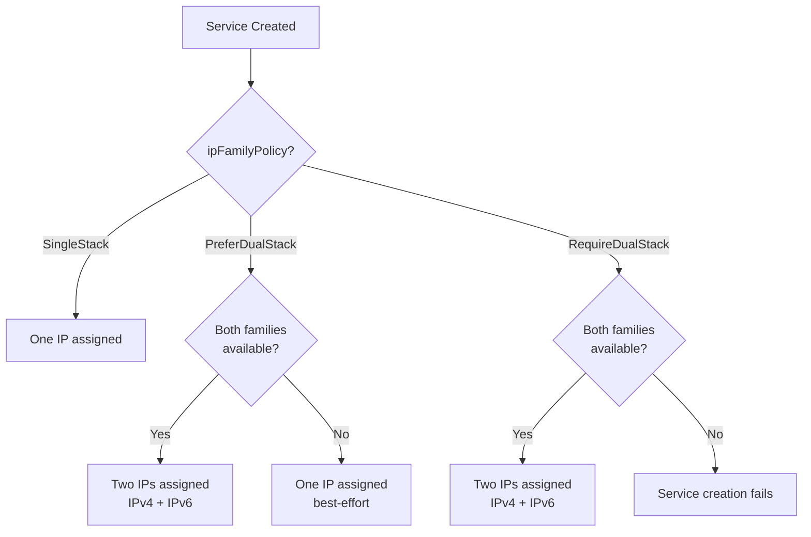
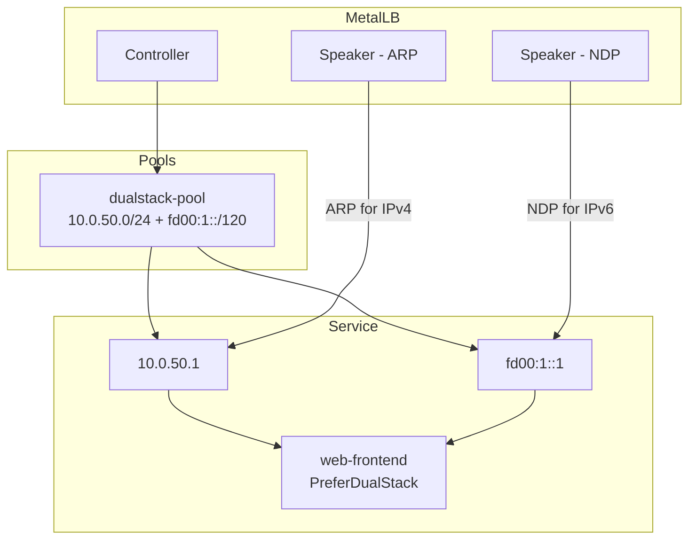

# How to Use PreferDualStack IP Family Policy with MetalLB

Author: [nawazdhandala](https://www.github.com/nawazdhandala)

Tags: Kubernetes, MetalLB, Dual Stack, IPv6, IpFamilyPolicy

Description: Learn how to use the PreferDualStack IP family policy with MetalLB to request both IPv4 and IPv6 addresses for LoadBalancer services.

---

> As IPv6 adoption grows, many organizations need their Kubernetes services reachable over both IPv4 and IPv6. The `PreferDualStack` IP family policy tells Kubernetes to request addresses from both families when available, gracefully falling back to single-stack when not. MetalLB supports this through an address pool that contains both IPv4 and IPv6 ranges.

This guide walks through configuring dual-stack MetalLB from pools to services.

---

## Understanding IP Family Policies

Kubernetes supports three IP family policies for services:

| Policy | Behavior |
|--------|----------|
| `SingleStack` | Service gets one IP (IPv4 or IPv6, based on `ipFamilies`) |
| `PreferDualStack` | Service gets both IPv4 and IPv6 if available, falls back to single |
| `RequireDualStack` | Service must use both IPv4 and IPv6, and creation fails if dual-stack is not enabled or supported |


```mermaid
graph TD
    S[Service Created] --> P{ipFamilyPolicy?}
    P -- SingleStack --> SS[One IP assigned]
    P -- PreferDualStack --> DS{Both families\navailable?}
    DS -- Yes --> DUAL[Two IPs assigned\nIPv4 + IPv6]
    DS -- No --> SINGLE[One IP assigned\nbest-effort]
    P -- RequireDualStack --> RDS{Both families\navailable?}
    RDS -- Yes --> DUAL2[Two IPs assigned\nIPv4 + IPv6]
    RDS -- No --> FAIL[Service creation fails]
```

---

## Prerequisites

For dual-stack MetalLB to work, you need:

1. A Kubernetes cluster with dual-stack networking enabled.
2. Nodes with both IPv4 and IPv6 addresses.
3. MetalLB v0.14.9+ for `PreferDualStack` support (dual-stack services were added in v0.12.0).

Verify your cluster supports dual-stack:

```bash
# Check if the cluster has dual-stack enabled

kubectl get nodes -o jsonpath='{range .items[*]}{.metadata.name}: {.status.addresses[*].address}{"\n"}{end}'

# Check whether a Service has one or two cluster IP families
kubectl get svc kubernetes -o jsonpath='{.spec.clusterIPs}{" "}{.spec.ipFamilies}{"\n"}'
```

---

## Creating a Dual-Stack Pool

MetalLB needs at least one pool that contains both address families for dual-stack services:

```yaml
# pool-dualstack.yaml
# IPv4 and IPv6 address ranges for dual-stack services
apiVersion: metallb.io/v1beta1
kind: IPAddressPool
metadata:
  name: dualstack-pool
  namespace: metallb-system
spec:
  addresses:
    # IPv4 range for services
    - 10.0.50.1-10.0.50.254
    # IPv6 range for services
    # /120 gives 256 addresses (fd00:1::0 through fd00:1::ff)
    - fd00:1::1-fd00:1::fe
```

Apply the pool:

```bash
# Create the address pool
kubectl apply -f pool-dualstack.yaml

# Verify the pool exists
kubectl get ipaddresspool -n metallb-system
```

---

## Configuring L2 Advertisements for Both Families

The pool needs an L2Advertisement to make the IPs reachable. If you use BGP for dual-stack services, use one of MetalLB's FRR-based BGP modes:

```yaml
# l2-advertisements.yaml
# L2 advertisement for the dual-stack pool
apiVersion: metallb.io/v1beta1
kind: L2Advertisement
metadata:
  name: dualstack-l2adv
  namespace: metallb-system
spec:
  ipAddressPools:
    # Advertise IPv4 via ARP and IPv6 via NDP
    - dualstack-pool
```

```bash
# Apply the advertisement resources
kubectl apply -f l2-advertisements.yaml
```

---

## Creating a PreferDualStack Service

Now create a service that requests both address families:

```yaml
# service-dualstack.yaml
# Service that prefers dual-stack (IPv4 + IPv6)
apiVersion: v1
kind: Service
metadata:
  name: web-frontend
  labels:
    app: web-frontend
spec:
  type: LoadBalancer
  # Request dual-stack, fall back to single if not available
  ipFamilyPolicy: PreferDualStack
  # Order matters: first family listed is the primary
  ipFamilies:
    - IPv4
    - IPv6
  selector:
    app: web-frontend
  ports:
    - port: 80
      targetPort: 8080
      protocol: TCP
```

```bash
# Create the dual-stack service
kubectl apply -f service-dualstack.yaml

# Check the assigned IPs - should show both IPv4 and IPv6
kubectl get svc web-frontend -o wide
```

---

## Architecture Diagram


```mermaid
flowchart TB
    subgraph MetalLB
        C[Controller]
        S1[Speaker - ARP]
        S2[Speaker - NDP]
    end
    subgraph Pools
        P[dualstack-pool\n10.0.50.0/24 + fd00:1::/120]
    end
    subgraph Service
        SVC[web-frontend\nPreferDualStack]
        IP4[10.0.50.1]
        IP6[fd00:1::1]
    end
    C --> P
    P --> IP4
    P --> IP6
    IP4 --> SVC
    IP6 --> SVC
    S1 -- "ARP for IPv4" --> IP4
    S2 -- "NDP for IPv6" --> IP6
```

---

## PreferDualStack vs RequireDualStack

Choose the right policy based on your requirements:

| Scenario | Recommended Policy |
|----------|-------------------|
| IPv6 is nice to have but not required | `PreferDualStack` |
| Both families are mandatory for compliance | `RequireDualStack` |
| Only one family needed | `SingleStack` |
| Migrating from IPv4-only gradually | `PreferDualStack` |

---

## Troubleshooting Dual-Stack Issues

| Symptom | Cause | Fix |
|---------|-------|-----|
| Only one IP assigned with PreferDualStack | No dual-stack pool is available | Create a pool that contains both IPv4 and IPv6 ranges |
| Service Pending with RequireDualStack | No compatible dual-stack pool is available | Add both IPv4 and IPv6 addresses to a compatible pool |
| IPv6 IP assigned but not reachable | No NDP advertisement | Create an L2Advertisement for the dual-stack pool |
| IPv4 works, IPv6 times out | Network does not route IPv6 | Verify IPv6 routing on your network |

```bash
# Debug dual-stack assignment issues
kubectl describe svc web-frontend | grep -A10 "Events"

# Check MetalLB controller for allocation decisions
kubectl logs -n metallb-system -l app=metallb,component=controller | grep "web-frontend"
```

---

## Wrapping Up

`PreferDualStack` is the safest way to adopt IPv6 alongside IPv4 - your services get both addresses when available and gracefully degrade to single-stack when not. Pair it with a MetalLB pool that includes both IPv4 and IPv6 ranges and a matching advertisement for a complete dual-stack load balancing setup.

Monitor the reachability of both your IPv4 and IPv6 endpoints with **[OneUptime](https://oneuptime.com)** to catch family-specific outages before your users do.
