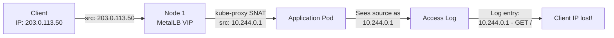
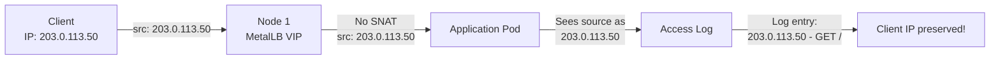
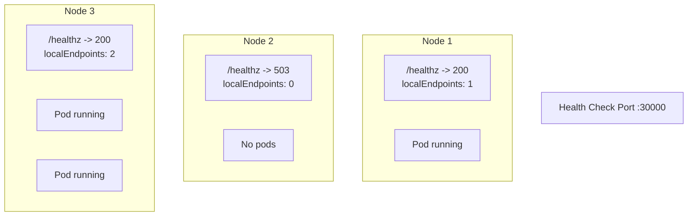

# How to Preserve Client Source IP with MetalLB Using Local Traffic Policy

Author: [nawazdhandala](https://www.github.com/nawazdhandala)

Tags: Kubernetes, MetalLB, Source IP, External Traffic Policy, Networking

Description: Learn how to preserve the original client source IP address when using MetalLB by configuring externalTrafficPolicy to Local.

---

When external traffic arrives at a Kubernetes LoadBalancer service, the default behavior is for kube-proxy to perform Source Network Address Translation (SNAT). This replaces the client's real IP address with the node's internal IP. For many applications - logging, rate limiting, geo-location, security auditing - you need the real client IP. This post shows you how to preserve it using MetalLB and the Local traffic policy.

## The Problem: SNAT Hides Client IPs

By default, Kubernetes services use `externalTrafficPolicy: Cluster`. Here is what happens to the client IP in that mode:



The application pod sees `10.244.0.1` (the node's IP) instead of `203.0.113.50` (the real client IP). This breaks any logic that depends on the client IP.

## The Solution: externalTrafficPolicy: Local

Setting `externalTrafficPolicy: Local` tells kube-proxy to skip SNAT and only forward traffic to pods on the receiving node:



## Configuring the Service

Here is a complete example with a deployment and LoadBalancer service that preserves client IPs:

```yaml
# deployment.yaml
# Deploy an nginx instance that logs client IPs.
apiVersion: apps/v1
kind: Deployment
metadata:
  name: web-server
  namespace: default
spec:
  replicas: 3
  selector:
    matchLabels:
      app: web-server
  template:
    metadata:
      labels:
        app: web-server
    spec:
      # Spread pods across nodes so the MetalLB leader always has a pod
      topologySpreadConstraints:
        - maxSkew: 1
          topologyKey: kubernetes.io/hostname
          whenUnsatisfiable: DoNotSchedule
          labelSelector:
            matchLabels:
              app: web-server
      containers:
        - name: nginx
          image: nginx:1.27
          ports:
            - containerPort: 80
```

```yaml
# service-local.yaml
# LoadBalancer service with Local traffic policy.
# This preserves the client source IP address.
apiVersion: v1
kind: Service
metadata:
  name: web-server
  namespace: default
spec:
  type: LoadBalancer
  # This is the key setting - preserves client source IP
  externalTrafficPolicy: Local
  selector:
    app: web-server
  ports:
    - name: http
      protocol: TCP
      port: 80
      targetPort: 80
```

Apply both:

```bash
# Deploy the application and service
kubectl apply -f deployment.yaml
kubectl apply -f service-local.yaml

# Wait for the external IP assignment
kubectl get svc web-server --watch
```

## Verifying Source IP Preservation

### Method 1: Check Nginx Access Logs

```bash
# Send a request from an external machine
curl http://192.168.1.200

# Check the nginx access logs inside the pod
kubectl logs -l app=web-server --tail=5

# You should see the real client IP in the logs:
# 203.0.113.50 - - [20/Feb/2026:10:30:00 +0000] "GET / HTTP/1.1" 200 612
```

### Method 2: Use an Echo Server

Deploy a server that reflects connection information:

```yaml
# echo-deployment.yaml
# An echo server that shows the client IP in the response body.
apiVersion: apps/v1
kind: Deployment
metadata:
  name: echo-server
  namespace: default
spec:
  replicas: 3
  selector:
    matchLabels:
      app: echo-server
  template:
    metadata:
      labels:
        app: echo-server
    spec:
      topologySpreadConstraints:
        - maxSkew: 1
          topologyKey: kubernetes.io/hostname
          whenUnsatisfiable: DoNotSchedule
          labelSelector:
            matchLabels:
              app: echo-server
      containers:
        - name: echo
          image: ealen/echo-server:latest
          ports:
            - containerPort: 80
---
# echo-service.yaml
apiVersion: v1
kind: Service
metadata:
  name: echo-server
  namespace: default
spec:
  type: LoadBalancer
  externalTrafficPolicy: Local
  selector:
    app: echo-server
  ports:
    - port: 80
      targetPort: 80
```

```bash
# Test and check the response for your real IP
curl -s http://192.168.1.201 | jq '.request.headers'

# The output should show your real client IP
# in headers like x-forwarded-for or x-real-ip
```

## The Health Check Consideration

When using `externalTrafficPolicy: Local`, Kubernetes creates a health check endpoint on each node. This health check tells external load balancers (and MetalLB in BGP mode) which nodes have pods for the service:

```bash
# Find the health check node port
kubectl get svc web-server -o jsonpath='{.spec.healthCheckNodePort}'

# Check the health endpoint on a specific node
curl http://node-1-ip:30000/healthz
```

The response indicates whether the node has pods:

```json
// Node with pods:
{
  "service": {
    "namespace": "default",
    "name": "web-server"
  },
  "localEndpoints": 1
}

// Node without pods:
{
  "service": {
    "namespace": "default",
    "name": "web-server"
  },
  "localEndpoints": 0
}
```



## Handling Uneven Traffic Distribution

With Local policy, traffic is only sent to pods on the node that receives the traffic. In L2 mode, only one node is the leader, so only pods on that node get traffic.

To mitigate this, ensure pods are scheduled on all nodes:

```bash
# Check pod distribution across nodes
kubectl get pods -l app=web-server -o wide

# If pods are not evenly distributed, check the topology constraints
kubectl describe deployment web-server | grep -A 5 "Topology"
```

For critical services, consider using a DaemonSet instead of a Deployment:

```yaml
# daemonset.yaml
# Run one pod per node to guarantee every node has a local endpoint.
# This ensures Local traffic policy always has a target.
apiVersion: apps/v1
kind: DaemonSet
metadata:
  name: web-server-ds
  namespace: default
spec:
  selector:
    matchLabels:
      app: web-server-ds
  template:
    metadata:
      labels:
        app: web-server-ds
    spec:
      containers:
        - name: nginx
          image: nginx:1.27
          ports:
            - containerPort: 80
```

## Using X-Forwarded-For as an Alternative

If you cannot use Local policy (for example, because you need even traffic distribution), you can use a reverse proxy that adds the `X-Forwarded-For` header:

```yaml
# nginx-configmap.yaml
# Configure nginx as a reverse proxy that adds X-Forwarded-For.
apiVersion: v1
kind: ConfigMap
metadata:
  name: nginx-proxy-config
  namespace: default
data:
  default.conf: |
    server {
        listen 80;

        location / {
            # Forward the real client IP in a header
            proxy_set_header X-Forwarded-For $proxy_add_x_forwarded_for;
            proxy_set_header X-Real-IP $remote_addr;
            proxy_pass http://backend-service:8080;
        }
    }
```

However, with Cluster policy, the `$remote_addr` seen by nginx is the node IP, not the client IP. So this only works if nginx itself is on the edge with Local policy.

## Comparison Summary

| Feature | Cluster Policy | Local Policy |
|---------|---------------|--------------|
| Client source IP | Hidden (SNAT) | Preserved |
| Traffic distribution | Even | Uneven (node-dependent) |
| Extra network hops | Yes (cross-node) | No |
| Pod scheduling requirements | None | Pods needed on receiving nodes |
| Health check node port | Not created | Automatically created |

## Monitoring Source IP-Dependent Services with OneUptime

When your applications depend on client source IPs for security or rate limiting, a misconfiguration can silently break these features. [OneUptime](https://oneuptime.com) can monitor your service endpoints from external locations, verify that responses reflect the correct client IP handling, and alert you when traffic policy changes impact your application behavior. This ensures your source IP preservation works correctly in production.
