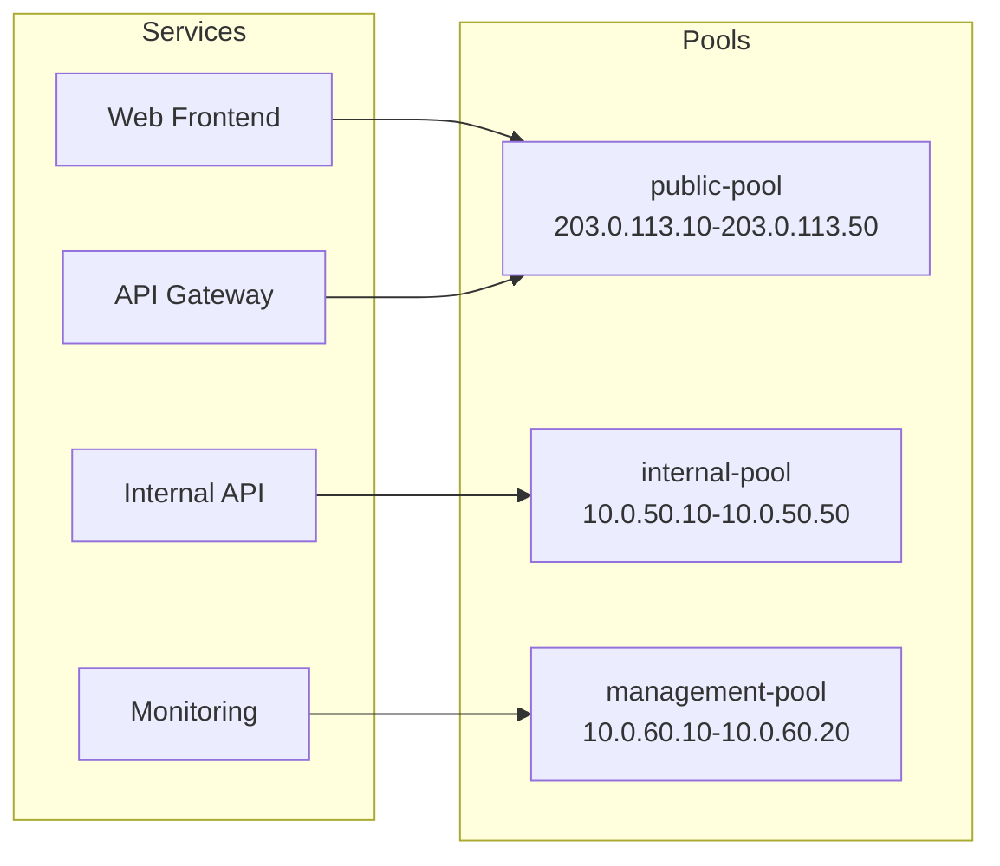
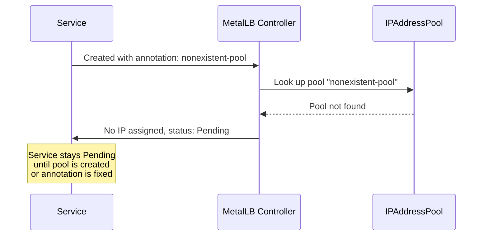

# How to Request IPs from a Named Address Pool in MetalLB

Author: [nawazdhandala](https://www.github.com/nawazdhandala)

Tags: Kubernetes, MetalLB, IP Pools, Annotations, Configuration

Description: Learn how to use MetalLB annotations to request IP addresses from a specific named address pool for your LoadBalancer services.

---

MetalLB lets you define multiple IP address pools, each with a different range and purpose. By default, MetalLB picks any available IP from any pool. But in production, you often need services to receive IPs from a specific pool. For example, you might have separate pools for public-facing services and internal services, or different pools for different environments.

This post shows you how to use annotations to direct MetalLB to assign IPs from a named pool.

## Why Use Named Pools?

Named pools let you segment your IP address space by purpose:

- **Public pool** for internet-facing services
- **Internal pool** for cluster-internal load balancers
- **Management pool** for monitoring and admin tools
- **Tenant pools** for multi-tenant clusters



## Defining Multiple IP Address Pools

Start by creating multiple pools with descriptive names:

```yaml
# ip-pools.yaml
# Define separate pools for different service categories.
# Each pool has a distinct IP range and name.
apiVersion: metallb.io/v1beta1
kind: IPAddressPool
metadata:
  # Pool for public-facing services
  name: public-pool
  namespace: metallb-system
spec:
  addresses:
    # Public IP range allocated by your ISP or hosting provider
    - 203.0.113.10-203.0.113.50
---
apiVersion: metallb.io/v1beta1
kind: IPAddressPool
metadata:
  # Pool for internal services only
  name: internal-pool
  namespace: metallb-system
spec:
  addresses:
    # Private IP range for internal services
    - 10.0.50.10-10.0.50.50
---
apiVersion: metallb.io/v1beta1
kind: IPAddressPool
metadata:
  # Pool for management and monitoring tools
  name: management-pool
  namespace: metallb-system
spec:
  addresses:
    # Small range for management services
    - 10.0.60.10-10.0.60.20
```

Apply all pools:

```bash
# Create all three IP address pools
kubectl apply -f ip-pools.yaml

# Verify the pools were created
kubectl get ipaddresspools -n metallb-system
```

## Configuring Advertisements for Each Pool

Each pool needs an advertisement configuration. You can use different advertisement types for different pools:

```yaml
# advertisements.yaml
# L2 advertisement for the internal and management pools.
# BGP advertisement for the public pool.
apiVersion: metallb.io/v1beta1
kind: L2Advertisement
metadata:
  name: internal-l2
  namespace: metallb-system
spec:
  ipAddressPools:
    - internal-pool
    - management-pool
---
apiVersion: metallb.io/v1beta1
kind: BGPAdvertisement
metadata:
  name: public-bgp
  namespace: metallb-system
spec:
  ipAddressPools:
    - public-pool
```

## Requesting an IP from a Specific Pool

Use the `metallb.universe.tf/address-pool` annotation on your Service to request an IP from a specific pool:

```yaml
# public-web-service.yaml
# This service will receive an IP from the public-pool.
# The annotation tells MetalLB which pool to use.
apiVersion: v1
kind: Service
metadata:
  name: web-frontend
  namespace: default
  annotations:
    # Direct MetalLB to use the public pool for this service
    metallb.universe.tf/address-pool: public-pool
spec:
  type: LoadBalancer
  selector:
    app: web-frontend
  ports:
    - name: http
      protocol: TCP
      port: 80
      targetPort: 8080
    - name: https
      protocol: TCP
      port: 443
      targetPort: 8443
```

And for an internal service:

```yaml
# internal-api-service.yaml
# This service will receive an IP from the internal-pool.
apiVersion: v1
kind: Service
metadata:
  name: internal-api
  namespace: default
  annotations:
    # Direct MetalLB to use the internal pool
    metallb.universe.tf/address-pool: internal-pool
spec:
  type: LoadBalancer
  selector:
    app: internal-api
  ports:
    - name: grpc
      protocol: TCP
      port: 9090
      targetPort: 9090
```

## Verifying Pool Assignment

After creating services, verify that IPs were assigned from the correct pools:

```bash
# Check all LoadBalancer services and their IPs
kubectl get svc -A --field-selector spec.type=LoadBalancer

# Verify the web-frontend got an IP from the public range (203.0.113.x)
kubectl get svc web-frontend -o jsonpath='{.status.loadBalancer.ingress[0].ip}'

# Verify the internal-api got an IP from the internal range (10.0.50.x)
kubectl get svc internal-api -o jsonpath='{.status.loadBalancer.ingress[0].ip}'
```

Expected output:

```
NAME            TYPE           CLUSTER-IP     EXTERNAL-IP     PORT(S)
web-frontend    LoadBalancer   10.96.10.5     203.0.113.10    80:31001/TCP,443:31002/TCP
internal-api    LoadBalancer   10.96.10.8     10.0.50.10      9090:31003/TCP
```

## What Happens with an Invalid Pool Name

If you reference a pool name that does not exist, the service will remain in `Pending` state:

```yaml
# bad-pool-reference.yaml
# This will fail because "nonexistent-pool" is not defined.
apiVersion: v1
kind: Service
metadata:
  name: broken-service
  namespace: default
  annotations:
    metallb.universe.tf/address-pool: nonexistent-pool
spec:
  type: LoadBalancer
  selector:
    app: test
  ports:
    - port: 80
      targetPort: 8080
```

Check the events to see the error:

```bash
# Describe the service to see allocation failure events
kubectl describe svc broken-service
```



## Controlling Auto-Assignment with Pool Settings

You can prevent MetalLB from automatically assigning IPs from certain pools by setting `autoAssign: false`:

```yaml
# reserved-pool.yaml
# This pool will only assign IPs when explicitly requested.
# Services without the pool annotation will not get IPs from here.
apiVersion: metallb.io/v1beta1
kind: IPAddressPool
metadata:
  name: reserved-pool
  namespace: metallb-system
spec:
  addresses:
    - 10.0.70.10-10.0.70.15
  # Prevent automatic assignment from this pool
  autoAssign: false
```

With `autoAssign: false`, a service must explicitly request this pool through the annotation. Services without any pool annotation will only receive IPs from pools where `autoAssign` is `true` (the default).

## Combining Pool Selection with Specific IP

You can combine a pool annotation with a specific IP request for maximum control:

```yaml
# specific-ip-from-pool.yaml
# Request a specific IP and also specify which pool it belongs to.
apiVersion: v1
kind: Service
metadata:
  name: critical-service
  namespace: default
  annotations:
    metallb.universe.tf/address-pool: public-pool
spec:
  type: LoadBalancer
  # Request a specific IP from within the public pool range
  loadBalancerIP: 203.0.113.25
  selector:
    app: critical-service
  ports:
    - name: https
      protocol: TCP
      port: 443
      targetPort: 8443
```

## Listing Pool Utilization

Monitor how many IPs are used in each pool:

```bash
# Count services assigned to each pool by checking IP ranges
kubectl get svc -A --field-selector spec.type=LoadBalancer \
  -o jsonpath='{range .items[*]}{.metadata.name}{"\t"}{.status.loadBalancer.ingress[0].ip}{"\n"}{end}'

# Check MetalLB controller logs for pool assignment details
kubectl logs -n metallb-system -l component=controller --tail=50
```

## Best Practices for Named Pools

1. Use descriptive pool names that reflect their purpose
2. Set `autoAssign: false` on pools reserved for critical services
3. Document which pools are for which environments or teams
4. Size pools based on expected service count plus growth buffer
5. Use separate advertisements per pool when network requirements differ
6. Monitor pool utilization to catch exhaustion early

## Monitoring Pool Health with OneUptime

As your pool count grows, tracking IP utilization and assignment health becomes essential. [OneUptime](https://oneuptime.com) can monitor each LoadBalancer service endpoint, alert you when services fail to get an IP from their designated pool, and give you dashboards showing the health of your entire MetalLB setup across all named pools.
