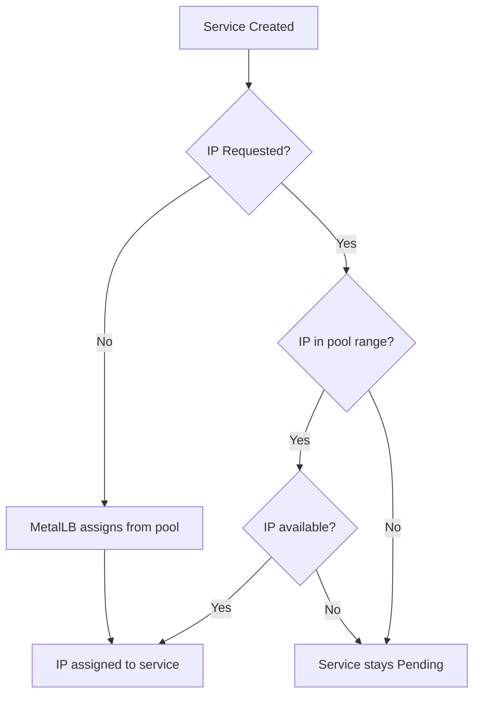
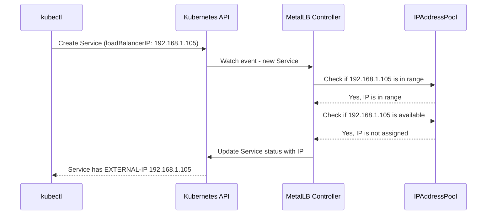

# How to Request a Specific IP Address for a Service in MetalLB

Author: [nawazdhandala](https://www.github.com/nawazdhandala)

Tags: Kubernetes, MetalLB, IP Address, LoadBalancer, Configuration

Description: Learn how to request a specific IP address for a Kubernetes LoadBalancer service using MetalLB annotations and spec fields.

---

When running services in a bare-metal Kubernetes cluster with MetalLB, you sometimes need a service to receive a specific external IP address. This is common when DNS records are already configured, when firewall rules reference a fixed IP, or when you need deterministic addressing for compliance reasons.

MetalLB supports two ways to request a specific IP: using the Kubernetes-native `spec.loadBalancerIP` field and using MetalLB-specific annotations.

## Why Request a Specific IP?

There are several scenarios where you need a fixed IP address for your service:

- DNS A records pointing to a known IP
- Firewall allowlists that reference specific addresses
- Third-party integrations that require a static callback IP
- Migration from another load balancer where the IP must stay the same



## Prerequisites

Before requesting a specific IP, make sure you have:

1. A working MetalLB installation
2. An IPAddressPool that contains the IP you want to request
3. An L2Advertisement or BGPAdvertisement configured

## Setting Up an IP Address Pool

First, define an IPAddressPool that includes the IP you want to assign:

```yaml
# ip-address-pool.yaml
# This pool defines a range of IPs available for MetalLB to assign.
# The specific IP you want to request must fall within this range.
apiVersion: metallb.io/v1beta1
kind: IPAddressPool
metadata:
  name: production-pool
  namespace: metallb-system
spec:
  addresses:
    # Range of IPs available for assignment
    - 192.168.1.100-192.168.1.120
```

Apply the pool:

```bash
# Apply the IP address pool configuration
kubectl apply -f ip-address-pool.yaml
```

## Method 1: Using spec.loadBalancerIP

The simplest way to request a specific IP is through the `spec.loadBalancerIP` field on the Service resource. This is a standard Kubernetes field that MetalLB honors.

```yaml
# service-with-specific-ip.yaml
# Request a specific IP using the native Kubernetes field.
# The IP must exist within a configured IPAddressPool.
apiVersion: v1
kind: Service
metadata:
  name: web-app
  namespace: default
spec:
  type: LoadBalancer
  # Request this specific IP address from MetalLB
  loadBalancerIP: 192.168.1.105
  selector:
    app: web-app
  ports:
    - name: http
      protocol: TCP
      port: 80
      targetPort: 8080
```

Apply and verify:

```bash
# Create the service with the specific IP request
kubectl apply -f service-with-specific-ip.yaml

# Verify the IP was assigned correctly
kubectl get svc web-app -o wide
```

The output should show `192.168.1.105` as the external IP:

```
NAME      TYPE           CLUSTER-IP     EXTERNAL-IP     PORT(S)        AGE
web-app   LoadBalancer   10.96.45.12    192.168.1.105   80:31234/TCP   5s
```

## Method 2: Using MetalLB Annotations

MetalLB also supports requesting a specific IP through annotations. This is useful when you want to keep the request explicit and MetalLB-specific:

```yaml
# service-with-annotation-ip.yaml
# Use the MetalLB-specific annotation to request an IP.
# This approach makes the MetalLB dependency explicit.
apiVersion: v1
kind: Service
metadata:
  name: api-gateway
  namespace: default
  annotations:
    # MetalLB annotation for requesting a specific IP
    metallb.universe.tf/loadBalancerIPs: "192.168.1.110"
spec:
  type: LoadBalancer
  selector:
    app: api-gateway
  ports:
    - name: https
      protocol: TCP
      port: 443
      targetPort: 8443
```

## What Happens When the IP Is Not Available

If the requested IP is already assigned to another service or falls outside any configured pool, MetalLB will not assign an IP. The service will remain in a `Pending` state.

```bash
# Check the service status
kubectl get svc api-gateway

# Look at events for more details on why assignment failed
kubectl describe svc api-gateway
```

You will see an event like:

```
Events:
  Type     Reason            Age   From                Message
  ----     ------            ----  ----                -------
  Warning  AllocationFailed  10s   metallb-controller  Failed to allocate IP for "default/api-gateway": "192.168.1.110" is not allowed in config
```

## Requesting Multiple IPs (Dual-Stack)

If your cluster supports dual-stack networking, you can request both an IPv4 and an IPv6 address:

```yaml
# dual-stack-service.yaml
# Request both IPv4 and IPv6 addresses for dual-stack support.
apiVersion: v1
kind: Service
metadata:
  name: dual-stack-app
  namespace: default
  annotations:
    # Comma-separated list for multiple IPs
    metallb.universe.tf/loadBalancerIPs: "192.168.1.115,fd00::1:115"
spec:
  type: LoadBalancer
  ipFamilyPolicy: RequireDualStack
  ipFamilies:
    - IPv4
    - IPv6
  selector:
    app: dual-stack-app
  ports:
    - name: http
      protocol: TCP
      port: 80
      targetPort: 8080
```

## Verifying IP Assignment

After creating your service, verify the assignment with these commands:

```bash
# Check the external IP assignment
kubectl get svc web-app -o jsonpath='{.status.loadBalancer.ingress[0].ip}'

# Verify connectivity from outside the cluster
curl http://192.168.1.105

# Check MetalLB speaker logs for assignment details
kubectl logs -n metallb-system -l component=speaker --tail=20
```



## Common Pitfalls

Here are mistakes to avoid when requesting specific IPs:

1. **IP outside pool range** - The requested IP must be within a configured IPAddressPool
2. **IP already in use** - Another service in the cluster already has this IP
3. **Typos in the annotation key** - Double-check the annotation name
4. **Missing L2 or BGP advertisement** - The pool must have an associated advertisement
5. **DHCP conflict** - Make sure no DHCP server is also assigning this IP

## Releasing and Reassigning IPs

When you delete a service, the IP returns to the available pool:

```bash
# Delete the service to release the IP
kubectl delete svc web-app

# The IP 192.168.1.105 is now available for reassignment
# Create a new service requesting the same IP
kubectl apply -f service-with-specific-ip.yaml
```

## Best Practices

- Document which IPs are assigned to which services
- Use a naming convention in your IPAddressPool names
- Keep a small pool of reserved IPs for services that need static addresses
- Use separate pools for static and dynamic IP assignments
- Monitor IP pool utilization to avoid exhaustion

## Monitoring with OneUptime

Keeping track of IP assignments and service availability is critical in production. [OneUptime](https://oneuptime.com) can monitor your LoadBalancer services to alert you when an IP assignment fails, when a service becomes unreachable, or when your IP pools are running low. With OneUptime, you get full observability into your bare-metal Kubernetes infrastructure.
