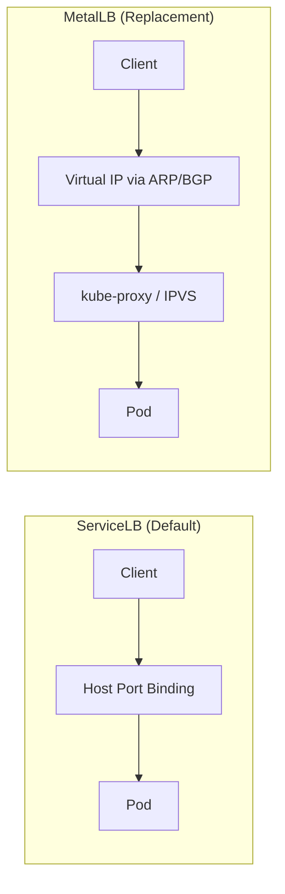
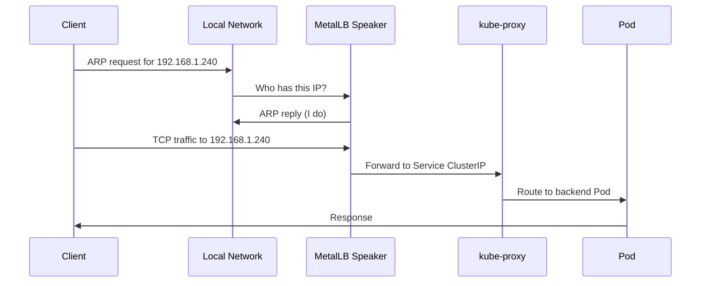

# How to Install MetalLB on RKE2 (Rancher Kubernetes Engine 2)

Author: [nawazdhandala](https://www.github.com/nawazdhandala)

Tags: Kubernetes, MetalLB, RKE2, Rancher, Load Balancing

Description: A guide to installing MetalLB on RKE2 clusters. Learn how to handle RKE2 defaults, disable its built-in load balancer, and configure MetalLB for production use.

---

RKE2 (Rancher Kubernetes Engine 2) is a fully conformant Kubernetes distribution focused on security and compliance. It ships with sensible defaults out of the box, including a built-in load balancer called **ServiceLB** (formerly Klipper). While ServiceLB works well for simple setups, production bare-metal environments often need the flexibility and protocol support that **MetalLB** provides.

This guide walks through the full process of installing MetalLB on an RKE2 cluster, from disabling RKE2's built-in ServiceLB to verifying your MetalLB configuration in production.

## How RKE2 Networking Defaults Work

RKE2 bundles several networking components by default:

- **Canal CNI** (Calico + Flannel) for pod networking
- **CoreDNS** for cluster DNS
- **ServiceLB** (Klipper) as the default LoadBalancer controller
- **Nginx Ingress Controller** for HTTP/HTTPS traffic

ServiceLB works by deploying a DaemonSet that binds directly to host ports. This is fine for single-node or test clusters, but it has limitations:

- No support for BGP (Border Gateway Protocol)
- No fine-grained IP pool management
- Limited ARP/NDP handling
- Conflicts with MetalLB if both run simultaneously

The following diagram shows the difference between the two approaches:



## Prerequisites

Before you begin, make sure you have:

- An RKE2 cluster (single or multi-node) with at least version v1.25+
- `kubectl` configured to talk to your cluster
- `helm` v3 installed
- A range of free IP addresses on your network for MetalLB to allocate
- SSH access to RKE2 server nodes (for config changes)

## Step 1: Disable ServiceLB on RKE2

You must disable RKE2's built-in ServiceLB before installing MetalLB. Running both at the same time causes IP conflicts and unpredictable behavior.

Edit the RKE2 server configuration file on **each server node**:

```bash
# Open the RKE2 config file for editing
# This file controls RKE2 server behavior at startup
sudo nano /etc/rancher/rke2/config.yaml
```

Add the following line to disable ServiceLB:

```yaml
# /etc/rancher/rke2/config.yaml
#
# disable: tells RKE2 which built-in components to skip
# rke2-servicelb: the built-in Klipper load balancer
disable:
  - rke2-servicelb
```

After saving, restart the RKE2 server service:

```bash
# Restart RKE2 to apply the config change
# The server will come back up without the ServiceLB controller
sudo systemctl restart rke2-server
```

Verify that ServiceLB pods are gone:

```bash
# Check that no servicelb pods are running
# If the disable worked, this should return nothing
kubectl get pods -A | grep servicelb
```

> **Important:** If you also want to bring your own ingress controller instead of the bundled Nginx, you can add `rke2-ingress-nginx` to the disable list.

## Step 2: Install MetalLB via Helm

Add the MetalLB Helm repository and install it into its own namespace:

```bash
# Add the official MetalLB Helm chart repository
helm repo add metallb https://metallb.github.io/metallb

# Update your local Helm chart cache
helm repo update

# Create a dedicated namespace for MetalLB
kubectl create namespace metallb-system

# Install MetalLB using Helm
# --namespace: target namespace for all MetalLB resources
# --wait: block until all pods are ready before returning
helm install metallb metallb/metallb \
  --namespace metallb-system \
  --wait
```

Wait for the MetalLB pods to become ready:

```bash
# Verify that the MetalLB controller and speaker pods are running
# You should see one controller pod and one speaker pod per node
kubectl get pods -n metallb-system
```

Expected output should look like:

```
NAME                                  READY   STATUS    RESTARTS   AGE
metallb-controller-7cf77b4f8b-x9k2l  1/1     Running   0          45s
metallb-speaker-abc12                 1/1     Running   0          45s
metallb-speaker-def34                 1/1     Running   0          45s
```

## Step 3: Configure an L2 (Layer 2) IP Address Pool

MetalLB needs two resources to start handing out IPs:

1. **IPAddressPool** - defines which IPs MetalLB can allocate
2. **L2Advertisement** - tells MetalLB to announce those IPs via ARP/NDP

Create a file called `metallb-config.yaml`:

```yaml
# metallb-config.yaml
# This file defines the IP pool and advertisement method for MetalLB
---
apiVersion: metallb.io/v1beta1
kind: IPAddressPool
metadata:
  # A descriptive name for this pool
  name: rke2-pool
  # Must match the namespace where MetalLB is installed
  namespace: metallb-system
spec:
  addresses:
    # CIDR range of IPs available for LoadBalancer services
    # Replace with your actual free IP range on the local network
    - 192.168.1.240-192.168.1.250
    # You can add additional ranges or single IPs as needed
    # - 10.0.0.100/32

---
apiVersion: metallb.io/v1beta1
kind: L2Advertisement
metadata:
  # Name for the advertisement resource
  name: rke2-l2-advert
  namespace: metallb-system
spec:
  # Bind this advertisement to specific IP pools
  # If omitted, it advertises all pools (not recommended in multi-pool setups)
  ipAddressPools:
    - rke2-pool
```

Apply the configuration:

```bash
# Apply the MetalLB pool and advertisement config
# MetalLB will immediately start watching for LoadBalancer services
kubectl apply -f metallb-config.yaml
```

Here is how traffic flows with L2 mode in place:



## Step 4: Deploy a Test Service

Create a simple test deployment and LoadBalancer service to verify everything works:

```yaml
# test-lb.yaml
# A minimal nginx deployment and LoadBalancer service for testing
---
apiVersion: apps/v1
kind: Deployment
metadata:
  name: nginx-test
  namespace: default
spec:
  replicas: 2
  selector:
    matchLabels:
      app: nginx-test
  template:
    metadata:
      labels:
        app: nginx-test
    spec:
      containers:
        - name: nginx
          image: nginx:alpine
          ports:
            # Nginx listens on port 80 by default
            - containerPort: 80

---
apiVersion: v1
kind: Service
metadata:
  name: nginx-lb
  namespace: default
  annotations:
    # Optional: pin this service to a specific pool
    metallb.universe.tf/address-pool: rke2-pool
spec:
  type: LoadBalancer
  ports:
    - protocol: TCP
      port: 80          # External port
      targetPort: 80    # Container port
  selector:
    app: nginx-test
```

Apply and check:

```bash
# Deploy the test nginx and LoadBalancer service
kubectl apply -f test-lb.yaml

# Watch for the EXTERNAL-IP to be assigned
# It should receive an IP from the rke2-pool range within a few seconds
kubectl get svc nginx-lb --watch
```

You should see output like:

```
NAME       TYPE           CLUSTER-IP      EXTERNAL-IP     PORT(S)        AGE
nginx-lb   LoadBalancer   10.43.200.150   192.168.1.240   80:31234/TCP   10s
```

Test connectivity:

```bash
# Verify the LoadBalancer IP responds with the default nginx page
# Replace with the actual EXTERNAL-IP from the previous command
curl http://192.168.1.240
```

## RKE2-Specific Gotchas and Tips

### 1. Canal CNI and Speaker Pods

RKE2 uses Canal (Calico + Flannel) by default. MetalLB speakers run as a DaemonSet and need to send gratuitous ARP packets. If you have strict Calico network policies, you need to allow traffic from the `metallb-system` namespace:

```yaml
# calico-allow-metallb.yaml
# Allows MetalLB speaker pods to send ARP and communicate with peers
apiVersion: projectcalico.org/v3
kind: GlobalNetworkPolicy
metadata:
  name: allow-metallb-speaker
spec:
  selector: app.kubernetes.io/name == 'metallb'
  types:
    - Ingress
    - Egress
  ingress:
    # Allow all inbound traffic to MetalLB speakers
    - action: Allow
  egress:
    # Allow all outbound traffic from MetalLB speakers
    - action: Allow
```

### 2. Firewall Rules on RKE2 Nodes

RKE2 nodes often run with `firewalld` or `iptables` rules. Make sure the following ports are open:

| Port    | Protocol | Purpose                        |
|---------|----------|--------------------------------|
| 7946    | TCP/UDP  | MetalLB speaker memberlist     |
| 7472    | TCP      | MetalLB metrics (optional)     |

```bash
# Open MetalLB memberlist port on each node (firewalld example)
sudo firewall-cmd --permanent --add-port=7946/tcp
sudo firewall-cmd --permanent --add-port=7946/udp
sudo firewall-cmd --reload
```

### 3. Avoid IP Conflicts with RKE2 Service CIDR

RKE2 defaults to `10.43.0.0/16` for its Service CIDR. Make sure your MetalLB IP pool does **not** overlap with this range. Your pool should use IPs from your physical/external network, not from the Kubernetes internal ranges.

### 4. Multi-Server HA Setups

In an RKE2 HA setup with multiple server nodes, ensure you disable ServiceLB on **every server node** before installing MetalLB. A single node still running ServiceLB can cause intermittent failures.

### 5. Upgrading RKE2 Without Losing MetalLB

When you upgrade RKE2, the `config.yaml` is preserved, so the `disable` setting persists. However, always verify after an upgrade:

```bash
# After upgrading RKE2, confirm ServiceLB is still disabled
# This should return empty if the disable setting was preserved
kubectl get pods -A | grep servicelb

# Confirm MetalLB pods are healthy after the upgrade
kubectl get pods -n metallb-system
```

## Quick Reference: Full Setup Checklist

Here is a condensed checklist you can follow:

1. Edit `/etc/rancher/rke2/config.yaml` and add `rke2-servicelb` to the `disable` list
2. Restart `rke2-server` on all server nodes
3. Install MetalLB via Helm into `metallb-system`
4. Create an `IPAddressPool` with your free IP range
5. Create an `L2Advertisement` bound to that pool
6. Deploy a test `LoadBalancer` service and confirm an external IP is assigned
7. Open firewall ports 7946 (TCP/UDP) on all nodes if running `firewalld`

## Conclusion

MetalLB is the go-to solution for production-grade load balancing on bare-metal Kubernetes clusters, and RKE2 is no exception. The key RKE2-specific step is disabling ServiceLB before MetalLB goes in. Once that is done, the rest follows the standard MetalLB installation process.

If you are running RKE2 in production and want full observability into your cluster, services, and endpoints, check out [OneUptime](https://oneuptime.com). OneUptime provides monitoring, alerting, status pages, and incident management - all in one open-source platform - so you can keep track of your LoadBalancer services, node health, and everything in between.
