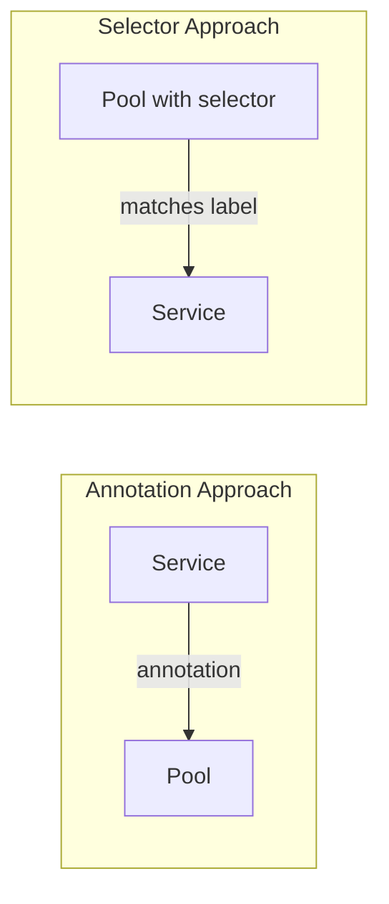
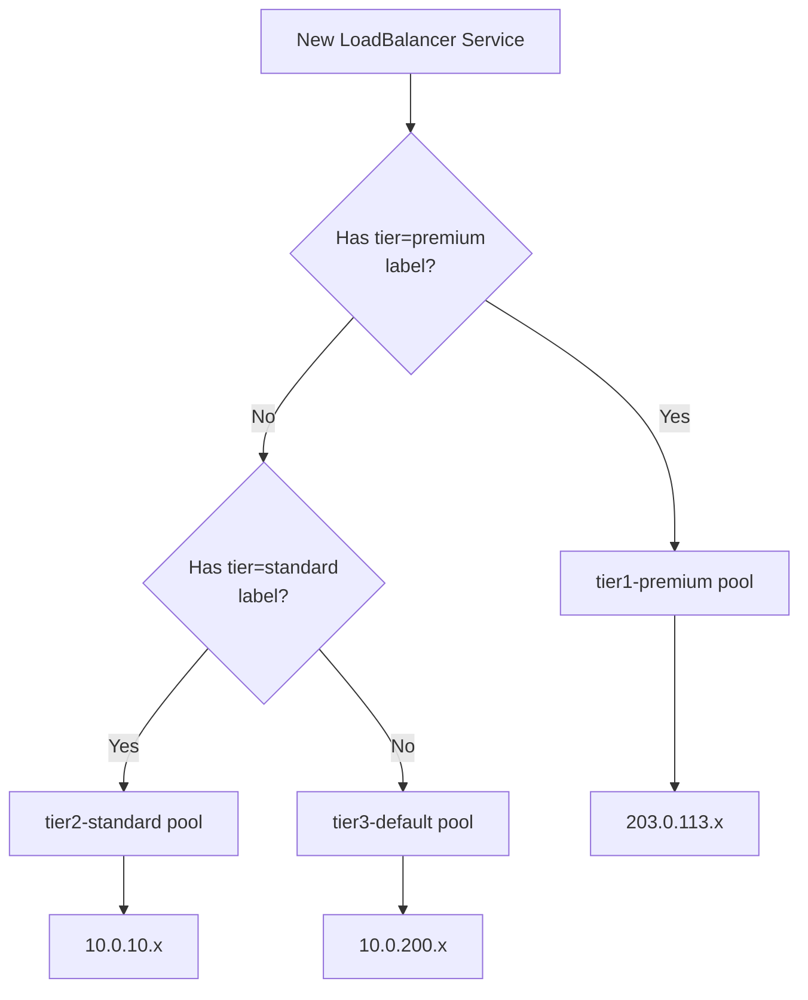

# How to Use Service Selectors to Pin IPAddressPools to Specific Services

Author: [nawazdhandala](https://www.github.com/nawazdhandala)

Tags: Kubernetes, MetalLB, Service Selectors, IP Pools, Configuration

Description: Learn how to use service selectors in MetalLB IPAddressPool resources to assign specific IP pools to services matching label criteria.

---

> MetalLB's service selectors let you automatically route IP allocation based on service labels instead of relying on manual annotations. Label a service with `tier: premium` and MetalLB hands it a premium IP without the developer needing to know pool names.

This guide covers how to configure `serviceAllocation.serviceSelectors` on IPAddressPool resources and how to design a label strategy that scales.

---

## Service Selectors vs Annotations

There are two ways to direct a service to a specific pool:

| Method | Who Decides | Scales How |
|--------|------------|-----------|
| Annotation (`metallb.universe.tf/address-pool`) | Service author | Must know pool names |
| Service selector on pool | Platform team | Automatic based on labels |



Service selectors are better for platform teams because developers do not need to know infrastructure details - they just label their services according to organizational conventions.

---

## Basic Service Selector

Add a `serviceAllocation.serviceSelectors` field to your IPAddressPool:

```yaml
# pool-premium.yaml
# Pool that automatically serves any service labeled tier=premium
apiVersion: metallb.io/v1beta1
kind: IPAddressPool
metadata:
  name: premium-ips
  namespace: metallb-system
spec:
  addresses:
    # Limited set of premium public IPs
    - 203.0.113.10-203.0.113.15
  serviceAllocation:
    priority: 10
    serviceSelectors:
      - matchLabels:
          # Any service with this label gets an IP from this pool
          tier: premium
```

Now any service with the label `tier: premium` automatically gets an IP from this pool:

```yaml
# service-api.yaml
# Service that will automatically get a premium IP due to its label
apiVersion: v1
kind: Service
metadata:
  name: critical-api
  labels:
    # This label triggers the premium pool selector
    tier: premium
    app: critical-api
spec:
  type: LoadBalancer
  selector:
    app: critical-api
  ports:
    - port: 443
      targetPort: 8443
```

---

## Multiple Selector Criteria

You can require multiple labels to match using `matchLabels`:

```yaml
# pool-prod-external.yaml
# Pool for services that are both production AND external-facing
apiVersion: metallb.io/v1beta1
kind: IPAddressPool
metadata:
  name: prod-external-ips
  namespace: metallb-system
spec:
  addresses:
    - 198.51.100.0/28
  serviceAllocation:
    priority: 10
    serviceSelectors:
      - matchLabels:
          # Both labels must be present on the service
          environment: production
          exposure: external
```

A service must have BOTH labels to match:

```yaml
# This service matches - has both labels
apiVersion: v1
kind: Service
metadata:
  name: web-frontend
  labels:
    environment: production
    exposure: external
spec:
  type: LoadBalancer
  selector:
    app: web-frontend
  ports:
    - port: 443
      targetPort: 8443
```

---

## Using matchExpressions for Complex Logic

For more complex matching, use `matchExpressions`:

```yaml
# pool-non-dev.yaml
# Pool for any service NOT in development
apiVersion: metallb.io/v1beta1
kind: IPAddressPool
metadata:
  name: non-dev-ips
  namespace: metallb-system
spec:
  addresses:
    - 10.0.50.0/24
  serviceAllocation:
    priority: 20
    serviceSelectors:
      - matchExpressions:
          # Match services where environment is staging OR production
          - key: environment
            operator: In
            values:
              - staging
              - production
```

Supported operators:

| Operator | Meaning |
|----------|---------|
| `In` | Label value is one of the listed values |
| `NotIn` | Label value is not one of the listed values |
| `Exists` | Label key exists (any value) |
| `DoesNotExist` | Label key does not exist |

---

## Allocation Flow Diagram



---

## Verifying Selector Matches

```bash
# List services with their labels to verify what should match
kubectl get svc -A --show-labels | grep LoadBalancer

# Check which pool a service got its IP from
kubectl describe svc critical-api | grep -A5 "Events"

# View pool definitions with their selectors
kubectl get ipaddresspool -n metallb-system -o yaml

# Check MetalLB logs for allocation decisions
kubectl logs -n metallb-system -l app=metallb,component=controller | grep "allocat"
```

---

## Best Practices

| Practice | Reason |
|----------|--------|
| Use a consistent label taxonomy | Prevents selector sprawl |
| Document label conventions | Developers know what labels to add |
| Always have a catch-all pool | Unlabeled services still get IPs |
| Prefer selectors over annotations | Decouples developers from infrastructure details |

---

## Wrapping Up

Service selectors on IPAddressPools let your platform team control IP allocation through labels, removing the need for developers to know pool names. Combined with namespace selectors and priorities, you get a flexible, self-service IP management system.

Monitor your pool utilization and service health across all tiers with **[OneUptime](https://oneuptime.com)** - open-source observability for Kubernetes infrastructure.
