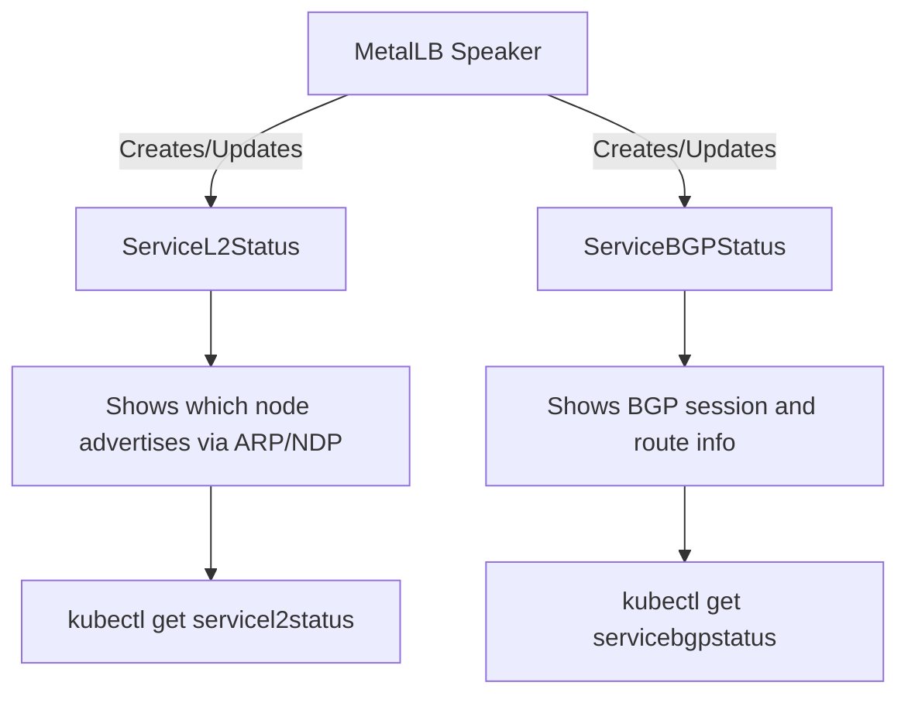
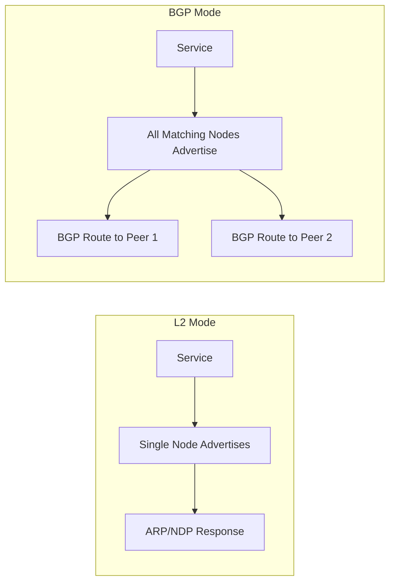
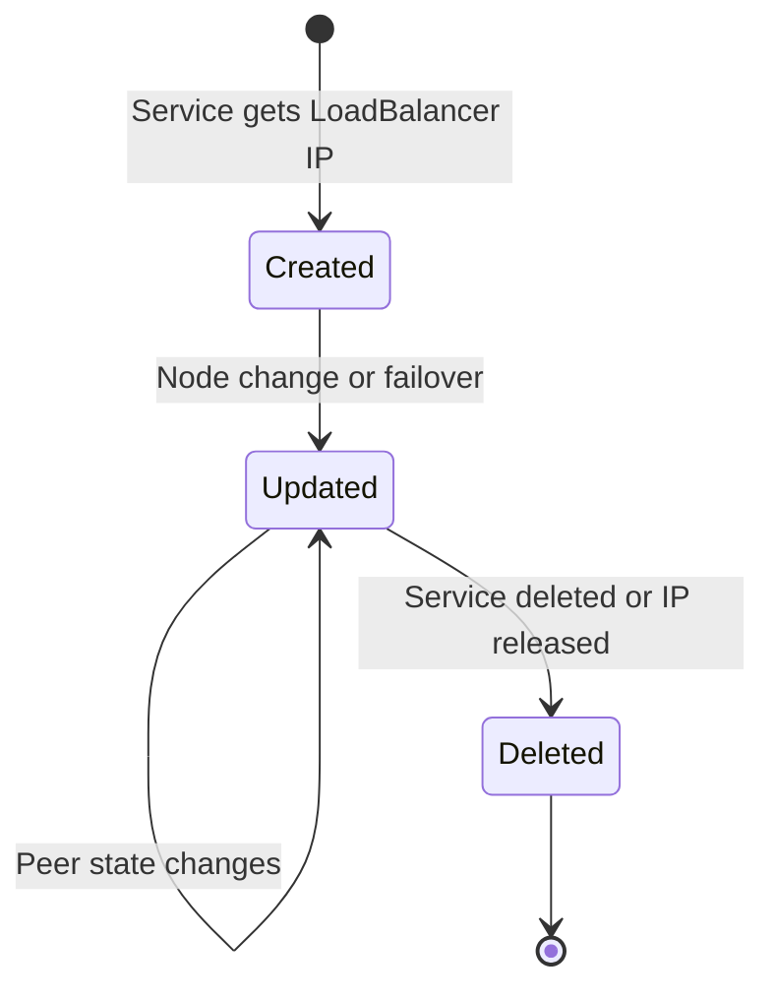

# How to Understand MetalLB ServiceL2Status and ServiceBGPStatus Resources

Author: [nawazdhandala](https://www.github.com/nawazdhandala)

Tags: Kubernetes, MetalLB, Status, CRD, Monitoring

Description: Learn how to read and interpret MetalLB ServiceL2Status and ServiceBGPStatus custom resources for monitoring service advertisement health.

---

MetalLB v0.14 introduced `ServiceL2Status` and `ServiceBGPStatus` custom resources that give you detailed visibility into how each service is being advertised. These resources replace the need to dig through speaker logs and make monitoring much simpler.

## What Are These Status Resources?

Before these CRDs, figuring out which node was advertising a service required parsing speaker pod logs. Now, MetalLB creates status objects that you can query directly with kubectl.



## ServiceL2Status

The `ServiceL2Status` resource shows the current L2 advertisement state for a service. It tells you which node is the active announcer and which interfaces are being used.

### Listing L2 Status Resources

```bash
# List all ServiceL2Status resources across all namespaces
kubectl get servicel2status -A
```

Example output:

```
NAMESPACE   NAME                   SERVICE      NODE       IPS
default     my-service-l2-status   my-service   worker-1   ["192.168.1.100"]
```

### Inspecting a Specific L2 Status

```bash
# Get detailed information about a specific L2 status resource
kubectl get servicel2status my-service-l2-status -n default -o yaml
```

The output looks like this:

```yaml
apiVersion: metallb.io/v1beta1
kind: ServiceL2Status
metadata:
  name: my-service-l2-status
  namespace: default
  # Labels link this status back to the parent service
  labels:
    metallb.io/service-name: my-service
    metallb.io/service-namespace: default
spec:
  # The service this status belongs to
  serviceName: my-service
  serviceNamespace: default
status:
  # The node currently announcing this service via L2
  node: worker-1
  # The interfaces used for ARP/NDP announcements
  interfaces:
    - name: eth0
  # The IP addresses being advertised
  ips:
    - "192.168.1.100"
```

## ServiceBGPStatus

The `ServiceBGPStatus` resource shows BGP advertisement state, including which peers are receiving route announcements and the session health.

### Listing BGP Status Resources

```bash
# List all ServiceBGPStatus resources in the cluster
kubectl get servicebgpstatus -A
```

### Inspecting a BGP Status

```bash
# View detailed BGP advertisement status for a service
kubectl get servicebgpstatus my-service-bgp-status -n default -o yaml
```

```yaml
apiVersion: metallb.io/v1beta1
kind: ServiceBGPStatus
metadata:
  name: my-service-bgp-status
  namespace: default
  labels:
    metallb.io/service-name: my-service
    metallb.io/service-namespace: default
spec:
  serviceName: my-service
  serviceNamespace: default
status:
  # Each node advertising this service via BGP
  nodes:
    - name: worker-1
      # BGP peers receiving the route
      peers:
        - address: 10.0.0.1
          # Whether the route was successfully advertised
          advertised: true
          # BGP session state
          sessionState: established
        - address: 10.0.0.2
          advertised: true
          sessionState: established
    - name: worker-2
      peers:
        - address: 10.0.0.1
          advertised: true
          sessionState: established
```

## Comparing L2 and BGP Status

The key difference is in how many nodes advertise:



| Aspect | ServiceL2Status | ServiceBGPStatus |
|--------|----------------|-----------------|
| Nodes | Single active node | Multiple nodes |
| Protocol | ARP (IPv4) / NDP (IPv6) | BGP sessions |
| Failover | Node re-election | Router ECMP |
| Key field | `status.node` | `status.nodes[].peers` |

## Using Status Resources for Health Checks

You can build health checks around these status resources.

### Check if L2 Service Has an Active Announcer

```bash
# Verify that an L2 service has a node assigned to announce it
# If this returns empty, the service is not being advertised
NODE=$(kubectl get servicel2status -n default \
  -l metallb.io/service-name=my-service \
  -o jsonpath='{.items[0].status.node}')

if [ -z "$NODE" ]; then
  echo "WARNING: No node is advertising my-service"
else
  echo "OK: my-service is being advertised from $NODE"
fi
```

### Check if BGP Routes Are Advertised

```bash
# Verify that BGP routes are being advertised to all peers
# This checks for any peers where advertised is false
kubectl get servicebgpstatus -n default \
  -l metallb.io/service-name=my-service \
  -o json | jq '
    .items[].status.nodes[].peers[] |
    select(.advertised == false) |
    "ALERT: Route not advertised to \(.address)"
  '
```

### Monitor BGP Session State

```bash
# Check for any BGP sessions that are not in established state
kubectl get servicebgpstatus -A -o json | jq -r '
  .items[].status.nodes[] as $node |
  $node.peers[] |
  select(.sessionState != "established") |
  "ALERT: BGP session to \(.address) on node \($node.name) is \(.sessionState)"
'
```

## Status Resource Lifecycle



The status resources are automatically managed by MetalLB:

- **Created** when MetalLB starts advertising a service
- **Updated** when the advertising node changes (L2 failover) or BGP peer states change
- **Deleted** when the service is deleted or loses its LoadBalancer IP

## Querying with Labels

MetalLB adds labels to status resources for easy filtering:

```bash
# Find all L2 statuses for services in the production namespace
kubectl get servicel2status -A \
  -l metallb.io/service-namespace=production

# Find the status for a specific service by name
kubectl get servicel2status -A \
  -l metallb.io/service-name=my-api
```

## Watching for Changes

Monitor status changes in real time:

```bash
# Watch for L2 status changes - useful during failover testing
kubectl get servicel2status -A --watch

# Watch BGP status changes - useful during BGP peer maintenance
kubectl get servicebgpstatus -A --watch
```

## Monitoring with OneUptime

The `ServiceL2Status` and `ServiceBGPStatus` resources give you point-in-time visibility, but you need continuous monitoring to detect issues proactively. [OneUptime](https://oneuptime.com) lets you set up monitors against your MetalLB-backed services, track uptime across both L2 and BGP-advertised endpoints, and get alerted instantly when a service stops being reachable. Combined with status page reporting, your team and customers stay informed about infrastructure health at all times.
