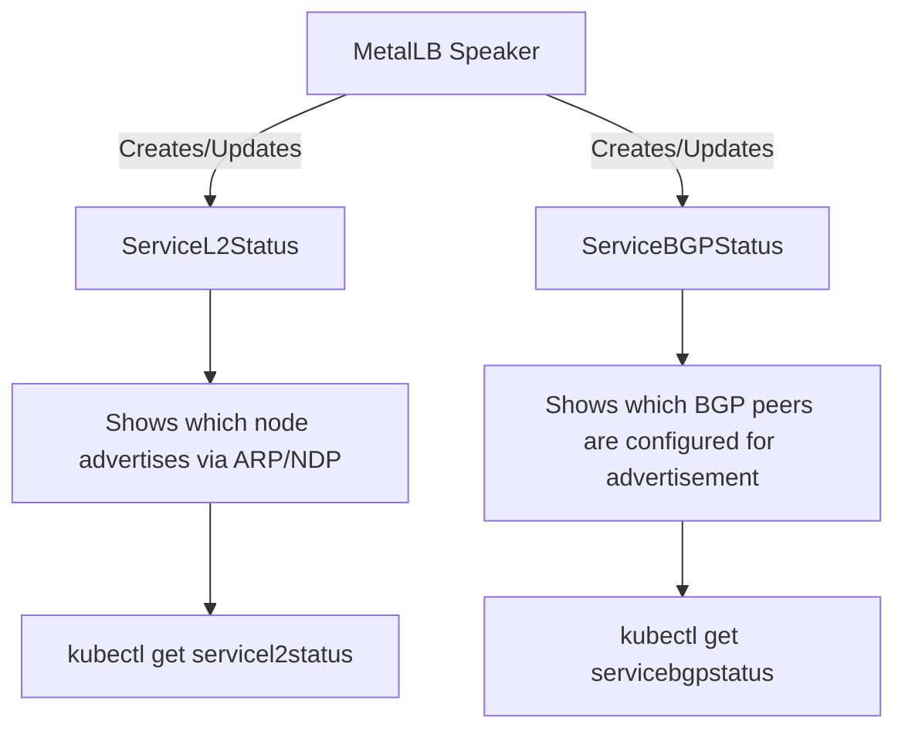
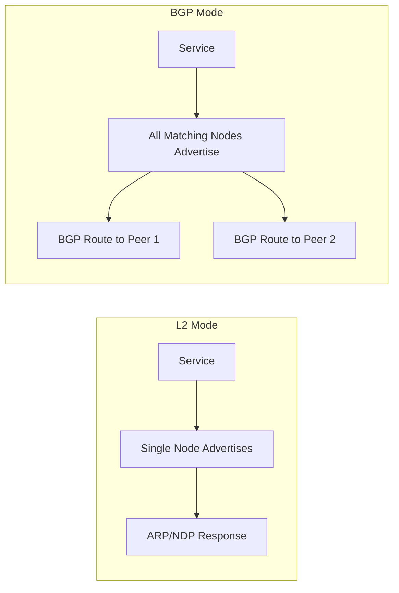
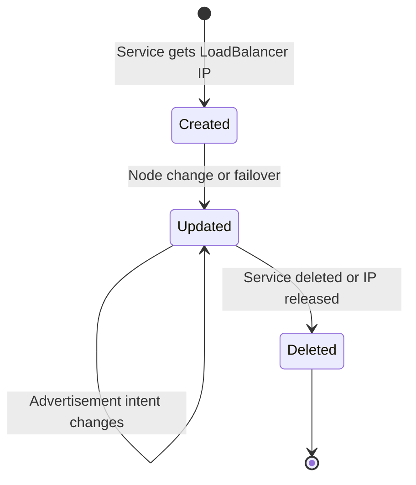

# How to Understand MetalLB ServiceL2Status and ServiceBGPStatus Resources

Author: [nawazdhandala](https://www.github.com/nawazdhandala)

Tags: Kubernetes, MetalLB, Status, CRD, Monitoring

Description: Learn how to read and interpret MetalLB ServiceL2Status and ServiceBGPStatus custom resources for monitoring service advertisement health.

---

MetalLB added `ServiceL2Status` in v0.14.6 and `ServiceBGPStatus` in v0.15.0 to give you detailed visibility into how each service is being advertised. These resources reduce the need to dig through speaker logs and make monitoring much simpler.

## What Are These Status Resources?

Before these CRDs, figuring out which node was advertising a service required parsing speaker pod logs. Now, MetalLB creates status objects that you can query directly with kubectl.


```mermaid
flowchart TD
    A[MetalLB Speaker] -->|Creates/Updates| B[ServiceL2Status]
    A -->|Creates/Updates| C[ServiceBGPStatus]
    B --> D[Shows which node advertises via ARP/NDP]
    C --> E[Shows which BGP peers are configured for advertisement]
    D --> F[kubectl get servicel2status]
    E --> G[kubectl get servicebgpstatus]
```

## ServiceL2Status

The `ServiceL2Status` resource shows the current L2 advertisement state for a service. It tells you which node is the active announcer and which interfaces are being used.

### Listing L2 Status Resources

```bash
# List all ServiceL2Status resources in the MetalLB namespace
kubectl get servicel2statuses -n metallb-system
```

Example output:

```text
NAME       ALLOCATED NODE   SERVICE NAME   SERVICE NAMESPACE
l2-r8jwb   worker-1         my-service     default
```

### Inspecting a Specific L2 Status

```bash
# Get detailed information about a specific L2 status resource
kubectl get servicel2status l2-r8jwb -n metallb-system -o yaml
```

The output looks like this:

```yaml
apiVersion: metallb.io/v1beta1
kind: ServiceL2Status
metadata:
  name: l2-r8jwb
  namespace: metallb-system
  # Labels link this status back to the parent service
  labels:
    metallb.io/node: worker-1
    metallb.io/service-name: my-service
    metallb.io/service-namespace: default
status:
  # The node currently announcing this service via L2
  node: worker-1
  # The service this status belongs to
  serviceName: my-service
  serviceNamespace: default
  # The interfaces used for ARP/NDP announcements
  interfaces:
    - name: eth0
```

## ServiceBGPStatus

The `ServiceBGPStatus` resource shows BGP advertisement intent, including which peers a service is configured to be advertised to from each relevant node. The actual route advertisement still depends on the corresponding BGP session state.

### Listing BGP Status Resources

```bash
# List all ServiceBGPStatus resources in the MetalLB namespace
kubectl get servicebgpstatuses -n metallb-system
```

### Inspecting a BGP Status

```bash
# View detailed BGP advertisement status for a service
kubectl get servicebgpstatus bgp-82jzt -n metallb-system -o yaml
```

```yaml
apiVersion: metallb.io/v1beta1
kind: ServiceBGPStatus
metadata:
  name: bgp-82jzt
  namespace: metallb-system
  labels:
    metallb.io/node: worker-1
    metallb.io/service-name: my-service
    metallb.io/service-namespace: default
status:
  # The node configured to advertise this service via BGP
  node: worker-1
  # The service this status belongs to
  serviceName: my-service
  serviceNamespace: default
  # BGP peers the service is configured to be advertised to
  peers:
    - 10.0.0.1
    - 10.0.0.2
```

## Comparing L2 and BGP Status

The key difference is in how many nodes advertise:


```mermaid
flowchart LR
    subgraph L2 Mode
        A[Service] --> B[Single Node Advertises]
        B --> C[ARP/NDP Response]
    end

    subgraph BGP Mode
        D[Service] --> E[All Matching Nodes Advertise]
        E --> F[BGP Route to Peer 1]
        E --> G[BGP Route to Peer 2]
    end
```

| Aspect | ServiceL2Status | ServiceBGPStatus |
|--------|----------------|-----------------|
| Nodes | Single active node | Multiple nodes |
| Protocol | ARP (IPv4) / NDP (IPv6) | BGP sessions |
| Failover | Node re-election | Router ECMP |
| Key field | `status.node` | `status.node`, `status.peers` |

## Using Status Resources for Health Checks

You can build health checks around these status resources.

### Check if L2 Service Has an Active Announcer

```bash
# Verify that an L2 service has a node assigned to announce it
# If this returns empty, the service is not being advertised
NODE=$(kubectl get servicel2status -n metallb-system \
  -l metallb.io/service-name=my-service \
  -o jsonpath='{.items[0].status.node}')

if [ -z "$NODE" ]; then
  echo "WARNING: No node is advertising my-service"
else
  echo "OK: my-service is being advertised from $NODE"
fi
```

### Check if BGP Advertisement Intent Exists

```bash
# Verify that MetalLB has BGP status objects for the service
COUNT=$(kubectl get servicebgpstatuses -n metallb-system \
  -l metallb.io/service-name=my-service \
  -o json | jq '.items | length')

if [ "$COUNT" -eq 0 ]; then
  echo "WARNING: No BGP status objects found for my-service"
else
  echo "OK: my-service has BGP status on $COUNT node(s)"
fi
```

### Monitor BGP Session State

```bash
# List the peers each service is configured to advertise to.
# Use MetalLB BGP metrics, logs, or BGPSessionState in FRR-K8s mode
# to verify whether each session is established.
kubectl get servicebgpstatuses -n metallb-system -o json | jq -r '
  .items[] |
  "Service \(.status.serviceNamespace)/\(.status.serviceName) on node \(.status.node) is configured for peers: \(.status.peers | join(", "))"
'
```

## Status Resource Lifecycle


```mermaid
stateDiagram-v2
    [*] --> Created: Service gets LoadBalancer IP
    Created --> Updated: Node change or failover
    Updated --> Updated: Advertisement intent changes
    Updated --> Deleted: Service deleted or IP released
    Deleted --> [*]
```

The status resources are automatically managed by MetalLB:

- **Created** when MetalLB starts advertising a service
- **Updated** when the advertising node changes (L2 failover) or the BGP advertisement intent changes
- **Deleted** when the service is deleted or loses its LoadBalancer IP

## Querying with Labels

MetalLB adds labels to status resources for easy filtering:

```bash
# Find all L2 statuses for services in the production namespace
kubectl get servicel2status -A \
  -l metallb.io/service-namespace=production

# Find the status for a specific service by name
kubectl get servicel2status -n metallb-system \
  -l metallb.io/service-name=my-api

# Find the BGP status for a specific service on a specific node
kubectl get servicebgpstatuses -n metallb-system \
  -l metallb.io/service-name=my-api,metallb.io/node=worker-1
```

## Watching for Changes

Monitor status changes in real time:

```bash
# Watch for L2 status changes - useful during failover testing
kubectl get servicel2status -n metallb-system --watch

# Watch BGP status changes - useful during BGP peer maintenance
kubectl get servicebgpstatus -n metallb-system --watch
```

## Monitoring with OneUptime

The `ServiceL2Status` and `ServiceBGPStatus` resources give you point-in-time visibility, but you need continuous monitoring to detect issues proactively. [OneUptime](https://oneuptime.com) lets you set up monitors against your MetalLB-backed services, track uptime across both L2 and BGP-advertised endpoints, and get alerted instantly when a service stops being reachable. Combined with status page reporting, your team and customers stay informed about infrastructure health at all times.
