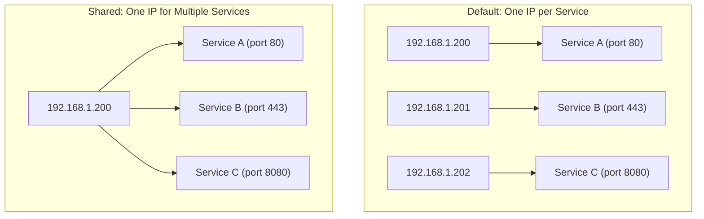
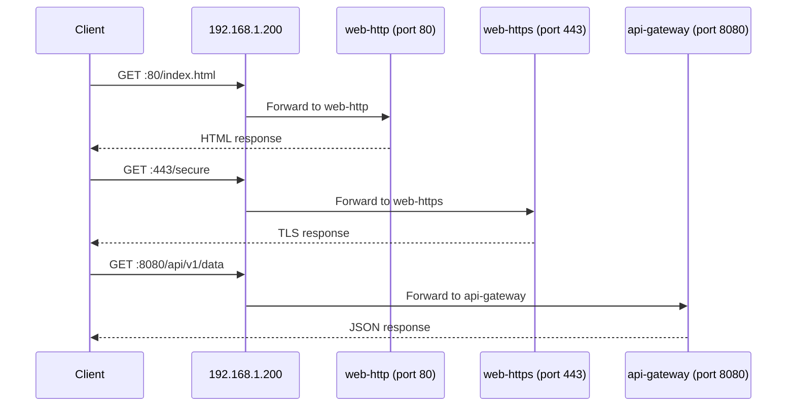

# How to Share IP Addresses Between Multiple Services in MetalLB

Author: [nawazdhandala](https://www.github.com/nawazdhandala)

Tags: Kubernetes, MetalLB, IP Sharing, Services, Configuration

Description: Learn how to share a single external IP address between multiple Kubernetes services using MetalLB IP sharing annotations.

---

By default, MetalLB assigns a unique external IP to each LoadBalancer service. But sometimes you need multiple services to share the same IP address. This is common when you have limited public IPs, when you want TCP and UDP services on the same address, or when you need to consolidate services behind a single entry point.

MetalLB supports IP sharing through a sharing key annotation that groups services together on the same IP.

## When to Share IPs

IP sharing makes sense in these scenarios:

- You have a limited number of public IP addresses
- You want TCP and UDP protocols on the same IP (Kubernetes does not allow mixing protocols in one Service)
- You need different services listening on different ports of the same IP
- You want to minimize DNS entries



## Requirements for IP Sharing

For two services to share an IP address in MetalLB, they must meet these conditions:

1. Both services must have the same `metallb.universe.tf/allow-shared-ip` annotation value
2. The services must not have conflicting ports (same port and protocol)
3. Both services must be in the same namespace or use the `metallb.universe.tf/allow-shared-ip` annotation correctly

## Setting Up IP Sharing

### Step 1: Create the IP Pool

```yaml
# ip-pool.yaml
# A standard IP address pool - no special config needed for sharing.
apiVersion: metallb.io/v1beta1
kind: IPAddressPool
metadata:
  name: shared-pool
  namespace: metallb-system
spec:
  addresses:
    - 192.168.1.200-192.168.1.210
```

### Step 2: Create Services with the Sharing Annotation

The key is the `metallb.universe.tf/allow-shared-ip` annotation. Services with the same annotation value will share an IP:

```yaml
# service-http.yaml
# HTTP service - will share an IP with the HTTPS service.
# The sharing key "web-services" groups them together.
apiVersion: v1
kind: Service
metadata:
  name: web-http
  namespace: default
  annotations:
    # This sharing key groups services that should share an IP
    metallb.universe.tf/allow-shared-ip: "web-services"
spec:
  type: LoadBalancer
  selector:
    app: web-app
  ports:
    - name: http
      protocol: TCP
      port: 80
      targetPort: 8080
---
# service-https.yaml
# HTTPS service - shares the same IP as the HTTP service.
# Same sharing key means same IP address.
apiVersion: v1
kind: Service
metadata:
  name: web-https
  namespace: default
  annotations:
    # Same sharing key as web-http
    metallb.universe.tf/allow-shared-ip: "web-services"
spec:
  type: LoadBalancer
  selector:
    app: web-app
  ports:
    - name: https
      protocol: TCP
      port: 443
      targetPort: 8443
```

### Step 3: Apply and Verify

```bash
# Create both services
kubectl apply -f service-http.yaml
kubectl apply -f service-https.yaml

# Check that both services got the same external IP
kubectl get svc web-http web-https
```

Expected output:

```
NAME        TYPE           CLUSTER-IP     EXTERNAL-IP     PORT(S)
web-http    LoadBalancer   10.96.10.5     192.168.1.200   80:31001/TCP
web-https   LoadBalancer   10.96.10.8     192.168.1.200   443:31002/TCP
```

Both services share `192.168.1.200`.

## Sharing Between Different Applications

IP sharing works across different applications, not just different ports of the same app:

```yaml
# api-service.yaml
# An API service on port 8080, sharing IP with other services.
apiVersion: v1
kind: Service
metadata:
  name: api-gateway
  namespace: default
  annotations:
    # Same sharing key groups this with the web services
    metallb.universe.tf/allow-shared-ip: "frontend-services"
spec:
  type: LoadBalancer
  selector:
    app: api-gateway
  ports:
    - name: api
      protocol: TCP
      port: 8080
      targetPort: 8080
---
# monitoring-service.yaml
# A monitoring dashboard on port 9090, sharing the same IP.
apiVersion: v1
kind: Service
metadata:
  name: monitoring-dashboard
  namespace: default
  annotations:
    metallb.universe.tf/allow-shared-ip: "frontend-services"
spec:
  type: LoadBalancer
  selector:
    app: monitoring
  ports:
    - name: dashboard
      protocol: TCP
      port: 9090
      targetPort: 9090
```



## What Happens with Port Conflicts

If two services with the same sharing key try to use the same port and protocol, MetalLB will not assign them the same IP:

```yaml
# conflict-service-a.yaml
# This service uses port 80/TCP
apiVersion: v1
kind: Service
metadata:
  name: service-a
  annotations:
    metallb.universe.tf/allow-shared-ip: "conflicting"
spec:
  type: LoadBalancer
  selector:
    app: service-a
  ports:
    - port: 80
      protocol: TCP
      targetPort: 8080
---
# conflict-service-b.yaml
# This service also uses port 80/TCP - CONFLICT
apiVersion: v1
kind: Service
metadata:
  name: service-b
  annotations:
    metallb.universe.tf/allow-shared-ip: "conflicting"
spec:
  type: LoadBalancer
  selector:
    app: service-b
  ports:
    # Same port 80/TCP as service-a - this causes a conflict
    - port: 80
      protocol: TCP
      targetPort: 9090
```

In this case, `service-b` will receive a different IP or remain Pending.

## Combining IP Sharing with Specific IP Requests

You can combine IP sharing with a specific IP request:

```yaml
# shared-specific-ip.yaml
# Both services request the same specific IP and share it.
apiVersion: v1
kind: Service
metadata:
  name: dns-tcp
  annotations:
    metallb.universe.tf/allow-shared-ip: "dns-services"
spec:
  type: LoadBalancer
  loadBalancerIP: 192.168.1.205
  selector:
    app: coredns
  ports:
    - name: dns-tcp
      protocol: TCP
      port: 53
      targetPort: 53
---
apiVersion: v1
kind: Service
metadata:
  name: dns-udp
  annotations:
    metallb.universe.tf/allow-shared-ip: "dns-services"
spec:
  type: LoadBalancer
  loadBalancerIP: 192.168.1.205
  selector:
    app: coredns
  ports:
    - name: dns-udp
      protocol: UDP
      port: 53
      targetPort: 53
```

## Listing Shared IPs

Find which services share IPs in your cluster:

```bash
# List all LoadBalancer services with their IPs and sharing annotations
kubectl get svc -A --field-selector spec.type=LoadBalancer \
  -o custom-columns=\
'NAMESPACE:.metadata.namespace,NAME:.metadata.name,EXTERNAL-IP:.status.loadBalancer.ingress[0].ip,SHARING-KEY:.metadata.annotations.metallb\.universe\.tf/allow-shared-ip'

# Find services sharing a specific IP
kubectl get svc -A -o json | jq -r \
  '.items[] | select(.status.loadBalancer.ingress[0].ip == "192.168.1.200") | "\(.metadata.namespace)/\(.metadata.name)"'
```

## Best Practices for IP Sharing

1. Use descriptive sharing keys that indicate the group purpose
2. Document which services share each IP
3. Avoid sharing IPs between unrelated services
4. Test that port combinations do not conflict before deploying
5. Use separate sharing keys for different environments
6. Monitor all services on a shared IP independently

## Monitoring Shared Services with OneUptime

When multiple services share an IP, monitoring becomes more nuanced. A network issue with the shared IP affects all services at once, but application-level problems affect only one. [OneUptime](https://oneuptime.com) can monitor each service endpoint individually, correlate failures across shared IPs, and alert you to both network-level and application-level issues in your MetalLB infrastructure.
