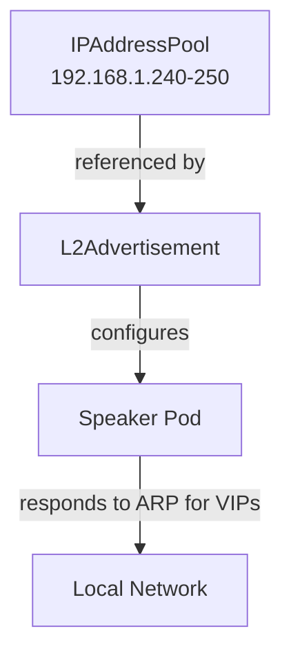

# How to Set Up MetalLB on a Single-Node Kubernetes Cluster

Author: [nawazdhandala](https://www.github.com/nawazdhandala)

Tags: Kubernetes, MetalLB, Single Node, Load Balancing, Home Lab

Description: A practical guide to setting up MetalLB on a single-node Kubernetes cluster for development, home labs, and edge deployments. Learn IP pool configuration, L2 mode setup, and testing.

---

> Running Kubernetes on a single node does not mean you have to give up on LoadBalancer services. MetalLB fills that gap by assigning real IP addresses to your services, even when there is no cloud provider handing them out. This guide walks through every step for a single-node setup.

When you create a `Service` of type `LoadBalancer` on a single-node cluster, Kubernetes just marks the external IP as `<pending>` forever. MetalLB solves this by acting as a network load balancer that allocates IPs from a pool you define. On a single node the "load balancing" part is trivial, but the IP allocation is exactly what you need to expose services externally.

---

## Why MetalLB on a Single Node?

Single-node clusters are common in several scenarios:

- **Home labs** running on a spare machine or Raspberry Pi
- **Edge deployments** where one machine handles the workload
- **Local development** when you want realistic service exposure
- **CI/CD pipelines** that spin up ephemeral clusters for integration tests

Without MetalLB (or a similar solution), you are limited to `NodePort` services, which force you to use high-numbered ports and add complexity to your networking.

---

## Architecture Overview

On a single-node cluster, MetalLB in Layer 2 (L2) mode responds to ARP requests on the local network for the IPs in your pool. Since there is only one node, that node always wins the ARP election.

```mermaid
flowchart LR
    Client["Client Device"]
    Switch["Network Switch / Router"]
    Node["Single K8s Node"]
    MetalLB["MetalLB Speaker Pod"]
    SVC["LoadBalancer Service"]
    Pod["Application Pod"]

    Client -->|"Sends traffic to VIP"| Switch
    Switch -->|"ARP resolves to node MAC"| Node
    Node --> MetalLB
    MetalLB -->|"Forwards to Service ClusterIP"| SVC
    SVC -->|"Routes to endpoint"| Pod
```



The flow is straightforward: the MetalLB speaker pod responds to ARP queries for the virtual IP, the traffic arrives at the node, and `kube-proxy` routes it to the correct pod.

---

## Prerequisites

Before you begin, make sure you have:

- A single-node Kubernetes cluster (Microk8s, k3s, kubeadm, or kind)
- `kubectl` configured and able to reach the cluster
- A range of free IP addresses on your local subnet (even one is enough)
- `kube-proxy` running in `iptables` or `ipvs` mode (not `userspace`)

Find your node IP and subnet to plan the address pool:

```bash
# Show the IP address and subnet of your primary network interface
# Look for the inet line under your active interface (e.g., eth0 or enp0s3)
ip addr show
```

If your node IP is `192.168.1.50` on a `/24` subnet, you could reserve `192.168.1.240-192.168.1.250` for MetalLB. Make sure those addresses are not used by other devices or your DHCP server.

---

## Step 1: Install MetalLB

### Option A: Install with kubectl (works on any cluster)

Apply the official MetalLB manifests. This creates the `metallb-system` namespace and deploys the controller and speaker components.

```bash
# Apply the MetalLB manifest for version 0.14.9
# This deploys the controller (manages IP allocation) and
# speaker (announces IPs via ARP/NDP) into the metallb-system namespace
kubectl apply -f https://raw.githubusercontent.com/metallb/metallb/v0.14.9/config/manifests/metallb-native.yaml
```

### Option B: Install with Helm

If you prefer Helm, add the MetalLB repository and install:

```bash
# Add the official MetalLB Helm chart repository
helm repo add metallb https://metallb.github.io/metallb

# Update repo index to pull the latest chart versions
helm repo update

# Install MetalLB into the metallb-system namespace
# --create-namespace ensures the namespace is created if it does not exist
helm install metallb metallb/metallb \
  --namespace metallb-system \
  --create-namespace
```

### Option C: Microk8s addon

For Microk8s clusters, a single command handles everything:

```bash
# Enable the built-in MetalLB addon
# You can optionally pass an IP range: microk8s enable metallb:192.168.1.240-192.168.1.250
microk8s enable metallb
```

### Verify the installation

Wait for all MetalLB pods to reach the `Running` state before proceeding:

```bash
# Watch the pods in the metallb-system namespace
# You should see one controller pod and one speaker pod (one per node)
kubectl get pods -n metallb-system -w
```

Expected output on a single-node cluster:

```
NAME                          READY   STATUS    RESTARTS   AGE
controller-7db8f9b4f5-xl2k9   1/1     Running   0          45s
speaker-abc12                  1/1     Running   0          45s
```

---

## Step 2: Configure the IP Address Pool

Create a file called `ipaddresspool.yaml`. This tells MetalLB which IP addresses it is allowed to hand out.

```yaml
# ipaddresspool.yaml
# Defines the pool of IP addresses MetalLB can assign to LoadBalancer services
apiVersion: metallb.io/v1beta1
kind: IPAddressPool
metadata:
  name: single-node-pool          # A descriptive name for this pool
  namespace: metallb-system        # Must be in the metallb-system namespace
spec:
  addresses:
    # A range of IPs on your local subnet reserved for MetalLB
    # Make sure these are NOT in your DHCP range or used by other devices
    - 192.168.1.240-192.168.1.250
    # You can also use CIDR notation for a single IP:
    # - 192.168.1.240/32
```

Apply it:

```bash
# Create the IP address pool resource in the cluster
kubectl apply -f ipaddresspool.yaml
```

---

## Step 3: Configure L2 Advertisement

Layer 2 mode is the simplest and most common choice for single-node and home lab setups. It uses ARP (IPv4) or NDP (IPv6) to make IPs reachable on the local network. No BGP routers or special network gear required.

Create `l2advertisement.yaml`:

```yaml
# l2advertisement.yaml
# Tells MetalLB to advertise IPs from the pool using Layer 2 (ARP/NDP)
apiVersion: metallb.io/v1beta1
kind: L2Advertisement
metadata:
  name: single-node-l2            # Name for this advertisement config
  namespace: metallb-system
spec:
  ipAddressPools:
    - single-node-pool             # Reference the pool created in the previous step
  # Optional: limit advertisement to specific network interfaces
  # interfaces:
  #   - eth0
```

Apply it:

```bash
# Create the L2 advertisement resource
kubectl apply -f l2advertisement.yaml
```



---

## Step 4: Test with a Sample Service

Deploy a simple nginx pod and expose it through a LoadBalancer service:

```yaml
# test-deployment.yaml
# A minimal nginx deployment to verify MetalLB is working
apiVersion: apps/v1
kind: Deployment
metadata:
  name: nginx-test
spec:
  replicas: 1                     # One replica is fine for testing
  selector:
    matchLabels:
      app: nginx-test
  template:
    metadata:
      labels:
        app: nginx-test
    spec:
      containers:
        - name: nginx
          image: nginx:alpine      # Lightweight nginx image
          ports:
            - containerPort: 80    # nginx listens on port 80
---
# LoadBalancer service - MetalLB will assign an external IP from the pool
apiVersion: v1
kind: Service
metadata:
  name: nginx-test-lb
spec:
  type: LoadBalancer               # Triggers MetalLB to allocate an IP
  selector:
    app: nginx-test                # Route traffic to pods with this label
  ports:
    - protocol: TCP
      port: 80                     # External port
      targetPort: 80               # Port on the container
```

Apply and verify:

```bash
# Deploy the test application and service
kubectl apply -f test-deployment.yaml

# Check the service - EXTERNAL-IP should show an address from your pool
kubectl get svc nginx-test-lb
```

You should see output like:

```
NAME            TYPE           CLUSTER-IP      EXTERNAL-IP     PORT(S)        AGE
nginx-test-lb   LoadBalancer   10.152.183.42   192.168.1.240   80:31234/TCP   10s
```

Now test connectivity from any device on the same network:

```bash
# Curl the external IP assigned by MetalLB
# You should get the default nginx welcome page
curl http://192.168.1.240
```

---

## Single-Node Considerations

Running MetalLB on a single node comes with a few things to keep in mind:

### No High Availability for L2

In a multi-node cluster, if the node announcing an IP goes down, another node takes over. On a single node, if the node goes down, everything goes down. This is expected and acceptable for dev or home lab use.

### IP Conflicts

Your MetalLB IP range must not overlap with your router's DHCP range. Check your router settings and carve out a static range. A common pattern:

| Purpose | Range |
|---------|-------|
| DHCP (dynamic devices) | 192.168.1.100 - 192.168.1.199 |
| Node static IP | 192.168.1.50 |
| MetalLB pool | 192.168.1.240 - 192.168.1.250 |

### Resource Usage

MetalLB is lightweight. The speaker and controller pods together use roughly 50-100 MB of RAM and minimal CPU, so they are fine even on a Raspberry Pi 4.

---

## Troubleshooting Common Issues

### Service stuck on `<pending>`

If your service never gets an external IP:

```bash
# Check MetalLB controller logs for allocation errors
kubectl logs -n metallb-system -l app.kubernetes.io/component=controller

# Verify the IPAddressPool was created successfully
kubectl get ipaddresspool -n metallb-system

# Verify the L2Advertisement exists and references the correct pool
kubectl get l2advertisement -n metallb-system
```

Common causes:
- The `IPAddressPool` or `L2Advertisement` is missing or in the wrong namespace
- The pool name in `L2Advertisement` does not match the `IPAddressPool` name
- All IPs in the pool are already allocated

### External IP assigned but not reachable

```bash
# Check that the speaker pod is running
kubectl get pods -n metallb-system -l app.kubernetes.io/component=speaker

# Verify ARP is working - from another machine on the same subnet
# Replace the IP with your assigned external IP
arp -a | grep 192.168.1.240

# Check if kube-proxy is routing correctly
kubectl get endpoints nginx-test-lb
```

Common causes:
- The client is not on the same Layer 2 network as the node
- A firewall on the node is blocking traffic on the service port
- `kube-proxy` is in `userspace` mode (switch to `iptables` or `ipvs`)

### Conflicting DHCP assignments

If another device grabs an IP from your MetalLB range:

```bash
# Scan for IP conflicts on your subnet using arping
# A conflict means two MAC addresses respond for the same IP
arping -c 3 192.168.1.240
```

Fix this by adjusting your DHCP range in your router settings so it does not overlap with the MetalLB pool.

---

## Cleaning Up

Remove the test resources when you are done:

```bash
# Delete the test deployment and service
kubectl delete -f test-deployment.yaml

# If you want to remove MetalLB entirely
kubectl delete -f l2advertisement.yaml
kubectl delete -f ipaddresspool.yaml
kubectl delete -f https://raw.githubusercontent.com/metallb/metallb/v0.14.9/config/manifests/metallb-native.yaml
```

---

## Wrapping Up

MetalLB turns a single-node Kubernetes cluster into a more capable environment by giving you real external IPs for your services. The L2 mode setup requires no special network hardware and works on any home or office network. While you do not get failover on a single node, you get a setup that closely mirrors production and makes development and testing far more realistic.

If you are running services on bare-metal or single-node clusters, monitoring their availability becomes critical since there is no cloud provider safety net. [OneUptime](https://oneuptime.com) provides open-source uptime monitoring, incident management, and status pages that work perfectly with self-hosted Kubernetes deployments. You can set up HTTP monitors for your MetalLB-exposed services and get alerted the moment something goes down.
