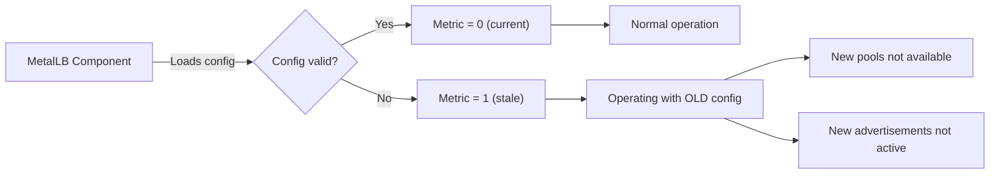
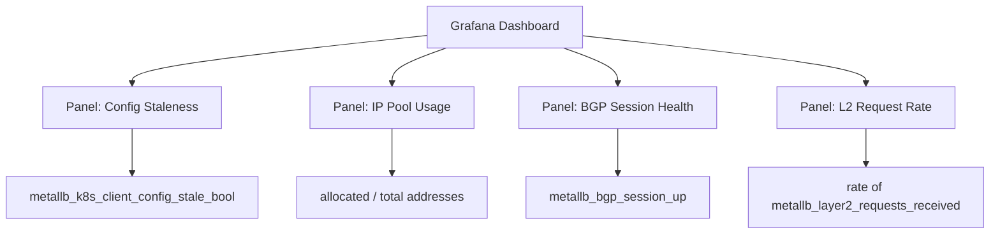

# How to Use the metallb_k8s_client_config_stale_bool Prometheus Metric

Author: [nawazdhandala](https://www.github.com/nawazdhandala)

Tags: Kubernetes, MetalLB, Prometheus, Metrics, Monitoring

Description: Learn how to use the metallb_k8s_client_config_stale_bool Prometheus metric to detect stale MetalLB configuration in your cluster.

---

MetalLB exposes a Prometheus metric called `metallb_k8s_client_config_stale_bool` that tells you whether the running configuration matches what is stored in Kubernetes. When this metric is `1`, MetalLB is operating with outdated configuration, which can lead to silent failures. This post explains how to scrape, alert on, and use this metric effectively.

## What the Metric Means

The `metallb_k8s_client_config_stale_bool` metric is a boolean gauge:

- **0**: Configuration is current. MetalLB has successfully loaded the latest CRDs.
- **1**: Configuration is stale. MetalLB failed to load the latest configuration and is running with an older version.



## Where the Metric Is Exposed

Both the MetalLB controller and speaker pods expose this metric on their metrics port (default 7472 for speakers, 7472 for controller).

```bash
# Access speaker metrics via port-forward
kubectl port-forward -n metallb-system \
  $(kubectl get pod -n metallb-system -l component=speaker -o name | head -1) \
  7472:7472 &

# Query the stale config metric
curl -s http://localhost:7472/metrics | grep config_stale

# Expected output when config is current:
# metallb_k8s_client_config_stale_bool 0

# Kill the port-forward when done
kill %1
```

```bash
# Access controller metrics
kubectl port-forward -n metallb-system \
  $(kubectl get pod -n metallb-system -l component=controller -o name | head -1) \
  7472:7472 &

curl -s http://localhost:7472/metrics | grep config_stale

kill %1
```

## Checking All Speakers at Once

Since speakers run as a DaemonSet, you should check all of them. A stale config on even one speaker means that node is not operating correctly.

```bash
#!/bin/bash
# check-stale-config.sh
# Check the stale config metric on all MetalLB speaker pods

# Get all speaker pod names
SPEAKERS=$(kubectl get pods -n metallb-system -l component=speaker \
  -o jsonpath='{.items[*].metadata.name}')

for POD in $SPEAKERS; do
  # Get the node name for context
  NODE=$(kubectl get pod "$POD" -n metallb-system \
    -o jsonpath='{.spec.nodeName}')

  # Query the metric directly using kubectl exec
  STALE=$(kubectl exec -n metallb-system "$POD" -- \
    wget -qO- http://localhost:7472/metrics 2>/dev/null | \
    grep "metallb_k8s_client_config_stale_bool" | \
    awk '{print $2}')

  if [ "$STALE" = "1" ]; then
    echo "ALERT: Speaker on node $NODE has STALE config"
  else
    echo "OK: Speaker on node $NODE has current config"
  fi
done
```

## Setting Up Prometheus Scraping

To continuously monitor this metric, configure Prometheus to scrape MetalLB pods.

### Using ServiceMonitor (Prometheus Operator)

```yaml
# metallb-servicemonitor.yaml
# ServiceMonitor to scrape MetalLB metrics with Prometheus Operator
apiVersion: monitoring.coreos.com/v1
kind: ServiceMonitor
metadata:
  name: metallb
  namespace: metallb-system
  labels:
    # Ensure this label matches your Prometheus operator's serviceMonitorSelector
    release: prometheus
spec:
  selector:
    matchLabels:
      # This matches the MetalLB service labels
      app.kubernetes.io/name: metallb
  endpoints:
    - port: monitoring
      # Scrape interval - check config staleness every 30 seconds
      interval: 30s
      path: /metrics
```

### Using PodMonitor

```yaml
# metallb-podmonitor.yaml
# PodMonitor for scraping MetalLB speaker and controller pods directly
apiVersion: monitoring.coreos.com/v1
kind: PodMonitor
metadata:
  name: metallb-speakers
  namespace: metallb-system
spec:
  selector:
    matchLabels:
      component: speaker
  podMetricsEndpoints:
    - port: monitoring
      interval: 30s
```

### Using Static Prometheus Config

```yaml
# prometheus.yml snippet
# Static scrape config for MetalLB metrics
scrape_configs:
  - job_name: 'metallb'
    # Discover MetalLB pods via Kubernetes service discovery
    kubernetes_sd_configs:
      - role: pod
        namespaces:
          names:
            - metallb-system
    relabel_configs:
      # Only scrape pods with the metallb app label
      - source_labels: [__meta_kubernetes_pod_label_app_kubernetes_io_name]
        action: keep
        regex: metallb
      # Use the monitoring port
      - source_labels: [__meta_kubernetes_pod_container_port_name]
        action: keep
        regex: monitoring
```

## Creating Alerting Rules

Set up alerts to fire when configuration becomes stale:

```yaml
# metallb-alerts.yaml
# PrometheusRule to alert on stale MetalLB configuration
apiVersion: monitoring.coreos.com/v1
kind: PrometheusRule
metadata:
  name: metallb-config-alerts
  namespace: metallb-system
spec:
  groups:
    - name: metallb-config
      rules:
        # Alert when any MetalLB component has stale configuration
        - alert: MetalLBConfigStale
          # Fires when the stale metric is 1 for more than 5 minutes
          expr: metallb_k8s_client_config_stale_bool == 1
          for: 5m
          labels:
            severity: warning
          annotations:
            summary: "MetalLB configuration is stale on {{ $labels.pod }}"
            description: >
              The MetalLB component {{ $labels.pod }} on node
              {{ $labels.node }} has been running with stale
              configuration for more than 5 minutes. New IP pools
              and advertisements may not be active.
            runbook: "Restart the affected MetalLB component to force config reload."
```

## Other Useful MetalLB Metrics

While checking the stale config metric, also monitor these related metrics:

```bash
# Query all MetalLB metrics to see what is available
curl -s http://localhost:7472/metrics | grep "^metallb_" | sort -u
```

Key metrics to watch:

| Metric | Description |
|--------|-------------|
| `metallb_k8s_client_config_stale_bool` | Config is outdated (1) or current (0) |
| `metallb_k8s_client_config_loaded_bool` | Config was ever successfully loaded |
| `metallb_allocator_addresses_in_use_total` | Number of IPs currently allocated |
| `metallb_allocator_addresses_total` | Total IPs available in all pools |
| `metallb_bgp_session_up` | BGP session state per peer |
| `metallb_layer2_requests_received` | ARP/NDP requests handled |

## Building a Grafana Dashboard

Use PromQL queries to build a MetalLB health dashboard:



Example PromQL queries:

```promql
# Percentage of IP pool used
metallb_allocator_addresses_in_use_total / metallb_allocator_addresses_total * 100

# Config stale across all components (should be 0)
max(metallb_k8s_client_config_stale_bool)

# BGP sessions that are down
metallb_bgp_session_up == 0
```

## Responding to a Stale Config Alert

When the alert fires:

```bash
# Step 1: Identify which component has stale config
kubectl get pods -n metallb-system -o wide

# Step 2: Check the component logs for config errors
kubectl logs -n metallb-system <pod-name> --tail=50 | grep -i "config\|error\|stale"

# Step 3: Fix the configuration error if found

# Step 4: Restart the component to force reload
kubectl rollout restart deployment controller -n metallb-system
kubectl rollout restart daemonset speaker -n metallb-system

# Step 5: Verify the metric returns to 0
kubectl exec -n metallb-system <new-pod-name> -- \
  wget -qO- http://localhost:7472/metrics 2>/dev/null | \
  grep config_stale
```

## Monitoring with OneUptime

Prometheus metrics tell you about MetalLB's internal state, but you also need to verify that services are actually reachable by end users. [OneUptime](https://oneuptime.com) complements your Prometheus monitoring by testing service reachability from outside the cluster. When a stale configuration causes services to become unreachable, OneUptime detects the outage immediately, creates an incident, and notifies your team through multiple channels - giving you both internal metrics visibility and external availability confirmation.
