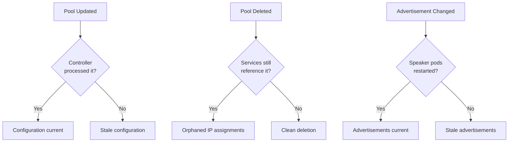
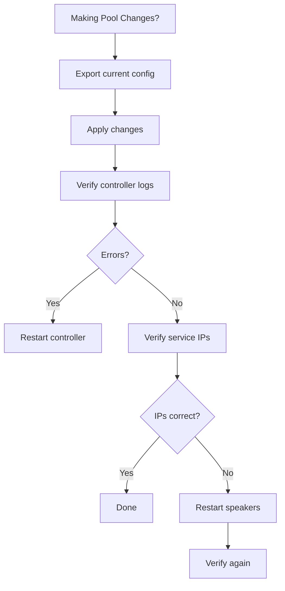

# How to Fix MetalLB Stale Configuration After Pool Changes

Author: [nawazdhandala](https://www.github.com/nawazdhandala)

Tags: Kubernetes, MetalLB, Configuration, Troubleshooting, IP Pools

Description: Learn how to detect and fix stale MetalLB configuration after making changes to IP address pools or advertisement resources.

---

> You updated an IPAddressPool or changed an L2Advertisement, but services still behave as if the old configuration is active. MetalLB can sometimes hold onto stale state, especially after rapid configuration changes or partial applies. This guide shows you how to detect stale configuration and fix it without disrupting running services.

---

## What Causes Stale Configuration

Several scenarios can leave MetalLB in an inconsistent state:



| Cause | Symptom |
|-------|---------|
| Edited pool CIDR but services keep old IPs | IPs outside the new range still assigned |
| Deleted a pool that had active assignments | Services keep working but pool is gone |
| Changed L2Advertisement selectors | Wrong pools being advertised |
| Rapid apply/delete cycles | Controller missed intermediate states |
| CRD version mismatch after upgrade | Resources exist but are not recognized |

---

## Detecting Stale Configuration

### Check 1: Compare Assigned IPs Against Pool Ranges

```bash
# List all pools and their address ranges
echo "=== IP Address Pools ==="
kubectl get ipaddresspool -n metallb-system \
  -o custom-columns=NAME:.metadata.name,ADDRESSES:.spec.addresses

# List all LoadBalancer services and their assigned IPs
echo "=== Service IPs ==="
kubectl get svc -A \
  -o custom-columns=NAMESPACE:.metadata.namespace,NAME:.metadata.name,IP:.status.loadBalancer.ingress[0].ip \
  | grep -v '<none>'
```

If a service has an IP that does not fall within any current pool's range, the configuration is stale.

### Check 2: Look for Controller Errors

```bash
# Check the controller logs for configuration errors
kubectl logs -n metallb-system -l app=metallb,component=controller \
  --since=1h | grep -iE "error|warn|stale|invalid|failed"
```

### Check 3: Verify Advertisement Resources Match Pools

```bash
# List L2 advertisements and their pool selectors
kubectl get l2advertisement -n metallb-system -o yaml

# List BGP advertisements and their pool selectors
kubectl get bgpadvertisement -n metallb-system -o yaml

# Compare against existing pools
kubectl get ipaddresspool -n metallb-system -o jsonpath='{range .items[*]}{.metadata.name}{"\n"}{end}'
```

---

## Fix 1: Force Controller Reconciliation

The simplest fix is to restart the MetalLB controller, which forces a full reconciliation:

```bash
# Restart the controller deployment
# This triggers a clean reload of all configuration
kubectl rollout restart deployment controller -n metallb-system

# Wait for the rollout to complete
kubectl rollout status deployment controller -n metallb-system

# Verify the controller is running and processing events
kubectl logs -n metallb-system -l app=metallb,component=controller --tail=20
```

---

## Fix 2: Restart Speaker Pods

If advertisements are stale (IPs assigned but not reachable), restart the speaker pods:

```bash
# Restart all speaker pods (runs as a DaemonSet)
kubectl rollout restart daemonset speaker -n metallb-system

# Wait for all speakers to come back up
kubectl rollout status daemonset speaker -n metallb-system

# Verify speakers are running on all nodes
kubectl get pods -n metallb-system -l app=metallb,component=speaker -o wide
```

---

## Fix 3: Re-apply All Configuration

For persistent issues, delete and re-apply all MetalLB custom resources:

```bash
# Step 1: Export current configuration
kubectl get ipaddresspool -n metallb-system -o yaml > pools-backup.yaml
kubectl get l2advertisement -n metallb-system -o yaml > l2adv-backup.yaml
kubectl get bgpadvertisement -n metallb-system -o yaml > bgpadv-backup.yaml

# Step 2: Delete all MetalLB configuration resources
kubectl delete ipaddresspool --all -n metallb-system
kubectl delete l2advertisement --all -n metallb-system
kubectl delete bgpadvertisement --all -n metallb-system

# Step 3: Wait for MetalLB to process the deletions
sleep 10

# Step 4: Re-apply the configuration
kubectl apply -f pools-backup.yaml
kubectl apply -f l2adv-backup.yaml
kubectl apply -f bgpadv-backup.yaml
```

---

## Fix 4: Clean Up Orphaned Service IPs

If a service has an IP from a deleted pool, force it to get a new IP:

```bash
# Remove the stale IP assignment by removing loadBalancerIP
kubectl patch svc orphaned-service --type=json \
  -p='[{"op":"remove","path":"/spec/loadBalancerIP"}]'

# Remove the old pool annotation if present
kubectl annotate svc orphaned-service \
  metallb.universe.tf/address-pool- \
  --overwrite

# The service will now get a new IP from an available pool
kubectl get svc orphaned-service -w
```

---

## Prevention Checklist



| Prevention Step | Why |
|----------------|-----|
| Always back up config before changes | Enables quick rollback |
| Apply changes one resource at a time | Easier to spot which change caused issues |
| Check controller logs after every apply | Catch errors immediately |
| Verify service IPs after pool changes | Confirm the change took effect |
| Avoid rapid apply/delete cycles | Give the controller time to process each change |

---

## Wrapping Up

Stale MetalLB configuration is usually fixed by restarting the controller or speaker pods, but persistent issues may require a full configuration re-apply. Build the diagnostic script into your runbooks so your team can quickly identify and resolve configuration drift.

For automated monitoring of your MetalLB configuration state and alerts when services lose their external IPs, set up **[OneUptime](https://oneuptime.com)** to watch your Kubernetes cluster health.
