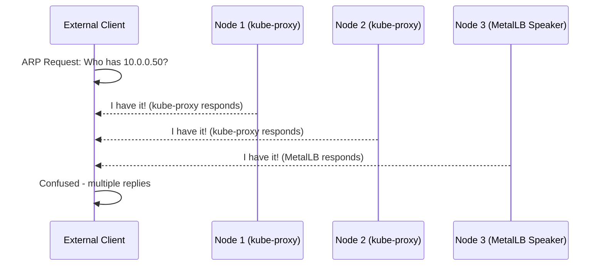
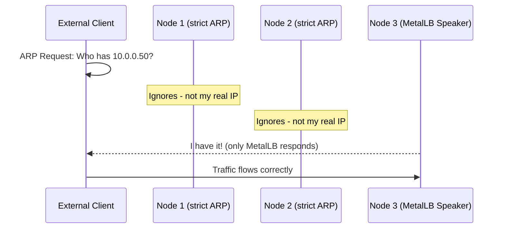
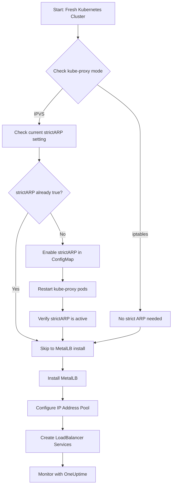

# How to Enable Strict ARP Mode for kube-proxy Before Installing MetalLB

Author: [nawazdhandala](https://www.github.com/nawazdhandala)

Tags: Kubernetes, MetalLB, kube-proxy, ARP, Networking

Description: Learn how to enable strict ARP mode for kube-proxy before installing MetalLB on your Kubernetes cluster. This guide covers why strict ARP is needed, how to configure it, and how to verify the setting.

---

If you have ever tried to set up MetalLB on a Kubernetes cluster and watched your LoadBalancer services sit in "Pending" forever, there is a good chance you missed one small but critical step - enabling strict ARP mode on kube-proxy. This is one of those things that trips people up because nothing breaks loudly. It just does not work, and the logs do not always make it obvious why.

In this post, we will walk through what strict ARP mode is, why MetalLB needs it, and exactly how to enable and verify it on your cluster. If you are looking for a full MetalLB setup guide, check out our earlier post on [how to configure MetalLB with Kubernetes (Microk8s)](https://oneuptime.com/blog/post/2023-11-06-configure-metallb-with-kubernetes-microk8s/view). This post focuses specifically on the ARP prerequisite that you need to handle first.

## What is ARP and Why Does It Matter?

ARP (Address Resolution Protocol) is how machines on a local network figure out which MAC address belongs to a given IP address. When a device wants to talk to an IP on its local subnet, it sends out an ARP request saying "Who has 10.0.0.50?" and the device that owns that IP responds with its MAC address.

MetalLB in Layer 2 mode works by having one of your Kubernetes nodes respond to ARP requests for the LoadBalancer IP addresses it manages. The node essentially says "That IP is mine" and starts receiving traffic for that service.

The problem? By default, kube-proxy is also happy to respond to ARP requests for any IP address it knows about - including LoadBalancer IPs. This creates a conflict.

## The Problem with Default kube-proxy Behavior

When kube-proxy runs in IPVS mode (which is common in production clusters), it binds service IPs to a local network interface called `kube-ipvs0`. This means the Linux kernel on every node thinks it "owns" those IPs and will respond to ARP requests for them.

Here is what happens without strict ARP mode:



Every node running kube-proxy in IPVS mode will answer ARP requests for service IPs. This means traffic might go to any node, not the one MetalLB has designated. The result is unreliable or completely broken load balancing.

With strict ARP enabled, kube-proxy stops responding to ARP requests for IPs that are not actually assigned to the node's real network interfaces. This lets MetalLB be the only one answering ARP for its managed IPs.



## When Do You Need Strict ARP?

You need to enable strict ARP mode when both of these are true:

1. **kube-proxy is running in IPVS mode** - If you are using the default iptables mode, kube-proxy does not bind service IPs to a local interface, so there is no conflict. But many production clusters use IPVS for better performance.

2. **MetalLB is running in Layer 2 mode** - In BGP mode, MetalLB announces routes through BGP rather than responding to ARP, so the ARP conflict does not apply.

You can check which mode kube-proxy is using with this command:

```bash
# Check the kube-proxy configuration to see what mode it's running in
# An empty string for mode means iptables (the default)
kubectl get configmap kube-proxy -n kube-system -o jsonpath='{.data.config\.conf}' | grep mode
```

If the output shows `mode: "ipvs"` or `mode: ipvs`, you need strict ARP.

## Step 1: Check the Current Strict ARP Setting

Before changing anything, let us see what the current setting looks like. The kube-proxy configuration lives in a ConfigMap in the `kube-system` namespace.

```bash
# View the current strictARP setting in the kube-proxy configmap
# By default, this will be false or not set at all
kubectl get configmap kube-proxy -n kube-system -o yaml | grep strictARP
```

If you see `strictARP: false` or nothing at all, you need to update it. If it already says `strictARP: true`, you are good to go and can skip to the verification step.

You can also dump the full IPVS section of the config to see the complete picture:

```bash
# Get the full ipvs configuration block from kube-proxy
# This shows all IPVS-related settings including strictARP
kubectl get configmap kube-proxy -n kube-system -o jsonpath='{.data.config\.conf}' | grep -A 10 "ipvs:"
```

The output will look something like this:

```yaml
ipvs:
  excludeCIDRs: null
  minSyncPeriod: 0s
  scheduler: ""
  strictARP: false    # This is what we need to change to true
  syncPeriod: 30s
  tcpFinTimeout: 0s
  tcpTimeout: 0s
  udpTimeout: 0s
```

## Step 2: Enable Strict ARP Mode

There are two ways to do this. You can either edit the ConfigMap directly, or use `kubectl patch`. The patch method is better for automation and scripts because it is a single command.

### Option A: Using kubectl edit (interactive)

This opens the ConfigMap in your default editor. Find the `strictARP` field under the `ipvs` section and change it to `true`.

```bash
# Open the kube-proxy configmap in your editor
# Find strictARP under the ipvs section and set it to true
kubectl edit configmap kube-proxy -n kube-system
```

Look for this section and change `strictARP: false` to `strictARP: true`:

```yaml
ipvs:
  excludeCIDRs: null
  minSyncPeriod: 0s
  scheduler: ""
  strictARP: true     # Changed from false to true
  syncPeriod: 30s
```

Save and close the editor.

### Option B: Using kubectl patch (non-interactive)

This is the better approach if you are scripting the setup or want a repeatable command. We will use `kubectl get` to pull the current config, modify it with `sed`, and apply it back.

```bash
# Pull the current kube-proxy configmap, flip strictARP to true, and apply it back
# This is a one-liner that works well in scripts and CI/CD pipelines
kubectl get configmap kube-proxy -n kube-system -o yaml | \
  sed -e "s/strictARP: false/strictARP: true/" | \
  kubectl apply -f - -n kube-system
```

If you want to be extra safe and check what would change before actually applying it, you can use `kubectl diff`:

```bash
# Preview the changes without applying them
# This shows you exactly what will be modified in the configmap
kubectl get configmap kube-proxy -n kube-system -o yaml | \
  sed -e "s/strictARP: false/strictARP: true/" | \
  kubectl diff -f - -n kube-system
```

The diff output should show only the `strictARP` line changing from `false` to `true`. If you see anything else changing, stop and investigate before applying.

## Step 3: Restart kube-proxy to Pick Up the Change

Editing the ConfigMap does not automatically restart kube-proxy. The kube-proxy pods need to be restarted so they read the new configuration. The easiest way to do this is to delete the kube-proxy pods and let the DaemonSet recreate them.

```bash
# Delete all kube-proxy pods to force a restart
# The DaemonSet will immediately recreate them with the new config
kubectl rollout restart daemonset kube-proxy -n kube-system
```

Wait for the pods to come back up:

```bash
# Watch the kube-proxy pods restart
# All pods should reach Running status within a minute or two
kubectl get pods -n kube-system -l k8s-app=kube-proxy -w
```

You should see the pods cycle through terminating and starting states. Once they are all running again, the new strict ARP setting is active.

## Step 4: Verify Strict ARP Is Enabled

Let us confirm the setting actually took effect. There are a few ways to verify this.

### Verify via ConfigMap

```bash
# Confirm the configmap now has strictARP set to true
kubectl get configmap kube-proxy -n kube-system -o yaml | grep strictARP
```

You should see:

```
      strictARP: true
```

### Verify via kube-proxy logs

You can also check the kube-proxy logs to confirm it loaded the new configuration:

```bash
# Check the logs of one of the kube-proxy pods
# Look for IPVS-related configuration messages
KUBE_PROXY_POD=$(kubectl get pods -n kube-system -l k8s-app=kube-proxy -o jsonpath='{.items[0].metadata.name}')
kubectl logs $KUBE_PROXY_POD -n kube-system | head -30
```

### Verify ARP behavior on the node (optional)

If you want to go deeper and verify the actual ARP behavior on a node, you can use `arping` from a machine on the same network. This is optional but useful for debugging.

```bash
# From a machine on the same network as your nodes, send an ARP request
# for a service IP. Only the MetalLB speaker node should respond.
# Replace 10.0.0.50 with your actual LoadBalancer IP
arping -I eth0 10.0.0.50
```

With strict ARP enabled, only the node where MetalLB has assigned the IP should reply. Without it, you would see multiple replies from different MAC addresses.

## The Full Flow

Here is what the complete setup flow looks like when you are starting from scratch:



## Common Issues and Troubleshooting

### LoadBalancer IPs stuck in Pending after installing MetalLB

This is the classic symptom of missing strict ARP. If you installed MetalLB first and forgot strict ARP, do not worry. Just enable it now, restart kube-proxy, and then restart the MetalLB speaker pods too:

```bash
# Enable strict ARP (if not done already)
kubectl get configmap kube-proxy -n kube-system -o yaml | \
  sed -e "s/strictARP: false/strictARP: true/" | \
  kubectl apply -f - -n kube-system

# Restart kube-proxy
kubectl rollout restart daemonset kube-proxy -n kube-system

# Restart MetalLB speaker pods to pick up the clean ARP state
kubectl rollout restart daemonset speaker -n metallb-system
```

### ConfigMap does not have an ipvs section

If your kube-proxy ConfigMap does not have an `ipvs` section at all, your cluster is probably using iptables mode and you do not need strict ARP. Double check with:

```bash
# Check what proxy mode is actually in use
# Look for the "Using <mode> Proxier" message
KUBE_PROXY_POD=$(kubectl get pods -n kube-system -l k8s-app=kube-proxy -o jsonpath='{.items[0].metadata.name}')
kubectl logs $KUBE_PROXY_POD -n kube-system | grep -i "proxier"
```

### Multiple nodes responding to ARP even after enabling strict ARP

Make sure you restarted the kube-proxy pods after changing the ConfigMap. The change is not picked up automatically. Also verify that the ConfigMap change actually persisted by checking it again with `kubectl get`.

## A Quick Note on Managed Kubernetes

If you are running on a managed Kubernetes service like EKS, GKE, or AKS, you typically do not need MetalLB at all since cloud providers have their own load balancer integrations. MetalLB and strict ARP mode are primarily relevant for bare-metal clusters, on-premise deployments, and local development setups like Microk8s or kind.

## Wrapping Up

Enabling strict ARP on kube-proxy is a small configuration change, but it is absolutely essential for MetalLB to work correctly in Layer 2 mode on IPVS-based clusters. The good news is it is a one-time setup step - once you have it configured, you do not need to touch it again unless you rebuild the cluster.

The key takeaway: always enable strict ARP before installing MetalLB. It takes 30 seconds and saves you from hours of debugging mysterious networking issues.

Once your MetalLB-powered services are up and running, you will want to keep an eye on them. [OneUptime](https://oneuptime.com) can monitor your Kubernetes services, track uptime, and alert you when something goes wrong - whether it is a MetalLB speaker pod crashing, an IP failover taking too long, or one of your LoadBalancer endpoints becoming unreachable. Setting up monitoring early means you catch problems before your users do.
