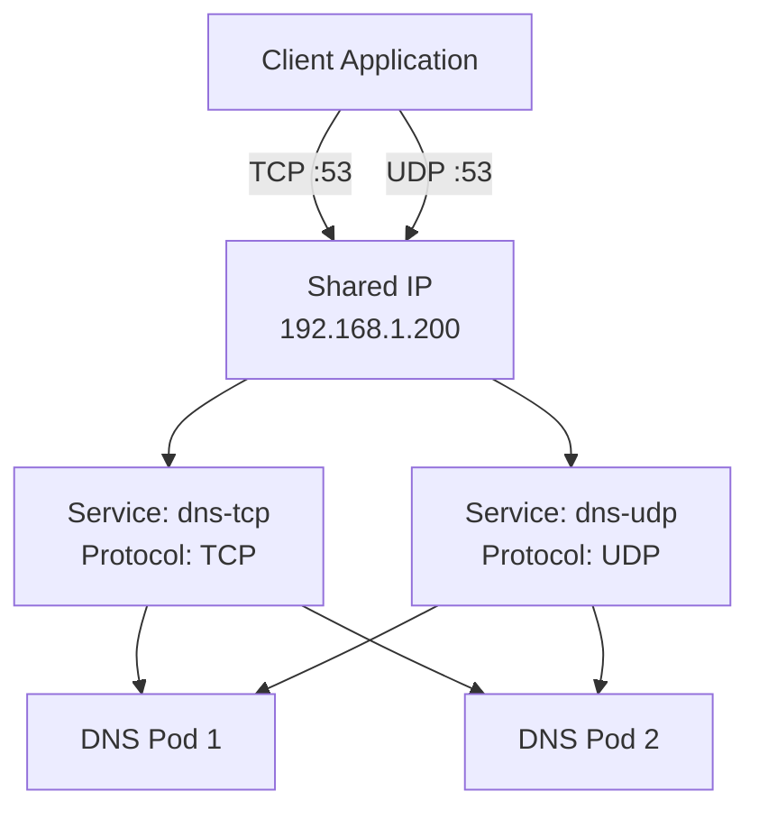
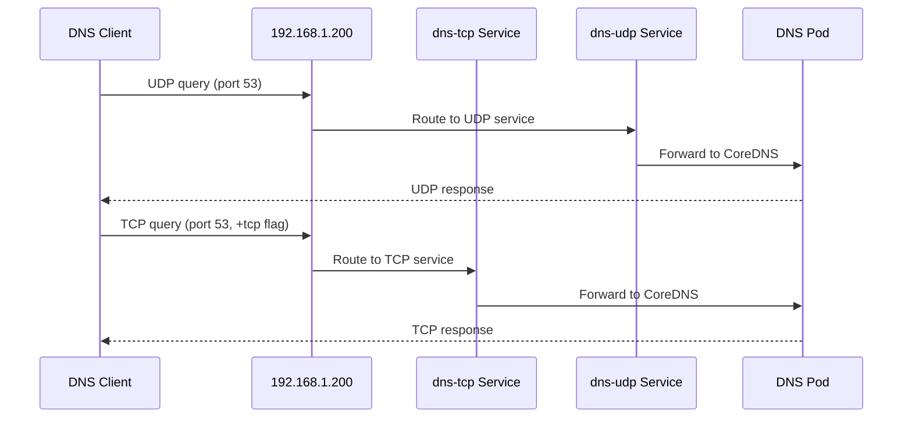

# How to Expose Both TCP and UDP on the Same IP with MetalLB

Author: [nawazdhandala](https://www.github.com/nawazdhandala)

Tags: Kubernetes, MetalLB, TCP, UDP, IP Sharing

Description: Learn how to expose both TCP and UDP services on the same external IP address using MetalLB IP sharing functionality.

---

Kubernetes has a limitation: a single Service resource cannot mix TCP and UDP protocols when using type LoadBalancer. If you need both TCP and UDP on the same external IP address - which is common for DNS servers, game servers, and media streaming - you need to create two separate services and configure them to share an IP. MetalLB makes this possible with its IP sharing annotations.

## The Problem

Consider a DNS server that needs to listen on port 53 for both TCP and UDP. In Kubernetes, you cannot do this in a single LoadBalancer service:

```yaml
# THIS DOES NOT WORK for LoadBalancer type
# Kubernetes rejects mixed protocols on LoadBalancer services
apiVersion: v1
kind: Service
metadata:
  name: dns-server
spec:
  type: LoadBalancer
  selector:
    app: dns-server
  ports:
    - name: dns-tcp
      protocol: TCP
      port: 53
      targetPort: 53
    - name: dns-udp
      protocol: UDP    # Mixed protocol - will cause issues
      port: 53
      targetPort: 53
```

This creates problems because Kubernetes may reject the configuration or MetalLB may not handle it correctly.

## The Solution: Two Services with IP Sharing

The solution is to create two separate services - one for TCP and one for UDP - and use MetalLB annotations to ensure they share the same external IP:



## Step 1: Set Up the IP Address Pool

```yaml
# ip-pool.yaml
# Standard IP pool - no special configuration needed for protocol sharing.
apiVersion: metallb.io/v1beta1
kind: IPAddressPool
metadata:
  name: service-pool
  namespace: metallb-system
spec:
  addresses:
    - 192.168.1.200-192.168.1.220
---
apiVersion: metallb.io/v1beta1
kind: L2Advertisement
metadata:
  name: l2-advert
  namespace: metallb-system
spec:
  ipAddressPools:
    - service-pool
```

## Step 2: Deploy the Application

Using CoreDNS as an example DNS server:

```yaml
# dns-deployment.yaml
# Deploy CoreDNS as a custom DNS server.
# It listens on port 53 for both TCP and UDP.
apiVersion: apps/v1
kind: Deployment
metadata:
  name: dns-server
  namespace: default
spec:
  replicas: 2
  selector:
    matchLabels:
      app: dns-server
  template:
    metadata:
      labels:
        app: dns-server
    spec:
      containers:
        - name: coredns
          image: coredns/coredns:1.11.1
          args:
            - -conf
            - /etc/coredns/Corefile
          ports:
            # Both TCP and UDP on port 53
            - containerPort: 53
              protocol: TCP
              name: dns-tcp
            - containerPort: 53
              protocol: UDP
              name: dns-udp
          volumeMounts:
            - name: config
              mountPath: /etc/coredns
      volumes:
        - name: config
          configMap:
            name: coredns-config
---
# coredns-configmap.yaml
# Minimal CoreDNS configuration for testing.
apiVersion: v1
kind: ConfigMap
metadata:
  name: coredns-config
  namespace: default
data:
  Corefile: |
    .:53 {
        forward . 8.8.8.8 8.8.4.4
        log
        errors
        cache 30
    }
```

## Step 3: Create the TCP and UDP Services

The critical part is the `metallb.universe.tf/allow-shared-ip` annotation. Both services must have the same value:

```yaml
# dns-tcp-service.yaml
# TCP service for DNS - shares IP with the UDP service.
# The sharing key "dns-shared" links this to the UDP service.
apiVersion: v1
kind: Service
metadata:
  name: dns-tcp
  namespace: default
  annotations:
    # This key must match between services sharing an IP
    metallb.universe.tf/allow-shared-ip: "dns-shared"
spec:
  type: LoadBalancer
  selector:
    app: dns-server
  ports:
    - name: dns-tcp
      protocol: TCP
      port: 53
      targetPort: 53
---
# dns-udp-service.yaml
# UDP service for DNS - shares IP with the TCP service.
# Same sharing key ensures both get the same external IP.
apiVersion: v1
kind: Service
metadata:
  name: dns-udp
  namespace: default
  annotations:
    # Same sharing key as the TCP service
    metallb.universe.tf/allow-shared-ip: "dns-shared"
spec:
  type: LoadBalancer
  selector:
    app: dns-server
  ports:
    - name: dns-udp
      protocol: UDP
      port: 53
      targetPort: 53
```

## Step 4: Apply and Verify

```bash
# Apply all resources
kubectl apply -f dns-deployment.yaml
kubectl apply -f dns-tcp-service.yaml

# Check that both services got the same IP
kubectl get svc dns-tcp dns-udp
```

Expected output:

```
NAME      TYPE           CLUSTER-IP     EXTERNAL-IP     PORT(S)
dns-tcp   LoadBalancer   10.96.10.5     192.168.1.200   53:31001/TCP
dns-udp   LoadBalancer   10.96.10.8     192.168.1.200   53:31002/UDP
```

Both services share `192.168.1.200`.

## Step 5: Test Both Protocols

```bash
# Test DNS over UDP (default for most queries)
dig @192.168.1.200 example.com

# Test DNS over TCP (used for large responses and zone transfers)
dig @192.168.1.200 example.com +tcp

# Test with nslookup
nslookup example.com 192.168.1.200
```



## Real-World Example: Game Server

Game servers often need both TCP (for login, chat, matchmaking) and UDP (for real-time game data):

```yaml
# game-tcp-service.yaml
# TCP service for game login and chat functionality.
apiVersion: v1
kind: Service
metadata:
  name: game-tcp
  namespace: gaming
  annotations:
    metallb.universe.tf/allow-shared-ip: "game-server"
spec:
  type: LoadBalancer
  selector:
    app: game-server
  ports:
    - name: login
      protocol: TCP
      port: 7777
      targetPort: 7777
    - name: chat
      protocol: TCP
      port: 7778
      targetPort: 7778
---
# game-udp-service.yaml
# UDP service for real-time game data.
apiVersion: v1
kind: Service
metadata:
  name: game-udp
  namespace: gaming
  annotations:
    metallb.universe.tf/allow-shared-ip: "game-server"
spec:
  type: LoadBalancer
  selector:
    app: game-server
  ports:
    - name: game-data
      protocol: UDP
      port: 7779
      targetPort: 7779
    - name: voice
      protocol: UDP
      port: 7780
      targetPort: 7780
```

## Real-World Example: Media Streaming Server

Media servers use TCP for control channels and UDP for media streams:

```yaml
# media-tcp-service.yaml
# TCP for RTSP control channel.
apiVersion: v1
kind: Service
metadata:
  name: media-tcp
  namespace: streaming
  annotations:
    metallb.universe.tf/allow-shared-ip: "media-server"
spec:
  type: LoadBalancer
  selector:
    app: media-server
  ports:
    - name: rtsp
      protocol: TCP
      port: 554
      targetPort: 554
---
# media-udp-service.yaml
# UDP for RTP media streams.
apiVersion: v1
kind: Service
metadata:
  name: media-udp
  namespace: streaming
  annotations:
    metallb.universe.tf/allow-shared-ip: "media-server"
spec:
  type: LoadBalancer
  selector:
    app: media-server
  ports:
    - name: rtp
      protocol: UDP
      port: 5004
      targetPort: 5004
    - name: rtcp
      protocol: UDP
      port: 5005
      targetPort: 5005
```

## Pinning to a Specific IP

You can combine IP sharing with a specific IP request:

```bash
# Both services request the same specific IP
kubectl patch svc dns-tcp -p '{"spec":{"loadBalancerIP":"192.168.1.205"}}'
kubectl patch svc dns-udp -p '{"spec":{"loadBalancerIP":"192.168.1.205"}}'

# Verify both moved to the same new IP
kubectl get svc dns-tcp dns-udp
```

## Troubleshooting Shared Protocol Services

If the services get different IPs instead of sharing:

```bash
# Verify the annotation values match exactly
kubectl get svc dns-tcp -o jsonpath='{.metadata.annotations.metallb\.universe\.tf/allow-shared-ip}'
kubectl get svc dns-udp -o jsonpath='{.metadata.annotations.metallb\.universe\.tf/allow-shared-ip}'

# Check MetalLB controller logs for sharing decisions
kubectl logs -n metallb-system -l component=controller --tail=30

# Verify there are no port conflicts
kubectl get svc dns-tcp -o jsonpath='{.spec.ports[*].port}'
kubectl get svc dns-udp -o jsonpath='{.spec.ports[*].port}'
```

## Monitoring Multi-Protocol Services with OneUptime

Services that depend on both TCP and UDP require monitoring on both protocols. A TCP health check passing does not guarantee UDP is working. [OneUptime](https://oneuptime.com) can monitor both TCP and UDP endpoints independently, giving you complete visibility into the health of your multi-protocol services. With OneUptime, you can set up separate monitors for each protocol and get alerted when either one fails.
