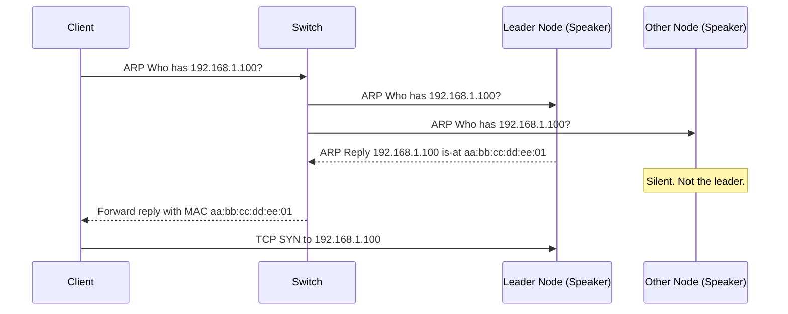
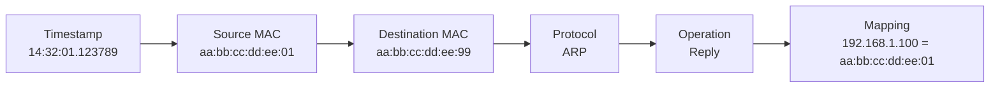
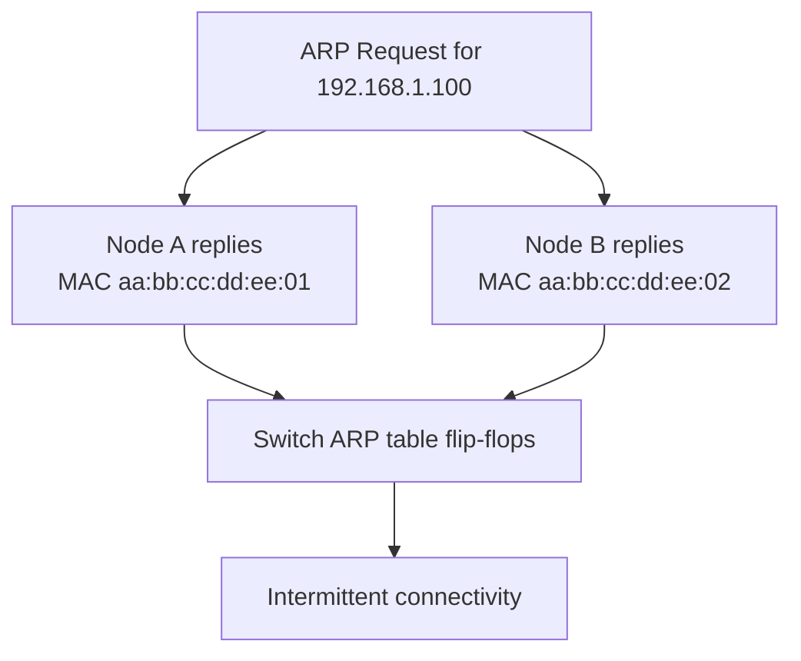
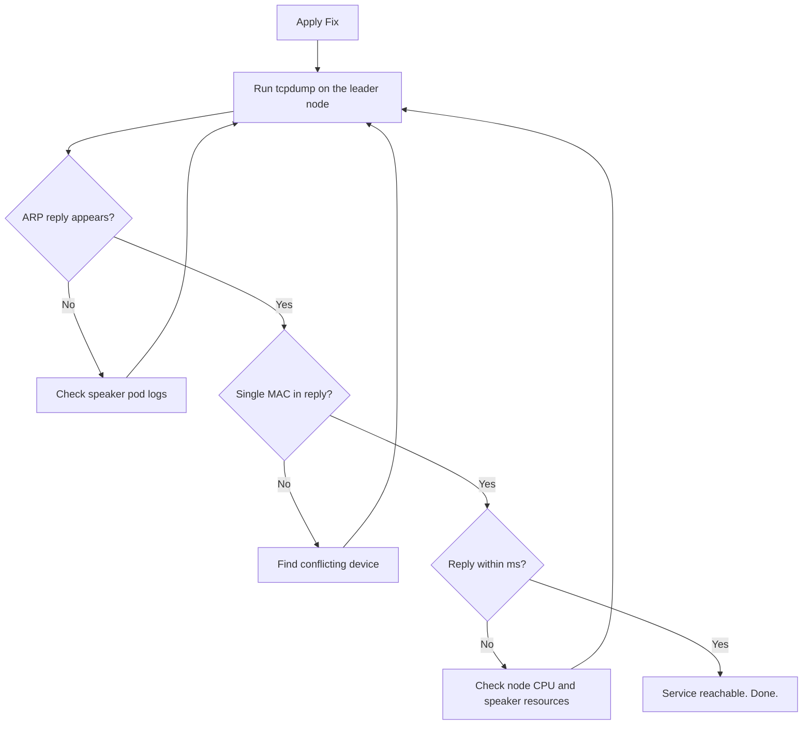

# How to Use tcpdump to Debug MetalLB ARP Replies

Author: [nawazdhandala](https://www.github.com/nawazdhandala)

Tags: Kubernetes, MetalLB, tcpdump, ARP, Debugging, Networking

Description: Learn how to use tcpdump to capture and analyze ARP traffic from MetalLB speaker pods. Debug unreachable services, duplicate MAC addresses, and ARP storms.

---

When a Kubernetes service of type LoadBalancer stops responding on bare metal, the problem often hides in ARP. MetalLB in Layer 2 mode relies on the speaker pod to answer ARP requests with the correct MAC address. If those replies never arrive, arrive from the wrong node, or arrive in duplicate, your external IP becomes unreachable. The `tcpdump` utility lets you capture raw ARP frames on the wire so you can see exactly what is happening at the network level.

---

## How MetalLB L2 ARP Works

In Layer 2 mode, MetalLB elects one speaker pod as the leader for each LoadBalancer IP. That leader replies to ARP queries so that upstream switches and routers learn where to send traffic. No BGP session is needed.



If the leader never replies, or two nodes both reply, the client cannot reach the service. tcpdump captures these frames so you can confirm the behavior.

---

## Installing tcpdump

Install tcpdump on the host node or use a Kubernetes debug container:

```bash
# Debian / Ubuntu
sudo apt-get update && sudo apt-get install -y tcpdump

# Or launch a debug container with host networking.
# nicolaka/netshoot ships with tcpdump pre-installed.
kubectl debug node/worker-01 -it \
  --image=nicolaka/netshoot \
  --profile=netadmin \
  -- /bin/bash
```

---

## Capturing ARP Traffic with tcpdump

### Basic ARP Capture

The simplest command filters only ARP frames on a specific interface:

```bash
# Capture all ARP traffic on eth0.
# -e prints the Ethernet header so you can see MAC addresses.
# -n disables DNS resolution to keep the output clean.
# arp is a tcpdump filter that matches only ARP frames.
sudo tcpdump -i eth0 -e -n arp
```

Sample output when MetalLB is healthy:

```
14:32:01.123456 aa:bb:cc:dd:ee:01 > ff:ff:ff:ff:ff:ff, ARP, length 42: Request who-has 192.168.1.100 tell 192.168.1.1
14:32:01.123789 aa:bb:cc:dd:ee:01 > aa:bb:cc:dd:ee:99, ARP, length 42: Reply 192.168.1.100 is-at aa:bb:cc:dd:ee:01
```

The first line shows the ARP request broadcast. The second line shows the leader node replying with its MAC address.

### Filter by a Specific IP

When you have many services, filter down to the one you care about:

```bash
# Capture ARP traffic only for the LoadBalancer IP 192.168.1.100.
# host 192.168.1.100 matches frames where the IP appears in either
# the sender or target protocol address field.
sudo tcpdump -i eth0 -e -n arp and host 192.168.1.100
```

---

## Interpreting the Output

Here is a breakdown of a single ARP reply line:

```
14:32:01.123789 aa:bb:cc:dd:ee:01 > aa:bb:cc:dd:ee:99, ARP, length 42: Reply 192.168.1.100 is-at aa:bb:cc:dd:ee:01
```



Key things to verify:

1. **One reply per request.** If you see two or more Reply lines with different MACs for the same IP, you have a conflict.
2. **Consistent MAC address.** The MAC in the reply should match the leader node's interface MAC. Run `ip link show eth0` on the node to confirm.
3. **Timely response.** The reply should appear within a few milliseconds of the request. Delays above 100 ms may indicate CPU pressure on the speaker pod.

---

## Debugging Common Issues

### Issue 1: No ARP Reply at All

**Symptom:** You see ARP requests but zero replies for your LoadBalancer IP.

```bash
# Run for 10 seconds. If no Reply line appears, MetalLB is not responding.
sudo timeout 10 tcpdump -i eth0 -e -n arp and host 192.168.1.100
```

**Check these first:** speaker pod not running, IPAddressPool missing the IP, L2Advertisement not created, or speaker lacking NET_RAW capability.

```bash
# Verify speaker pods, address pool, and L2 advertisement.
kubectl get pods -n metallb-system -l component=speaker -o wide
kubectl get ipaddresspool -n metallb-system -o yaml
kubectl get l2advertisement -n metallb-system -o yaml
```

### Issue 2: Duplicate ARP Replies from Different MACs

**Symptom:** You see two Reply lines with different source MACs for the same request.

```
14:32:01.123789 aa:bb:cc:dd:ee:01 > ff:ff:ff:ff:ff:ff, ARP, length 42: Reply 192.168.1.100 is-at aa:bb:cc:dd:ee:01
14:32:01.124012 aa:bb:cc:dd:ee:02 > ff:ff:ff:ff:ff:ff, ARP, length 42: Reply 192.168.1.100 is-at aa:bb:cc:dd:ee:02
```



**Check these first:** another device using the same IP, overlapping MetalLB pools, or a split-brain in the memberlist.

```bash
# Compare MACs across nodes and check leader election logs.
ip link show eth0 | grep ether
kubectl logs -n metallb-system -l component=speaker --tail=50 | grep -i "leader"
```

### Issue 3: ARP Storm (Excessive Gratuitous ARPs)

**Symptom:** tcpdump shows a flood of unsolicited ARP announcements for the same IP.

```bash
# Count ARP replies per second for a specific IP.
# A healthy cluster sends one gratuitous ARP during failover.
# More than a few per second indicates a problem.
sudo tcpdump -i eth0 -e -n arp and host 192.168.1.100 2>/dev/null \
  | head -100 \
  | awk '{print $1}' \
  | cut -d. -f1 \
  | uniq -c
```

**Check these first:** leader election flapping, a network loop, or misconfigured memberlist keepalive timers.

```bash
# Watch leader changes and check node resource pressure.
kubectl logs -n metallb-system -l component=speaker -f | grep -i "leader"
kubectl get events -n metallb-system --sort-by='.lastTimestamp' | tail -20
```

---

## Verifying a Fix

After applying a configuration change, follow this checklist using tcpdump to confirm the fix:



A quick one-liner to confirm the fix:

```bash
# Send an ARP probe and watch for exactly one reply.
# Run this from a machine on the same Layer 2 segment.
# In one terminal, start tcpdump:
sudo tcpdump -i eth0 -e -n -c 2 arp and host 192.168.1.100

# In another terminal, trigger an ARP request:
arping -c 1 192.168.1.100
```

You should see one Request and one Reply. If you see more, keep debugging.

---

## Quick Reference

| Goal | Command |
|---|---|
| Capture all ARP | `sudo tcpdump -i eth0 -e -n arp` |
| Filter by IP | `sudo tcpdump -i eth0 -e -n arp and host 192.168.1.100` |
| Save to pcap file | `sudo tcpdump -i eth0 -e -n arp -w /tmp/arp.pcap` |
| Gratuitous ARPs only | `sudo tcpdump -i eth0 -e -n 'arp[6:2] = 2'` |
| All interfaces | `sudo tcpdump -i any -e -n arp` |

---

## Monitoring ARP Health with OneUptime

Debugging ARP issues manually with tcpdump works for one-off problems, but production clusters need continuous monitoring. [OneUptime](https://oneuptime.com) can monitor your MetalLB services and alert you the moment an external IP becomes unreachable. By combining synthetic health checks with real-time alerting, you catch ARP failures before your users do. Set up a ping or HTTP monitor for each LoadBalancer IP and let OneUptime notify your on-call team when a response stops arriving.
